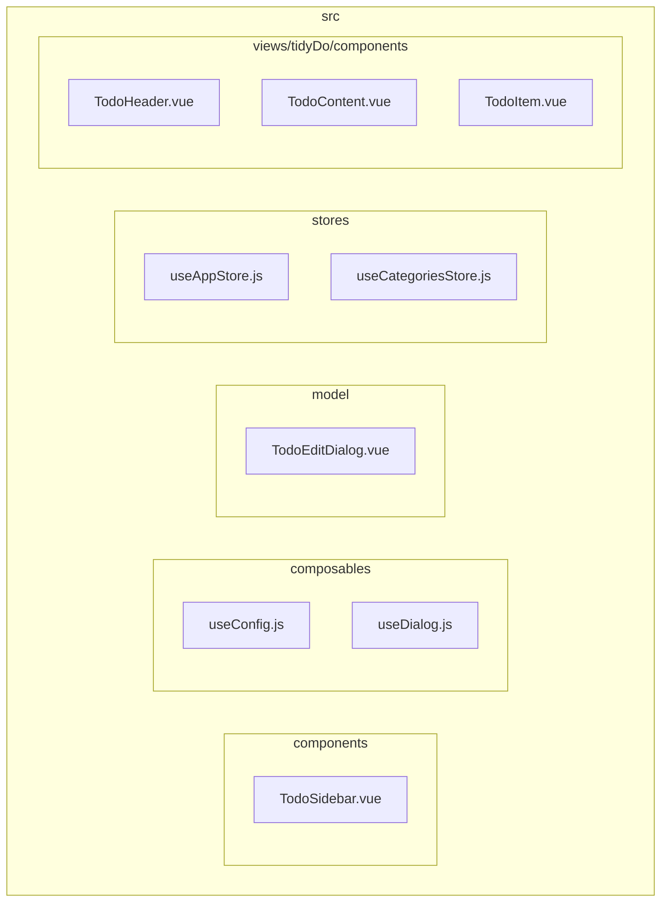
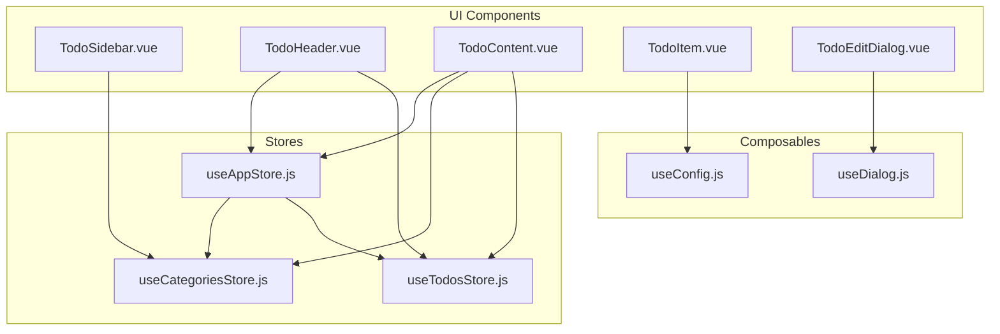
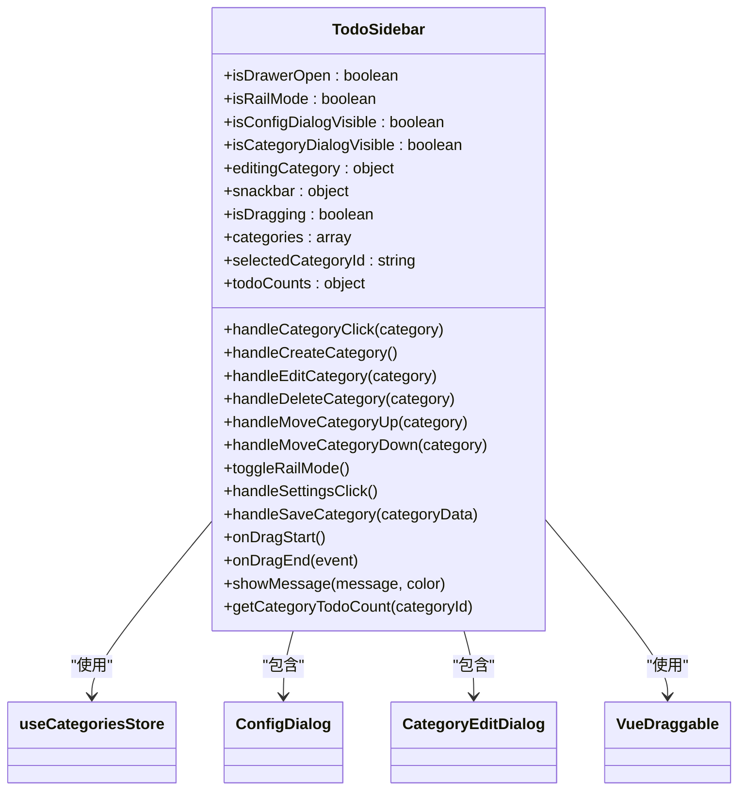
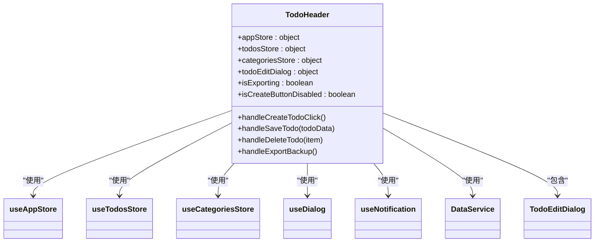
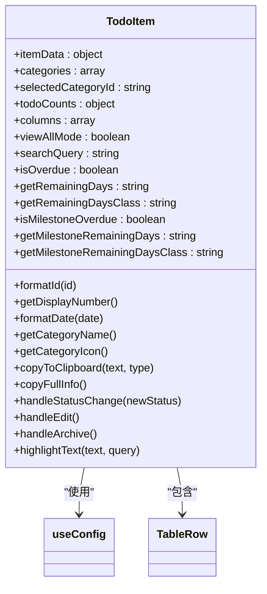
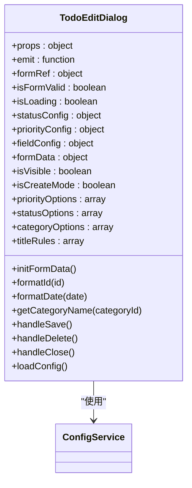
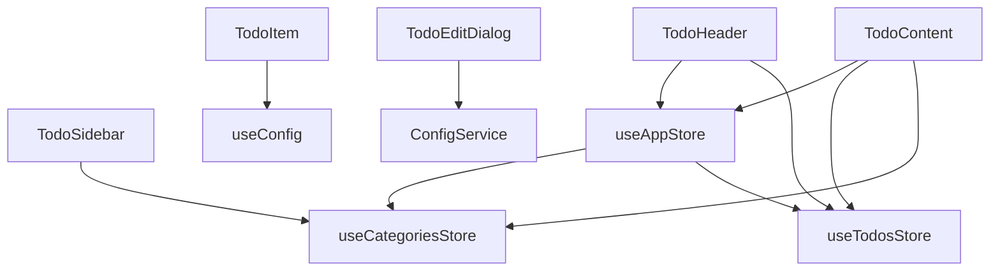

# UI组件

<cite>
**本文档引用的文件**
- [TodoSidebar.vue](file://src/components/TodoSidebar.vue)
- [TodoHeader.vue](file://src/views/tidyDo/components/TodoHeader.vue)
- [TodoContent.vue](file://src/views/tidyDo/components/TodoContent.vue)
- [TodoItem.vue](file://src/views/tidyDo/components/TodoItem.vue)
- [TodoEditDialog.vue](file://src/model/TodoEditDialog.vue)
- [useAppStore.js](file://src/stores/useAppStore.js)
- [useCategoriesStore.js](file://src/stores/useCategoriesStore.js)
- [useConfig.js](file://src/composables/useConfig.js)
- [useDialog.js](file://src/composables/useDialog.js)
</cite>

## 目录
1. [简介](#简介)
2. [项目结构](#项目结构)
3. [核心组件](#核心组件)
4. [架构概述](#架构概述)
5. [详细组件分析](#详细组件分析)
6. [依赖分析](#依赖分析)
7. [性能考虑](#性能考虑)
8. [故障排除指南](#故障排除指南)
9. [结论](#结论)
10. [附录](#附录)（如有必要）

## 简介
本文档详细描述了TidyDo应用的核心UI组件，包括其视觉外观、行为和用户交互。重点介绍`TodoSidebar`的分类导航和拖拽排序功能，`TodoHeader`的搜索、创建和视图切换功能，以及`TodoContent`如何根据视图模式渲染不同内容。同时解释`TodoItem`的内联编辑和状态切换机制，以及弹窗组件（如`TodoEditDialog`）的设计。文档包含组件的props、事件和插槽的完整列表，并提供使用示例和最佳实践。

## 项目结构
TidyDo项目的结构清晰，主要分为以下几个目录：
- `src/assets`：存放静态资源文件，如CSS样式表。
- `src/components`：存放可复用的UI组件，如`TodoSidebar.vue`。
- `src/composables`：存放组合式函数，如`useConfig.js`和`useDialog.js`。
- `src/model`：存放模型组件，如`TodoEditDialog.vue`。
- `src/router`：存放路由配置。
- `src/services`：存放服务类，如`dataService.js`和`configService.js`。
- `src/stores`：存放Pinia状态管理store，如`useAppStore.js`和`useCategoriesStore.js`。
- `src/utils`：存放工具函数。
- `src/views/tidyDo/components`：存放TidyDo视图相关的组件，如`TodoHeader.vue`、`TodoContent.vue`和`TodoItem.vue`。



**图示来源**
- [TodoSidebar.vue](file://src/components/TodoSidebar.vue)
- [useConfig.js](file://src/composables/useConfig.js)
- [useDialog.js](file://src/composables/useDialog.js)
- [TodoEditDialog.vue](file://src/model/TodoEditDialog.vue)
- [useAppStore.js](file://src/stores/useAppStore.js)
- [useCategoriesStore.js](file://src/stores/useCategoriesStore.js)
- [TodoHeader.vue](file://src/views/tidyDo/components/TodoHeader.vue)
- [TodoContent.vue](file://src/views/tidyDo/components/TodoContent.vue)
- [TodoItem.vue](file://src/views/tidyDo/components/TodoItem.vue)

**本节来源**
- [TodoSidebar.vue](file://src/components/TodoSidebar.vue)
- [useConfig.js](file://src/composables/useConfig.js)
- [useDialog.js](file://src/composables/useDialog.js)
- [TodoEditDialog.vue](file://src/model/TodoEditDialog.vue)
- [useAppStore.js](file://src/stores/useAppStore.js)
- [useCategoriesStore.js](file://src/stores/useCategoriesStore.js)
- [TodoHeader.vue](file://src/views/tidyDo/components/TodoHeader.vue)
- [TodoContent.vue](file://src/views/tidyDo/components/TodoContent.vue)
- [TodoItem.vue](file://src/views/tidyDo/components/TodoItem.vue)

## 核心组件
TidyDo的核心UI组件包括`TodoSidebar`、`TodoHeader`、`TodoContent`、`TodoItem`和`TodoEditDialog`。这些组件共同构成了应用的主要界面和交互逻辑。

**本节来源**
- [TodoSidebar.vue](file://src/components/TodoSidebar.vue)
- [TodoHeader.vue](file://src/views/tidyDo/components/TodoHeader.vue)
- [TodoContent.vue](file://src/views/tidyDo/components/TodoContent.vue)
- [TodoItem.vue](file://src/views/tidyDo/components/TodoItem.vue)
- [TodoEditDialog.vue](file://src/model/TodoEditDialog.vue)

## 架构概述
TidyDo的UI架构采用Vue 3的组合式API和Pinia状态管理。核心组件通过props和events进行通信，状态管理store负责全局状态的管理和同步。`useAppStore`管理应用的全局状态，如当前选中的分类、视图模式和搜索查询。`useCategoriesStore`管理分类数据，`useTodosStore`管理待办事项数据。`useConfig`和`useDialog`等组合式函数提供配置管理和弹窗控制功能。



**图示来源**
- [TodoSidebar.vue](file://src/components/TodoSidebar.vue)
- [TodoHeader.vue](file://src/views/tidyDo/components/TodoHeader.vue)
- [TodoContent.vue](file://src/views/tidyDo/components/TodoContent.vue)
- [TodoItem.vue](file://src/views/tidyDo/components/TodoItem.vue)
- [TodoEditDialog.vue](file://src/model/TodoEditDialog.vue)
- [useConfig.js](file://src/composables/useConfig.js)
- [useDialog.js](file://src/composables/useDialog.js)
- [useAppStore.js](file://src/stores/useAppStore.js)
- [useCategoriesStore.js](file://src/stores/useCategoriesStore.js)
- [useTodosStore.js](file://src/stores/useTodosStore.js)

## 详细组件分析
### TodoSidebar分析
`TodoSidebar`组件提供分类导航和拖拽排序功能。用户可以通过点击分类项来选择当前分类，通过拖拽分类项来调整分类顺序。侧边栏还包含新建分类、查看全部、收起侧边栏和设置等操作按钮。

#### 分类导航
`TodoSidebar`使用`v-navigation-drawer`组件创建侧边栏，`v-list-item`组件显示分类项。每个分类项包含图标、名称和待办事项数量。用户点击分类项时，触发`handleCategoryClick`方法，通过`emit`事件通知父组件更新当前选中的分类。

#### 拖拽排序
`TodoSidebar`使用`VueDraggable`组件实现拖拽排序功能。用户可以通过拖动分类项右侧的菜单按钮来调整分类顺序。拖拽开始时，显示提示消息；拖拽结束时，调用`reorderCategoriesByDrag`方法更新分类顺序，并通过`emit`事件通知父组件分类数据已更新。



**图示来源**
- [TodoSidebar.vue](file://src/components/TodoSidebar.vue)
- [useCategoriesStore.js](file://src/stores/useCategoriesStore.js)
- [ConfigDialog.vue](file://src/model/ConfigDialog.vue)
- [CategoryEditDialog.vue](file://src/model/CategoryEditDialog.vue)
- [vue-draggable-plus](https://github.com/SortableJS/vue-draggable-plus)

**本节来源**
- [TodoSidebar.vue](file://src/components/TodoSidebar.vue)

### TodoHeader分析
`TodoHeader`组件提供搜索、创建和视图切换功能。用户可以通过搜索框搜索待办事项，通过创建按钮新增待办事项，通过视图切换按钮切换不同的视图模式。

#### 搜索功能
`TodoHeader`使用`v-text-field`组件创建搜索框，绑定`appStore.searchQuery`状态。用户输入搜索关键词时，通过`@update:model-value`事件更新搜索查询，并触发待办事项的过滤。

#### 创建功能
`TodoHeader`使用`v-btn`组件创建新增待办按钮。用户点击按钮时，触发`handleCreateTodoClick`方法。如果在查看全部模式下，弹出`TodoEditDialog`并提示用户选择分类；否则直接弹出`TodoEditDialog`。

#### 视图切换
`TodoHeader`使用`v-btn-toggle`组件创建视图切换按钮组，包含表格、时间线、日历和报表视图。用户点击按钮时，通过`@update:model-value`事件更新`appStore.viewMode`状态，并重新渲染`TodoContent`组件。



**图示来源**
- [TodoHeader.vue](file://src/views/tidyDo/components/TodoHeader.vue)
- [useAppStore.js](file://src/stores/useAppStore.js)
- [useTodosStore.js](file://src/stores/useTodosStore.js)
- [useCategoriesStore.js](file://src/stores/useCategoriesStore.js)
- [useDialog.js](file://src/composables/useDialog.js)
- [useNotification.js](file://src/composables/useNotification.js)
- [dataService.js](file://src/services/dataService.js)
- [TodoEditDialog.vue](file://src/model/TodoEditDialog.vue)

**本节来源**
- [TodoHeader.vue](file://src/views/tidyDo/components/TodoHeader.vue)

### TodoContent分析
`TodoContent`组件根据当前视图模式渲染不同的内容。支持表格、时间线、日历和报表视图，以及简单Todo的四象限视图。

#### 视图模式
`TodoContent`通过`appStore.viewMode`状态确定当前视图模式。在表格视图中，使用`TableRow`和`TodoItem`组件显示待办事项列表；在时间线视图中，使用`TodoTimeline`组件显示待办事项的时间线；在日历视图中，使用`TodoCalendar`组件显示待办事项的日历；在报表视图中，使用`TodoReport`组件显示待办事项的报表。

#### 空状态处理
`TodoContent`处理多种空状态，包括未选择分类、搜索无结果和普通空列表。未选择分类时，显示提示信息；搜索无结果时，显示未找到搜索结果的提示；普通空列表时，显示还没有待办事项的提示。

```mermaid
classDiagram
class TodoContent {
+appStore : object
+todosStore : object
+categoriesStore : object
+simpleTodosStore : object
+todoEditDialog : object
+notification : object
+sortedTodos : array
+handleCreateTodo()
+handleEditTodo(item)
+handleStatusChange({item, newStatus})
+handleSaveTodo(todoData)
+handleDeleteTodo(item)
+handleCopy({text, type})
+handleArchive(item)
+handleUpdateSimpleTodo(todo)
+handleDeleteSimpleTodo(todoId)
+getStatusLabel(status)
}
TodoContent --> useAppStore : "使用"
TodoContent --> useTodosStore : "使用"
TodoContent --> useCategoriesStore : "使用"
TodoContent --> useSimpleTodosStore : "使用"
TodoContent --> useNotification : "使用"
TodoContent --> useDialog : "使用"
TodoContent --> TodoItem : "包含"
TodoContent --> TableRow : "包含"
TodoContent --> TodoTimeline : "包含"
TodoContent --> TodoCalendar : "包含"
TodoContent --> TodoReport : "包含"
TodoContent --> SimpleTodoQuadrant : "包含"
TodoContent --> TodoEditDialog : "包含"
```

**图示来源**
- [TodoContent.vue](file://src/views/tidyDo/components/TodoContent.vue)
- [useAppStore.js](file://src/stores/useAppStore.js)
- [useTodosStore.js](file://src/stores/useTodosStore.js)
- [useCategoriesStore.js](file://src/stores/useCategoriesStore.js)
- [useSimpleTodosStore.js](file://src/stores/useSimpleTodosStore.js)
- [useNotification.js](file://src/composables/useNotification.js)
- [useDialog.js](file://src/composables/useDialog.js)
- [TodoItem.vue](file://src/views/tidyDo/components/TodoItem.vue)
- [TableRow.vue](file://src/views/tidyDo/components/TableRow.vue)
- [TodoTimeline.vue](file://src/views/tidyDo/components/TodoTimeline.vue)
- [TodoCalendar.vue](file://src/views/tidyDo/components/TodoCalendar.vue)
- [TodoReport.vue](file://src/views/tidyDo/components/TodoReport.vue)
- [SimpleTodoQuadrant.vue](file://src/views/tidyDo/components/SimpleTodoQuadrant.vue)
- [TodoEditDialog.vue](file://src/model/TodoEditDialog.vue)

**本节来源**
- [TodoContent.vue](file://src/views/tidyDo/components/TodoContent.vue)

### TodoItem分析
`TodoItem`组件显示单个待办事项的详细信息，支持内联编辑和状态切换。用户可以通过点击待办事项的标题、编号、节点日期和截止日期来复制相关信息，通过状态下拉菜单切换状态，通过操作按钮组进行编辑、复制和归档操作。

#### 内联编辑
`TodoItem`通过`v-menu`组件创建状态下拉菜单，用户点击菜单项时，触发`handleStatusChange`方法，通过`emit`事件通知父组件更新待办事项状态。

#### 状态切换
`TodoItem`通过`v-btn`组件创建操作按钮组，包含编辑、复制和归档按钮。用户点击编辑按钮时，触发`handleEdit`方法，通过`emit`事件通知父组件打开编辑弹窗；点击复制按钮时，触发`copyFullInfo`方法，复制待办事项的完整信息；点击归档按钮时，触发`handleArchive`方法，通过`emit`事件通知父组件切换归档状态。



**图示来源**
- [TodoItem.vue](file://src/views/tidyDo/components/TodoItem.vue)
- [useConfig.js](file://src/composables/useConfig.js)
- [TableRow.vue](file://src/views/tidyDo/components/TableRow.vue)

**本节来源**
- [TodoItem.vue](file://src/views/tidyDo/components/TodoItem.vue)

### TodoEditDialog分析
`TodoEditDialog`组件提供待办事项的编辑和创建功能。用户可以通过表单输入待办事项的详细信息，包括自定义编号、标题、描述、节点日期、结束日期、状态、优先级、分配人、标签和分组。表单支持验证和高级选项的展开。

#### 表单验证
`TodoEditDialog`使用`v-form`组件创建表单，`v-text-field`和`v-select`组件创建输入字段。标题字段设置了必填和长度限制的验证规则，确保用户输入有效的标题。

#### 高级选项
`TodoEditDialog`使用`v-expansion-panels`组件创建高级选项区域，包含优先级、分配人、标签和分组字段。用户可以点击展开按钮查看和编辑高级选项。



**图示来源**
- [TodoEditDialog.vue](file://src/model/TodoEditDialog.vue)
- [configService.js](file://src/services/configService.js)

**本节来源**
- [TodoEditDialog.vue](file://src/model/TodoEditDialog.vue)

## 依赖分析
TidyDo的UI组件之间存在明确的依赖关系。`TodoSidebar`依赖`useCategoriesStore`管理分类数据，`TodoHeader`依赖`useAppStore`和`useTodosStore`管理应用状态和待办事项数据，`TodoContent`依赖`useAppStore`、`useTodosStore`和`useCategoriesStore`管理全局状态和数据，`TodoItem`依赖`useConfig`获取状态和优先级配置，`TodoEditDialog`依赖`ConfigService`获取配置数据。



**图示来源**
- [TodoSidebar.vue](file://src/components/TodoSidebar.vue)
- [TodoHeader.vue](file://src/views/tidyDo/components/TodoHeader.vue)
- [TodoContent.vue](file://src/views/tidyDo/components/TodoContent.vue)
- [TodoItem.vue](file://src/views/tidyDo/components/TodoItem.vue)
- [TodoEditDialog.vue](file://src/model/TodoEditDialog.vue)
- [useAppStore.js](file://src/stores/useAppStore.js)
- [useCategoriesStore.js](file://src/stores/useCategoriesStore.js)
- [useTodosStore.js](file://src/stores/useTodosStore.js)
- [useConfig.js](file://src/composables/useConfig.js)
- [configService.js](file://src/services/configService.js)

**本节来源**
- [TodoSidebar.vue](file://src/components/TodoSidebar.vue)
- [TodoHeader.vue](file://src/views/tidyDo/components/TodoHeader.vue)
- [TodoContent.vue](file://src/views/tidyDo/components/TodoContent.vue)
- [TodoItem.vue](file://src/views/tidyDo/components/TodoItem.vue)
- [TodoEditDialog.vue](file://src/model/TodoEditDialog.vue)
- [useAppStore.js](file://src/stores/useAppStore.js)
- [useCategoriesStore.js](file://src/stores/useCategoriesStore.js)
- [useTodosStore.js](file://src/stores/useTodosStore.js)
- [useConfig.js](file://src/composables/useConfig.js)
- [configService.js](file://src/services/configService.js)

## 性能考虑
TidyDo的UI组件在性能方面做了以下优化：
- 使用`computed`属性缓存计算结果，避免重复计算。
- 使用`v-if`和`v-else`指令按需渲染组件，减少DOM节点数量。
- 使用`v-for`指令的`key`属性优化列表渲染性能。
- 使用`debounce`和`throttle`技术优化搜索和拖拽操作的性能。

## 故障排除指南
### 常见问题
1. **分类排序不生效**：检查`reorderCategoriesByDrag`方法是否正确调用，确保`CategoryService.reorderByDrag`方法返回成功。
2. **搜索功能不工作**：检查`appStore.searchQuery`状态是否正确更新，确保`currentTodos`计算属性正确过滤待办事项。
3. **视图切换无效**：检查`appStore.viewMode`状态是否正确更新，确保`TodoContent`组件正确响应视图模式变化。
4. **弹窗无法显示**：检查`useDialog`组合式函数是否正确使用，确保`visible`状态正确更新。

### 调试技巧
- 使用浏览器开发者工具检查组件的props和state。
- 在关键方法中添加`console.log`语