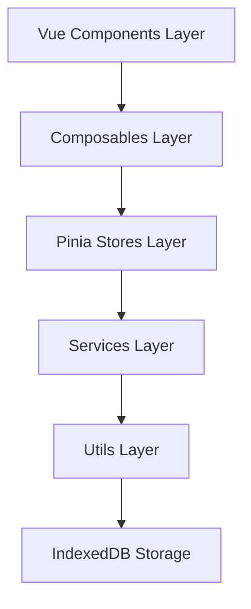

# 开发者指南

<cite>
**本文档引用的文件**  
- [package.json](file://package.json)
- [README.md](file://README.md)
- [DEVELOPMENT.md](file://DEVELOPMENT.md)
- [CHANGELOG.md](file://CHANGELOG.md)
- [vite.config.js](file://vite.config.js)
- [tailwind.config.js](file://tailwind.config.js)
- [main.js](file://src/main.js)
- [todoService.js](file://src/services/todoService.js)
- [useTodosStore.js](file://src/stores/useTodosStore.js)
- [index.vue](file://src/views/tidyDo/index.vue)
- [TodoSidebar.vue](file://src/components/TodoSidebar.vue)
- [useDragSort.js](file://src/composables/useDragSort.js)
- [idGenerator.js](file://src/utils/idGenerator.js)
- [TodoEditDialog.vue](file://src/model/TodoEditDialog.vue)
- [index.js](file://src/router/index.js)
</cite>

## 目录
1. [简介](#简介)
2. [项目结构](#项目结构)
3. [开发环境搭建](#开发环境搭建)
4. [代码规范](#代码规范)
5. [功能开发流程](#功能开发流程)
6. [调试技巧与工具](#调试技巧与工具)
7. [贡献流程](#贡献流程)
8. [版本更新日志](#版本更新日志)

## 简介

TidyDo 是一个基于 Vue 3 + Vuetify 构建的现代化待办事项管理应用，支持 Web 应用和 Chrome 扩展等多种部署方式。本指南旨在为开发者提供从环境搭建到功能开发的完整流程说明，帮助快速上手并高效参与项目开发。

**Section sources**
- [README.md](file://README.md#L0-L134)

## 项目结构

TidyDo 采用清晰的分层架构设计，各目录职责明确：

```
TidyDo/
├── src/
│   ├── assets/              # 静态资源
│   ├── components/         # 公共组件
│   ├── composables/        # 组合式函数 (UI状态管理)
│   ├── model/              # 弹窗组件
│   ├── router/             # 路由配置
│   ├── services/           # 服务层 (数据操作)
│   ├── stores/             # 状态管理 (业务逻辑)
│   ├── utils/              # 工具函数
│   ├── views/              # 页面组件
│   ├── App.vue             # 根组件
│   ├── main.js             # Web 应用入口
│   ├── extension.js        # Chrome 扩展入口
│   └── popup.js            # 弹窗页面入口
├── scripts/                # 构建脚本
├── manifest.json           # Chrome 扩展配置
├── package.json           # 项目配置
├── CHANGELOG.md           # 更新日志
└── DEVELOPMENT.md         # 开发者文档
```



**Diagram sources**
- [DEVELOPMENT.md](file://DEVELOPMENT.md#L20-L100)

**Section sources**
- [DEVELOPMENT.md](file://DEVELOPMENT.md#L101-L200)

## 开发环境搭建

### 环境要求

- **Node.js** >= 16.0.0
- **npm** >= 7.0.0 或 **yarn** >= 1.22.0
- **现代浏览器** 支持 ES2020+ 和 IndexedDB

### 安装依赖

```bash
# 使用 npm
npm install

# 或使用 yarn
yarn install
```

### 启动开发服务器

```bash
# 启动开发模式
npm run dev
# 访问 http://localhost:5173

# 预览构建结果
npm run preview
```

### 构建生产版本

```bash
# 构建Web应用
npm run build

# 构建Chrome扩展
npm run build:extension
```

**Section sources**
- [README.md](file://README.md#L100-L134)
- [package.json](file://package.json#L4-L12)
- [vite.config.js](file://vite.config.js#L1-L42)

## 代码规范

### 命名约定

- **组件**: PascalCase (`TodoEditDialog.vue`)
- **文件**: camelCase (`useConfig.js`)
- **方法**: 动词开头 (`createTodo`, `updateStatus`)
- **常量**: UPPER_SNAKE_CASE (`CONFIG_KEY`)
- **私有方法**: 前缀下划线 (`_initializeState`)

### 文件组织

```javascript
// 1. 导入顺序
import { ref, computed } from 'vue'           // Vue 相关
import { defineStore } from 'pinia'           // 第三方库
import { TodoService } from '@/services'      // 项目内部模块
import { withErrorHandling } from '@/utils'   // 工具函数

// 2. 类型定义（JSDoc）
/**
 * 创建待办事项
 * @param {Object} todoData - 待办数据
 * @param {string} todoData.title - 标题
 * @returns {Promise<Object>} 创建的待办对象
 */

// 3. 主要逻辑
export const useTodoStore = defineStore('todos', () => {
  // 状态定义
  const todos = ref([])

  // 计算属性
  const activeTodos = computed(() => ...)

  // 方法定义
  const createTodo = withErrorHandling(async (todoData) => {
    // 实现逻辑
  }, '创建待办', ErrorTypes.BUSINESS)

  return { todos, activeTodos, createTodo }
})
```

### JSDoc 注释标准

所有关键函数都应使用 JSDoc 进行注释，包括参数类型、返回值类型和功能描述。例如：

```javascript
/**
 * 创建分类数据结构
 * @param {string} id - 分类ID
 * @param {string} name - 分类名称
 * @param {string} icon - 分类图标，默认为'mdi-folder'
 * @returns {Object} 分类对象
 */
```

**Section sources**
- [DEVELOPMENT.md](file://DEVELOPMENT.md#L600-L700)
- [todoService.js](file://src/services/todoService.js#L10-L30)

## 功能开发流程

### 新增功能开发流程图


**Diagram sources**
- [DEVELOPMENT.md](file://DEVELOPMENT.md#L500-L510)

### 数据层开发

在 `services/` 目录中添加数据操作方法。例如，在 `todoService.js` 中实现 CRUD 操作：

```javascript
export class TodoItemService {
  static getAll = withErrorHandling(async () => {
    const items = (await get(TODO_ITEMS_KEY)) || []
    return items
  }, '获取待办事项列表', ErrorTypes.STORAGE)
}
```

### 状态层开发

在对应的 Store 中添加状态和 actions。例如，在 `useTodosStore.js` 中管理待办事项状态：

```javascript
export const useTodosStore = defineStore('todos', () => {
  const todos = ref([])
  const isLoading = ref(false)
  
  const loadTodos = async () => {
    try {
      isLoading.value = true
      todos.value = await TodoItemService.getAll()
    } catch (error) {
      console.error('Load todos error:', error)
      throw error
    } finally {
      isLoading.value = false
    }
  }
  
  return { todos, isLoading, loadTodos }
})
```

### 组件层开发

创建或修改 Vue 组件，通过 Pinia Store 访问状态。例如，在 `index.vue` 中使用多个 Store：

```javascript
import { useTodosStore } from '@/stores/useTodosStore'
import { useCategoriesStore } from '@/stores/useCategoriesStore'
import { useAppStore } from '@/stores/useAppStore'

const todosStore = useTodosStore()
const categoriesStore = useCategoriesStore()
const appStore = useAppStore()
```

**Section sources**
- [DEVELOPMENT.md](file://DEVELOPMENT.md#L480-L520)
- [useTodosStore.js](file://src/stores/useTodosStore.js#L1-L20)
- [index.vue](file://src/views/tidyDo/index.vue#L1-L20)

## 调试技巧与工具

### 浏览器调试

- **Vue DevTools**: 调试组件状态和 Pinia stores
- **IndexedDB**: 在开发者工具中查看存储数据
- **Network**: 检查网络请求（如有）
- **Console**: 查看错误日志和调试信息

### 开发技巧

```javascript
// 1. 开发环境调试
if (process.env.NODE_ENV === 'development') {
  console.log('🐛 Debug info:', data)
}

// 2. 性能监控
console.time('数据加载')
await loadData()
console.timeEnd('数据加载')

// 3. 状态检查
const { isInitialized } = useConfig()
console.log('配置初始化状态:', isInitialized.value)
```

### 错误处理

使用统一的错误处理机制：

```javascript
import { withErrorHandling, ErrorTypes } from '@/utils/errorHandler'

static saveData = withErrorHandling(async (data) => {
  // 业务逻辑
}, '保存数据', ErrorTypes.STORAGE)
```

**Section sources**
- [DEVELOPMENT.md](file://DEVELOPMENT.md#L700-L760)
- [errorHandler.js](file://src/utils/errorHandler.js#L1-L10)

## 贡献流程

### 参与贡献

1. **Fork** 项目到你的 GitHub 账户
2. **Clone** 到本地: `git clone [your-fork-url]`
3. **创建分支**: `git checkout -b feature/amazing-feature`
4. **开发功能**: 遵循项目的代码规范和架构设计
5. **测试验证**: 确保功能正常且不破坏现有功能
6. **提交代码**: `git commit -m 'feat: add amazing feature'`
7. **推送分支**: `git push origin feature/amazing-feature`
8. **创建 PR**: 在 GitHub 上创建 Pull Request

### 提交规范

使用 [Conventional Commits](https://conventionalcommits.org/) 规范：

```bash
feat: 新功能
fix: 修复bug
docs: 文档更新
style: 代码格式调整
refactor: 代码重构
perf: 性能优化
test: 测试相关
chore: 构建工具或辅助工具的变动
```

**Section sources**
- [DEVELOPMENT.md](file://DEVELOPMENT.md#L740-L760)
- [CHANGELOG.md](file://CHANGELOG.md#L180-L200)

## 版本更新日志

### v2.7.0 - 数据报表功能版本

- ✨ **新增报表视图** - 在"查看全部"模式下新增第四个视图选项，提供全面的数据分析和可视化
- 📊 **多维度数据统计** - 包括项目数量统计、状态分布分析、完成情况统计、时间趋势分析和优先级分布
- 📈 **ECharts 5 图表库** - 集成业界领先的图表库，提供高性能图表渲染能力

### v2.6.0 - 筛选功能增强版本

- ✨ **节点日期筛选** - 在分类筛选条件中新增节点日期范围筛选，支持按节点日期过滤待办事项
- 🔍 **筛选UI优化** - 在分类编辑对话框中添加节点日期筛选字段，与截止日期筛选保持一致的UI风格

### v2.5.0 - 节点日期功能版本

- ✨ **新增节点日期字段** - 为待办事项添加节点日期，用于标记项目关键时间节点
- 📊 **表格视图优化** - 在截止日期前新增节点日期列，重新调整列宽度确保单行显示

### v2.4.0 - 拖拽功能优化版本

- ✨ **VueDraggablePlus集成** - 使用成熟的拖拽库替换自定义实现，提升稳定性和流畅性
- 🖱️ **侧边栏分类拖拽优化** - 保持长按启动机制，增强视觉反馈和动画效果

### v2.3.0 - 简单Todo版本

- ✨ **新增简单Todo大类** - 第三种分类类型，专为轻量级任务管理设计
- 🎨 **四象限视图** - 采用2x2网格布局，直观展示待办/进行中/已完成/暂停四种状态

**Section sources**
- [CHANGELOG.md](file://CHANGELOG.md#L0-L180)