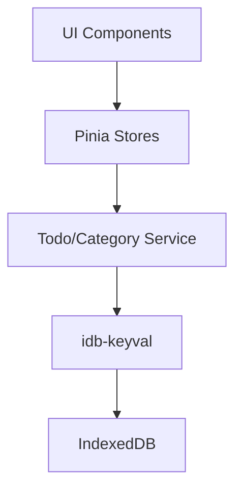

# 数据模型与存储

<cite>
**本文档中引用的文件**  
- [TodoEditDialog.vue](file://src/model/TodoEditDialog.vue)
- [CategoryEditDialog.vue](file://src/model/CategoryEditDialog.vue)
- [todoService.js](file://src/services/todoService.js)
- [dataService.js](file://src/services/dataService.js)
- [useTodosStore.js](file://src/stores/useTodosStore.js)
- [useCategoriesStore.js](file://src/stores/useCategoriesStore.js)
- [idGenerator.js](file://src/utils/idGenerator.js)
- [dateUtils.js](file://src/utils/dateUtils.js)
</cite>

## 目录
1. [简介](#简介)
2. [核心数据实体](#核心数据实体)
3. [待办事项模型](#待办事项模型)
4. [分类模型](#分类模型)
5. [ID生成策略](#id生成策略)
6. [数据验证规则](#数据验证规则)
7. [数据持久化机制](#数据持久化机制)
8. [数据访问模式](#数据访问模式)
9. [性能考虑](#性能考虑)
10. [数据模型JSON示例](#数据模型json示例)

## 简介
TidyDo 是一个基于浏览器的待办事项管理应用，采用 Vue 3 和 Pinia 构建，数据持久化使用 IndexedDB。本文档详细描述其核心数据模型的设计、字段定义、业务规则以及数据存储机制。重点分析待办事项和分类两个核心实体，阐述其在服务层如何通过 `idb-keyval` 库持久化到 IndexedDB，并说明数据访问模式和性能优化策略。

## 核心数据实体
TidyDo 的数据模型围绕两个核心实体构建：**待办事项 (Todo Item)** 和 **分类 (Category)**。每个实体都有明确的字段定义、数据类型和业务规则。分类用于组织和分组待办事项，而待办事项则包含具体的任务信息。数据通过服务层（`todoService.js`）进行 CRUD 操作，并最终由 `idb-keyval` 库持久化到浏览器的 IndexedDB 中。

**Section sources**
- [todoService.js](file://src/services/todoService.js#L1-L314)

## 待办事项模型
待办事项是 TidyDo 中的基本任务单元，包含丰富的字段以支持任务管理的各种需求。

### 字段定义与数据类型
| 字段名 | 数据类型 | 是否必填 | 默认值 | 说明 |
| :--- | :--- | :--- | :--- | :--- |
| `id` | string | 是 | - | 唯一标识符，由 `idGenerator.js` 生成 |
| `categoryId` | string | 是 | - | 所属分类的 ID |
| `title` | string | 是 | - | 任务标题，前端有长度验证（≤100字符） |
| `customNumber` | string | 否 | "" | 用户自定义编号 |
| `description` | string | 否 | "" | 任务详细描述 |
| `priority` | string | 否 | "medium" | 优先级：`low`, `medium`, `high` |
| `status` | string | 否 | "pending" | 状态：`pending`, `completed`, `cancelled` |
| `tags` | string[] | 否 | [] | 标签数组，用于标记和分类 |
| `milestoneDate` | string (ISO 8601) | 否 | null | 节点日期，表示任务的关键里程碑 |
| `endDate` | string (ISO 8601) | 否 | null | 结束日期，任务的截止时间 |
| `assignee` | string | 否 | null | 分配人 |
| `attachments` | Object[] | 否 | [] | 附件数组，存储文件信息 |
| `archived` | boolean | 否 | false | 是否已归档，归档后默认不显示 |
| `createdAt` | string (ISO 8601) | 是 | 当前时间 | 创建时间 |
| `updatedAt` | string (ISO 8601) | 是 | 当前时间 | 更新时间 |

### 业务规则
- **创建与编辑**：在 `TodoEditDialog.vue` 中，标题是必填项，且长度不能超过100个字符。
- **状态管理**：状态和优先级的选项由 `ConfigService` 动态配置，允许用户自定义。
- **日期兼容性**：在读取旧数据时，`endDate` 会尝试从 `dueDate` 字段获取，以保证向后兼容。
- **归档逻辑**：归档的待办事项不会从数据中删除，而是通过 `archived` 字段标记，在查询时根据 `showArchived` 标志过滤。

**Section sources**
- [TodoEditDialog.vue](file://src/model/TodoEditDialog.vue#L1-L453)
- [todoService.js](file://src/services/todoService.js#L75-L110)
- [useTodosStore.js](file://src/stores/useTodosStore.js#L1-L171)

## 分类模型
分类用于组织和管理待办事项，支持普通分类、筛选类和简单Todo大类三种类型。

### 字段定义与数据类型
| 字段名 | 数据类型 | 是否必填 | 默认值 | 说明 |
| :--- | :--- | :--- | :--- | :--- |
| `id` | string | 是 | - | 唯一标识符，由 `idGenerator.js` 生成 |
| `name` | string | 是 | - | 分类名称 |
| `icon` | string | 否 | "mdi-folder" | 分类图标（Material Design Icon） |
| `isExpanded` | boolean | 否 | true | 在侧边栏中是否展开 |
| `isFilterCategory` | boolean | 否 | false | 是否为筛选类 |
| `isSimpleTodo` | boolean | 否 | false | 是否为简单Todo大类 |
| `order` | number | 否 | 0 | 排序值，用于在侧边栏中的显示顺序 |
| `filterConditions` | Object | 否 | 见下文 | 筛选条件对象，仅当 `isFilterCategory` 为 `true` 时有效 |
| `createdAt` | string (ISO 8601) | 是 | 当前时间 | 创建时间 |
| `updatedAt` | string (ISO 8601) | 是 | 当前时间 | 更新时间 |

### 筛选条件 (filterConditions)
当 `isFilterCategory` 为 `true` 时，此对象定义了动态筛选待办事项的规则。
| 字段名 | 数据类型 | 说明 |
| :--- | :--- | :--- |
| `endDateFrom` | string (ISO 8601) | 结束日期范围 - 开始 |
| `endDateTo` | string (ISO 8601) | 结束日期范围 - 结束 |
| `milestoneDateFrom` | string (ISO 8601) | 节点日期范围 - 开始 |
| `milestoneDateTo` | string (ISO 8601) | 节点日期范围 - 结束 |
| `statuses` | string[] | 状态多选 |
| `categories` | string[] | 分类ID多选 |
| `tags` | string[] | 标签多选 |

### 业务规则
- **类型互斥**：一个分类不能同时是筛选类和简单Todo大类。
- **图标联动**：创建或编辑时，选择分类类型会自动推荐相应的默认图标（如筛选类用 `mdi-filter`）。
- **排序**：分类在侧边栏中的顺序由 `order` 字段决定，支持上/下移动和拖拽排序。
- **删除级联**：删除分类时，会同时删除其下的所有待办事项。如果是简单Todo大类，则调用 `SimpleTodoService` 进行删除。

**Section sources**
- [CategoryEditDialog.vue](file://src/model/CategoryEditDialog.vue#L1-L474)
- [todoService.js](file://src/services/todoService.js#L15-L73)
- [useCategoriesStore.js](file://src/stores/useCategoriesStore.js#L1-L187)

## ID生成策略
TidyDo 使用 `src/utils/idGenerator.js` 文件中的 `generateId()` 函数来生成所有实体（待办事项和分类）的唯一ID。

### 实现细节
```javascript
export const generateId = () => {
  return Date.now().toString(36) + Math.random().toString(36).slice(2)
}
```
该策略结合了时间戳和随机数：
1.  `Date.now().toString(36)`：将当前时间戳（毫秒）转换为36进制字符串，保证了ID的时间顺序性。
2.  `Math.random().toString(36).slice(2)`：生成一个0到1之间的随机数，转换为36进制字符串，并去掉开头的 "0."，增加了随机性以避免冲突。

这种组合方式在单个用户实例中能高效地生成全局唯一的字符串ID，且生成的ID具有可读性。

**Section sources**
- [idGenerator.js](file://src/utils/idGenerator.js#L10-L13)
- [todoService.js](file://src/services/todoService.js#L130-L135)

## 数据验证规则
数据验证在多个层面进行，确保数据的完整性和一致性。

### 前端表单验证
- **待办事项标题**：不能为空，且长度不能超过100个字符。此规则在 `TodoEditDialog.vue` 的 `titleRules` 中定义。
- **分类名称**：不能为空。此规则在 `CategoryEditDialog.vue` 的 `v-text-field` 组件中通过内联规则定义。

### 服务层数据清洗
在数据持久化之前，服务层会对数据进行清洗和规范化，以防止无效或不可序列化的数据写入存储。
- **数组字段**：`tags`、`attachments`、`filterConditions.statuses` 等数组字段，如果不存在或类型不正确，会被初始化为 `[]` 或进行深拷贝，确保其为可序列化的数组。
- **日期字段**：`milestoneDate` 和 `endDate` 等日期字段会被确保为 `null` 或有效的ISO字符串。
- **布尔/数值字段**：`isExpanded`、`order` 等字段会检查其 `undefined` 状态并赋予默认值。

这些清洗逻辑在 `todoService.js` 的 `CategoryService.save` 和 `TodoItemService.save` 方法中实现。

**Section sources**
- [TodoEditDialog.vue](file://src/model/TodoEditDialog.vue#L150-L153)
- [CategoryEditDialog.vue](file://src/model/CategoryEditDialog.vue#L100)
- [todoService.js](file://src/services/todoService.js#L180-L185)

## 数据持久化机制
TidyDo 使用 `idb-keyval` 这个轻量级库来操作浏览器的 IndexedDB，提供了一个简单的键值对存储接口。

### 存储结构
- **键 (Keys)**：应用定义了两个常量作为主键。
  - `TODO_CATEGORIES_KEY = 'todo-categories'`
  - `TODO_ITEMS_KEY = 'todo-items'`
- **值 (Values)**：每个键对应的值是一个包含所有该类型实体的数组。例如，`todo-items` 键存储的是所有待办事项对象的数组。

### CRUD 操作流程
1.  **读取 (Read)**：调用 `get(key)` 获取整个数组，然后在内存中进行过滤（如 `getByCategoryId`）。
2.  **创建/更新 (Create/Update)**：
    - 读取对应键的整个数组。
    - 在数组中查找是否存在相同 `id` 的对象。
    - 如果存在则替换，否则添加到数组末尾。
    - 调用 `set(key, updatedArray)` 将整个数组写回。
3.  **删除 (Delete)**：读取数组，过滤掉目标对象，然后将新数组写回。

### 事务与错误处理
所有数据库操作都包裹在 `withErrorHandling` 高阶函数中，提供统一的错误捕获和日志记录。虽然 `idb-keyval` 简化了操作，但每次 `set` 操作都是一个独立的写入事务。

**Section sources**
- [todoService.js](file://src/services/todoService.js#L1-L314)
- [dataService.js](file://src/services/dataService.js#L1-L274)

## 数据访问模式
数据访问通过分层架构实现，遵循单一职责原则。

### 架构分层


**Diagram sources**
- [useTodosStore.js](file://src/stores/useTodosStore.js#L1-L171)
- [useCategoriesStore.js](file://src/stores/useCategoriesStore.js#L1-L187)
- [todoService.js](file://src/services/todoService.js#L1-L314)

1.  **UI 组件层**：如 `TodoEditDialog.vue`，负责用户交互和展示。
2.  **状态管理层 (Pinia Store)**：`useTodosStore.js` 和 `useCategoriesStore.js`。它们持有应用状态（`todos`, `categories`），并提供 `load`, `create`, `update`, `delete` 等业务动作（Actions）。这些动作会调用服务层，并在操作后刷新状态。
3.  **服务层 (Service)**：`todoService.js` 中的 `TodoItemService` 和 `CategoryService`。它们定义了数据的CRUD接口和业务逻辑（如数据清洗、ID生成），直接与 `idb-keyval` 交互。
4.  **持久化层**：`idb-keyval` 库，负责与 IndexedDB 的底层通信。

这种模式使得 UI 与数据逻辑解耦，便于测试和维护。

**Section sources**
- [useTodosStore.js](file://src/stores/useTodosStore.js#L1-L171)
- [useCategoriesStore.js](file://src/stores/useCategoriesStore.js#L1-L187)

## 性能考虑
尽管 `idb-keyval` 简单易用，但其“读取整个数组 -> 修改 -> 写回整个数组”的模式存在性能瓶颈。

### 潜在问题
- **写入放大**：当待办事项数量很大时（例如数千条），每次更新一个待办事项都需要将整个 `todo-items` 数组从 IndexedDB 读取到内存，修改后又全部写回。这会消耗大量内存和I/O资源。
- **并发风险**：在高并发场景下（虽然在单页应用中较少见），两个同时进行的写操作可能导致数据丢失，因为后一个写操作会覆盖前一个操作的修改。

### 优化建议
- **分片存储**：可以考虑按分类或时间范围将待办事项分片存储，例如 `todo-items-category-123`，这样每次操作只影响一个子集。
- **使用原生 IndexedDB**：对于大型数据集，直接使用 IndexedDB 的事务和游标功能会更高效，避免了全量读写。
- **引入缓存层**：在服务层之上增加一个内存缓存，减少对持久化层的直接调用。

目前的实现对于个人用户的中小型数据集是足够高效的。

**Section sources**
- [todoService.js](file://src/services/todoService.js#L1-L314)

## 数据模型JSON示例

### 待办事项示例
```json
{
  "id": "1h2j3k4l5m6n",
  "categoryId": "a1b2c3d4e5f6",
  "title": "完成TidyDo文档",
  "customNumber": "TD-001",
  "description": "为TidyDo应用创建全面的数据模型文档。",
  "priority": "high",
  "status": "pending",
  "tags": ["文档", "开发"],
  "milestoneDate": "2023-10-27T00:00:00Z",
  "endDate": "2023-10-30T23:59:59Z",
  "assignee": "张三",
  "attachments": [],
  "archived": false,
  "createdAt": "2023-10-25T10:30:00Z",
  "updatedAt": "2023-10-25T14:45:00Z"
}
```

### 分类示例（普通分类）
```json
{
  "id": "a1b2c3d4e5f6",
  "name": "工作项目",
  "icon": "mdi-briefcase",
  "isExpanded": true,
  "isFilterCategory": false,
  "isSimpleTodo": false,
  "order": 1,
  "filterConditions": {
    "endDateFrom": null,
    "endDateTo": null,
    "milestoneDateFrom": null,
    "milestoneDateTo": null,
    "statuses": [],
    "categories": [],
    "tags": []
  },
  "createdAt": "2023-10-25T09:00:00Z",
  "updatedAt": "2023-10-25T09:00:00Z"
}
```

### 分类示例（筛选类）
```json
{
  "id": "g7h8i9j0k1l2",
  "name": "本周待办",
  "icon": "mdi-filter",
  "isExpanded": true,
  "isFilterCategory": true,
  "isSimpleTodo": false,
  "order": 2,
  "filterConditions": {
    "endDateFrom": "2023-10-23T00:00:00Z",
    "endDateTo": "2023-10-29T23:59:59Z",
    "milestoneDateFrom": null,
    "milestoneDateTo": null,
    "statuses": ["pending"],
    "categories": ["a1b2c3d4e5f6"],
    "tags": []
  },
  "createdAt": "2023-10-25T11:00:00Z",
  "updatedAt": "2023-10-25T11:00:00Z"
}
```