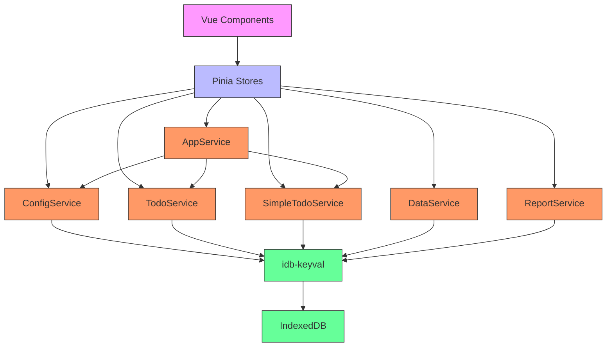
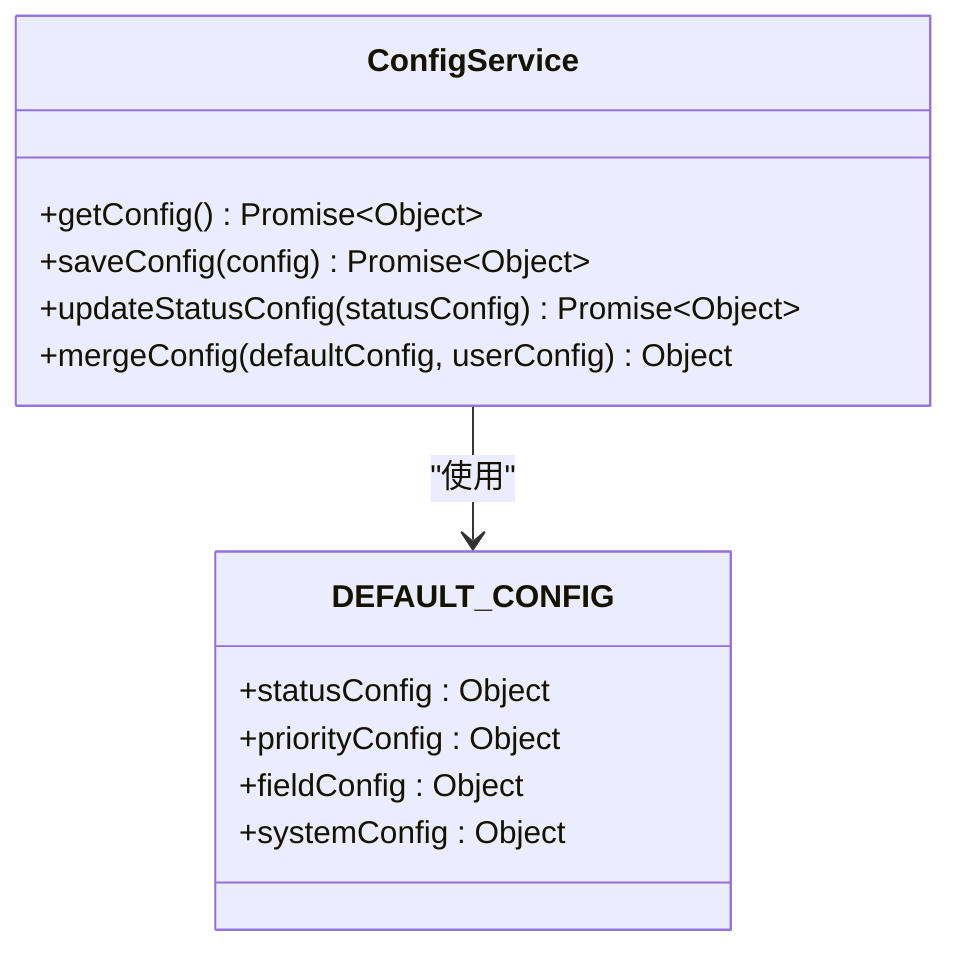
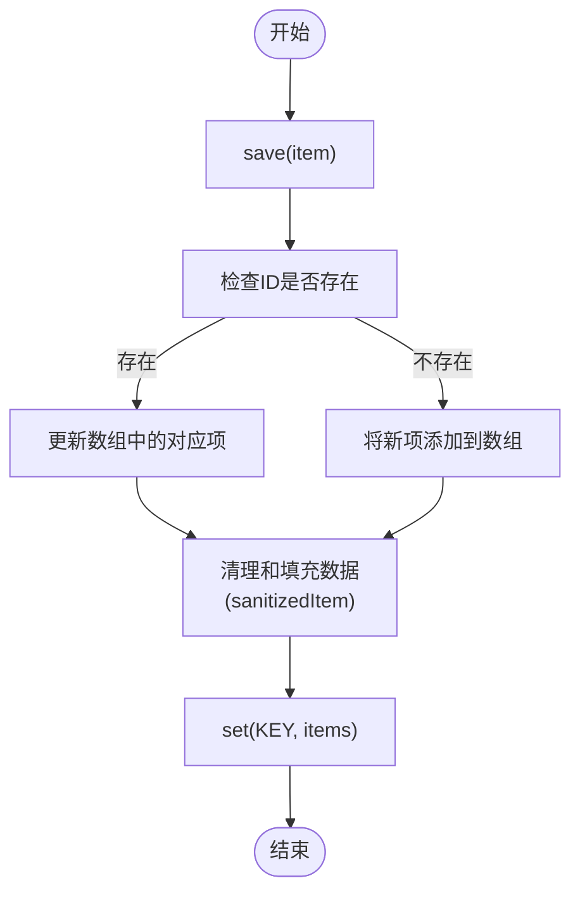
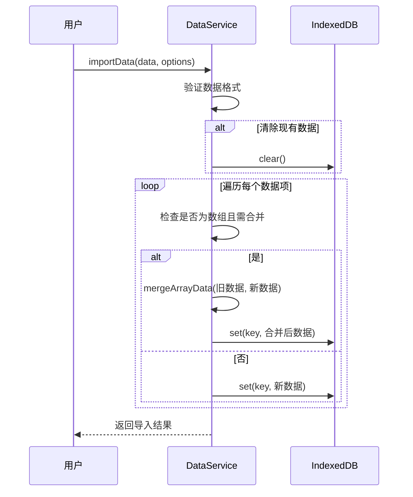
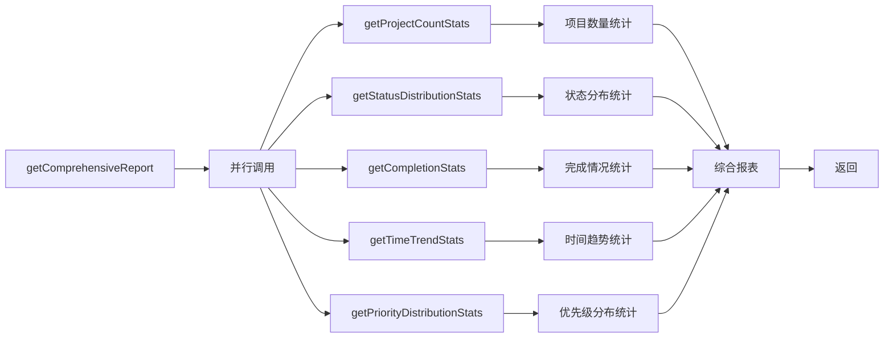

# 服务层架构

<cite>
**本文档引用的文件**  
- [appService.js](file://src/services/appService.js)
- [configService.js](file://src/services/configService.js)
- [todoService.js](file://src/services/todoService.js)
- [simpleTodoService.js](file://src/services/simpleTodoService.js)
- [dataService.js](file://src/services/dataService.js)
- [reportService.js](file://src/services/reportService.js)
- [errorHandler.js](file://src/utils/errorHandler.js)
- [idGenerator.js](file://src/utils/idGenerator.js)
</cite>

## 目录
1. [简介](#简介)
2. [服务层总体架构](#服务层总体架构)
3. [核心服务详解](#核心服务详解)
   - [AppService：应用初始化与状态管理](#appservice应用初始化与状态管理)
   - [ConfigService：配置持久化与合并](#configservice配置持久化与合并)
   - [TodoService 与 SimpleTodoService：CRUD 操作](#todoservice-与-simpletodoservicecrud-操作)
   - [DataService：数据导入导出机制](#dataservice数据导入导出机制)
   - [ReportService：多维度统计分析](#reportservice多维度统计分析)
4. [服务间协作与调用流程](#服务间协作与调用流程)
5. [错误处理机制](#错误处理机制)
6. [API 调用示例与参数说明](#api-调用示例与参数说明)
7. [总结](#总结)

## 简介
TidyDo 是一个基于浏览器 IndexedDB 的待办事项管理应用，其服务层位于 `src/services` 目录下，是整个应用的业务逻辑核心。服务层封装了对底层数据存储（IndexedDB）的访问，向上层组件（如 Vue 组件和 Pinia stores）提供干净、一致且易于使用的 API。本文档将深入剖析服务层的各个核心服务，阐述其设计原理、关键方法和协作机制。

## 服务层总体架构
服务层采用模块化设计，每个服务类负责特定领域的业务逻辑。所有服务均通过 `idb-keyval` 库与 IndexedDB 交互，确保数据持久化。服务之间通过静态方法调用和依赖注入进行协作，形成一个松耦合、高内聚的架构体系。



**图示来源**  
- [appService.js](file://src/services/appService.js)
- [configService.js](file://src/services/configService.js)
- [todoService.js](file://src/services/todoService.js)
- [simpleTodoService.js](file://src/services/simpleTodoService.js)
- [dataService.js](file://src/services/dataService.js)
- [reportService.js](file://src/services/reportService.js)

## 核心服务详解

### AppService：应用初始化与状态管理
`AppService` 是应用的启动中枢，负责协调整个应用的初始化流程，确保各个服务和状态按正确的时序加载。

**核心功能**：
- **防止重复初始化**：通过私有静态变量 `#isInitialized` 和 `#isInitializing` 确保应用不会被重复或并发初始化。
- **并行初始化**：在 `initializeApp` 方法中，使用 `Promise.all` 并行加载配置、初始化全局配置和创建默认数据，显著提升启动速度。
- **状态管理**：提供 `initializeStores` 方法来加载 Pinia stores 中的数据，并通过 `resetAppState` 方法在数据导入或用户切换时重置所有状态。

**错误处理**：`initializeApp` 和 `initializeStores` 方法均使用 `withErrorHandling` 高阶函数包装，将业务操作（"应用初始化"）的错误统一捕获并转换为 `AppError`，错误类型为 `ErrorTypes.BUSINESS`。

**Section sources**
- [appService.js](file://src/services/appService.js#L23-L54)
- [appService.js](file://src/services/appService.js#L88-L107)

### ConfigService：配置持久化与合并
`ConfigService` 负责管理应用的全局配置，确保配置的持久化存储和版本兼容性。

**核心功能**：
- **默认配置**：`DEFAULT_CONFIG` 对象定义了状态、优先级、字段显示和系统设置等完整的默认配置。
- **获取配置**：`getConfig` 方法首先尝试从 IndexedDB 获取配置。若不存在，则保存并返回默认配置。关键的是，它会调用 `mergeConfig` 方法，将已保存的用户配置与最新的默认配置进行深度合并，确保新版本中新增的配置项能被自动包含，同时保留用户的自定义设置。
- **保存配置**：`saveConfig` 方法在保存前也会调用 `mergeConfig`，保证配置的完整性。
- **细粒度更新**：提供 `updateStatusConfig`、`updatePriorityConfig` 等方法，允许只更新配置的特定部分。

**数据结构**：


**图示来源**  
- [configService.js](file://src/services/configService.js#L88-L98)
- [configService.js](file://src/services/configService.js#L106-L110)
- [configService.js](file://src/services/configService.js#L180-L205)

**Section sources**
- [configService.js](file://src/services/configService.js#L88-L98)
- [configService.js](file://src/services/configService.js#L106-L110)
- [configService.js](file://src/services/configService.js#L180-L205)

### TodoService 与 SimpleTodoService：CRUD 操作
这两个服务分别管理“普通待办事项”和“简单待办事项”的数据，提供了标准的 CRUD（创建、读取、更新、删除）接口。

**共同设计模式**：
- **数据键定义**：每个服务定义了其数据在 IndexedDB 中的存储键（如 `TODO_ITEMS_KEY` 和 `SIMPLE_TODO_ITEMS_KEY`）。
- **数据结构工厂**：提供 `createTodoItem` 和 `createSimpleTodoItem` 函数，用于创建符合规范的数据对象。
- **CRUD 方法**：`getAll`、`getById`、`getByCategoryId`、`save`、`delete` 等方法构成了完整的数据操作接口。
- **数据清理**：`save` 方法内部会创建一个 `sanitizedItem` 对象，对输入数据进行清理和默认值填充，确保数据的完整性和可序列化性。

**差异**：
- **数据模型**：`TodoItem` 包含更丰富的字段，如 `endDate`、`priority`、`tags` 等；而 `SimpleTodoItem` 结构更简单，只有 `title` 和 `status`。
- **状态机**：`SimpleTodoService` 定义了更复杂的状态机（`SIMPLE_TODO_STATUSES`），并提供了 `updateStatus` 和 `batchUpdateStatus` 等专用方法来管理状态流转。

**CRUD 流程图**：


**图示来源**  
- [todoService.js](file://src/services/todoService.js#L248-L269)
- [simpleTodoService.js](file://src/services/simpleTodoService.js#L68-L90)

**Section sources**
- [todoService.js](file://src/services/todoService.js#L248-L269)
- [todoService.js](file://src/services/todoService.js#L271-L275)
- [simpleTodoService.js](file://src/services/simpleTodoService.js#L68-L90)
- [simpleTodoService.js](file://src/services/simpleTodoService.js#L97-L101)

### DataService：数据导入导出机制
`DataService` 提供了强大的数据备份和恢复功能，是用户数据安全的重要保障。

**核心功能**：
- **导出数据**：`exportAllData` 方法会遍历 IndexedDB 中的所有键，将所有数据打包成一个包含版本和时间戳的 JSON 对象。
- **导入数据**：`importData` 方法支持两种模式：
  - **清除并替换**：当 `clearExisting=true` 时，先清空现有数据，再导入新数据。
  - **智能合并**：当 `mergeData=true` 时，对于数组类型的数据（如待办事项），会调用 `mergeArrayData` 方法，通过 ID 进行去重合并，避免数据重复。
- **文件操作**：`saveFileWithSystemAPI` 方法优先使用现代的 File System Access API 保存文件，若浏览器不支持，则自动回退到传统的 `downloadAsJSON` 方式。

**导入流程**：


**图示来源**  
- [dataService.js](file://src/services/dataService.js#L13-L35)
- [dataService.js](file://src/services/dataService.js#L46-L86)

**Section sources**
- [dataService.js](file://src/services/dataService.js#L13-L35)
- [dataService.js](file://src/services/dataService.js#L46-L86)

### ReportService：多维度统计分析
`ReportService` 负责从原始数据中提取洞察，为用户提供项目概览和趋势分析。

**核心功能**：
- **多维度统计**：提供多个专用方法，如 `getProjectCountStats`（项目数量）、`getStatusDistributionStats`（状态分布）、`getCompletionStats`（完成情况）、`getTimeTrendStats`（时间趋势）等。
- **综合报表**：`getComprehensiveReport` 方法是核心，它通过 `Promise.all` 并行调用所有统计方法，高效地生成一份包含所有维度的综合报表。
- **数据聚合**：在统计过程中，会根据分类、状态、优先级等维度对数据进行分组和计数。

**综合报表生成流程**：


**图示来源**  
- [reportService.js](file://src/services/reportService.js#L260-L285)

**Section sources**
- [reportService.js](file://src/services/reportService.js#L260-L285)

## 服务间协作与调用流程
服务层的各个服务并非孤立存在，它们通过明确的依赖关系协同工作。例如：
- `AppService.initializeApp` 会调用 `ConfigService.getConfig` 和 `todoService.initializeDefaultData`。
- `CategoryService.delete` 在删除分类时，会根据分类类型调用 `TodoItemService.deleteByCategoryId` 或 `SimpleTodoService.deleteByCategoryId`。
- `ReportService` 的统计方法会直接调用 `TodoItemService.getAll` 和 `SimpleTodoService.getAll` 来获取原始数据。

这种设计使得业务逻辑高度内聚，同时保持了服务间的低耦合。

## 错误处理机制
统一的错误处理是服务层健壮性的关键。`errorHandler.js` 提供了核心工具：
- **`withErrorHandling`**：一个高阶函数，用于包装所有异步服务方法。它捕获异常，记录日志，并将错误包装成 `AppError` 实例，附加上下文信息（操作描述和错误类型）。
- **`ErrorTypes`**：枚举了不同类型的错误（如 `STORAGE`, `BUSINESS`），便于上层进行针对性处理。
- **`getUserFriendlyMessage`**：将技术性错误转换为用户友好的提示信息。

所有服务方法都应使用 `withErrorHandling` 包装，确保错误处理的一致性。

## API 调用示例与参数说明
以下是一些关键服务方法的调用示例：

**初始化应用**
```javascript
// [AppService.initializeApp](file://src/services/appService.js#L23-L54)
await AppService.initializeApp({ force: false });
```
- **参数**：`options` 对象，`force` (boolean) 是否强制重新初始化。

**获取配置**
```javascript
// [ConfigService.getConfig](file://src/services/configService.js#L88-L98)
const config = await ConfigService.getConfig();
```
- **无参数**：返回合并了默认值的完整配置对象。

**保存待办事项**
```javascript
// [TodoItemService.save](file://src/services/todoService.js#L248-L269)
const newItem = createTodoItem(
  generateId(), 
  'cat-123', 
  '完成文档编写'
);
await TodoItemService.save(newItem);
```
- **参数**：`item` (Object) 待保存的待办事项对象。

**批量更新简单待办状态**
```javascript
// [SimpleTodoService.batchUpdateStatus](file://src/services/simpleTodoService.js#L110-L130)
await SimpleTodoService.batchUpdateStatus([
  { id: 'st-1', status: 'done' },
  { id: 'st-2', status: 'doing' }
]);
```
- **参数**：`updates` (Array) 包含 `id` 和 `status` 的更新列表。

**导出所有数据**
```javascript
// [DataService.exportAllData](file://src/services/dataService.js#L13-L35)
const backupData = await DataService.exportAllData();
DataService.downloadAsJSON(backupData, 'backup.json');
```
- **无参数**：返回包含所有数据的导出对象。

**获取综合报表**
```javascript
// [ReportService.getComprehensiveReport](file://src/services/reportService.js#L260-L285)
const report = await ReportService.getComprehensiveReport({ trendDays: 7 });
```
- **参数**：`options` 对象，`trendDays` (number) 时间趋势统计的天数。

## 总结
TidyDo 的服务层是一个设计精良、职责清晰的业务逻辑中心。它通过模块化的服务类，有效地封装了对 IndexedDB 的复杂操作，为上层应用提供了简洁、可靠且功能丰富的 API。各服务之间通过合理的依赖和协作，共同支撑起整个应用的核心功能。统一的错误处理机制和数据验证确保了系统的稳定性和用户体验。该架构为应用的可维护性和可扩展性奠定了坚实的基础。