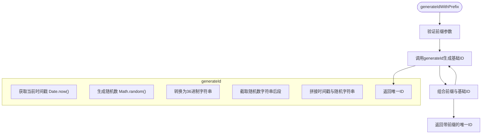
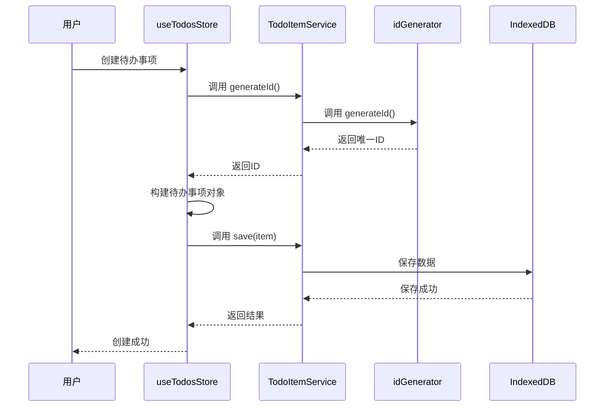
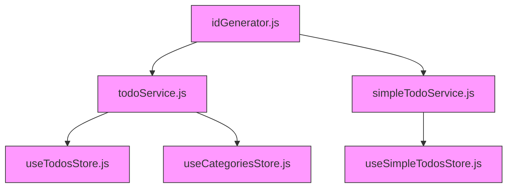

# ID 生成策略

<cite>
**Referenced Files in This Document**   
- [idGenerator.js](file://src/utils/idGenerator.js)
- [todoService.js](file://src/services/todoService.js)
- [simpleTodoService.js](file://src/services/simpleTodoService.js)
- [useTodosStore.js](file://src/stores/useTodosStore.js)
- [useCategoriesStore.js](file://src/stores/useCategoriesStore.js)
- [dataService.js](file://src/services/dataService.js)
</cite>

## 目录
1. [ID生成器概述](#id生成器概述)
2. [核心函数实现原理](#核心函数实现原理)
3. [前缀机制与实体组织](#前缀机制与实体组织)
4. [调用方式与使用示例](#调用方式与使用示例)
5. [生成格式与性能表现](#生成格式与性能表现)
6. [高并发场景下的可靠性](#高并发场景下的可靠性)
7. [实际业务场景应用](#实际业务场景应用)
8. [相关依赖与调用链路](#相关依赖与调用链路)

## ID生成器概述

TidyDo应用中的ID生成器（idGenerator.js）是整个系统数据唯一性保障的核心基础设施。该模块位于`src/utils/idGenerator.js`，为应用中的各类实体（如待办事项、分类等）提供统一、可靠且高效的唯一标识符生成服务。

ID生成器的设计目标是确保在本地存储环境下，所有创建的数据实体都能获得全局唯一的标识符，从而避免数据冲突和覆盖问题。其采用时间戳与随机数相结合的策略，在保证高性能的同时，极大降低了ID碰撞的概率。

该模块不仅服务于基础的ID生成需求，还通过前缀机制实现了对不同类型实体的逻辑隔离与分类管理，提升了数据的可读性和系统的可维护性。作为底层工具，它被多个核心服务和状态管理模块广泛调用，是数据创建流程中不可或缺的一环。

**Section sources**
- [idGenerator.js](file://src/utils/idGenerator.js#L1-L32)

## 核心函数实现原理

ID生成器的核心在于两个函数：`generateId`和`generateIdWithPrefix`。它们共同构成了系统唯一标识符的生成基础。

`generateId`函数采用时间戳与随机字符串组合的策略来确保唯一性。其具体实现为将当前时间戳`Date.now()`转换为36进制字符串，并与一个随机数`Math.random()`的36进制表示（去除前两位）进行拼接。这种设计巧妙地结合了时间的递增性和随机数的不可预测性，使得在极短时间内连续生成的ID也具有极高的差异性，有效避免了碰撞。

`generateIdWithPrefix`函数则在`generateId`的基础上增加了前缀功能。它接受一个字符串参数作为前缀，通过模板字符串将其与`generateId`生成的基础ID用下划线连接。这一设计不仅保留了基础ID的唯一性，还通过前缀为ID赋予了语义信息，使其能够直观地反映其所代表的实体类型。



**Diagram sources**
- [idGenerator.js](file://src/utils/idGenerator.js#L10-L25)

**Section sources**
- [idGenerator.js](file://src/utils/idGenerator.js#L10-L25)

## 前缀机制与实体组织

前缀机制是TidyDo数据模型中一项重要的设计模式，它通过在ID前添加特定标识来组织和区分不同类型的实体，极大地提升了数据的可读性和管理效率。

在TidyDo中，不同的数据实体使用不同的前缀进行标识。例如，待办事项（Todo）使用`todo_`前缀，而分类（Category）则使用`category_`前缀。这种命名约定使得开发者和维护者能够仅通过ID就能快速识别其所属的实体类型，无需查询数据库或查阅文档。

前缀机制带来的好处是多方面的：
1.  **可读性增强**：`todo_1a2b3c`比单纯的`1a2b3c`更能传达其含义。
2.  **逻辑隔离**：即使不同实体的ID生成算法相同，前缀也确保了它们在字符串层面的唯一性，避免了潜在的冲突。
3.  **调试便利**：在日志或调试信息中，带前缀的ID能帮助开发者快速定位问题数据的来源。
4.  **未来扩展**：系统可以轻松地为新的实体类型（如`project_`, `user_`）定义新的前缀，而无需修改底层ID生成逻辑。

虽然`idGenerator.js`本身只提供`generateIdWithPrefix`这个通用方法，但具体的前缀值（如'todo_'、'category_'）是在调用它的业务逻辑层（如`todoService.js`）中定义的，这体现了关注点分离的设计原则。

**Section sources**
- [idGenerator.js](file://src/utils/idGenerator.js#L20-L25)

## 调用方式与使用示例

ID生成器的调用方式简洁明了，主要通过`generateId`和`generateIdWithPrefix`两个导出函数进行。

在实际应用中，`generateIdWithPrefix`是最常用的调用方式。例如，在创建一个新的待办事项时，系统会调用`generateIdWithPrefix('todo')`来生成一个以`todo_`开头的唯一ID。同样，创建分类时会调用`generateIdWithPrefix('category')`。

值得注意的是，尽管`idGenerator.js`提供了这两个函数，但在TidyDo的代码库中，上层模块通常通过服务类的静态方法来间接调用它们。例如，`TodoItemService.generateId()`和`SimpleTodoService.generateId()`都是对`idGenerator`中`generateId`函数的封装。这种封装模式为代码提供了更好的抽象和可维护性。

```javascript
// 直接调用（不推荐，但可行）
import { generateIdWithPrefix } from '@/utils/idGenerator'
const todoId = generateIdWithPrefix('todo')

// 推荐的调用方式：通过服务类
import { TodoItemService } from '@/services/todoService'
const todoId = TodoItemService.generateId()
```

**Section sources**
- [idGenerator.js](file://src/utils/idGenerator.js#L10-L25)
- [todoService.js](file://src/services/todoService.js#L287-L288)
- [simpleTodoService.js](file://src/services/simpleTodoService.js#L163-L164)

## 生成格式与性能表现

ID生成器生成的ID具有特定的格式特征和优异的性能表现。

**生成格式**：
- **基础ID**：由时间戳（36进制）和随机字符串（36进制）拼接而成，例如`1a2b3c4d5e6f7g8h`。
- **带前缀ID**：由前缀、下划线和基础ID组成，例如`todo_1a2b3c4d5e6f7g8h`或`category_9i8h7g6f5e4d3c2b`。
这种格式紧凑且无特殊字符，非常适合用作数据库键和URL参数。

**性能表现**：
ID生成过程极其高效，因为它仅依赖于JavaScript的内置方法`Date.now()`和`Math.random()`，这些方法在所有现代浏览器中都经过高度优化。生成一个ID的操作时间复杂度为O(1)，且不涉及任何异步操作或外部依赖，因此可以在同步代码中快速执行，不会成为性能瓶颈。

此外，由于ID生成是纯内存操作，它对系统的I/O资源没有影响，即使在高频率创建数据的场景下，也能保持稳定的性能。

**Section sources**
- [idGenerator.js](file://src/utils/idGenerator.js#L10-L25)

## 高并发场景下的可靠性

在高并发场景下，ID生成器的可靠性主要依赖于其算法设计，而非外部协调机制。

TidyDo作为一个浏览器扩展应用，其数据操作主要发生在单个用户的本地环境中。这意味着ID生成的并发性主要来自于用户短时间内快速创建多个项目，而非来自多个分布式客户端的同时写入。在这种场景下，`generateId`函数的时间戳部分（`Date.now()`）提供了天然的顺序性，而`Math.random()`的随机性则确保了即使在同一毫秒内生成的ID也极大概率不同。

虽然理论上存在极小的碰撞概率，但在实际使用中，这种概率可以忽略不计。对于TidyDo这类应用，这种基于时间戳和随机数的轻量级方案在性能、复杂性和可靠性之间取得了最佳平衡。它避免了引入复杂的时间同步或中心化ID生成服务的开销，完全满足了本地应用的需求。

**Section sources**
- [idGenerator.js](file://src/utils/idGenerator.js#L10-L15)

## 实际业务场景应用

ID生成器在TidyDo的实际业务场景中扮演着关键角色，贯穿于数据创建的整个流程。

当用户在应用中创建一个新的待办事项时，`useTodosStore.js`中的`createTodo`方法会被调用。该方法会实例化一个待办事项对象，其ID通过`TodoItemService.generateId()`获取。`TodoItemService`内部则调用了`idGenerator`的`generateId`函数来生成一个唯一的ID。随后，这个带有唯一ID的待办事项对象会被保存到IndexedDB中。

同样，当用户创建一个新的分类时，`useCategoriesStore.js`中的`createNewCategory`方法会调用`TodoItemService.generateId()`来为新分类生成ID。这确保了每个分类也拥有一个全局唯一的标识符。



**Diagram sources**
- [useTodosStore.js](file://src/stores/useTodosStore.js#L57)
- [todoService.js](file://src/services/todoService.js#L287-L288)
- [idGenerator.js](file://src/utils/idGenerator.js#L10)

**Section sources**
- [useTodosStore.js](file://src/stores/useTodosStore.js#L57)
- [useCategoriesStore.js](file://src/stores/useCategoriesStore.js#L55)

## 相关依赖与调用链路

ID生成器模块（idGenerator.js）是整个应用的底层依赖，被多个核心模块所调用。

其主要的直接调用者是`todoService.js`和`simpleTodoService.js`中的服务类。这些服务类通过静态方法`generateId()`对`idGenerator`的`generateId`函数进行封装，为上层应用提供统一的接口。

上层的状态管理模块`useTodosStore.js`和`useCategoriesStore.js`则通过调用这些服务类的`generateId()`方法来获取ID，从而实现了从UI到数据层的完整调用链路。这种分层调用结构清晰地划分了职责，使得ID生成逻辑可以独立演进，而不会影响到业务逻辑。



**Diagram sources**
- [idGenerator.js](file://src/utils/idGenerator.js)
- [todoService.js](file://src/services/todoService.js)
- [simpleTodoService.js](file://src/services/simpleTodoService.js)
- [useTodosStore.js](file://src/stores/useTodosStore.js)
- [useCategoriesStore.js](file://src/stores/useCategoriesStore.js)

**Section sources**
- [todoService.js](file://src/services/todoService.js#L287-L288)
- [simpleTodoService.js](file://src/services/simpleTodoService.js#L163-L164)
- [useTodosStore.js](file://src/stores/useTodosStore.js#L57)
- [useCategoriesStore.js](file://src/stores/useCategoriesStore.js#L55)