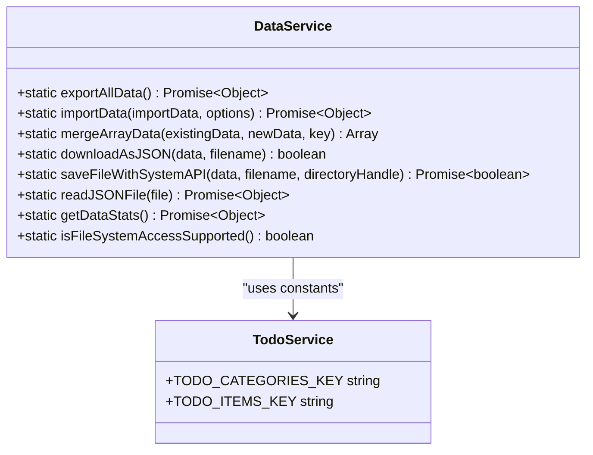

# IndexedDB 数据存储机制

<cite>
**Referenced Files in This Document**  
- [dataService.js](file://src/services/dataService.js)
- [todoService.js](file://src/services/todoService.js)
</cite>

## 目录
1. [简介](#简介)
2. [核心存储方案](#核心存储方案)
3. [数据服务核心方法](#数据服务核心方法)
4. [数据导出机制](#数据导出机制)
5. [数据导入机制](#数据导入机制)
6. [智能数据合并](#智能数据合并)
7. [数据序列化与版本控制](#数据序列化与版本控制)
8. [存储键设计规范](#存储键设计规范)
9. [异常处理流程](#异常处理流程)
10. [实际调用示例](#实际调用示例)

## 简介
TidyDo 应用采用基于 `idb-keyval` 库的轻量级键值存储方案，利用 IndexedDB 实现浏览器环境下的数据持久化。该方案提供了可靠的数据备份与恢复功能，支持数据的导出、导入、合并等操作，确保用户数据的安全性与可迁移性。

## 核心存储方案
TidyDo 使用 `idb-keyval` 作为 IndexedDB 的轻量级封装库，提供简洁的键值对存储接口。该方案在浏览器环境中具有以下优势：
- **持久化存储**：数据在浏览器关闭后依然保留
- **大容量支持**：相比 localStorage 有更大的存储空间
- **异步操作**：非阻塞式数据读写，提升应用性能
- **简单易用**：提供简洁的 get、set、keys、clear 等接口

**Section sources**
- [dataService.js](file://src/services/dataService.js#L0-L273)
- [todoService.js](file://src/services/todoService.js#L0-L313)

## 数据服务核心方法
`DataService` 类提供了数据备份与恢复的核心功能，包括数据导出、导入、文件下载等操作。该服务作为应用数据持久化的关键组件，确保了用户数据的安全与可移植性。



**Diagram sources**
- [dataService.js](file://src/services/dataService.js#L13-L100)
- [todoService.js](file://src/services/todoService.js#L4-L5)

## 数据导出机制
`exportAllData` 方法实现了完整的数据导出功能，将应用中的所有数据打包为可迁移的格式。

### 实现逻辑
1. 创建包含版本信息、时间戳和数据体的导出对象
2. 通过 `keys()` 方法获取所有存储键
3. 遍历每个键，使用 `get()` 方法读取对应数据
4. 将所有数据封装到导出对象中返回

该机制确保了导出数据的完整性与可追溯性，为数据迁移和备份提供了可靠基础。

**Section sources**
- [dataService.js](file://src/services/dataService.js#L13-L35)

## 数据导入机制
`importData` 方法提供了灵活的数据导入功能，支持多种导入策略以满足不同场景需求。

### 参数配置
- `clearExisting`：是否清除现有数据（默认 false）
- `mergeData`：是否合并数据（默认 true）

### 处理流程
1. 验证导入数据格式的正确性
2. 根据 `clearExisting` 选项决定是否清除现有数据
3. 遍历导入数据的每个键值对
4. 根据 `mergeData` 选项和数据类型决定处理策略
5. 使用 `set()` 方法保存数据

该机制提供了清除、替换、合并等多种数据导入策略，确保了数据导入的灵活性与安全性。

**Section sources**
- [dataService.js](file://src/services/dataService.js#L46-L86)

## 智能数据合并
`mergeArrayData` 方法实现了数组类型数据的智能合并，避免数据重复。

### 合并策略
- **特定键处理**：对 `TODO_CATEGORIES_KEY` 和 `TODO_ITEMS_KEY` 进行特殊处理
- **ID去重**：基于数据项的 ID 进行去重合并
- **通用策略**：其他类型数据直接替换

### 实现逻辑
1. 检查键是否为待办事项或分类数据
2. 提取现有数据中的所有 ID
3. 过滤新数据中已存在的项
4. 将去重后的新数据追加到现有数据末尾

此机制确保了在合并同类数据时不会产生重复项，同时保持了数据的完整性。

**Section sources**
- [dataService.js](file://src/services/dataService.js#L89-L99)
- [todoService.js](file://src/services/todoService.js#L4-L5)

## 数据序列化与版本控制
TidyDo 的数据存储机制采用了标准化的数据序列化格式和版本控制策略。

### 导出数据结构
```json
{
  "version": "1.0",
  "timestamp": "2024-01-01T00:00:00.000Z",
  "data": {
    "todo-categories": [...],
    "todo-items": [...]
  }
}
```

### 版本控制
- **版本号**：当前为 "1.0"，便于未来格式升级
- **时间戳**：ISO 格式记录导出时间，便于数据追溯
- **数据体**：包含所有键值对的嵌套对象

此结构确保了数据的可读性、可扩展性和向后兼容性。

**Section sources**
- [dataService.js](file://src/services/dataService.js#L15-L18)

## 存储键设计规范
TidyDo 采用了清晰的存储键命名规范，便于数据管理和维护。

### 键命名规则
- **语义化命名**：使用有意义的名称描述数据内容
- **统一前缀**：所有待办相关数据使用 "todo-" 前缀
- **复数形式**：集合数据使用复数形式

### 核心存储键
- `todo-categories`：存储分类数据数组
- `todo-items`：存储待办事项数据数组

这种规范化的键设计提高了代码的可读性和可维护性。

**Section sources**
- [todoService.js](file://src/services/todoService.js#L4-L5)

## 异常处理流程
TidyDo 的数据服务实现了完善的异常处理机制，确保数据操作的可靠性。

### 错误类型
- **数据格式错误**：导入数据格式无效
- **操作失败**：导出或导入过程中发生错误
- **文件系统错误**：文件保存或读取失败

### 处理策略
1. 捕获所有异步操作中的异常
2. 记录详细的错误日志到控制台
3. 抛出用户友好的错误消息
4. 提供回退机制（如现代API失败时回退到传统下载）

此机制确保了在各种异常情况下都能提供清晰的反馈和适当的恢复策略。

**Section sources**
- [dataService.js](file://src/services/dataService.js#L29-L34)
- [dataService.js](file://src/services/dataService.js#L65-L85)

## 实际调用示例
以下是 `DataService` 的典型使用场景：

### 数据导出
```javascript
const backupData = await DataService.exportAllData();
// 可选择下载为JSON文件
DataService.downloadAsJSON(backupData, 'tidydo-backup.json');
```

### 数据导入
```javascript
// 仅合并新数据
await DataService.importData(backupData, { mergeData: true });

// 清除现有数据后导入
await DataService.importData(backupData, { clearExisting: true });
```

这些示例展示了如何在实际应用中使用数据服务进行备份和恢复操作。

**Section sources**
- [dataService.js](file://src/services/dataService.js#L13-L86)