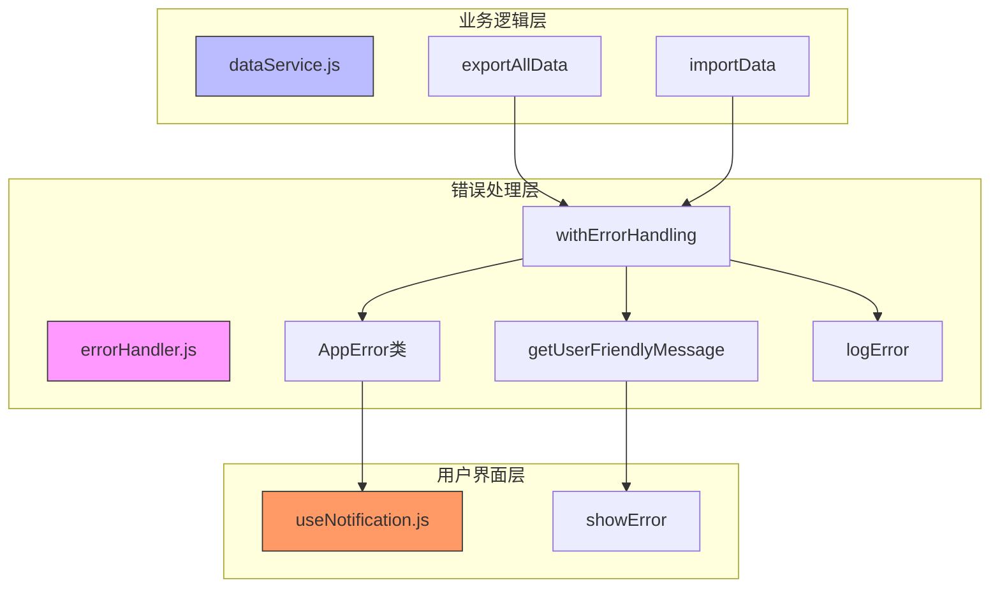
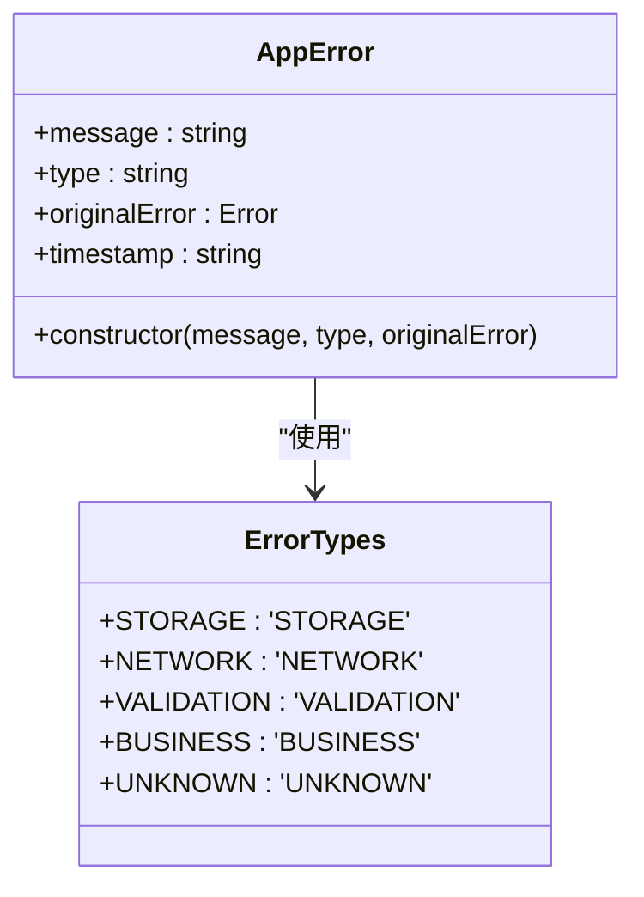
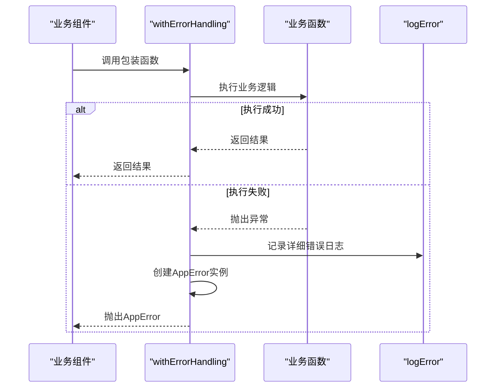
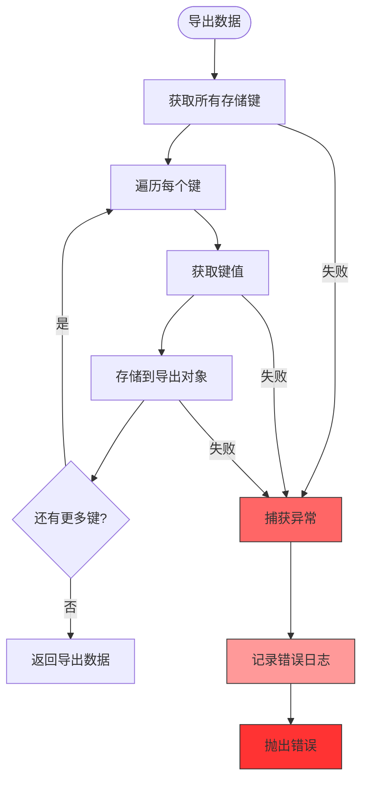
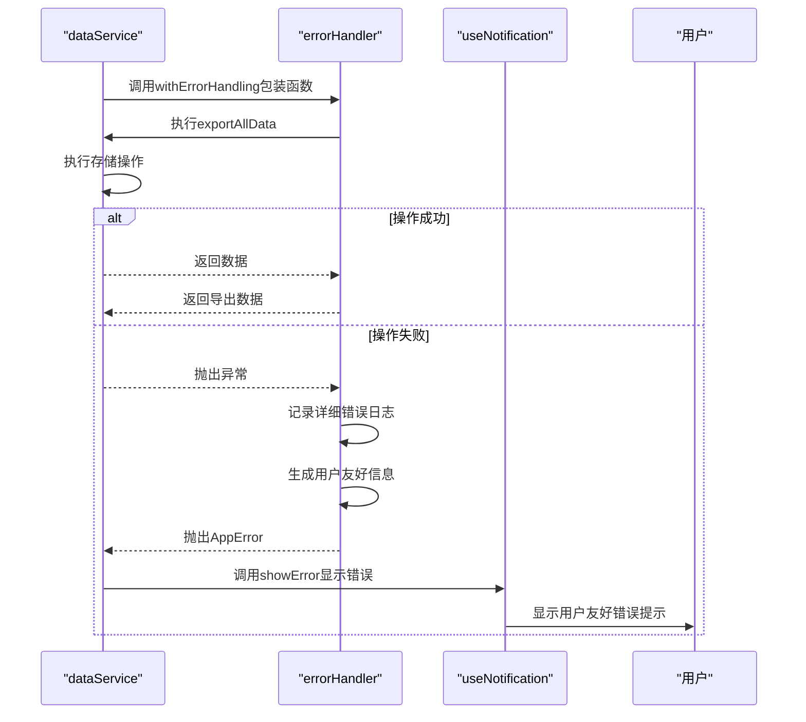

# 存储操作错误处理

<cite>
**Referenced Files in This Document**  
- [errorHandler.js](file://src/utils/errorHandler.js)
- [dataService.js](file://src/services/dataService.js)
- [useNotification.js](file://src/composables/useNotification.js)
</cite>

## 目录
1. [简介](#简介)
2. [核心组件](#核心组件)
3. [错误处理架构](#错误处理架构)
4. [错误类型分类](#错误类型分类)
5. [高阶函数封装](#高阶函数封装)
6. [实际应用分析](#实际应用分析)
7. [错误处理流程](#错误处理流程)
8. [最佳实践](#最佳实践)
9. [常见错误代码解析](#常见错误代码解析)
10. [调试建议](#调试建议)
11. [扩展新错误类型](#扩展新错误类型)

## 简介

TidyDo应用通过`errorHandler.js`模块提供了一套完整的存储操作错误处理机制。该机制旨在为用户提供一致且友好的错误体验，同时为开发者提供详细的错误日志记录。系统特别关注存储操作中的异常情况，如数据导出、导入失败等场景，通过统一的错误处理框架确保应用的健壮性和用户体验。

## 核心组件

TidyDo的错误处理系统由三个核心组件构成：`errorHandler.js`提供统一的错误处理能力，`dataService.js`实现数据的导入导出功能，`useNotification.js`负责向用户展示错误信息。这三个组件协同工作，形成了从错误捕获、处理到用户反馈的完整闭环。

**Section sources**
- [errorHandler.js](file://src/utils/errorHandler.js#L1-L110)
- [dataService.js](file://src/services/dataService.js#L1-L274)
- [useNotification.js](file://src/composables/useNotification.js#L1-L59)

## 错误处理架构



**Diagram sources**
- [errorHandler.js](file://src/utils/errorHandler.js#L1-L110)
- [dataService.js](file://src/services/dataService.js#L1-L274)
- [useNotification.js](file://src/composables/useNotification.js#L1-L59)

## 错误类型分类

TidyDo定义了多种错误类型，以精确标识不同场景下的异常情况。这些类型在`ErrorTypes`枚举中声明，为错误处理提供了语义化的分类基础。



**Diagram sources**
- [errorHandler.js](file://src/utils/errorHandler.js#L6-L23)

### 错误类型说明

| 错误类型 | 描述 | 用户提示信息 |
|---------|------|------------|
| STORAGE | 存储操作失败，如浏览器存储空间不足或权限问题 | 数据存储失败，请检查浏览器存储权限 |
| NETWORK | 网络连接问题导致的操作失败 | 网络连接失败，请检查网络连接 |
| VALIDATION | 数据验证不通过，如格式错误或必填项缺失 | 数据验证失败，请检查输入内容 |
| BUSINESS | 业务逻辑相关的操作失败 | 操作失败，请稍后重试 |
| UNKNOWN | 未预期的未知错误 | 未知错误，请联系技术支持 |

**Section sources**
- [errorHandler.js](file://src/utils/errorHandler.js#L6-L34)

## 高阶函数封装

`withErrorHandling`高阶函数是TidyDo错误处理机制的核心，它通过装饰器模式为异步函数提供统一的错误处理能力。



**Diagram sources**
- [errorHandler.js](file://src/utils/errorHandler.js#L69-L86)

### withErrorHandling实现

`withErrorHandling`函数接收一个异步函数作为参数，并返回一个新的异步函数。这个新函数包含了完整的错误处理逻辑，包括错误日志记录、用户友好信息生成和错误对象包装。

**Section sources**
- [errorHandler.js](file://src/utils/errorHandler.js#L69-L86)

## 实际应用分析

在`dataService.js`中，`exportAllData`和`importData`方法展示了错误处理机制在实际业务场景中的应用。



**Diagram sources**
- [dataService.js](file://src/services/dataService.js#L13-L35)

### 数据导出流程

当用户尝试导出数据时，系统会执行以下步骤：
1. 创建包含版本和时间戳的导出对象
2. 获取所有存储的键名
3. 遍历每个键并获取其值
4. 将键值对存储到导出对象中
5. 返回完整的导出数据

如果在此过程中发生任何错误，原始实现会直接记录错误并抛出通用错误消息。

**Section sources**
- [dataService.js](file://src/services/dataService.js#L13-L35)

### 数据导入流程

数据导入流程包括：
1. 验证导入数据的格式
2. 根据选项决定是否清除现有数据
3. 遍历导入数据中的每个键值对
4. 根据合并策略处理数据（智能合并或直接覆盖）
5. 返回导入结果

与导出类似，原始实现使用了基本的try-catch机制进行错误处理。

**Section sources**
- [dataService.js](file://src/services/dataService.js#L46-L86)

## 错误处理流程

TidyDo的完整错误处理流程从错误发生到用户反馈经历了多个阶段，确保了错误信息的准确传递和用户体验的优化。



**Diagram sources**
- [errorHandler.js](file://src/utils/errorHandler.js#L69-L86)
- [dataService.js](file://src/services/dataService.js#L13-L35)
- [useNotification.js](file://src/composables/useNotification.js#L1-L59)

## 最佳实践

### 统一错误处理模式

TidyDo推荐使用`withErrorHandling`高阶函数来包装所有异步操作，确保错误处理的一致性。

```javascript
// 推荐做法
const safeExport = withErrorHandling(
  DataService.exportAllData, 
  '数据导出', 
  ErrorTypes.STORAGE
)
```

这种方法避免了在每个业务方法中重复编写try-catch块，提高了代码的可维护性。

### 分层错误处理

系统采用分层错误处理策略：
- 底层：`errorHandler.js`提供基础错误处理能力
- 中层：业务服务使用高阶函数包装关键操作
- 上层：UI组件接收标准化的错误对象并展示给用户

这种分层架构确保了错误处理的关注点分离。

**Section sources**
- [errorHandler.js](file://src/utils/errorHandler.js#L69-L86)
- [dataService.js](file://src/services/dataService.js#L13-L35)

## 常见错误代码解析

### QuotaExceededError

当浏览器存储空间不足时，会抛出此错误。系统会将其映射为更友好的提示：

```mermaid
stateDiagram-v2
[*] --> StorageOperation
StorageOperation --> QuotaExceededError : 存储空间不足
QuotaExceededError --> UserFriendlyMessage : 转换
UserFriendlyMessage --> "存储空间不足，请清理浏览器数据后重试"
```

**Section sources**
- [errorHandler.js](file://src/utils/errorHandler.js#L54-L56)

### NetworkError

网络连接问题会导致此错误，通常发生在需要网络通信的场景中：

```mermaid
stateDiagram-v2
[*] --> NetworkRequest
NetworkRequest --> NetworkError : 网络中断
NetworkError --> UserFriendlyMessage : 转换
UserFriendlyMessage --> "网络连接失败，请检查网络连接"
```

**Section sources**
- [errorHandler.js](file://src/utils/errorHandler.js#L58-L60)

## 调试建议

### 启用详细日志

在开发环境中，所有错误都会被详细记录到控制台，包含完整的错误堆栈和上下文信息。

```javascript
// 错误日志格式
{
  message: "数据导出失败",
  type: "STORAGE",
  context: "exportAllData",
  timestamp: "2024-01-01T00:00:00.000Z",
  stack: "Error: 数据导出失败\n    at ..."
}
```

这有助于快速定位问题根源。

### 错误监控

虽然当前实现主要依赖控制台日志，但代码中预留了生产环境错误监控的扩展点：

```javascript
// if (process.env.NODE_ENV === 'production') {
//   sendToErrorMonitoring(errorInfo)
// }
```

建议在生产环境中集成错误监控服务，如Sentry或Bugsnag。

**Section sources**
- [errorHandler.js](file://src/utils/errorHandler.js#L102-L106)

## 扩展新错误类型

### 添加新的错误类型

要扩展新的错误类型，需要在`ErrorTypes`枚举中添加新的类型定义：

```javascript
export const ErrorTypes = {
  // ... existing types
  AUTH: 'AUTH',        // 认证相关错误
  SYNC: 'SYNC',        // 数据同步错误
  EXPORT: 'EXPORT',    // 导出特定错误
  IMPORT: 'IMPORT'     // 导入特定错误
}
```

### 自定义错误消息

同时需要在`ERROR_MESSAGES`映射中添加对应的用户友好提示：

```javascript
const ERROR_MESSAGES = {
  // ... existing messages
  [ErrorTypes.AUTH]: '认证失败，请重新登录',
  [ErrorTypes.SYNC]: '数据同步失败，请检查网络连接',
  [ErrorTypes.EXPORT]: '数据导出失败，请重试',
  [ErrorTypes.IMPORT]: '数据导入失败，请检查文件格式'
}
```

### 使用新错误类型

在业务逻辑中使用新的错误类型：

```javascript
const safeExport = withErrorHandling(
  DataService.exportAllData, 
  '数据导出', 
  ErrorTypes.EXPORT
)
```

这种扩展方式保持了错误处理系统的一致性和可维护性。

**Section sources**
- [errorHandler.js](file://src/utils/errorHandler.js#L6-L34)