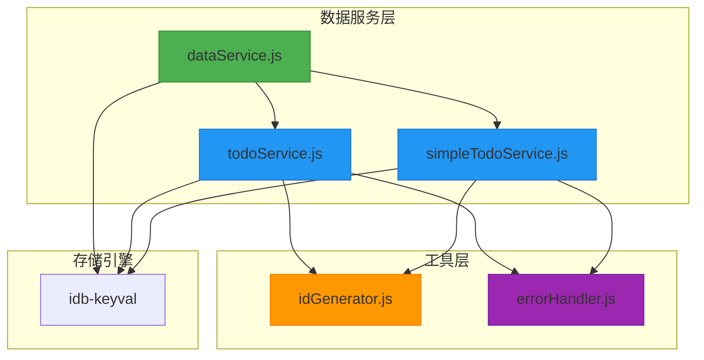
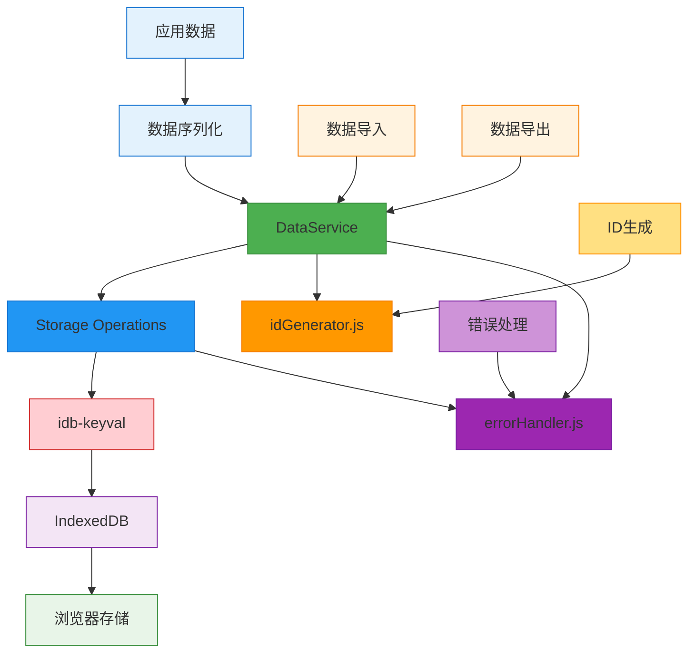
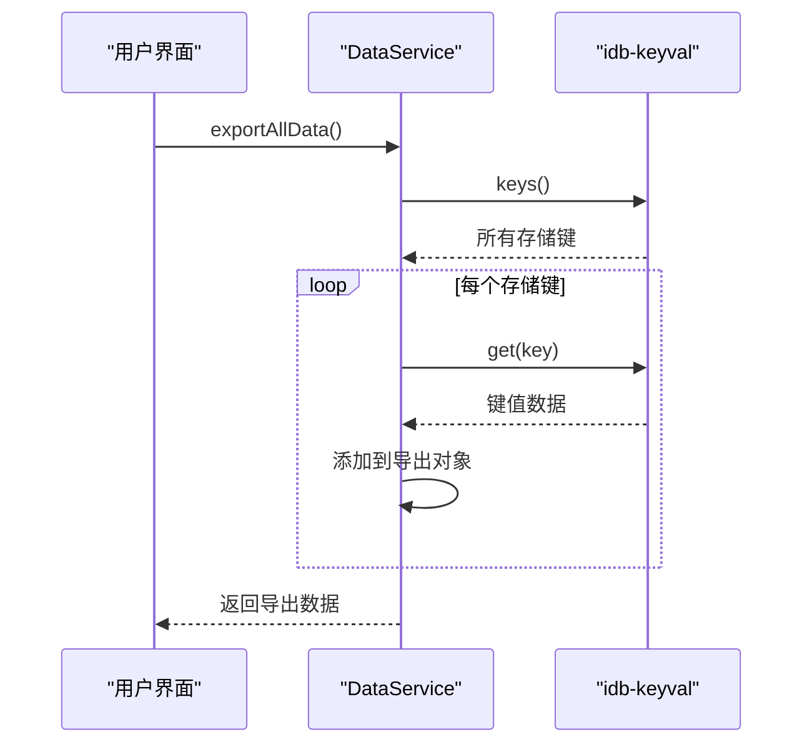
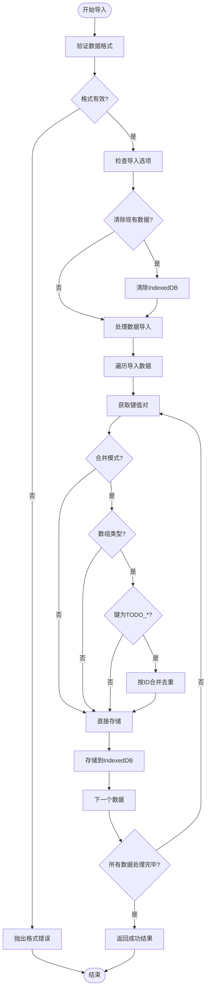
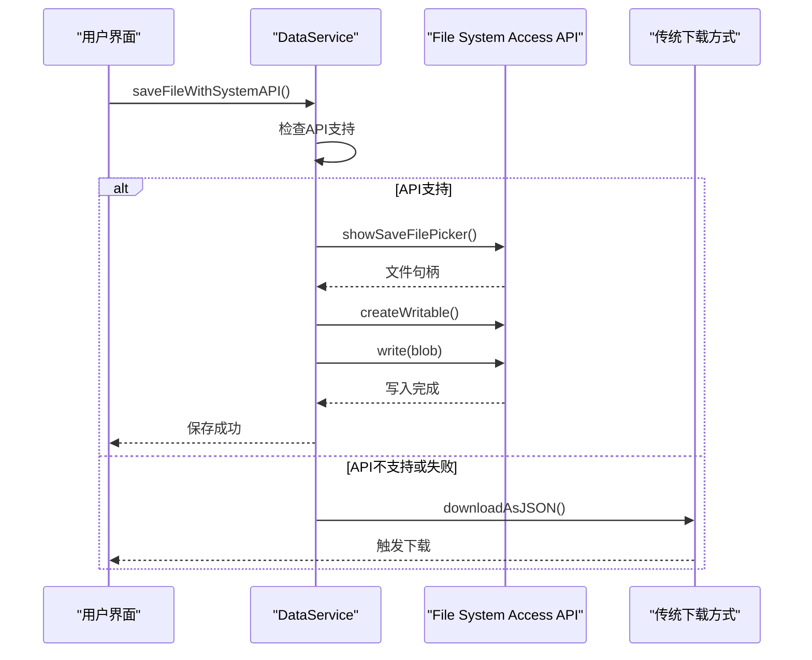
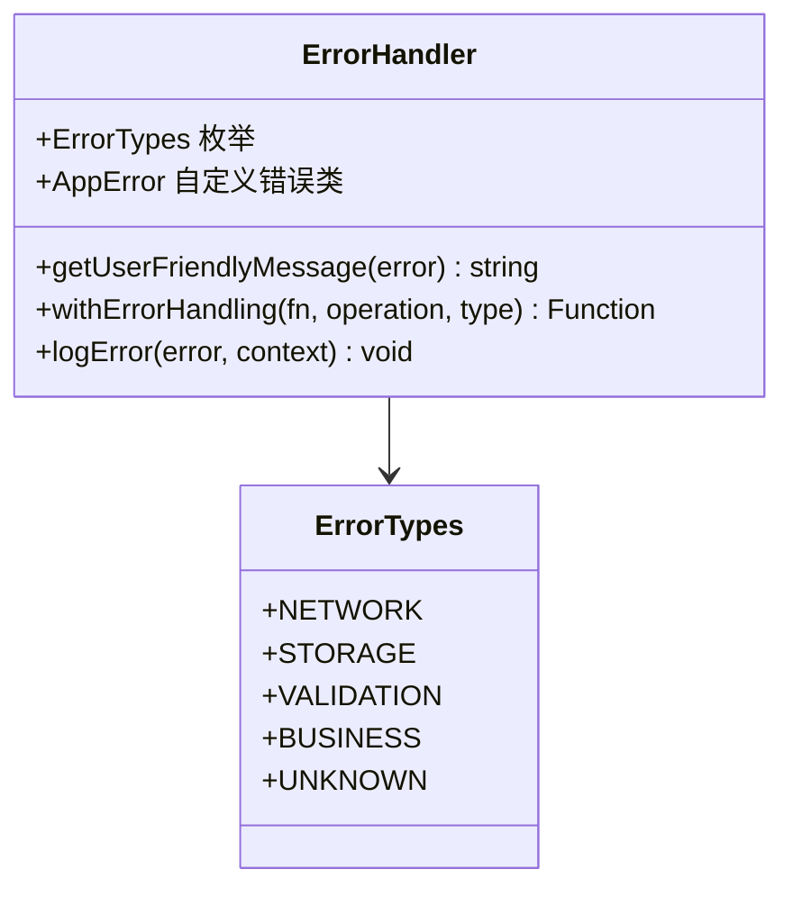
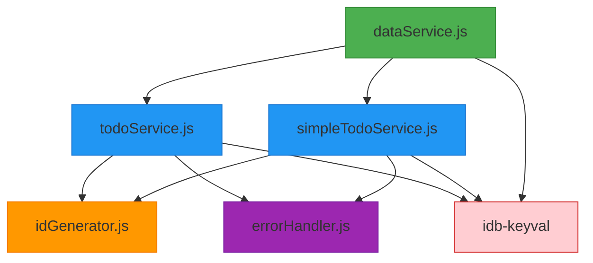
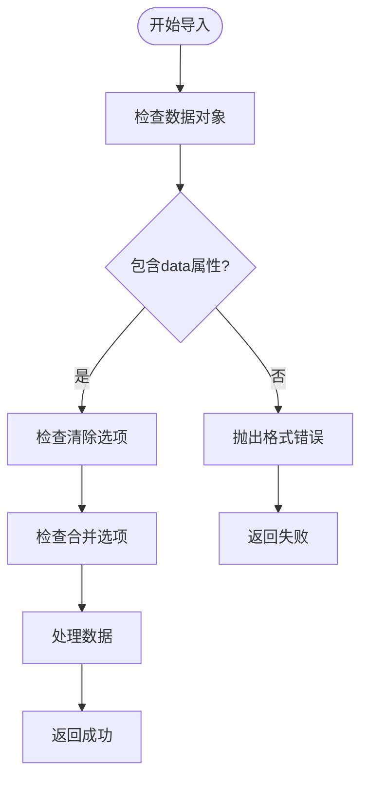
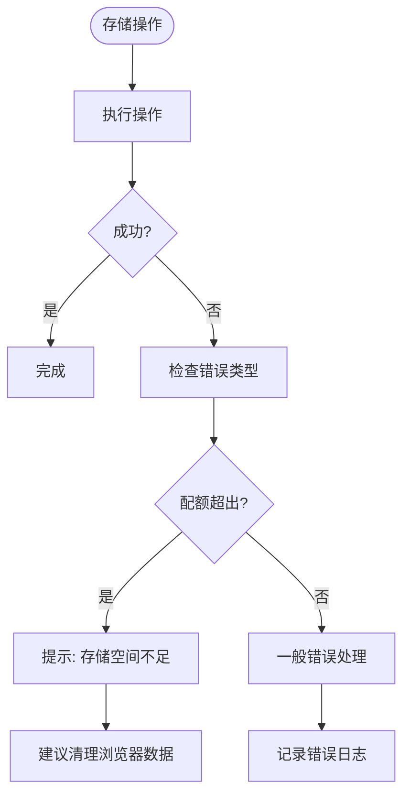

# 数据持久化架构

<cite>
**Referenced Files in This Document**   
- [dataService.js](file://src/services/dataService.js)
- [idGenerator.js](file://src/utils/idGenerator.js)
- [errorHandler.js](file://src/utils/errorHandler.js)
- [todoService.js](file://src/services/todoService.js)
- [simpleTodoService.js](file://src/services/simpleTodoService.js)
</cite>

## 目录
1. [简介](#简介)
2. [项目结构](#项目结构)
3. [核心组件](#核心组件)
4. [架构概述](#架构概述)
5. [详细组件分析](#详细组件分析)
6. [依赖分析](#依赖分析)
7. [性能考虑](#性能考虑)
8. [故障排除指南](#故障排除指南)
9. [结论](#结论)

## 简介
TidyDo应用采用基于IndexedDB的本地数据持久化方案，通过idb-keyval库提供轻量级键值存储。本架构文档详细阐述了数据存储、序列化、ID生成、错误处理等核心机制，以及数据导出导入、版本管理、完整性校验等高级功能，为开发者和用户提供全面的技术参考。

## 项目结构
TidyDo的数据持久化机制主要分布在`src/services`和`src/utils`目录下，采用分层架构设计，将数据访问、业务逻辑和工具功能分离。



**Diagram sources**
- [dataService.js](file://src/services/dataService.js)
- [todoService.js](file://src/services/todoService.js)
- [simpleTodoService.js](file://src/services/simpleTodoService.js)
- [idGenerator.js](file://src/utils/idGenerator.js)
- [errorHandler.js](file://src/utils/errorHandler.js)

**Section sources**
- [src/services](file://src/services)
- [src/utils](file://src/utils)

## 核心组件
TidyDo的数据持久化架构由三个核心组件构成：DataService提供数据备份与恢复功能，idGenerator.js确保数据ID的全局唯一性，errorHandler.js实现统一的错误处理策略。

**Section sources**
- [dataService.js](file://src/services/dataService.js#L1-L273)
- [idGenerator.js](file://src/utils/idGenerator.js#L1-L31)
- [errorHandler.js](file://src/utils/errorHandler.js#L1-L109)

## 架构概述
TidyDo采用基于IndexedDB的客户端数据存储架构，通过idb-keyval库封装底层API，提供简洁的键值存储接口。系统定义了明确的存储键规范，使用JSON格式进行数据序列化，并通过DataService实现完整的数据导出导入功能。



**Diagram sources**
- [dataService.js](file://src/services/dataService.js#L1-L273)
- [idGenerator.js](file://src/utils/idGenerator.js#L1-L31)
- [errorHandler.js](file://src/utils/errorHandler.js#L1-L109)

## 详细组件分析

### DataService分析
DataService是TidyDo数据持久化的核心服务，提供完整的数据备份、恢复和迁移功能，支持现代浏览器的文件系统API和传统下载方式。

#### 数据导出功能


**Diagram sources**
- [dataService.js](file://src/services/dataService.js#L13-L35)

**Section sources**
- [dataService.js](file://src/services/dataService.js#L13-L35)

#### 数据导入功能


**Diagram sources**
- [dataService.js](file://src/services/dataService.js#L46-L86)

**Section sources**
- [dataService.js](file://src/services/dataService.js#L46-L86)

#### 智能数据合并
```mermaid
classDiagram
class DataService {
+static mergeArrayData(existingData, newData, key) Object
}
class ArrayMerger {
+mergeById(existingData, newData) Object
+mergeByReplace(newData) Object
}
DataService --> ArrayMerger : "使用"
note right of DataService
对于TODO_CATEGORIES_KEY和TODO_ITEMS_KEY，
按ID去重合并；其他情况直接替换
end note
```

**Diagram sources**
- [dataService.js](file://src/services/dataService.js#L89-L99)

**Section sources**
- [dataService.js](file://src/services/dataService.js#L89-L99)

#### 文件系统API集成


**Diagram sources**
- [dataService.js](file://src/services/dataService.js#L130-L173)

**Section sources**
- [dataService.js](file://src/services/dataService.js#L130-L173)

### idGenerator.js分析
idGenerator.js提供全局唯一的ID生成算法，确保不同数据实体的ID不会冲突，支持带前缀的ID生成以增强数据可读性。

```mermaid
classDiagram
class IdGenerator {
+static generateId() string
+static generateIdWithPrefix(prefix) string
+static isValidId(id) boolean
}
note right of IdGenerator
generateId : 时间戳 + 随机字符串<br/>
generateIdWithPrefix : 前缀 + "_" + generateId()
end note
```

**Diagram sources**
- [idGenerator.js](file://src/utils/idGenerator.js#L1-L31)

**Section sources**
- [idGenerator.js](file://src/utils/idGenerator.js#L1-L31)

### errorHandler.js分析
errorHandler.js实现统一的错误处理框架，提供用户友好的错误信息映射和错误日志记录功能，确保异常情况下的用户体验。



**Diagram sources**
- [errorHandler.js](file://src/utils/errorHandler.js#L1-L109)

**Section sources**
- [errorHandler.js](file://src/utils/errorHandler.js#L1-L109)

## 依赖分析
TidyDo的数据持久化组件之间存在明确的依赖关系，DataService依赖于具体的业务服务，而业务服务又依赖于通用工具模块。



**Diagram sources**
- [dataService.js](file://src/services/dataService.js)
- [todoService.js](file://src/services/todoService.js)
- [simpleTodoService.js](file://src/services/simpleTodoService.js)
- [idGenerator.js](file://src/utils/idGenerator.js)
- [errorHandler.js](file://src/utils/errorHandler.js)

**Section sources**
- [dataService.js](file://src/services/dataService.js)
- [todoService.js](file://src/services/todoService.js)
- [simpleTodoService.js](file://src/services/simpleTodoService.js)

## 性能考虑
TidyDo的数据持久化设计考虑了多项性能优化策略，包括批量操作、数据压缩和错误处理优化。

### 存储键设计规范
TidyDo采用统一的存储键命名规范，确保数据组织的清晰性和可维护性。

| 存储键 | 用途 | 数据类型 |
|-------|------|---------|
| todo-categories | 存储分类数据 | 数组 |
| todo-items | 存储待办事项数据 | 数组 |
| simple-todo-items | 存储简单待办事项数据 | 数组 |

**Section sources**
- [todoService.js](file://src/services/todoService.js#L3-L4)
- [simpleTodoService.js](file://src/services/simpleTodoService.js#L5)

### 数据完整性校验
系统在数据导入时执行严格的完整性校验，确保数据格式的正确性。



**Section sources**
- [dataService.js](file://src/services/dataService.js#L50-L53)

## 故障排除指南
本节提供常见数据持久化问题的解决方案和恢复指南。

### 浏览器存储限制应对
当遇到存储空间不足时，系统提供相应的错误处理和用户提示。



**Section sources**
- [errorHandler.js](file://src/utils/errorHandler.js#L58-L62)

### 灾难恢复指南
提供完整的数据恢复流程，确保用户数据安全。

1. **数据导出**：定期使用`DataService.exportAllData()`导出数据
2. **文件保存**：通过`saveFileWithSystemAPI`保存为JSON文件
3. **数据恢复**：使用`importData`方法导入备份文件
4. **验证数据**：检查导入后的数据完整性

**Section sources**
- [dataService.js](file://src/services/dataService.js#L13-L273)

## 结论
TidyDo的数据持久化架构设计合理，功能完整，通过模块化设计实现了高内聚低耦合。系统提供了完善的数据备份恢复机制，结合现代浏览器API和传统方式，确保了良好的用户体验和数据安全性。建议定期备份重要数据，并关注浏览器存储限制，以确保应用的稳定运行。