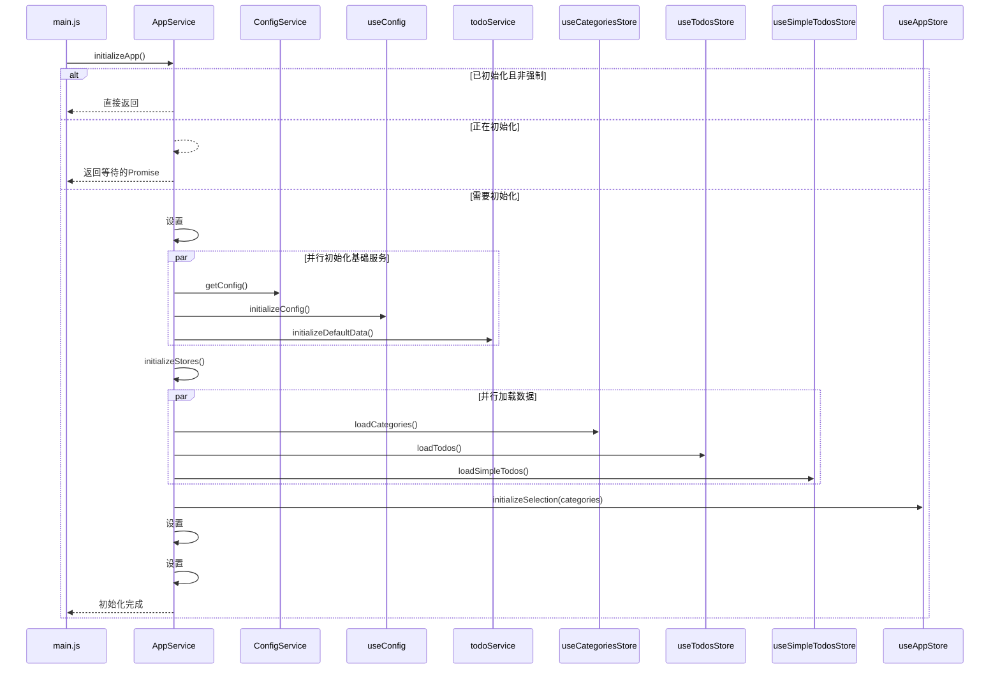

# AppService 应用初始化服务

<cite>
**Referenced Files in This Document**   
- [appService.js](file://src/services/appService.js)
- [errorHandler.js](file://src/utils/errorHandler.js)
- [useConfig.js](file://src/composables/useConfig.js)
- [configService.js](file://src/services/configService.js)
- [useCategoriesStore.js](file://src/stores/useCategoriesStore.js)
- [useTodosStore.js](file://src/stores/useTodosStore.js)
- [useSimpleTodosStore.js](file://src/stores/useSimpleTodosStore.js)
- [useAppStore.js](file://src/stores/useAppStore.js)
- [todoService.js](file://src/services/todoService.js)
- [main.js](file://src/main.js)
</cite>

## 目录
1. [简介](#简介)
2. [核心状态管理](#核心状态管理)
3. [初始化流程](#初始化流程)
4. [数据加载与状态协调](#数据加载与状态协调)
5. [数据刷新与状态重置](#数据刷新与状态重置)
6. [错误处理策略](#错误处理策略)
7. [初始化时序图](#初始化时序图)
8. [常见问题与优化](#常见问题与优化)

## 简介

AppService 是 TidyDo 应用的核心初始化服务，负责统一管理整个应用的启动流程。它确保了应用在启动时能够正确、高效地完成所有必要的初始化步骤，包括配置加载、数据准备和状态设置。该服务通过精心设计的机制，防止了重复和并发初始化，保证了应用状态的一致性和可靠性。

**Section sources**
- [appService.js](file://src/services/appService.js#L1-L20)

## 核心状态管理

AppService 通过两个静态私有字段来管理其核心状态，确保初始化过程的线程安全和幂等性。

### 防止重复初始化 (#isInitialized)

`#isInitialized` 是一个布尔类型的静态私有字段，用于标记应用是否已经成功完成过一次完整的初始化。当此字段为 `true` 时，除非显式传入 `force: true` 选项，否则 `initializeApp` 方法将直接返回，避免了不必要的重复工作。这种设计保证了应用状态的幂等性，即多次调用初始化方法不会产生副作用。

### 防止并发初始化 (#isInitializing)

`#isInitializing` 是另一个布尔类型的静态私有字段，用于标记应用当前是否正处于初始化过程中。当一个初始化请求正在进行时，此字段被设置为 `true`。如果在此期间有新的初始化请求到来，服务不会立即执行，而是返回一个由 `#waitForInitialization` 方法创建的 Promise。该 Promise 会周期性地检查 `#isInitialized` 状态，一旦主初始化流程完成，所有等待的 Promise 都会被同时解析。这种机制有效地将并发的初始化请求“排队”，确保了初始化过程的原子性。

**Section sources**
- [appService.js](file://src/services/appService.js#L5-L10)

## 初始化流程

`initializeApp` 方法是应用启动的入口点，它定义了应用从启动到就绪的完整流程。

### 初始化选项

该方法接受一个可选的 `options` 对象作为参数，其中包含一个关键的 `force` 选项。当 `force` 为 `true` 时，即使应用已被初始化，也会强制重新执行整个流程。这在需要完全重置应用状态的场景下非常有用。

### 并行化性能优化

为了优化启动性能，`initializeApp` 方法在初始化基础服务阶段采用了并行加载策略。它通过 `Promise.all` 同时发起三个关键任务：
1.  **配置加载**：调用 `ConfigService.getConfig()` 确保应用的默认配置存在。
2.  **全局配置初始化**：调用 `globalConfig.initializeConfig()` 来加载并设置全局的响应式配置状态。
3.  **默认数据初始化**：调用 `initializeDefaultData()` 函数，检查并创建应用所需的默认分类数据。

这三个任务之间没有严格的依赖关系，因此并行执行可以显著缩短总的初始化时间。

### 状态更新与清理

整个初始化过程被包裹在 `try...finally` 块中。在 `try` 块中，一旦所有基础服务和数据加载完成，`#isInitialized` 字段会被设置为 `true`，标志着应用已准备就绪。无论初始化成功或失败，`finally` 块都会将 `#isInitializing` 字段重置为 `false`，释放“锁”，允许后续的初始化请求进入。

**Section sources**
- [appService.js](file://src/services/appService.js#L23-L54)

## 数据加载与状态协调

在基础服务初始化完成后，`initializeApp` 方法会调用 `initializeStores` 方法来协调 Pinia 状态管理库中各个 store 的数据加载。

### 并行加载数据

`initializeStores` 方法同样利用 `Promise.all` 来并行加载来自不同 store 的数据。它同时触发以下三个异步操作：
- `useCategoriesStore().loadCategories()`: 从持久化存储中加载所有分类数据。
- `useTodosStore().loadTodos()`: 从持久化存储中加载所有待办事项数据。
- `useSimpleTodosStore().loadSimpleTodos()`: 从持久化存储中加载所有简单待办事项数据。

这种并行加载模式最大限度地减少了数据获取的总耗时。

### 协调应用状态

在所有数据加载完成后，`initializeStores` 方法会调用 `useAppStore().initializeSelection(categoriesStore.categories)`。这是一个关键的协调步骤，它确保了应用的主状态（`useAppStore`）能够根据最新的分类数据进行初始化。例如，如果当前没有选中的分类，它会自动选择第一个分类作为默认选中项，从而保证了应用 UI 的正确显示。

**Section sources**
- [appService.js](file://src/services/appService.js#L92-L113)
- [useAppStore.js](file://src/stores/useAppStore.js#L257-L266)

## 数据刷新与状态重置

AppService 提供了两个重要的方法来处理应用运行时的数据更新和状态管理。

### reloadAppData 方法

`reloadAppData` 方法用于在应用运行期间重新加载所有数据。这在用户更新了配置（如状态、优先级设置）或导入了新的数据后非常有用。该方法会：
1.  清除 `useConfig` 的缓存。
2.  重新初始化全局配置。
3.  并行重新加载所有 store（分类、待办事项、简单待办事项）的数据。
4.  最后，重新协调 `useAppStore` 的状态，确保视图与最新数据保持一致。

这个方法不会重置 `#isInitialized` 状态，因为它是在应用已初始化的前提下进行的数据刷新。

### resetAppState 方法

`resetAppState` 方法用于彻底重置应用的内部状态。这通常在更高级别的操作中使用，例如切换用户或进行数据恢复。该方法会：
1.  清除 `useConfig` 的缓存。
2.  调用各个 store 的 `resetState()` 方法，将它们的状态重置为空。
3.  将 AppService 自身的 `#isInitialized` 和 `#isInitializing` 标志位重置为 `false`。

执行此方法后，应用将回到一个“未初始化”的干净状态，下一次调用 `initializeApp` 将会像首次启动一样完整执行。

**Section sources**
- [appService.js](file://src/services/appService.js#L115-L155)

## 错误处理策略

AppService 通过 `withErrorHandling` 装饰器实现了统一且健壮的错误处理机制。

### withErrorHandling 装饰器

`initializeApp` 和 `initializeStores` 这两个核心方法都被 `withErrorHandling` 装饰器所包装。该装饰器位于 `errorHandler.js` 文件中，它接收一个异步函数、一个操作描述和一个错误类型作为参数。

### 错误捕获与包装

当被装饰的方法内部抛出异常时，`withErrorHandling` 会捕获该错误。它首先将错误信息输出到控制台，然后创建一个 `AppError` 实例。这个 `AppError` 包含了原始错误、一个用户友好的错误消息（通过 `getUserFriendlyMessage` 函数生成）以及错误的类型（如 `BUSINESS` 或 `STORAGE`）。最后，它抛出这个包装后的 `AppError`。

这种策略将底层的技术性错误（如数据库错误、网络错误）转换为应用层面的、结构化的错误，便于上层代码进行统一的错误展示和处理，提升了用户体验。

**Section sources**
- [appService.js](file://src/services/appService.js#L23)
- [errorHandler.js](file://src/utils/errorHandler.js#L50-L85)

## 初始化时序图

以下时序图展示了 `AppService.initializeApp` 方法的执行流程，清晰地描绘了各个组件之间的交互和时序。

**Diagram sources**
- [appService.js](file://src/services/appService.js#L23-L54)
- [main.js](file://src/main.js#L43-L45)

## 常见问题与优化

### 排查初始化阻塞问题

如果应用启动时出现长时间阻塞，应按以下步骤排查：
1.  **检查 `#isInitializing` 状态**：确认是否有其他进程或代码在长时间持有初始化锁。
2.  **分析并行任务**：检查 `Promise.all` 中的三个并行任务（配置、全局配置、默认数据）是否有一个执行时间过长。可以通过在 `configService.js`、`useConfig.js` 和 `todoService.js` 中添加日志来定位瓶颈。
3.  **检查持久化存储**：由于数据存储在 IndexedDB 中，如果数据库文件损坏或存储空间不足，`idb-keyval` 操作可能会失败或超时。检查浏览器的开发者工具中的“Application”标签页，查看存储情况。

### 性能优化建议

1.  **懒加载非关键数据**：对于 `useSimpleTodosStore` 等可能包含大量数据的 store，可以考虑在应用主界面加载后再进行加载，以缩短首屏时间。
2.  **优化数据结构**：确保 `idb-keyval` 存储的数据结构是扁平化的，并避免存储大型对象，以提高读写性能。
3.  **预加载策略**：在用户执行某些操作（如打开设置）之前，可以预判性地开始加载相关数据，从而在用户真正需要时实现“零等待”。