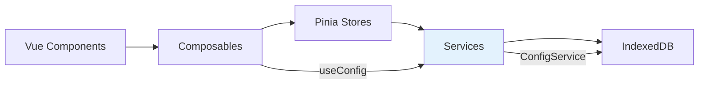
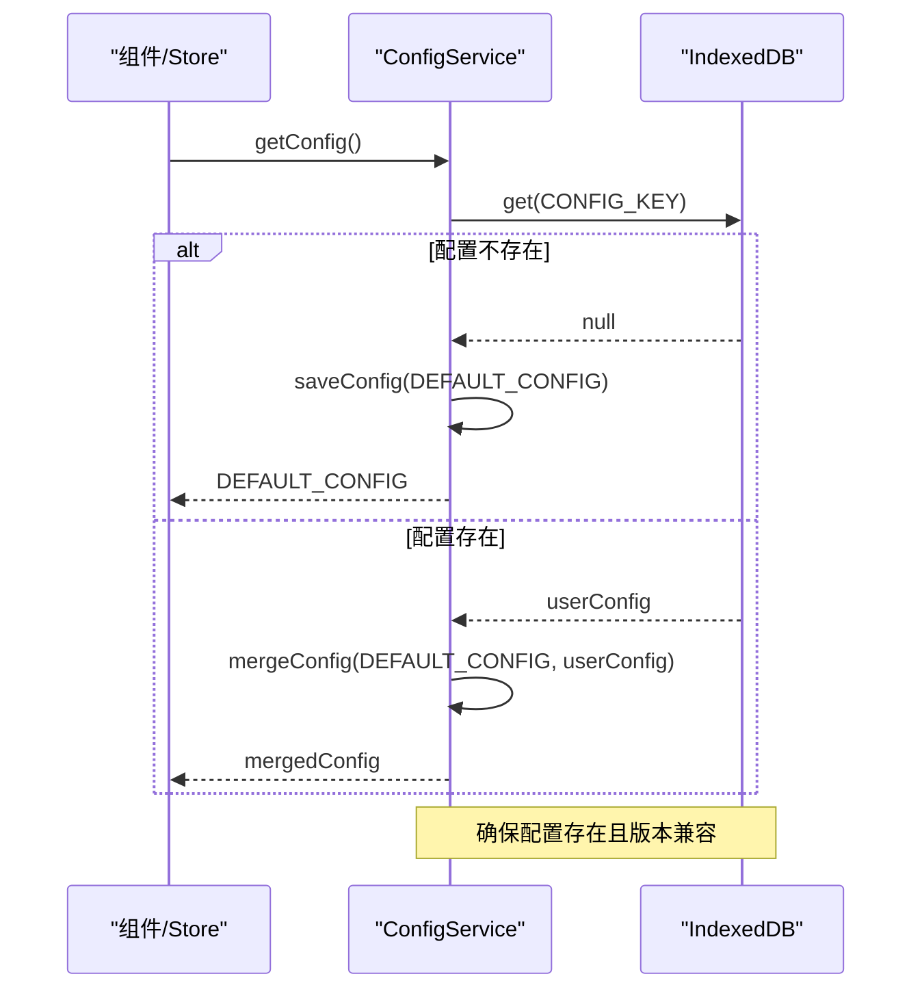
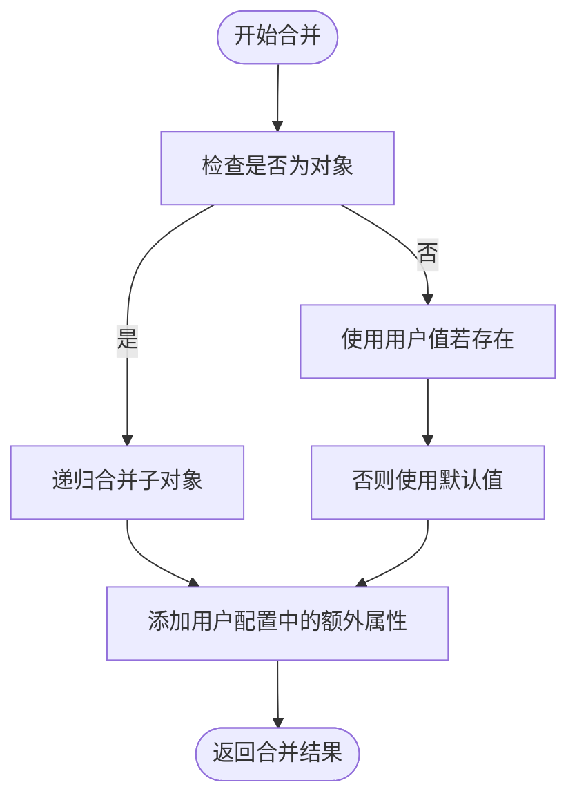
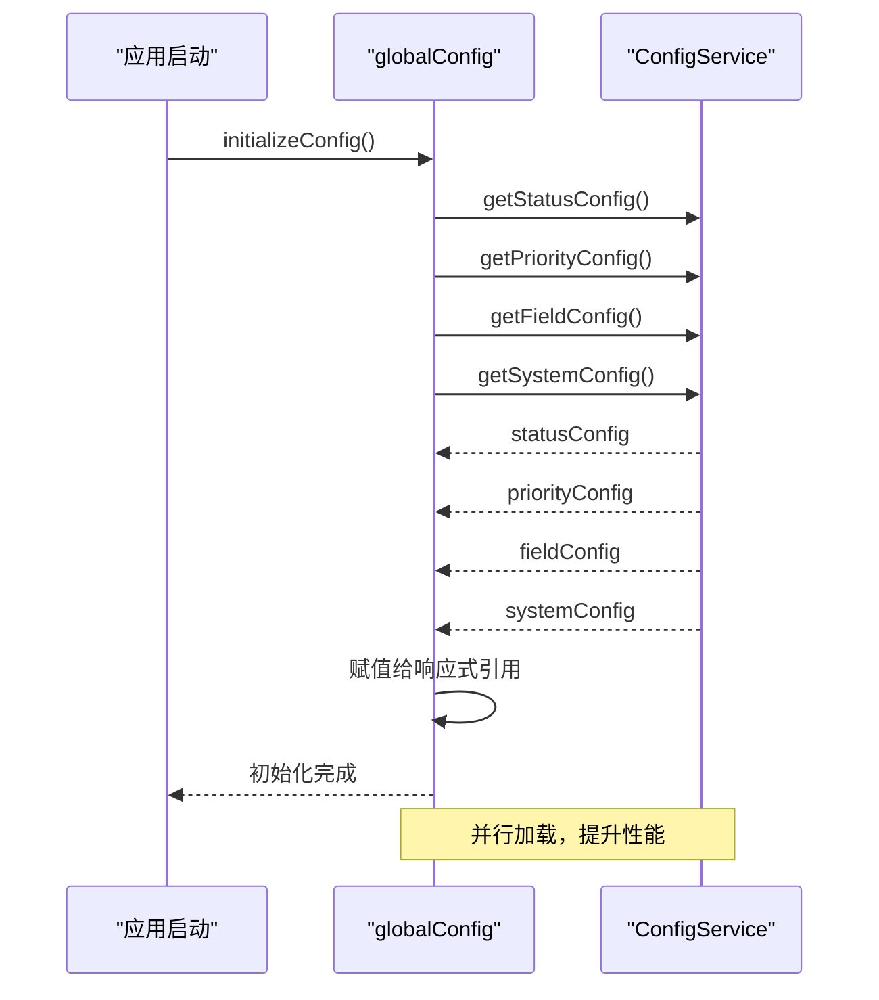

# ConfigService 配置管理服务

<cite>
**Referenced Files in This Document**   
- [configService.js](file://src/services/configService.js)
- [useConfig.js](file://src/composables/useConfig.js)
- [DEVELOPMENT.md](file://DEVELOPMENT.md)
</cite>

## 目录
1. [简介](#简介)
2. [核心职责与架构](#核心职责与架构)
3. [配置获取机制](#配置获取机制)
4. [配置保存与数据完整性](#配置保存与数据完整性)
5. [细分配置方法](#细分配置方法)
6. [配置更新机制](#配置更新机制)
7. [深度合并算法](#深度合并算法)
8. [与globalConfig协作](#与globalconfig协作)
9. [配置迁移示例](#配置迁移示例)
10. [常见问题与解决方案](#常见问题与解决方案)

## 简介

ConfigService 是 TidyDo 应用的全局配置管理中心，负责管理应用的所有可配置项。该服务通过 IndexedDB 实现配置的持久化存储，并提供了一套完整的配置管理 API，确保配置数据的完整性、兼容性和易用性。作为服务层的核心组件，ConfigService 与上层的组合式函数（Composables）和状态管理（Stores）紧密协作，为整个应用提供统一的配置访问接口。

**Section sources**
- [configService.js](file://src/services/configService.js#L1-L205)

## 核心职责与架构

ConfigService 作为服务层（Services Layer）的关键组件，承担着配置数据的持久化存储、版本兼容性维护和数据完整性保障等核心职责。其设计遵循了分层架构原则，位于应用的业务逻辑层，为上层的组合式函数和状态管理提供数据支持。

根据 `DEVELOPMENT.md` 中的架构图，ConfigService 与 `useConfig` 组合式函数共同构成了配置管理的核心。服务层负责数据操作和业务逻辑，而组合式函数层则负责提供响应式的状态管理和便捷的访问方法。



**Diagram sources**
- [DEVELOPMENT.md](file://DEVELOPMENT.md#L20-L70)

**Section sources**
- [configService.js](file://src/services/configService.js#L1-L205)
- [DEVELOPMENT.md](file://DEVELOPMENT.md#L20-L70)

## 配置获取机制

ConfigService 提供了 `getConfig` 方法作为获取完整配置的入口。该方法实现了默认配置的自动创建和版本兼容性升级，确保应用在任何状态下都能获得有效的配置。

当调用 `getConfig` 时，服务首先尝试从 IndexedDB 中读取存储的配置。如果配置不存在（例如首次启动应用），服务会自动将 `DEFAULT_CONFIG` 保存到存储中，并返回默认配置。这一机制保证了应用的开箱即用体验。

对于已存在的配置，`getConfig` 会调用 `mergeConfig` 方法，将用户保存的配置与当前版本的默认配置进行深度合并。这一过程确保了即使应用版本更新引入了新的配置项，用户的现有配置也能与新版本兼容，不会因为配置缺失而导致功能异常。



**Diagram sources**
- [configService.js](file://src/services/configService.js#L88-L98)

**Section sources**
- [configService.js](file://src/services/configService.js#L88-L98)

## 配置保存与数据完整性

`saveConfig` 方法是 ConfigService 中保障数据完整性的核心机制。该方法不仅负责将配置持久化到存储中，还通过与默认配置的合并，确保保存的配置始终是完整和有效的。

在保存配置之前，`saveConfig` 会调用 `mergeConfig` 方法，将传入的配置与 `DEFAULT_CONFIG` 进行深度合并。这一预处理步骤至关重要，它确保了即使用户只修改了部分配置项，最终保存的配置也包含了所有必要的配置项，防止因配置缺失导致的应用错误。

此外，`saveConfig` 方法使用了 `withErrorHandling` 高阶函数进行包装，实现了统一的错误处理。任何在保存过程中发生的存储错误都会被正确捕获和处理，向调用者提供清晰的错误信息，同时避免应用崩溃。

**Section sources**
- [configService.js](file://src/services/configService.js#L106-L110)

## 细分配置方法

为了提高 API 的易用性，ConfigService 提供了一系列细分配置的获取方法，如 `getStatusConfig`、`getPriorityConfig`、`getFieldConfig` 和 `getSystemConfig`。这些方法封装了配置获取的逻辑，使上层组件能够以更直观的方式访问特定的配置分组。

这些方法的实现非常简洁：它们首先调用 `getConfig` 获取完整的配置对象，然后从中提取相应的配置分组并返回。这种设计复用了核心的配置获取逻辑，确保了所有配置访问的一致性和可靠性。同时，它也简化了上层组件的调用代码，使其无需关心配置的完整结构。

**Section sources**
- [configService.js](file://src/services/configService.js#L112-L128)

## 配置更新机制

ConfigService 提供了 `updateStatusConfig`、`updatePriorityConfig` 等局部更新方法，允许对特定配置分组进行增量修改。这些方法实现了局部配置的合并与持久化，避免了需要传递完整配置对象的繁琐操作。

以 `updateStatusConfig` 为例，其执行流程如下：首先调用 `getConfig` 获取当前的完整配置；然后使用对象扩展语法 `{...config.statusConfig, ...statusConfig}` 将新的状态配置与现有配置进行浅层合并；最后调用 `saveConfig` 将更新后的完整配置保存到存储中。

这种设计模式既保证了数据的完整性（通过 `saveConfig` 的合并机制），又提供了灵活的更新接口。开发者可以只传递需要修改的配置项，而无需关心其他未修改的配置。

**Section sources**
- [configService.js](file://src/services/configService.js#L139-L143)

## 深度合并算法

`mergeConfig` 方法是 ConfigService 的核心技术，实现了深度递归的配置合并算法。该算法确保了用户自定义配置不会被覆盖，同时又能无缝集成新版本引入的默认配置。

算法的核心逻辑如下：
1. 遍历默认配置的所有键。
2. 对于每个键，如果其值是一个非数组的对象，则递归调用 `mergeConfig` 进行深度合并。
3. 对于基本类型值，优先使用用户配置中的值，如果用户未配置则使用默认值。
4. 最后，将用户配置中存在但默认配置中不存在的额外属性添加到结果中。

这种递归合并策略完美解决了配置的版本兼容性问题。当应用升级并添加新的配置项时，旧的用户配置会与新版本的默认配置合并，既保留了用户的个性化设置，又确保了新功能的正常运行。



**Diagram sources**
- [configService.js](file://src/services/configService.js#L178-L201)

**Section sources**
- [configService.js](file://src/services/configService.js#L178-L201)

## 与globalConfig协作

ConfigService 与 `globalConfig` 对象紧密协作，形成了完整的配置管理方案。`globalConfig` 是 `useConfig` 组合式函数的全局实例，它在应用启动时自动初始化，为整个应用提供响应式的配置状态。

`globalConfig` 的初始化流程充分体现了与 ConfigService 的协作关系。在 `initializeConfig` 方法中，它并行调用 ConfigService 的 `getStatusConfig`、`getPriorityConfig` 等方法，获取各个配置分组，并将它们赋值给响应式引用（ref）。这使得上层组件可以通过 `globalConfig.statusConfig` 等属性直接访问最新的配置，且这些属性是响应式的，配置更新后会自动触发视图更新。

这种分层设计将数据操作（ConfigService）与状态管理（globalConfig）分离，既保证了数据的一致性和可靠性，又提供了高效的响应式访问接口。



**Diagram sources**
- [useConfig.js](file://src/composables/useConfig.js#L20-L192)

**Section sources**
- [useConfig.js](file://src/composables/useConfig.js#L20-L192)

## 配置迁移示例

当应用版本升级需要迁移配置时，可以利用 ConfigService 的 API 实现平滑过渡。以下是一个将旧版本的状态配置迁移到新版本的代码示例：

```javascript
// 假设旧版本使用不同的状态键名
const migrateOldConfig = async () => {
  const currentConfig = await ConfigService.getConfig();
  
  // 检查是否为旧版本配置
  if (currentConfig.statusConfig && !currentConfig.statusConfig.pending) {
    // 创建新的状态配置
    const newStatusConfig = {
      pending: { text: '待办', color: 'warning' },
      inProgress: { text: '进行中', color: 'info' },
      completed: { text: '完成', color: 'success' },
      cancelled: { text: '取消', color: 'error' }
    };
    
    // 保留用户自定义的颜色设置
    if (currentConfig.customStatusColors) {
      Object.keys(currentConfig.customStatusColors).forEach(status => {
        if (newStatusConfig[status]) {
          newStatusConfig[status].color = currentConfig.customStatusColors[status];
        }
      });
    }
    
    // 更新状态配置
    await ConfigService.updateStatusConfig(newStatusConfig);
    
    // 清理旧配置
    delete currentConfig.customStatusColors;
    await ConfigService.saveConfig(currentConfig);
  }
};
```

此示例展示了如何安全地进行配置迁移：首先读取当前配置，然后根据特定条件判断是否需要迁移，接着创建新的配置结构并尽可能保留用户的自定义设置，最后通过标准的更新接口保存新配置。

**Section sources**
- [configService.js](file://src/services/configService.js#L88-L143)

## 常见问题与解决方案

### 配置缓存失效

**问题**：`globalConfig` 使用了响应式缓存，当配置通过其他途径更新时，缓存可能失效。

**解决方案**：在配置更新后，调用 `globalConfig.clearCache()` 方法清除缓存，然后重新初始化。例如，在 `ConfigDialog.vue` 中更新配置后：

```javascript
// 更新配置后
await ConfigService.updateStatusConfig(newConfig);
// 清除全局配置缓存
globalConfig.clearCache();
// 重新初始化以获取最新配置
await globalConfig.initializeConfig();
```

### 并发更新冲突

**问题**：多个组件同时更新配置可能导致数据覆盖。

**解决方案**：ConfigService 的更新方法（如 `updateStatusConfig`）内部已经实现了基于 `getConfig` 和 `saveConfig` 的读-改-写模式，这在大多数情况下可以避免冲突。对于极端情况，可以考虑在服务层引入简单的锁机制。

### 初始化竞态条件

**问题**：组件在 `globalConfig` 初始化完成前就尝试访问配置。

**解决方案**：始终检查 `globalConfig.isInitialized.value`，或使用其提供的异步初始化方法：

```javascript
if (!globalConfig.isInitialized.value) {
  await globalConfig.initializeConfig();
}
// 现在可以安全地使用配置
const color = globalConfig.getStatusColor('completed');
```

**Section sources**
- [useConfig.js](file://src/composables/useConfig.js#L178-L192)