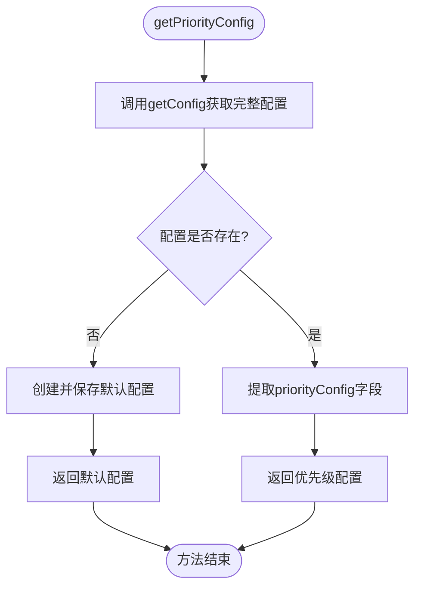
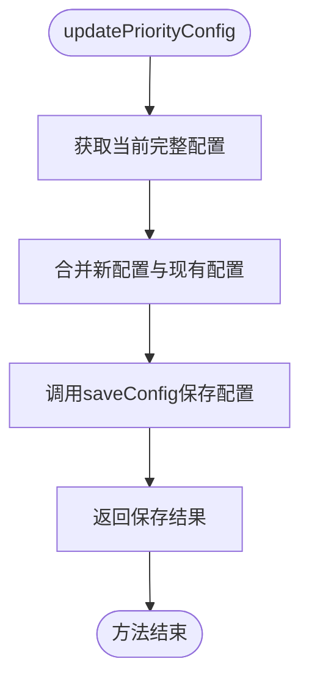
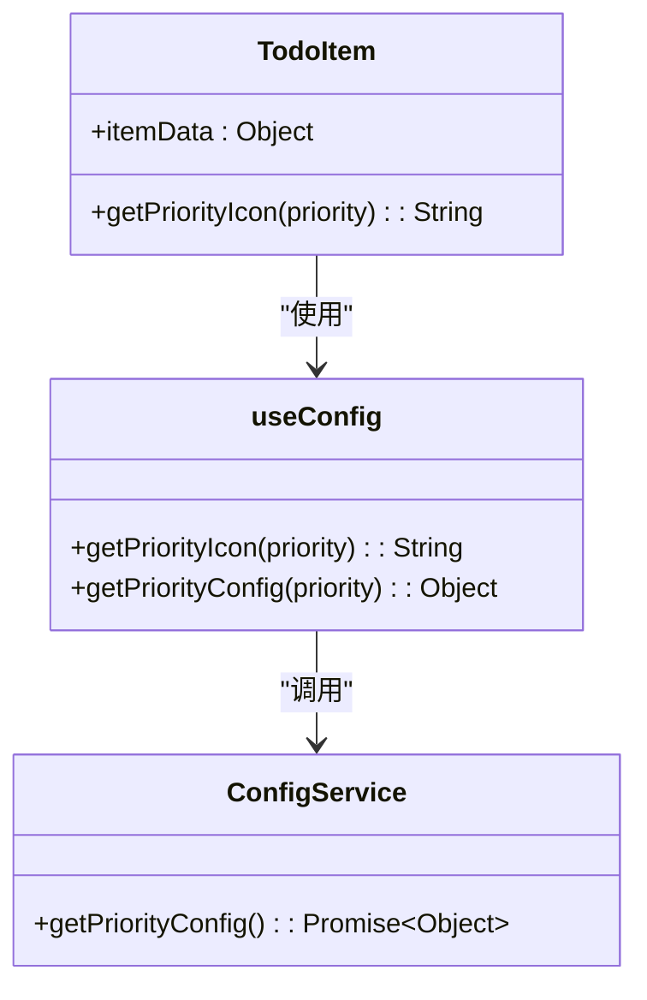
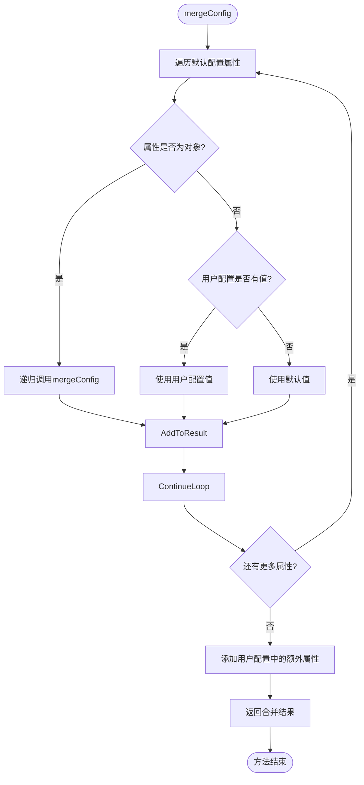

# 优先级配置管理

<cite>
**Referenced Files in This Document**  
- [configService.js](file://src/services/configService.js)
- [useConfig.js](file://src/composables/useConfig.js)
- [TodoItem.vue](file://src/views/tidyDo/components/TodoItem.vue)
- [ConfigDialog.vue](file://src/model/ConfigDialog.vue)
</cite>

## 目录
1. [优先级配置功能概述](#优先级配置功能概述)
2. [核心方法工作流程](#核心方法工作流程)
3. [优先级配置结构详解](#优先级配置结构详解)
4. [与TodoItem组件的集成机制](#与todotem组件的集成机制)
5. [图标修改实践指南](#图标修改实践指南)
6. [配置合并与默认回退机制](#配置合并与默认回退机制)
7. [常见问题排查](#常见问题排查)

## 优先级配置功能概述

TidyDo应用通过`ConfigService`服务类提供优先级配置管理功能，允许用户自定义待办事项的优先级显示样式。该功能支持对低、中、高三级优先级进行文本、颜色和图标的个性化设置，这些配置直接影响待办事项在用户界面中的视觉呈现。配置数据通过IndexedDB持久化存储，确保用户设置在应用重启后依然保留。

**Section sources**
- [configService.js](file://src/services/configService.js#L1-L205)

## 核心方法工作流程

### getPriorityConfig方法流程

`getPriorityConfig`方法负责获取当前的优先级配置。其工作流程如下：首先调用`getConfig`方法获取完整的应用配置，该方法会检查存储中是否存在配置数据，若不存在则创建并保存默认配置；然后从完整配置中提取`priorityConfig`字段并返回。此过程确保了即使在首次使用应用时也能获得有效的配置数据。



**Diagram sources**
- [configService.js](file://src/services/configService.js#L119-L122)

**Section sources**
- [configService.js](file://src/services/configService.js#L119-L122)

### updatePriorityConfig方法流程

`updatePriorityConfig`方法用于更新优先级配置。其执行流程为：首先通过`getConfig`获取当前完整配置；然后使用对象扩展运算符将新的优先级配置与现有配置进行合并，确保未修改的优先级设置得以保留；最后调用`saveConfig`方法保存更新后的配置，并返回保存结果。该方法采用浅层合并策略，只更新指定的优先级字段。



**Diagram sources**
- [configService.js](file://src/services/configService.js#L145-L149)

**Section sources**
- [configService.js](file://src/services/configService.js#L145-L149)

## 优先级配置结构详解

优先级配置包含三个预设级别：低、中、高，每个级别都具有以下属性：

- **text**: 显示文本，用于描述优先级级别
- **color**: 颜色标识，决定UI元素的着色方案
- **icon**: 图标标识，使用Material Design Icons(MDI)的命名约定

默认配置如下：
- 低优先级：文本为"低优先级"，颜色为success，图标为mdi-chevron-down
- 中优先级：文本为"中优先级"，颜色为warning，图标为mdi-chevron-up
- 高优先级：文本为"高优先级"，颜色为error，图标为mdi-chevron-double-up

这些配置直接影响待办事项列表中优先级图标的显示样式和颜色。

**Section sources**
- [configService.js](file://src/services/configService.js#L30-L47)

## 与TodoItem组件的集成机制

### 图标渲染逻辑

`TodoItem`组件通过`useConfig`组合式函数集成优先级配置。在模板中，`v-icon`组件的图标值由`getPriorityIcon(itemData.priority)`动态确定。该函数查询当前优先级配置并返回对应的图标名称，实现基于配置的动态图标渲染。



**Diagram sources**
- [TodoItem.vue](file://src/views/tidyDo/components/TodoItem.vue#L55-L65)
- [useConfig.js](file://src/composables/useConfig.js#L145-L151)

### 颜色应用机制

颜色应用通过`getStatusColor`方法实现，该方法同样由`useConfig`提供。当待办事项的状态改变时，组件会根据当前状态查询配置中的颜色值，并将该颜色应用于状态芯片（v-chip）组件。这种机制确保了UI颜色与用户配置保持一致。

**Section sources**
- [TodoItem.vue](file://src/views/tidyDo/components/TodoItem.vue#L175-L185)
- [useConfig.js](file://src/composables/useConfig.js#L85-L91)

## 图标修改实践指南

### 替换MDI图标

要修改优先级图标，可通过`updatePriorityConfig`方法更新配置。例如，将高优先级图标更改为感叹号：

```javascript
await ConfigService.updatePriorityConfig({
  high: {
    icon: 'mdi-alert'
  }
})
```

可用的MDI图标名称可在`ConfigDialog.vue`文件中找到，如`mdi-chevron-down`、`mdi-chevron-up`和`mdi-chevron-double-up`等。

### 添加自定义SVG

虽然当前系统主要使用MDI图标，但可通过扩展`useConfig`的`getPriorityIcon`方法来支持自定义SVG。建议的实现方式是将SVG数据编码为data URL，并在配置中引用：

```javascript
// 示例：扩展配置支持SVG
await ConfigService.updatePriorityConfig({
  high: {
    icon: 'data:image/svg+xml;base64,PHN2ZyB3aWR0aD0iMjAiIGhlaWdodD0iMjAiPjxjaXJjbGUgY3g9IjEwIiBjeT0iMTAiIHI9IjkiLz48L3N2Zz4='
  }
})
```

**Section sources**
- [ConfigDialog.vue](file://src/model/ConfigDialog.vue#L492-L494)
- [useConfig.js](file://src/composables/useConfig.js#L145-L151)

## 配置合并与默认回退机制

### 配置合并策略

`mergeConfig`方法实现深度配置合并，确保用户自定义的扩展优先级字段得以保留。该方法递归遍历默认配置，对每个属性进行合并：对于对象类型属性，递归调用`mergeConfig`；对于基本类型属性，优先使用用户配置值；最后，将用户配置中新增的属性添加到结果中。



**Diagram sources**
- [configService.js](file://src/services/configService.js#L178-L201)

### 默认回退行为

当配置值缺失时，系统会自动回退到默认配置。`getPriorityConfig`方法在查询特定优先级配置时，若找不到对应值，会返回包含默认文本、颜色和图标的对象。这种机制确保了即使在配置不完整的情况下，应用仍能正常显示待办事项。

**Section sources**
- [configService.js](file://src/services/configService.js#L178-L201)
- [useConfig.js](file://src/composables/useConfig.js#L135-L142)

## 常见问题排查

### 图标不显示问题

当优先级图标不显示时，可按以下步骤排查：

1. **检查图标名称**：确保使用的图标名称正确且存在于MDI图标库中
2. **验证配置更新**：确认`updatePriorityConfig`调用成功并返回了预期结果
3. **检查组件依赖**：确保`TodoItem`组件正确导入了`useConfig`并调用了`getPriorityIcon`
4. **查看控制台错误**：检查浏览器控制台是否有图标加载相关的错误信息

推荐的调试方法是直接在浏览器控制台执行`await ConfigService.getPriorityConfig()`，验证返回的配置是否包含预期的图标名称。

**Section sources**
- [TodoItem.vue](file://src/views/tidyDo/components/TodoItem.vue#L55-L65)
- [configService.js](file://src/services/configService.js#L119-L122)