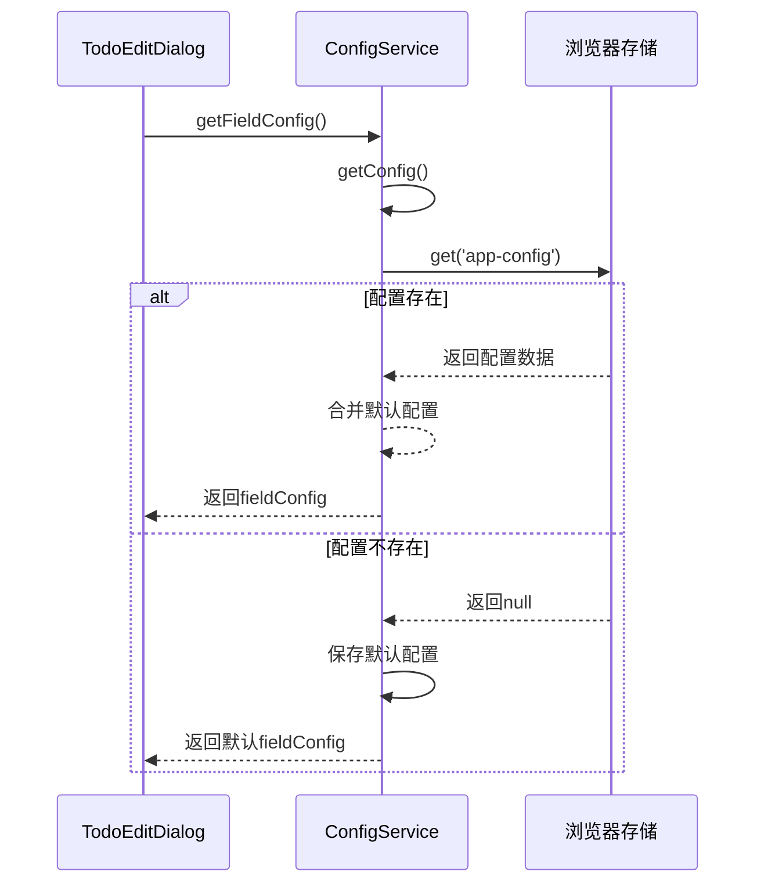
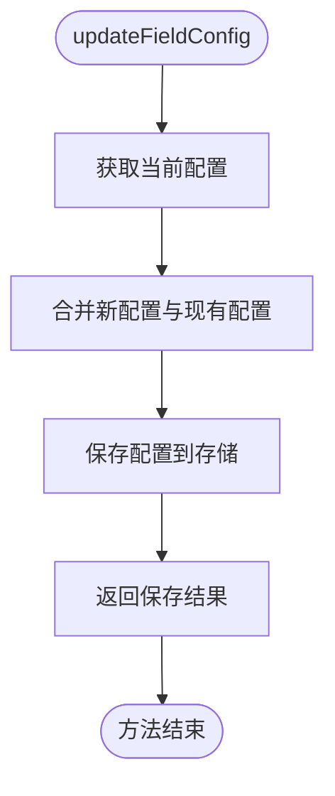
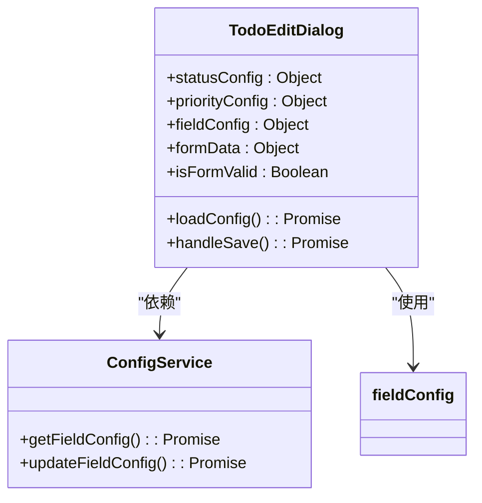
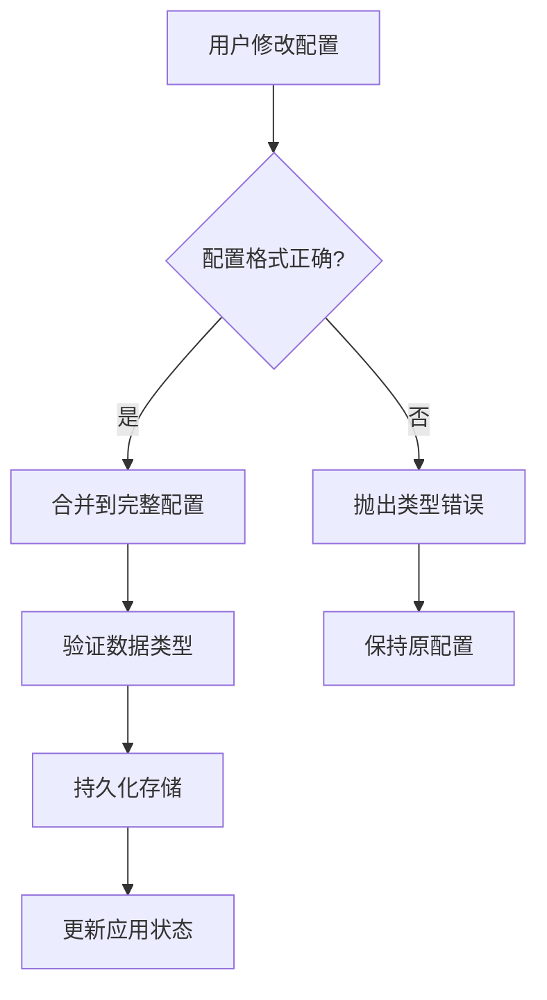

# 字段显示配置管理

<cite>
**Referenced Files in This Document**   
- [configService.js](file://src/services/configService.js)
- [TodoEditDialog.vue](file://src/model/TodoEditDialog.vue)
- [ConfigDialog.vue](file://src/model/ConfigDialog.vue)
- [useConfig.js](file://src/composables/useConfig.js)
</cite>

## 目录
1. [字段配置功能概述](#字段配置功能概述)
2. [核心方法技术实现](#核心方法技术实现)
3. [字段配置在表单中的应用](#字段配置在表单中的应用)
4. [实用代码示例](#实用代码示例)
5. [数据一致性保障机制](#数据一致性保障机制)
6. [自定义字段扩展指南](#自定义字段扩展指南)
7. [调试建议](#调试建议)

## 字段配置功能概述

TidyDo系统通过`ConfigService`提供的字段显示配置功能，实现了对表单字段的动态控制。该功能允许用户自定义`endDate`、`dueDate`、`assignee`、`tags`等字段的显示标签（label）和必填状态（required），从而满足不同用户的个性化需求。

字段配置作为应用配置的一部分，存储在名为`app-config`的键值对中，采用持久化存储机制确保配置在应用重启后依然有效。系统通过`DEFAULT_CONFIG`常量定义了字段配置的默认值，包括各字段的初始标签和必填状态设置。

**Section sources**
- [configService.js](file://src/services/configService.js#L20-L40)

## 核心方法技术实现

### getFieldConfig方法

`getFieldConfig`方法用于获取当前的字段配置对象。该方法通过调用`getConfig`获取完整的应用配置，然后从中提取`fieldConfig`子对象返回。此方法采用异步设计，确保在配置加载完成前不会阻塞主线程。



**Diagram sources**
- [configService.js](file://src/services/configService.js#L125-L128)

### updateFieldConfig方法

`updateFieldConfig`方法用于更新字段配置。该方法首先获取当前配置，然后使用对象扩展运算符将新配置与现有配置合并，最后调用`saveConfig`方法持久化保存。这种合并策略确保了即使只更新部分字段配置，其他未修改的配置项也能保持不变。



**Diagram sources**
- [configService.js](file://src/services/configService.js#L151-L155)

**Section sources**
- [configService.js](file://src/services/configService.js#L125-L155)

## 字段配置在表单中的应用

### TodoEditDialog组件中的字段控制

在`TodoEditDialog`组件中，字段配置被用于动态控制表单的渲染行为。组件通过`loadConfig`方法在挂载时加载配置，并将配置数据绑定到响应式变量中。

#### 字段可见性控制

虽然当前实现中所有字段都显示在表单中，但字段配置系统为未来实现字段可见性控制提供了基础架构。通过扩展`fieldConfig`结构，可以添加`visible`属性来控制字段是否显示。

#### 必填校验逻辑

字段的必填状态直接影响表单验证逻辑。当某个字段的`required`属性为`true`时，系统会在表单提交时进行必填校验。这种动态校验机制使得用户可以根据实际需求灵活调整表单的严格程度。



**Diagram sources**
- [TodoEditDialog.vue](file://src/model/TodoEditDialog.vue#L253-L308)
- [configService.js](file://src/services/configService.js#L125-L128)

**Section sources**
- [TodoEditDialog.vue](file://src/model/TodoEditDialog.vue#L253-L308)

## 实用代码示例

### 隐藏特定字段

要实现字段的隐藏功能，可以扩展字段配置结构并修改表单渲染逻辑：

```javascript
// 扩展字段配置，添加visible属性
const EXTENDED_DEFAULT_CONFIG = {
  fieldConfig: {
    endDate: {
      label: '结束日期',
      required: true,
      visible: true
    },
    dueDate: {
      label: '截止日期',
      required: false,
      visible: true
    }
    // 其他字段...
  }
}
```

### 修改字段标签

通过`updateFieldConfig`方法可以轻松修改字段的显示标签：

```javascript
// 将"分配人"字段的标签修改为"负责人"
await ConfigService.updateFieldConfig({
  assignee: {
    label: '负责人',
    required: false
  }
});
```

**Section sources**
- [configService.js](file://src/services/configService.js#L151-L155)
- [ConfigDialog.vue](file://src/model/ConfigDialog.vue#L312-L350)

## 数据一致性保障机制

### 配置合并策略

系统采用深度合并策略确保配置变更不会导致数据丢失。`mergeConfig`方法递归遍历默认配置和用户配置，优先保留用户自定义的设置，同时确保新增的配置项能够被正确包含。

### 默认配置保护

通过将默认配置与用户配置分离，系统确保了即使用户误操作重置配置，也能快速恢复到安全的默认状态。`resetToDefault`方法提供了配置恢复的安全网。

### 数据类型一致性

字段配置中的`label`属性始终为字符串类型，`required`属性为布尔类型，这种严格的类型约束防止了配置数据的类型混乱。



**Diagram sources**
- [configService.js](file://src/services/configService.js#L170-L198)

**Section sources**
- [configService.js](file://src/services/configService.js#L170-L198)

## 自定义字段扩展指南

### 命名规范

当扩展自定义字段时，应遵循以下命名规范：
- 使用小写字母和连字符（kebab-case）命名，如`custom-field`
- 避免使用保留字和特殊字符
- 保持命名的语义清晰和一致性

### 类型约束

自定义字段的配置必须遵循严格的类型约束：
- `label`属性必须为字符串类型
- `required`属性必须为布尔类型
- 可以扩展其他属性，但需确保类型一致性

### 推荐实践

1. 在`DEFAULT_CONFIG`中预先定义自定义字段的默认配置
2. 在`ConfigDialog`组件中添加相应的配置界面
3. 在使用字段的组件中实现动态渲染逻辑

**Section sources**
- [configService.js](file://src/services/configService.js#L20-L40)
- [ConfigDialog.vue](file://src/model/ConfigDialog.vue#L312-L350)

## 调试建议

### 配置加载状态检查

在开发过程中，可以通过浏览器的开发者工具检查配置的加载状态：

```javascript
// 检查当前字段配置
console.log(await ConfigService.getFieldConfig());

// 检查完整配置
console.log(await ConfigService.getConfig());
```

### 响应式更新验证

确保配置变更能够正确触发UI更新：

1. 修改字段配置后，观察相关组件是否重新渲染
2. 检查`useConfig`组合式函数的响应式状态是否同步更新
3. 验证表单验证规则是否根据新的`required`设置正确调整

### 存储持久化测试

测试配置的持久化功能：
- 修改配置后刷新页面，确认配置仍然存在
- 检查浏览器的IndexedDB存储中`app-config`键的值是否正确更新
- 验证配置在不同设备间的同步行为（如果支持）

**Section sources**
- [useConfig.js](file://src/composables/useConfig.js#L20-L204)
- [configService.js](file://src/services/configService.js#L60-L115)