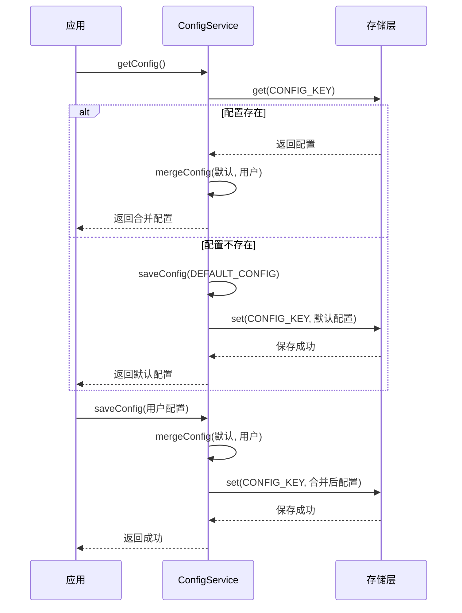
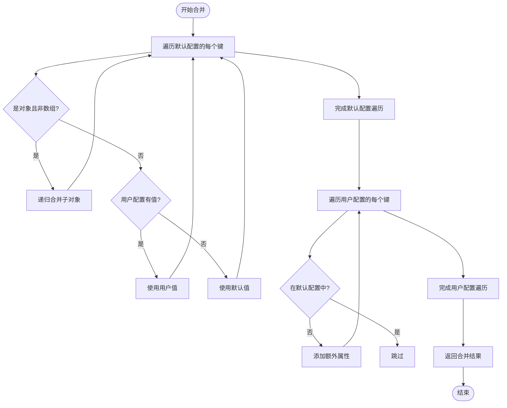
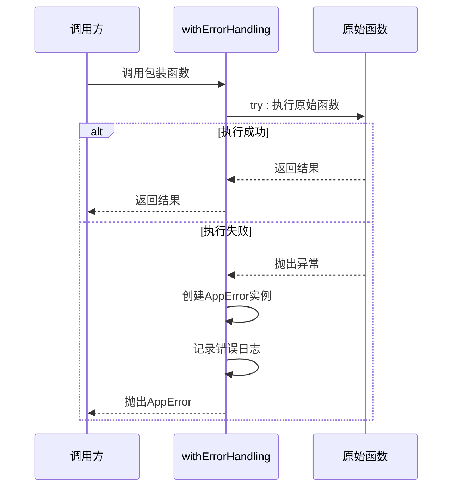

# 核心配置机制

<cite>
**Referenced Files in This Document**   
- [configService.js](file://src/services/configService.js)
- [errorHandler.js](file://src/utils/errorHandler.js)
- [useConfig.js](file://src/composables/useConfig.js)
- [ConfigDialog.vue](file://src/model/ConfigDialog.vue)
</cite>

## 目录
1. [配置服务概述](#配置服务概述)
2. [配置获取与保存协同流程](#配置获取与保存协同流程)
3. [默认配置初始化机制](#默认配置初始化机制)
4. [深度配置合并算法](#深度配置合并算法)
5. [版本升级配置注入](#版本升级配置注入)
6. [错误处理装饰器](#错误处理装饰器)
7. [配置完整性校验](#配置完整性校验)
8. [存储限制与规避方案](#存储限制与规避方案)

## 配置服务概述

`ConfigService` 是 TidyDo 应用的核心配置管理服务，负责配置的持久化存储、版本兼容性维护和运行时管理。该服务基于 IndexedDB 实现，通过 `idb-keyval` 库提供简洁的键值对存储接口。服务采用静态类模式，提供 `getConfig` 和 `saveConfig` 等核心方法，确保配置数据的统一访问和操作。

**Section sources**
- [configService.js](file://src/services/configService.js#L67-L70)

## 配置获取与保存协同流程

`getConfig` 与 `saveConfig` 方法构成了配置管理的核心工作流。当应用请求配置时，`getConfig` 首先尝试从存储中读取配置数据。如果配置不存在，则自动触发 `saveConfig` 方法，将默认配置持久化并返回。当用户修改配置时，`saveConfig` 会先调用 `mergeConfig` 方法，将用户配置与默认配置进行深度合并，确保配置的完整性和向后兼容性，然后将合并后的结果保存。

**Diagram sources**
- [configService.js](file://src/services/configService.js#L88-L98)
- [configService.js](file://src/services/configService.js#L106-L110)

**Section sources**
- [configService.js](file://src/services/configService.js#L88-L110)

## 默认配置初始化机制

首次启动应用时，系统会自动创建并初始化默认配置。`getConfig` 方法通过检查 `CONFIG_KEY` 在存储中的存在性来判断配置是否已初始化。如果未找到配置，服务会立即调用 `saveConfig` 方法，将 `DEFAULT_CONFIG` 常量中定义的完整配置结构持久化到存储中。这一机制确保了即使在全新安装或配置被清除的情况下，应用也能立即获得一个功能完整、结构正确的配置环境。

**Section sources**
- [configService.js](file://src/services/configService.js#L90-L95)

## 深度配置合并算法

`mergeConfig` 方法实现了递归深度合并算法，是保证配置向后兼容性的核心技术。该算法通过以下步骤实现：

1. **对象类型检测**：遍历默认配置的所有键，检查其值是否为非数组的纯对象（`typeof value === 'object' && value !== null && !Array.isArray(value)`）。
2. **递归合并**：对于嵌套对象，递归调用 `mergeConfig` 进行子对象合并。
3. **空值处理**：使用 `userConfig[key] !== undefined` 判断用户配置值的有效性，避免 `null` 值被忽略。
4. **额外属性保留**：遍历用户配置，将默认配置中不存在的额外属性直接添加到结果中。

**Diagram sources**
- [configService.js](file://src/services/configService.js#L178-L201)

**Section sources**
- [configService.js](file://src/services/configService.js#L178-L201)

## 版本升级配置注入

当应用版本升级并引入新的配置项时，`mergeConfig` 算法能自动实现新配置项的注入。由于合并过程以默认配置为基准，任何在新版本中添加到 `DEFAULT_CONFIG` 的配置项，都会在下次调用 `getConfig` 时被自动合并到现有用户配置中。用户原有的自定义配置保持不变，而新增的配置项则以默认值填充，实现了无缝的版本升级体验。

**Section sources**
- [configService.js](file://src/services/configService.js#L190-L195)

## 错误处理装饰器

`withErrorHandling` 装饰器为存储操作提供了统一的错误捕获和处理策略。该装饰器将 `getConfig` 和 `saveConfig` 等异步方法包装在一个 `try-catch` 块中。当底层存储操作（如 `get` 或 `set`）抛出异常时，装饰器会捕获错误，将其包装为 `AppError` 实例，并附加操作描述和错误类型。同时，它会将错误信息以用户友好的方式呈现，并记录详细的错误日志，便于问题诊断。

**Diagram sources**
- [errorHandler.js](file://src/utils/errorHandler.js#L69-L86)

**Section sources**
- [errorHandler.js](file://src/utils/errorHandler.js#L69-L86)

## 配置完整性校验

为确保配置数据的完整性和一致性，建议采用事务性保存和回滚机制。虽然当前实现中 `saveConfig` 是原子操作，但在复杂的配置更新场景下，最佳实践是：

1. **事务性保存**：在更新多个相关配置时，应一次性获取完整配置，进行所有修改，然后通过单次 `saveConfig` 调用保存，避免中间状态。
2. **回滚机制**：在调用 `saveConfig` 前，应缓存当前配置状态。如果保存失败，可提供回滚功能，将配置恢复到之前的状态，保证应用的稳定性。

**Section sources**
- [configService.js](file://src/services/configService.js#L106-L110)

## 存储限制与规避方案

由于使用 IndexedDB 作为底层存储，配置数据可能受到浏览器存储配额的限制。当存储空间不足时，`QuotaExceededError` 错误会被抛出。`errorHandler.js` 中的 `getUserFriendlyMessage` 函数已针对此错误提供了友好的提示信息：“存储空间不足，请清理浏览器数据后重试”。规避此问题的方案包括：定期清理无用数据、压缩配置数据结构、或在极端情况下提示用户导出配置并重置应用。

**Section sources**
- [errorHandler.js](file://src/utils/errorHandler.js#L51-L53)