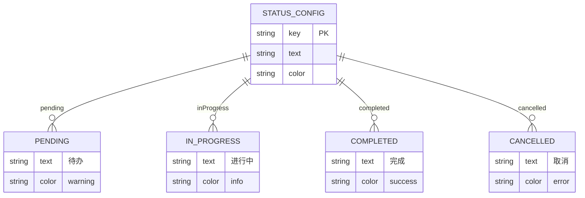
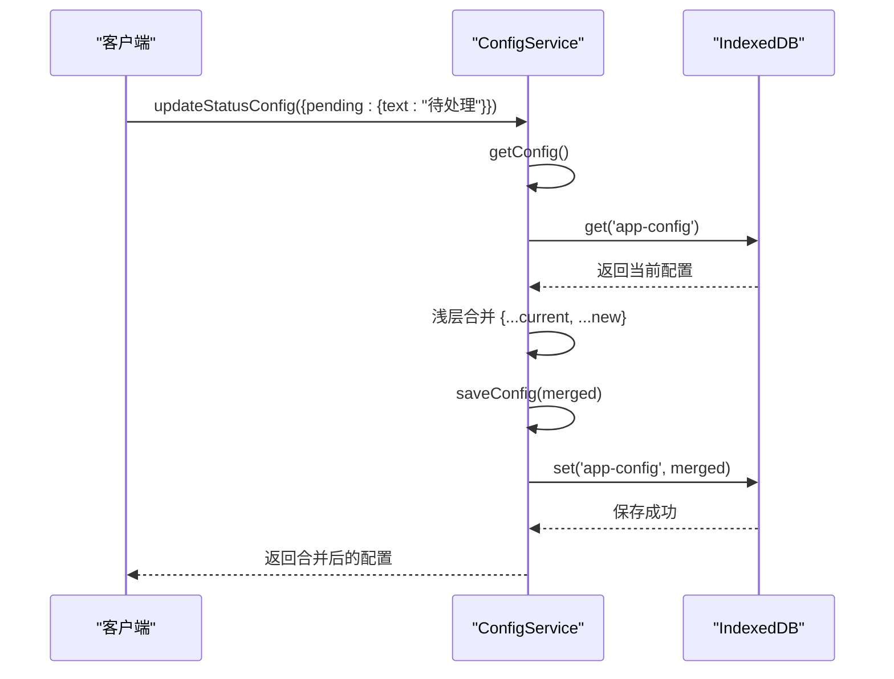
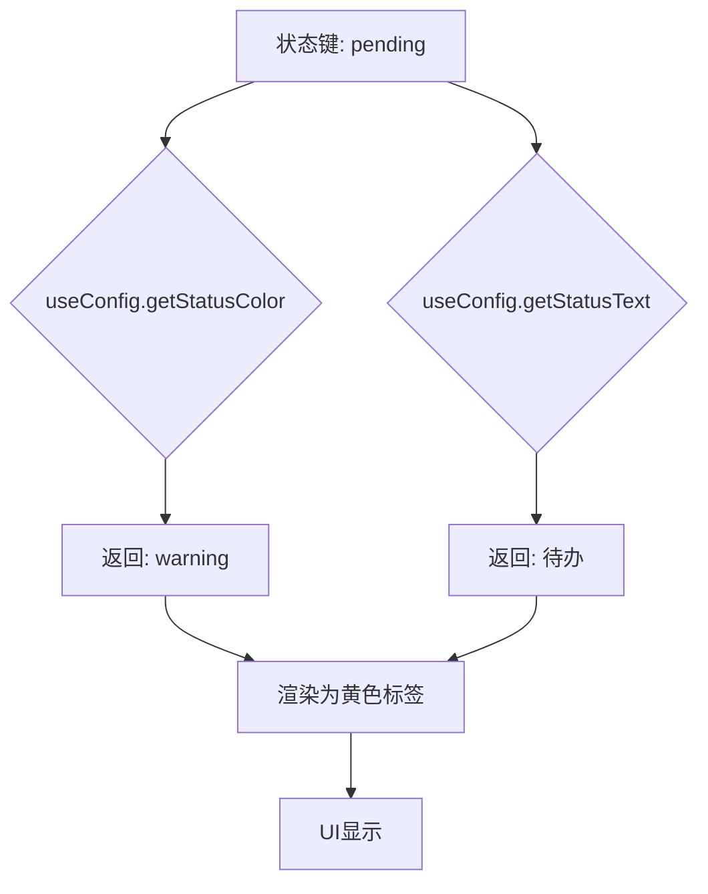

# 状态配置管理

<cite>
**Referenced Files in This Document**  
- [configService.js](file://src/services/configService.js)
- [useConfig.js](file://src/composables/useConfig.js)
- [ConfigDialog.vue](file://src/model/ConfigDialog.vue)
- [TodoItem.vue](file://src/views/tidyDo/components/TodoItem.vue)
</cite>

## 目录
1. [核心功能概述](#核心功能概述)
2. [状态配置数据结构](#状态配置数据结构)
3. [配置读取与更新机制](#配置读取与更新机制)
4. [配置合并策略](#配置合并策略)
5. [UI映射与显示逻辑](#ui映射与显示逻辑)
6. [自定义配置示例](#自定义配置示例)
7. [UI更新与状态同步](#ui更新与状态同步)
8. [配置问题排查指南](#配置问题排查指南)

## 核心功能概述

`ConfigService` 服务类为 TidyDo 应用提供配置管理功能，其中状态配置（`statusConfig`）是核心功能之一。该服务通过 `getStatusConfig` 和 `updateStatusConfig` 方法实现对任务状态的读取与更新，支持用户自定义状态的显示文本和颜色。配置数据通过 `idb-keyval` 库持久化存储在浏览器的 IndexedDB 中，确保用户设置在页面刷新后依然保留。

**Section sources**
- [configService.js](file://src/services/configService.js#L1-L205)

## 状态配置数据结构

状态配置定义了任务的四种基本状态：待办（pending）、进行中（inProgress）、完成（completed）和取消（cancelled）。每个状态包含两个属性：`text`（显示文本）和 `color`（颜色标识）。颜色值与 Vuetify 框架的调色板对应，如 'warning'、'info'、'success' 和 'error'，用于在 UI 中渲染不同颜色的状态标签。



**Diagram sources**
- [configService.js](file://src/services/configService.js#L15-L30)

**Section sources**
- [configService.js](file://src/services/configService.js#L15-L30)

## 配置读取与更新机制

### 获取状态配置
`getStatusConfig` 方法通过调用 `getConfig` 获取完整的应用配置，并返回其中的 `statusConfig` 部分。该方法确保即使配置尚未初始化，也能返回包含默认值的配置对象。

### 更新状态配置
`updateStatusConfig` 方法接收一个部分状态配置对象，实现局部更新。其核心逻辑是使用对象扩展运算符（`...`）进行浅层合并，将新配置与现有配置合并，从而实现对特定状态项的修改而不影响其他配置。



**Diagram sources**
- [configService.js](file://src/services/configService.js#L113-L116)
- [configService.js](file://src/services/configService.js#L139-L143)

**Section sources**
- [configService.js](file://src/services/configService.js#L113-L143)

## 配置合并策略

`ConfigService` 使用 `mergeConfig` 方法实现配置的深度合并。该方法递归遍历默认配置和用户配置，确保即使在应用更新后新增了配置项，旧用户的配置也能与新默认值正确合并。对于状态配置这类扁平对象，主要使用浅层合并策略，即 `{...current, ...new}`，这允许用户仅更新特定状态的属性（如只修改 `pending` 状态的文本），而保留其他状态的自定义设置。

**Section sources**
- [configService.js](file://src/services/configService.js#L178-L201)

## UI映射与显示逻辑

状态配置在 UI 中通过 `useConfig` 组合式函数进行映射。该函数提供 `getStatusColor` 和 `getStatusText` 等响应式方法，将状态键（如 'pending'）转换为对应的显示文本和颜色值。这些方法被 `TodoItem.vue` 等组件调用，以动态渲染任务项的状态标签。



**Diagram sources**
- [useConfig.js](file://src/composables/useConfig.js#L100-L115)
- [TodoItem.vue](file://src/views/tidyDo/components/TodoItem.vue#L100-L110)

**Section sources**
- [useConfig.js](file://src/composables/useConfig.js#L100-L115)
- [TodoItem.vue](file://src/views/tidyDo/components/TodoItem.vue#L100-L110)

## 自定义配置示例

### 新增自定义状态
```javascript
// 示例：添加一个 "reviewing" (审核中) 状态
await ConfigService.updateStatusConfig({
  reviewing: {
    text: "审核中",
    color: "info"
  }
});
```

### 修改现有状态
```javascript
// 示例：修改 "pending" 状态的显示文本和颜色
await ConfigService.updateStatusConfig({
  pending: {
    text: "待处理",
    color: "primary"
  }
});
```

### 批量更新多个状态
```javascript
// 示例：同时更新多个状态
await ConfigService.updateStatusConfig({
  pending: { text: "待办" },
  inProgress: { text: "执行中", color: "warning" },
  completed: { text: "已完结" }
});
```

**Section sources**
- [configService.js](file://src/services/configService.js#L139-L143)

## UI更新与状态同步

当调用 `updateStatusConfig` 后，必须触发 UI 更新以反映新的配置。`ConfigDialog.vue` 组件在保存配置后会发出 `config-updated` 事件，通知父组件重新加载数据。`useConfig` 中的 `globalConfig` 实例通过 `clearCache` 和 `initializeConfig` 方法实现配置的刷新，确保所有使用 `useConfig` 的组件都能获取到最新的配置。

**Section sources**
- [ConfigDialog.vue](file://src/model/ConfigDialog.vue#L300-L310)
- [useConfig.js](file://src/composables/useConfig.js#L200-L210)

## 配置问题排查指南

当配置更新后未生效时，可按以下步骤排查：

1.  **检查存储键名**：确认 `CONFIG_KEY` 常量值为 `'app-config'`，且存储操作无误。
2.  **验证合并逻辑**：检查 `updateStatusConfig` 是否正确执行了对象扩展运算，确保新配置被正确合并。
3.  **确认UI绑定**：检查 `useConfig` 是否在组件中正确引入，并调用了 `getStatusColor` 或 `getStatusText` 等方法。
4.  **测试响应式更新**：在 `ConfigDialog.vue` 中，确认保存后是否调用了 `emit('config-updated')` 以通知系统刷新。
5.  **检查缓存机制**：`useConfig` 内部有缓存机制，若配置未更新，可尝试调用 `globalConfig.clearCache()` 强制刷新。
6.  **查看浏览器存储**：通过开发者工具的 Application 面板检查 IndexedDB 中 `app-config` 键的值，确认持久化数据已更新。

**Section sources**
- [configService.js](file://src/services/configService.js#L139-L143)
- [useConfig.js](file://src/composables/useConfig.js#L150-L160)
- [ConfigDialog.vue](file://src/model/ConfigDialog.vue#L300-L310)