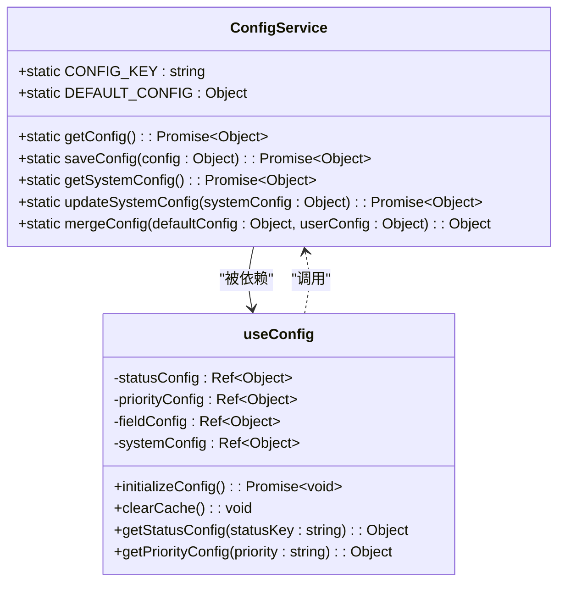
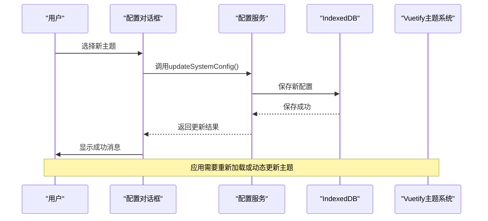

# 系统配置管理

<cite>
**Referenced Files in This Document**   
- [configService.js](file://src/services/configService.js)
- [useConfig.js](file://src/composables/useConfig.js)
- [ConfigDialog.vue](file://src/model/ConfigDialog.vue)
- [main.js](file://src/main.js)
</cite>

## 目录
1. [系统配置管理](#系统配置管理)
2. [核心配置服务分析](#核心配置服务分析)
3. [系统配置项详解](#系统配置项详解)
4. [主题切换实现机制](#主题切换实现机制)
5. [动态日期格式更新](#动态日期格式更新)
6. [语言配置扩展性分析](#语言配置扩展性分析)
7. [配置变更状态同步](#配置变更状态同步)
8. [配置失效诊断与修复](#配置失效诊断与修复)

## 核心配置服务分析

`ConfigService` 是 TidyDo 应用的核心配置管理服务，负责所有应用配置的持久化存储和管理。该服务采用静态类模式实现，提供了统一的配置访问接口。

服务通过 `idb-keyval` 库在浏览器的 IndexedDB 中持久化存储配置数据，使用 `app-config` 作为存储键名。配置服务实现了完整的 CRUD 操作，包括获取、保存、更新和重置配置功能。

配置服务采用深度合并策略，确保用户配置与默认配置的完整性。当获取配置时，如果存储中不存在配置数据，服务会自动创建并保存默认配置。在合并配置时，服务会递归遍历所有嵌套对象，保留用户自定义设置的同时，确保新增的配置项能被正确包含。



**Diagram sources**
- [configService.js](file://src/services/configService.js#L1-L205)
- [useConfig.js](file://src/composables/useConfig.js#L20-L192)

**Section sources**
- [configService.js](file://src/services/configService.js#L1-L205)

## 系统配置项详解

系统配置项是 `ConfigService` 中 `systemConfig` 对象的一部分，包含影响整个应用行为的全局设置。这些配置项定义了用户界面的外观和行为，包括主题、语言、日期格式和时间格式等。

`theme` 配置项控制应用的整体视觉风格，支持 "light"（浅色）和 "dark"（深色）两种主题模式。`language` 配置项指定应用的界面语言，当前支持 "zh-CN"（简体中文）和 "en-US"（英语）两种语言。`dateFormat` 配置项定义日期的显示格式，支持 "YYYY-MM-DD"、"MM/DD/YYYY" 和 "DD/MM/YYYY" 三种常见格式。`timeFormat` 配置项控制时间的显示方式，支持 "24h"（24小时制）和 "12h"（12小时制）两种模式。

这些系统配置项在应用启动时由 `useConfig` 组合式函数初始化，并在整个应用生命周期中保持响应式更新。配置项的值通过 Vue 的响应式系统进行管理，确保界面能够实时反映配置变化。

**Section sources**
- [configService.js](file://src/services/configService.js#L131-L134)
- [configService.js](file://src/services/configService.js#L157-L161)

## 主题切换实现机制

主题切换功能通过 `ConfigService` 和 Vuetify UI 框架的深度集成实现。当用户在配置对话框中更改主题设置时，`ConfigDialog` 组件会调用 `ConfigService.updateSystemConfig` 方法更新系统配置。

Vuetify 框架在 `main.js` 中被初始化，并配置了主题支持。虽然当前代码中 Vuetify 的主题配置是静态的，但通过结合 `ConfigService` 的动态配置管理，可以实现运行时主题切换。

主题切换的实现流程如下：用户在 `ConfigDialog` 中选择新主题 → 调用 `updateSystemConfig` 更新配置 → 配置服务将新主题保存到 IndexedDB → `useConfig` 的响应式系统检测到变化 → 应用需要重新加载或动态更新 Vuetify 的主题配置以反映变化。



**Diagram sources**
- [configService.js](file://src/services/configService.js#L157-L161)
- [ConfigDialog.vue](file://src/model/ConfigDialog.vue#L1-L701)
- [main.js](file://src/main.js#L18-L29)

**Section sources**
- [configService.js](file://src/services/configService.js#L157-L161)
- [ConfigDialog.vue](file://src/model/ConfigDialog.vue#L1-L701)

## 动态日期格式更新

动态修改日期格式的功能通过 `ConfigService` 提供的 API 实现。以下代码示例展示了如何实时更新所有日期显示组件：

```javascript
import { ConfigService } from '@/services/configService'
import { globalConfig } from '@/composables/useConfig'

// 更新日期格式
const updateDateFormat = async (newFormat) => {
  try {
    // 调用配置服务更新系统配置
    await ConfigService.updateSystemConfig({
      dateFormat: newFormat
    })
    
    // 强制清除配置缓存，触发响应式更新
    globalConfig.clearCache()
    
    // 重新初始化配置，确保所有组件获取最新配置
    await globalConfig.initializeConfig()
    
    console.log(`日期格式已更新为: ${newFormat}`)
  } catch (error) {
    console.error('更新日期格式失败:', error)
  }
}

// 使用示例
updateDateFormat('MM/DD/YYYY')
```

当调用 `updateSystemConfig` 方法时，新的日期格式会被保存到持久化存储中。通过调用 `clearCache` 方法清除配置缓存，然后重新初始化配置，可以确保所有使用 `useConfig` 的组件都能获取到最新的日期格式设置。这种方法利用了 Vue 的响应式系统，实现了跨组件的实时更新。

**Section sources**
- [configService.js](file://src/services/configService.js#L157-L161)
- [useConfig.js](file://src/composables/useConfig.js#L20-L192)

## 语言配置扩展性分析

当前语言配置的实现具有良好的扩展潜力，但也存在一些局限性。从扩展潜力来看，系统已经建立了完整的多语言支持基础架构。`language` 配置项的设计允许轻松添加新的语言选项，只需在 `ConfigDialog` 的 `languageOptions` 数组中添加新的语言选项即可。

然而，当前实现的主要局限性在于缺乏实际的国际化（i18n）支持。虽然界面提供了语言选择，但应用的文本内容仍然是硬编码的，没有根据选择的语言动态切换。真正的国际化需要引入 i18n 库（如 Vue I18n），并为每种支持的语言创建对应的翻译文件。

此外，当前的语言配置仅存储在客户端，没有与服务器端同步的机制。对于需要跨设备同步用户偏好的场景，这种纯客户端的实现方式会限制用户体验。未来的改进方向包括集成 i18n 库、创建多语言翻译文件，以及实现语言偏好在用户账户间的同步。

**Section sources**
- [ConfigDialog.vue](file://src/model/ConfigDialog.vue#L1-L701)
- [configService.js](file://src/services/configService.js#L1-L205)

## 配置变更状态同步

系统配置变更时的状态同步涉及多个层面的协调。首先，`ConfigService` 负责将配置变更持久化到 IndexedDB，确保数据的持久性。其次，`useConfig` 组合式函数通过 Vue 的响应式系统管理配置状态，确保所有使用该组合式函数的组件能够接收到配置变更的通知。

状态同步的主要机制包括：
1. **持久化存储**：所有配置变更都通过 `ConfigService.saveConfig` 方法保存到 IndexedDB
2. **响应式更新**：`useConfig` 中的配置对象是响应式的，当配置变更时，依赖这些配置的组件会自动重新渲染
3. **事件通知**：`ConfigDialog` 组件在保存配置后会触发 `config-updated` 事件，通知父组件配置已更新

然而，当前实现存在一个潜在的状态同步问题：配置变更后，Vuetify 的主题系统不会自动更新。这需要应用在配置变更后重新加载或手动更新 Vuetify 的主题配置，否则用户界面的主题可能不会立即反映新的设置。

**Section sources**
- [configService.js](file://src/services/configService.js#L1-L205)
- [useConfig.js](file://src/composables/useConfig.js#L20-L192)
- [ConfigDialog.vue](file://src/model/ConfigDialog.vue#L1-L701)

## 配置失效诊断与修复

当系统配置失效时，可以按照以下诊断流程进行排查和修复：

1. **检查存储访问权限**：确认浏览器是否允许应用访问 IndexedDB 存储
2. **验证配置键名**：检查 `CONFIG_KEY` 是否正确，确保应用读取的是正确的配置数据
3. **检查默认配置完整性**：确认 `DEFAULT_CONFIG` 对象是否完整，特别是 `systemConfig` 部分
4. **测试配置读写功能**：通过调用 `getConfig` 和 `saveConfig` 方法测试基本的配置读写功能

修复方案包括：
- **重置为默认配置**：调用 `ConfigService.resetToDefault()` 方法恢复默认配置
- **手动修复存储数据**：在浏览器开发者工具中直接编辑 IndexedDB 中的配置数据
- **清除应用数据**：完全清除应用的本地存储数据，让应用重新创建默认配置

最常见的配置失效原因是存储权限被拒绝或配置数据损坏。在这种情况下，重置为默认配置通常是最快捷有效的解决方案。

**Section sources**
- [configService.js](file://src/services/configService.js#L1-L205)