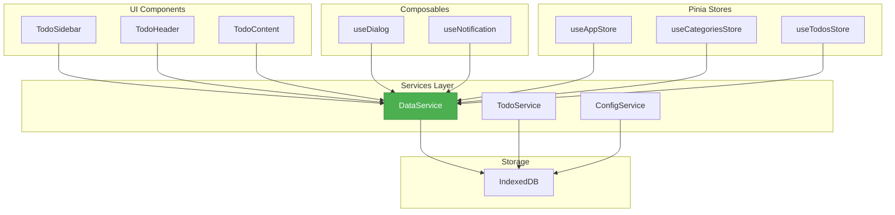
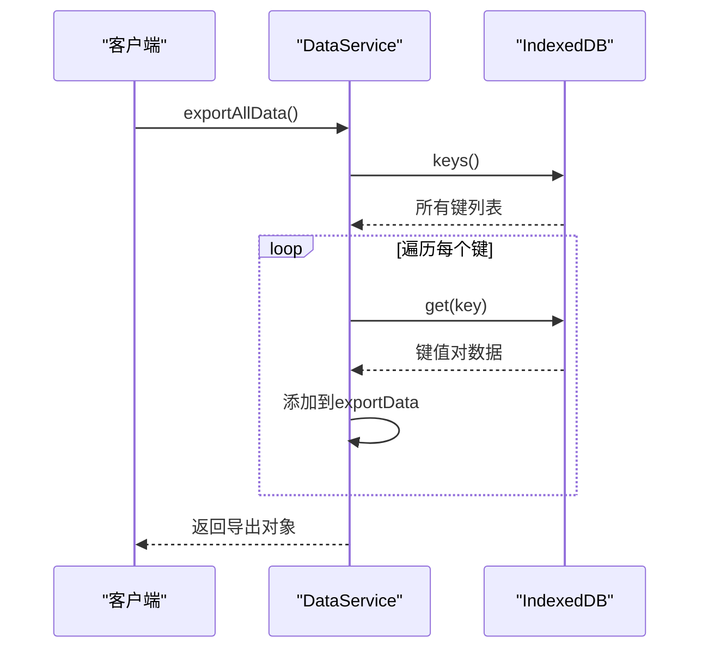
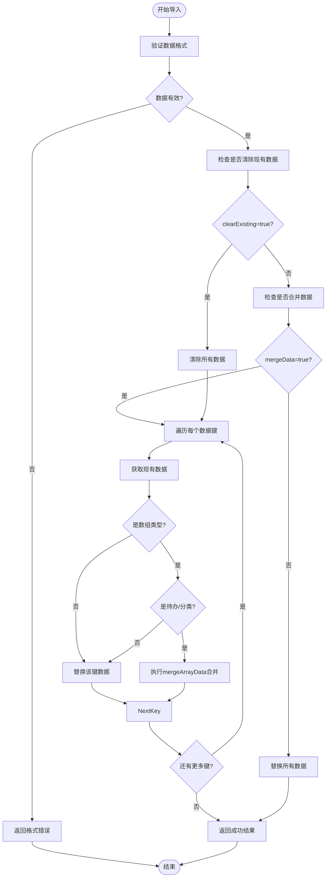
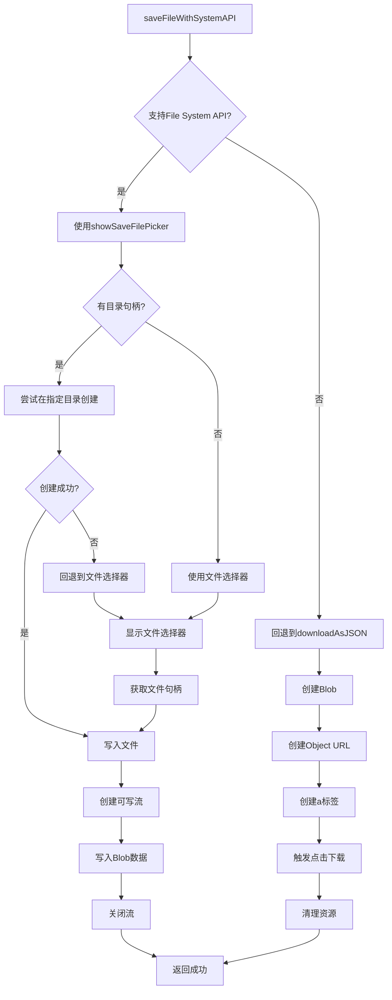

# DataService 数据备份与导入服务

<cite>
**Referenced Files in This Document**   
- [dataService.js](file://src/services/dataService.js)
- [todoService.js](file://src/services/todoService.js)
- [idGenerator.js](file://src/utils/idGenerator.js)
- [errorHandler.js](file://src/utils/errorHandler.js)
- [README.md](file://README.md)
- [DEVELOPMENT.md](file://DEVELOPMENT.md)
- [CHANGELOG.md](file://CHANGELOG.md)
</cite>

## 目录
1. [简介](#简介)
2. [核心职责与架构](#核心职责与架构)
3. [全量数据导出机制](#全量数据导出机制)
4. [智能数据导入与合并](#智能数据导入与合并)
5. [文件下载实现对比](#文件下载实现对比)
6. [文件解析与错误处理](#文件解析与错误处理)
7. [存储状态监控](#存储状态监控)
8. [浏览器兼容性指南](#浏览器兼容性指南)
9. [性能调优建议](#性能调优建议)
10. [常见问题排查](#常见问题排查)

## 简介

DataService 是 TidyDo 应用的核心数据持久化与迁移服务，负责实现数据的备份、恢复和迁移功能。作为应用架构中的关键服务层组件，它确保了用户数据的安全性和可移植性。

该服务通过 `idb-keyval` 库与 IndexedDB 进行交互，实现了对应用数据的统一管理。其主要功能包括全量数据导出、智能数据导入、文件下载与保存、JSON 文件解析和数据统计等，为用户提供了一套完整的数据管理解决方案。

**Section sources**
- [dataService.js](file://src/services/dataService.js#L1-L273)

## 核心职责与架构

DataService 在 TidyDo 的分层架构中扮演着数据操作核心的角色，位于服务层（Services Layer），负责与底层存储系统进行交互，并为上层状态管理（Stores）和组合式函数（Composables）提供数据操作接口。

该服务采用静态类设计模式，所有方法均为静态方法，无需实例化即可调用。这种设计模式符合其工具类的定位，使得数据操作方法可以被应用的任何部分直接访问。



**Diagram sources**
- [dataService.js](file://src/services/dataService.js#L1-L273)
- [DEVELOPMENT.md](file://DEVELOPMENT.md#L1-L760)

**Section sources**
- [dataService.js](file://src/services/dataService.js#L1-L273)
- [DEVELOPMENT.md](file://DEVELOPMENT.md#L1-L760)

## 全量数据导出机制

### 版本控制与时间戳记录

`exportAllData` 方法是 DataService 的核心功能之一，负责实现全量数据的导出。该方法不仅导出所有存储的数据，还包含了版本控制和时间戳记录，确保了数据的可追溯性和兼容性。

当调用 `exportAllData` 时，服务会创建一个包含版本信息、时间戳和实际数据的导出对象。当前版本号为 `1.0`，这为未来的数据格式升级提供了基础。时间戳采用 ISO 8601 格式（`new Date().toISOString()`），确保了时间信息的标准化和可读性。



**Diagram sources**
- [dataService.js](file://src/services/dataService.js#L13-L35)

**Section sources**
- [dataService.js](file://src/services/dataService.js#L13-L35)

## 智能数据导入与合并

### mergeArrayData 合并策略

`importData` 方法实现了智能的数据导入功能，其核心是 `mergeArrayData` 合并策略。该策略在不清除现有数据的前提下，有效避免了 ID 冲突，确保了数据的完整性和一致性。

导入过程支持多种选项，包括是否清除现有数据（`clearExisting`）和是否合并数据（`mergeData`）。当 `mergeData` 选项启用且未选择清除现有数据时，服务会进入智能合并模式。

对于数组类型的数据，特别是待办事项（`TODO_ITEMS_KEY`）和分类（`TODO_CATEGORIES_KEY`），服务会执行智能合并：
1. 首先获取现有数据
2. 创建一个包含所有现有 ID 的 `Set`
3. 过滤新数据，排除 ID 已存在的项
4. 将去重后的新数据与现有数据合并

这种策略确保了即使导入包含重复 ID 的数据，也不会导致数据覆盖或冲突。



**Diagram sources**
- [dataService.js](file://src/services/dataService.js#L46-L99)

**Section sources**
- [dataService.js](file://src/services/dataService.js#L46-L99)
- [todoService.js](file://src/services/todoService.js#L1-L313)

## 文件下载实现对比

### downloadAsJSON 与 saveFileWithSystemAPI

DataService 提供了两种文件下载实现：传统的 `downloadAsJSON` 和现代的 `saveFileWithSystemAPI`。这两种实现方式针对不同的浏览器环境提供了最佳的用户体验。

#### downloadAsJSON (传统方式)

`downloadAsJSON` 方法使用传统的 Blob 和 `a` 标签下载机制。这种方法兼容性极佳，几乎支持所有现代浏览器，但其局限性在于无法让用户选择保存位置，文件会自动下载到默认下载目录。

#### saveFileWithSystemAPI (现代方式)

`saveFileWithSystemAPI` 方法利用现代浏览器的 File System Access API，提供了更高级的文件操作能力。该方法允许用户通过文件选择器指定保存位置，提供了更灵活的文件管理体验。

两种实现的关键差异在于：
- **用户控制**: `saveFileWithSystemAPI` 允许用户选择保存位置，而 `downloadAsJSON` 使用默认下载目录
- **API 依赖**: `saveFileWithSystemAPI` 依赖于较新的浏览器 API，而 `downloadAsSystemAPI` 基于传统 Web API
- **用户体验**: `saveFileWithSystemAPI` 提供了更直观的文件保存体验



**Diagram sources**
- [dataService.js](file://src/services/dataService.js#L102-L173)

**Section sources**
- [dataService.js](file://src/services/dataService.js#L102-L173)

## 文件解析与错误处理

### readJSONFile 解析流程

`readJSONFile` 方法负责解析用户选择的 JSON 文件，其流程设计充分考虑了各种可能的错误情况，确保了数据导入的稳定性和用户体验。

解析流程如下：
1. **文件验证**: 首先检查文件是否存在，然后验证文件扩展名是否为 `.json`
2. **异步读取**: 使用 `FileReader` 异步读取文件内容
3. **JSON 解析**: 尝试将读取的文本内容解析为 JSON 对象
4. **错误处理**: 捕获并处理各种可能的错误，包括文件读取失败和 JSON 格式错误

该方法返回一个 Promise，成功时解析结果通过 `resolve` 返回，失败时通过 `reject` 返回相应的错误信息。这种设计模式与现代 JavaScript 的异步编程范式保持一致，便于在调用方进行链式处理。

**Section sources**
- [dataService.js](file://src/services/dataService.js#L207-L236)

## 存储状态监控

### getDataStats 监控能力

`getDataStats` 方法提供了对存储状态的全面监控能力，帮助开发者和用户了解应用的数据状况。该方法返回一个包含总键数和详细信息的对象，可用于性能分析和数据管理。

监控信息包括：
- **总键数**: 存储中所有键的总数
- **详细信息**: 每个键的类型和大小信息
  - 数组类型: 记录元素数量
  - 对象类型: 记录键的数量
  - 其他类型: 记录值的类型和内容

这种细粒度的监控能力对于诊断存储问题、优化数据结构和提供用户反馈都非常有价值。

**Section sources**
- [dataService.js](file://src/services/dataService.js#L239-L272)

## 浏览器兼容性指南

DataService 的功能实现考虑了不同浏览器环境的兼容性，特别是 `saveFileWithSystemAPI` 方法对现代浏览器 API 的依赖。

### 兼容性策略

1. **特性检测**: 使用 `isFileSystemAccessSupported` 方法检测浏览器是否支持 File System Access API
   ```javascript
   static isFileSystemAccessSupported() {
     return 'showSaveFilePicker' in window && 'showDirectoryPicker' in window
   }
   ```

2. **优雅降级**: 当现代 API 不可用时，自动回退到传统的 `downloadAsJSON` 方法

3. **错误处理**: 捕获 `AbortError` 等特定错误，区分用户取消操作和其他错误

### 支持的浏览器

- **Chrome**: 完整支持所有功能
- **Edge**: 完整支持所有功能
- **Firefox**: 部分支持 File System Access API（需启用实验性功能）
- **Safari**: 不支持 File System Access API，仅支持传统下载方式

**Section sources**
- [dataService.js](file://src/services/dataService.js#L130-L204)

## 性能调优建议

### 大体积数据导入优化

对于大体积数据的导入，建议采取以下性能优化措施：

1. **分批处理**: 对于超大数据集，考虑分批导入，避免长时间阻塞主线程
2. **进度反馈**: 在导入过程中提供进度指示，改善用户体验
3. **内存管理**: 注意避免在内存中同时持有大量数据副本
4. **错误恢复**: 实现断点续传机制，支持在导入失败后从中断点继续

### 批量操作优化

由于 DataService 使用 `idb-keyval` 库，而该库的每个操作都是独立的 IndexedDB 事务，频繁的读写操作可能影响性能。建议：

1. **批量读取**: 在 `exportAllData` 中已经实现了批量读取所有键，这是最佳实践
2. **减少操作次数**: 尽量减少不必要的读写操作
3. **合理使用缓存**: 对于频繁访问的数据，考虑在内存中缓存

**Section sources**
- [dataService.js](file://src/services/dataService.js#L1-L273)
- [idGenerator.js](file://src/utils/idGenerator.js#L1-L31)

## 常见问题排查

### 常见格式错误

1. **无效的 JSON 格式**: 确保导出的文件是有效的 JSON 格式，可以使用在线 JSON 验证工具进行检查
2. **文件扩展名错误**: 确保文件扩展名为 `.json`，否则 `readJSONFile` 会拒绝处理
3. **数据结构不匹配**: 导入的数据结构应与导出时的结构保持一致

### 常见操作问题

1. **导入失败**: 检查控制台错误日志，确认是数据格式问题还是存储权限问题
2. **下载无反应**: 检查浏览器是否阻止了自动下载，尝试手动点击下载链接
3. **ID 冲突**: 确认 `mergeArrayData` 策略是否按预期工作，检查 ID 生成逻辑

### 调试建议

1. **查看控制台日志**: DataService 在关键操作点都有详细的 `console.log` 和 `console.error` 输出
2. **检查 IndexedDB**: 使用浏览器开发者工具的 Application 面板查看 IndexedDB 中的实际数据
3. **验证数据统计**: 使用 `getDataStats` 方法验证数据导入后的状态

**Section sources**
- [dataService.js](file://src/services/dataService.js#L1-L273)
- [errorHandler.js](file://src/utils/errorHandler.js#L1-L109)