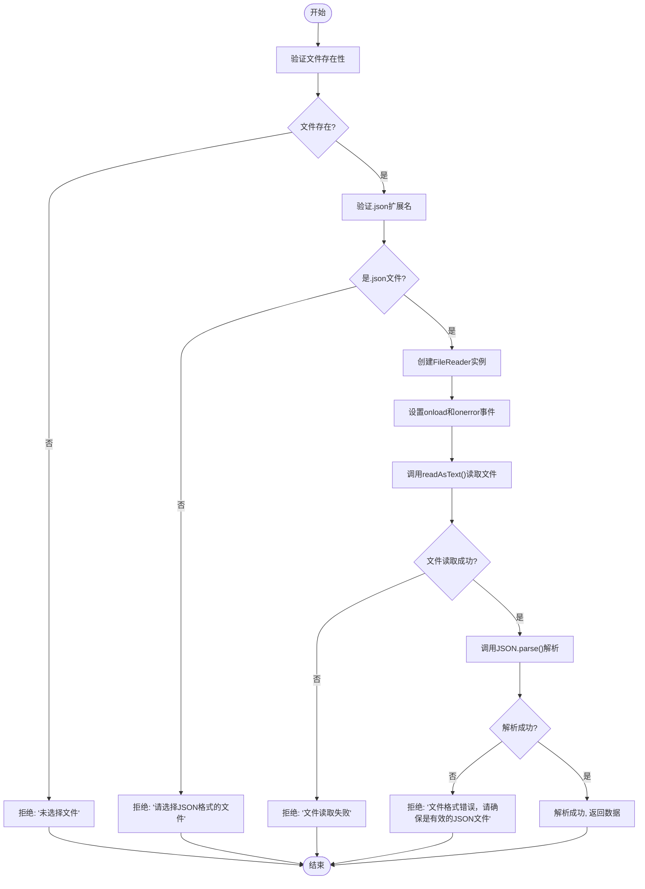
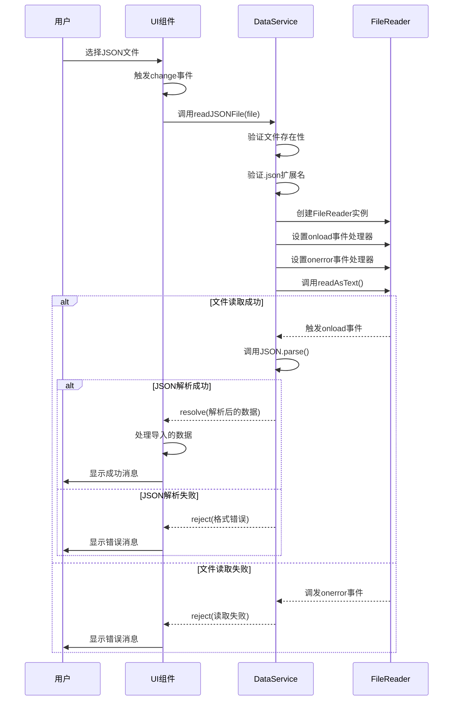

# JSON文件读取与解析

<cite>
**Referenced Files in This Document**  
- [dataService.js](file://src/services/dataService.js#L207-L236)
- [useDialog.js](file://src/composables/useDialog.js)
- [useNotification.js](file://src/composables/useNotification.js)
- [TodoSidebar.vue](file://src/components/TodoSidebar.vue)
</cite>

## 目录
1. [readJSONFile方法概述](#readjsonfile方法概述)
2. [文件处理流程](#文件处理流程)
3. [异步操作与Promise封装](#异步操作与promise封装)
4. [常见文件解析错误类型](#常见文件解析错误类型)
5. [Vue组件集成示例](#vue组件集成示例)
6. [错误提示UI建议](#错误提示ui建议)

## readJSONFile方法概述

`readJSONFile` 是 `DataService` 类中的一个静态方法，用于从用户选择的文件对象中读取并解析JSON数据。该方法位于 `src/services/dataService.js` 文件中，是TidyDo应用数据导入功能的核心组成部分。

该方法通过浏览器原生的 `FileReader` API 实现文件读取，并结合 `JSON.parse()` 方法进行数据解析。整个过程被封装在 `Promise` 中，以支持异步调用和 `await` 语法，便于在Vue组件中使用。

**Section sources**  
- [dataService.js](file://src/services/dataService.js#L207-L236)

## 文件处理流程

`readJSONFile` 方法的文件处理流程包含三个关键阶段：文件验证、异步读取和JSON解析。

### 文件类型验证

在读取文件之前，方法首先执行两项验证：

1. **文件存在性检查**：确认传入的 `file` 参数不为空
2. **扩展名验证**：通过 `file.name.endsWith('.json')` 检查文件是否为JSON格式

如果任一验证失败，方法会立即拒绝Promise并返回相应的错误信息。

### FileReader异步读取机制

验证通过后，方法创建 `FileReader` 实例并设置事件处理器：

- **onload事件**：当文件成功读取时触发，将读取结果传递给 `JSON.parse()` 进行解析
- **onerror事件**：当文件读取失败时触发，拒绝Promise并返回"文件读取失败"错误

最后调用 `reader.readAsText(file)` 启动异步读取过程。

### JSON.parse异常处理

在 `onload` 事件处理器中，方法使用 `try-catch` 块包裹 `JSON.parse()` 调用：

- **解析成功**：将解析后的数据通过 `resolve(data)` 返回
- **解析失败**：捕获异常并通过 `reject()` 返回"文件格式错误，请确保是有效的JSON文件"错误



**Diagram sources**  
- [dataService.js](file://src/services/dataService.js#L207-L236)

**Section sources**  
- [dataService.js](file://src/services/dataService.js#L207-L236)

## 异步操作与Promise封装

`readJSONFile` 方法通过 `Promise` 封装异步操作，使其能够与现代JavaScript的异步编程模式无缝集成。

### Promise封装机制

方法返回一个 `Promise` 对象，该对象在以下情况下被解决或拒绝：

- **resolve(data)**：当JSON文件成功读取并解析时，返回解析后的数据对象
- **reject(error)**：当发生任何错误时（文件未选择、格式错误、读取失败等），返回相应的错误对象

### 在组件中使用await调用

由于方法返回Promise，可以在支持 `async/await` 的环境中直接使用：

```javascript
try {
  const data = await DataService.readJSONFile(file)
  // 处理解析后的数据
} catch (error) {
  // 处理错误
  console.error(error.message)
}
```

这种设计模式使得异步代码的编写和阅读更加直观，避免了回调地狱问题。

**Section sources**  
- [dataService.js](file://src/services/dataService.js#L207-L236)

## 常见文件解析错误类型

`readJSONFile` 方法识别并处理多种文件解析错误，每种错误都有专门的错误消息设计。

### 错误类型分类

| 错误类型 | 触发条件 | 错误消息 |
|---------|---------|---------|
| 文件未选择 | `file` 参数为 `null` 或 `undefined` | "未选择文件" |
| 文件格式错误 | 文件扩展名不是 `.json` | "请选择JSON格式的文件" |
| 编码问题 | 文件包含无法解析的字符编码 | "文件格式错误，请确保是有效的JSON文件" |
| 非法字符 | JSON中包含控制字符或特殊符号 | "文件格式错误，请确保是有效的JSON文件" |
| 结构损坏 | JSON结构不完整或括号不匹配 | "文件格式错误，请确保是有效的JSON文件" |
| 文件读取失败 | 浏览器无法读取文件内容 | "文件读取失败" |

### 错误消息设计原则

1. **用户友好性**：使用中文提示，避免技术术语
2. **明确性**：清楚指出问题所在（如"未选择文件"）
3. **可操作性**：提供用户可以采取的纠正措施（如"请选择JSON格式的文件"）
4. **一致性**：所有错误消息遵循相似的表述风格

**Section sources**  
- [dataService.js](file://src/services/dataService.js#L207-L236)

## Vue组件集成示例

以下是在Vue组件中集成 `readJSONFile` 方法的完整示例，展示从用户选择文件到处理结果的完整链路。

### 组件模板

```vue
<template>
  <div>
    <input type="file" @change="handleFileSelect" accept=".json" />
    <button @click="importData" :disabled="!selectedFile">导入数据</button>
  </div>
</template>
```

### 脚本实现

```javascript
import { ref } from 'vue'
import { DataService } from '@/services/dataService'
import { useNotification } from '@/composables/useNotification'

export default {
  setup() {
    const selectedFile = ref(null)
    const { showError, showSuccess } = useNotification()

    // 处理文件选择
    const handleFileSelect = (event) => {
      selectedFile.value = event.target.files[0]
      if (selectedFile.value) {
        showSuccess(`已选择文件: ${selectedFile.value.name}`)
      }
    }

    // 导入数据
    const importData = async () => {
      if (!selectedFile.value) return

      try {
        const data = await DataService.readJSONFile(selectedFile.value)
        // 处理导入的数据
        await DataService.importData(data)
        showSuccess('数据导入成功')
      } catch (error) {
        showError(error.message)
      }
    }

    return {
      selectedFile,
      handleFileSelect,
      importData
    }
  }
}
```

### 处理链路说明

1. **用户选择文件**：通过 `<input type="file">` 触发 `change` 事件
2. **文件验证**：`readJSONFile` 自动验证文件类型和格式
3. **异步读取**：使用 `FileReader` 异步读取文件内容
4. **JSON解析**：调用 `JSON.parse()` 解析文本为JavaScript对象
5. **错误处理**：捕获并显示各种可能的错误
6. **数据处理**：成功解析后调用 `importData` 方法处理数据



**Diagram sources**  
- [dataService.js](file://src/services/dataService.js#L207-L236)
- [useNotification.js](file://src/composables/useNotification.js)

**Section sources**  
- [dataService.js](file://src/services/dataService.js#L207-L236)
- [useNotification.js](file://src/composables/useNotification.js)

## 错误提示UI建议

基于TidyDo应用的现有设计，以下是针对文件解析错误的UI提示建议。

### 通知系统集成

利用现有的 `useNotification` 组合式函数提供统一的错误提示：

```javascript
const { showError, showSuccess, showWarning } = useNotification()
```

### 具体错误处理策略

#### 文件未选择
- **UI提示**：`showWarning('请先选择要导入的文件')`
- **视觉反馈**：高亮文件选择输入框

#### 文件格式错误
- **UI提示**：`showError('请选择JSON格式的文件')`
- **视觉反馈**：在文件选择器旁边显示格式要求提示

#### 文件读取失败
- **UI提示**：`showError('文件读取失败，请检查文件是否损坏')`
- **建议操作**：提供"重试"按钮

#### JSON解析错误
- **UI提示**：`showError('文件格式错误，请确保是有效的JSON文件')`
- **建议操作**：提供"查看示例文件"链接

### 错误提示设计原则

1. **即时反馈**：在用户操作后立即显示结果
2. **视觉区分**：使用不同颜色区分成功、警告和错误状态
3. **可操作性**：提供明确的后续操作建议
4. **一致性**：与应用其他部分的错误提示风格保持一致

**Section sources**  
- [useNotification.js](file://src/composables/useNotification.js)
- [TodoSidebar.vue](file://src/components/TodoSidebar.vue)