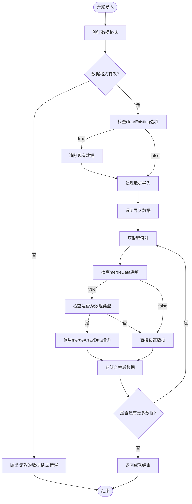
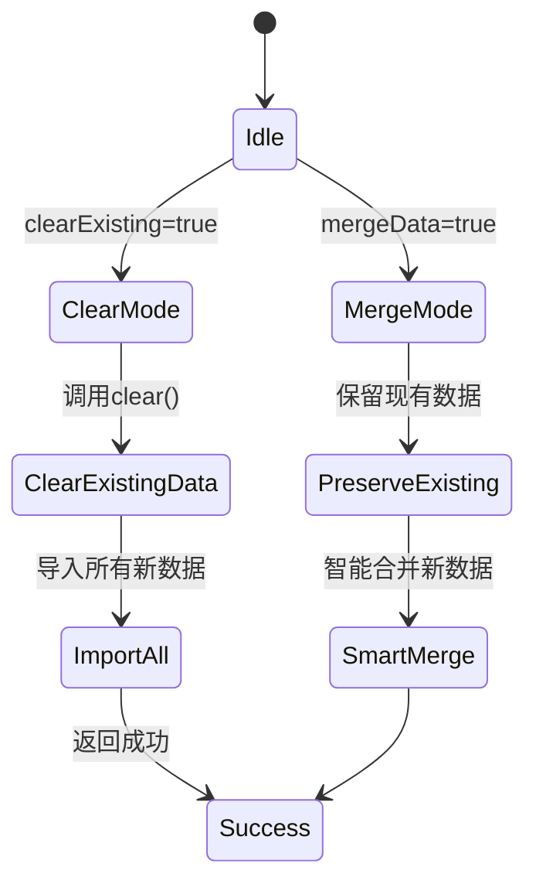
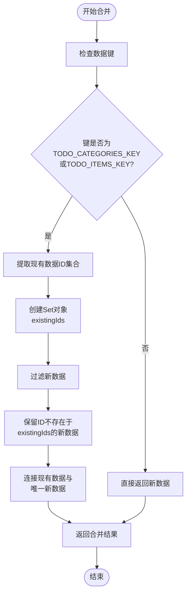
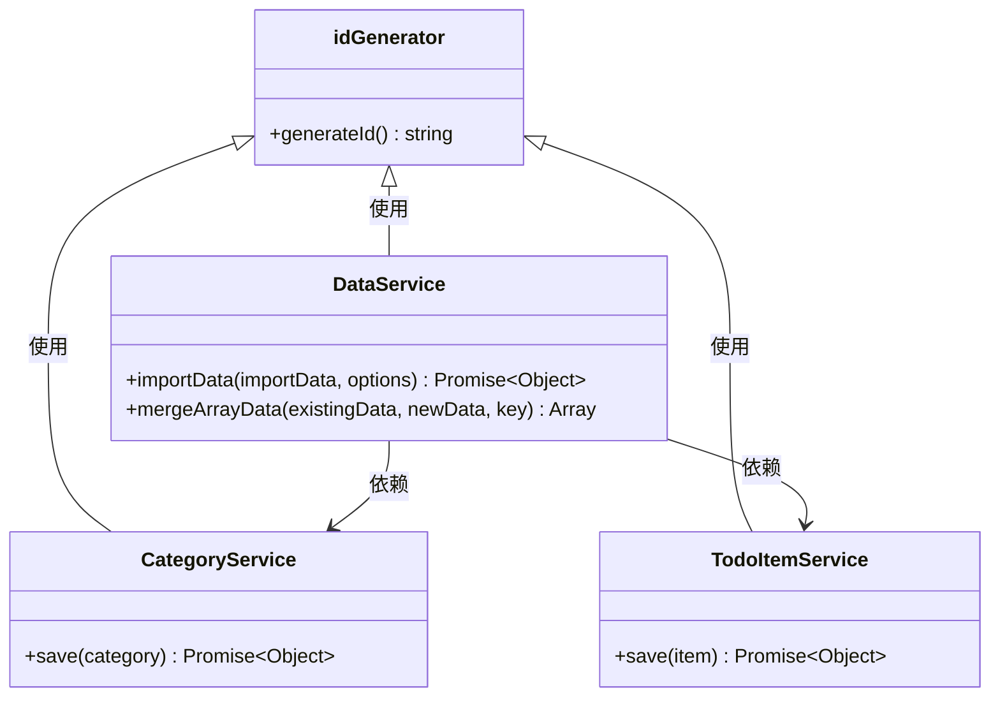

# 数据导入与合并策略

<cite>
**Referenced Files in This Document**   
- [dataService.js](file://src/services/dataService.js)
- [todoService.js](file://src/services/todoService.js)
- [simpleTodoService.js](file://src/services/simpleTodoService.js)
</cite>

## 目录
1. [导入方法核心流程](#导入方法核心流程)
2. [选项行为差异分析](#选项行为差异分析)
3. [智能合并机制详解](#智能合并机制详解)
4. [数据完整性保障](#数据完整性保障)
5. [常见导入失败场景排查](#常见导入失败场景排查)
6. [用户提示优化建议](#用户提示优化建议)

## 导入方法核心流程

`importData` 方法是数据服务类（DataService）中的核心功能，负责处理数据的导入操作。该方法接收两个参数：待导入的数据对象和可选的配置选项。



**Diagram sources**
- [dataService.js](file://src/services/dataService.js#L46-L86)

**Section sources**
- [dataService.js](file://src/services/dataService.js#L46-L86)

## 选项行为差异分析

`importData` 方法支持两个关键选项：`clearExisting` 和 `mergeData`，它们共同决定了数据导入的行为模式。

### 清除现有数据 (clearExisting)

当 `clearExisting` 选项设置为 `true` 时，系统会在导入新数据前彻底清除所有现有数据。这种模式适用于需要完全替换数据的场景，如从备份恢复或初始化系统。



### 合并数据 (mergeData)

当 `mergeData` 选项设置为 `true` 且 `clearExisting` 为 `false` 时，系统会尝试智能合并新旧数据，避免覆盖现有信息。这是默认的导入行为，旨在保护用户已有的数据。

**Section sources**
- [dataService.js](file://src/services/dataService.js#L46-L86)

## 智能合并机制详解

`mergeArrayData` 方法实现了基于ID的智能合并逻辑，专门用于处理分类和待办事项等关键数据集合。

### 合并算法流程



### 具体合并过程示例

假设现有分类数据为：
```json
[
  {"id": "cat1", "name": "工作"},
  {"id": "cat2", "name": "学习"}
]
```

导入的新数据为：
```json
[
  {"id": "cat2", "name": "个人发展"},
  {"id": "cat3", "name": "健身"}
]
```

合并过程如下：
1. 提取现有数据ID：`{"cat1", "cat2"}`
2. 过滤新数据中ID已存在的项：`{"cat2"}` 被排除
3. 保留唯一新数据：`{"id": "cat3", "name": "健身"}`
4. 合并结果：`[{"id": "cat1", "name": "工作"}, {"id": "cat2", "name": "学习"}, {"id": "cat3", "name": "健身"}]`

**Diagram sources**
- [dataService.js](file://src/services/dataService.js#L89-L99)

**Section sources**
- [dataService.js](file://src/services/dataService.js#L89-L99)
- [todoService.js](file://src/services/todoService.js#L5-L6)

## 数据完整性保障

系统通过多种机制确保数据导入过程中的完整性，防止主键冲突和其他数据一致性问题。

### 主键冲突预防

系统依赖 `idGenerator` 工具生成全局唯一的ID，确保即使在合并过程中也不会出现ID冲突。每个新创建的分类或待办事项都会获得一个唯一的标识符。



### 数据验证与错误处理

`importData` 方法包含完善的错误处理机制，能够捕获并报告各种导入失败情况，同时确保系统状态的一致性。

**Section sources**
- [dataService.js](file://src/services/dataService.js#L46-L86)
- [utils/idGenerator.js](file://src/utils/idGenerator.js)
- [utils/errorHandler.js](file://src/utils/errorHandler.js)

## 常见导入失败场景排查

### 格式错误

**症状**：导入失败，提示"无效的数据格式"
**原因**：导入数据缺少必要的 `data` 属性，或数据结构不符合预期
**解决方案**：
1. 确保导入数据包含 `data` 字段
2. 验证数据为有效的JSON格式
3. 检查数据结构是否与导出格式一致

### 字段缺失

**症状**：部分数据未能正确导入
**原因**：某些关键字段（如ID、分类ID）缺失
**解决方案**：
1. 确保每个分类和待办事项都有唯一的ID
2. 检查待办事项的 `categoryId` 是否指向存在的分类
3. 验证必填字段的完整性

### 类型不匹配

**症状**：数据导入后显示异常或功能失效
**原因**：字段类型与预期不符（如字符串与数字混淆）
**解决方案**：
1. 检查日期字段是否为ISO格式字符串
2. 验证状态字段是否为预定义的枚举值
3. 确认数组字段确实为数组类型

**Section sources**
- [dataService.js](file://src/services/dataService.js#L46-L86)
- [todoService.js](file://src/services/todoService.js#L10-L15)
- [simpleTodoService.js](file://src/services/simpleTodoService.js#L10-L15)

## 用户提示优化建议

为了提升用户体验，建议在导入失败时提供更具体的错误信息和指导：

1. **详细错误描述**：将通用的"数据导入失败"替换为具体的错误原因，如"缺少data字段"或"JSON格式无效"
2. **行号定位**：在格式错误时指出问题发生的大概位置
3. **修复建议**：提供具体的修复步骤，如"请确保每个待办事项都有唯一的ID"
4. **预览功能**：在正式导入前提供数据预览，让用户确认数据内容
5. **分步导入**：对于大型数据集，提供分步导入和进度显示

这些改进将帮助用户更快地识别和解决导入问题，减少挫败感。