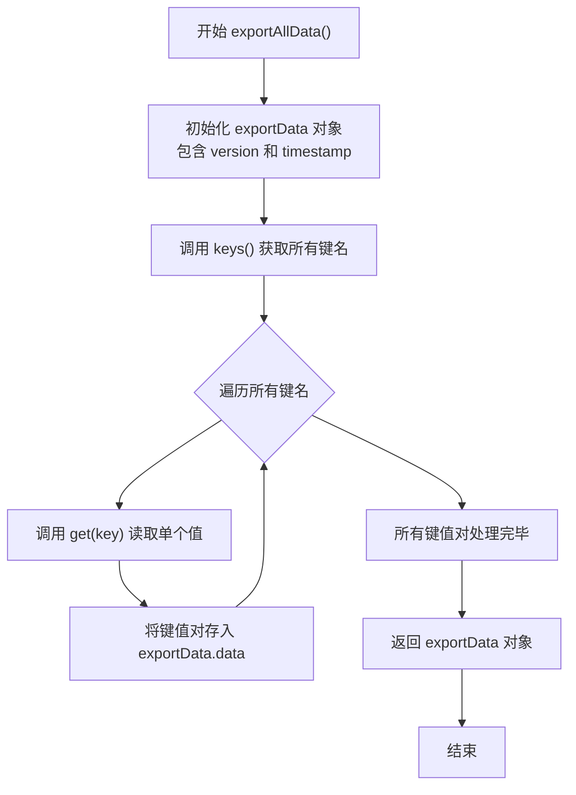
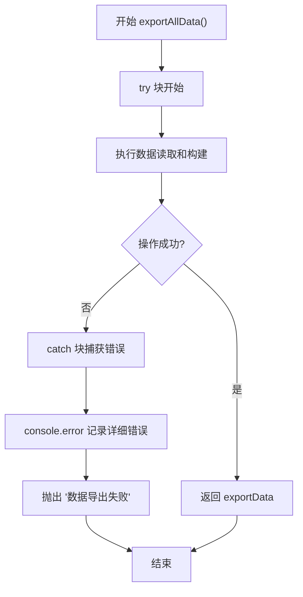
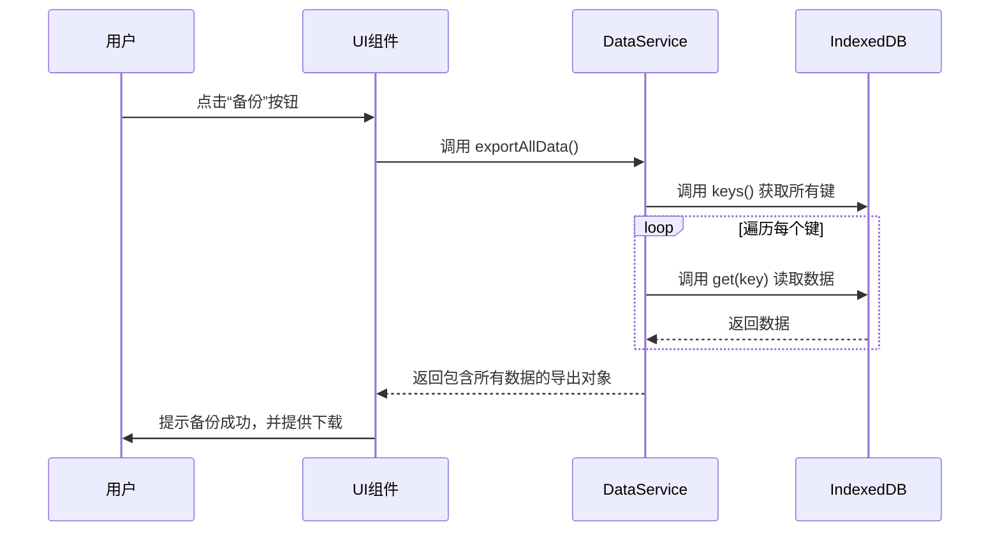

<cite>
**本文档中引用的文件**   
- [dataService.js](file://src/services/dataService.js)
- [appService.js](file://src/services/appService.js)
- [errorHandler.js](file://src/utils/errorHandler.js)
</cite>

## 目录
1. [数据导出功能](#数据导出功能)
2. [核心实现机制](#核心实现机制)
3. [数据一致性保障设计](#数据一致性保障设计)
4. [调用示例与返回结构](#调用示例与返回结构)
5. [服务调用关系与完整调用链路](#服务调用关系与完整调用链路)
6. [大规模数据导出优化建议](#大规模数据导出优化建议)

## 数据导出功能

本文档详细说明 `DataService` 服务中 `exportAllData` 方法的实现机制，包括其如何从 IndexedDB 中收集所有键值对数据，生成包含版本号和时间戳的导出对象。文档将深入分析该方法在数据一致性保障方面的设计，如事务处理与错误捕获策略。同时，提供实际调用代码示例，解释返回数据结构的字段含义，描述与其他服务（如 `AppService`）的调用关系，并在用户触发备份操作时展示完整的调用链路。最后，针对大规模数据导出场景，给出性能优化建议和内存使用注意事项。

**Section sources**
- [dataService.js](file://src/services/dataService.js#L13-L35)

## 核心实现机制

`DataService.exportAllData` 方法的核心职责是从 IndexedDB 中提取所有数据并构建成一个结构化的导出对象。该方法利用 `idb-keyval` 库提供的异步 API 来操作底层的 IndexedDB 存储。

方法的执行流程如下：
1.  **初始化导出对象**：创建一个包含 `version`、`timestamp` 和空 `data` 对象的 `exportData` 结构。
2.  **获取所有键名**：调用 `keys()` 方法异步获取 IndexedDB 中存储的所有键名列表。
3.  **遍历并读取数据**：使用 `for...of` 循环遍历每个键名，并通过 `get(key)` 方法异步读取其对应的值。
4.  **构建数据结构**：将读取到的键值对填充到 `exportData.data` 对象中。
5.  **返回结果**：在成功读取所有数据后，返回完整的 `exportData` 对象。

此实现机制确保了所有存储在 IndexedDB 中的数据，无论其键名如何，都会被完整地收集到导出对象中。



**Diagram sources**
- [dataService.js](file://src/services/dataService.js#L13-L35)

**Section sources**
- [dataService.js](file://src/services/dataService.js#L13-L35)

## 数据一致性保障设计

为了确保数据导出过程的可靠性和一致性，`exportAllData` 方法在设计上采用了以下策略：

### 事务处理
虽然 `idb-keyval` 库在底层封装了 IndexedDB 的事务，但 `exportAllData` 方法本身并未显式地创建一个跨越所有读取操作的单一事务。它通过 `keys()` 和 `get()` 的异步调用链来工作。这意味着在导出过程中，如果其他操作修改了数据库，可能会导致数据不一致（例如，读取到部分旧数据和部分新数据）。然而，对于备份场景，这种“最终一致性”通常是可接受的，因为其主要目标是捕获一个时间点上的数据快照，而不是保证严格的原子性。

### 错误捕获策略
该方法采用了全面的 `try...catch` 错误捕获机制，这是保障数据一致性的关键环节。
-   **捕获异常**：整个数据读取和构建过程被包裹在 `try` 块中，能够捕获任何在 `keys()` 或 `get()` 调用中抛出的错误。
-   **日志记录**：当捕获到错误时，会使用 `console.error` 将详细的错误信息输出到控制台，便于开发者诊断问题。
-   **统一错误抛出**：方法不会将底层的原始错误直接暴露给调用者，而是将其包装成一个更通用的 `Error('数据导出失败')`。这种做法隐藏了实现细节，向调用者提供了一个清晰、一致的错误信号，表明整个导出操作已失败。

这种设计确保了方法的健壮性，即使在部分数据读取失败的情况下，也能优雅地处理错误，避免程序崩溃，并为上层调用者提供明确的失败反馈。



**Diagram sources**
- [dataService.js](file://src/services/dataService.js#L13-L35)

**Section sources**
- [dataService.js](file://src/services/dataService.js#L13-L35)
- [errorHandler.js](file://src/utils/errorHandler.js)

## 调用示例与返回结构

### 实际调用代码示例
以下是一个调用 `exportAllData` 方法的典型代码示例：

```javascript
import { DataService } from '@/services/dataService'

try {
  const backupData = await DataService.exportAllData()
  // 成功获取备份数据，可以进行后续处理，如保存到文件
  console.log('备份成功，数据大小:', Object.keys(backupData.data).length, '项')
} catch (error) {
  // 处理导出失败的情况
  console.error('备份失败:', error.message)
}
```

### 返回数据结构字段含义
`exportAllData` 方法返回一个 Promise，其解析后的对象具有以下结构：

```json
{
  "version": "1.0",
  "timestamp": "2024-01-01T12:00:00.000Z",
  "data": {
    "todo_items": [ /* ... */ ],
    "categories": [ /* ... */ ],
    "config": { /* ... */ }
    // ... 其他所有存储的键值对
  }
}
```

-   **`version` (字符串)**: 标识导出数据的版本号。当前固定为 `"1.0"`，用于在未来数据结构变更时进行兼容性处理。
-   **`timestamp` (字符串)**: 采用 ISO 8601 格式的 UTC 时间戳，精确记录了数据导出的时间点，便于用户识别备份文件。
-   **`data` (对象)**: 这是一个包含所有导出数据的键值对集合。其中的每个键（key）对应 IndexedDB 中的一个存储键名，其值（value）则是该键所存储的完整数据对象或数组。

**Section sources**
- [dataService.js](file://src/services/dataService.js#L13-L35)

## 服务调用关系与完整调用链路

`DataService` 与 `AppService` 是两个独立的服务类，它们之间没有直接的依赖或调用关系。`DataService` 专注于数据的持久化操作（导入/导出），而 `AppService` 则负责应用的初始化和状态管理。

### 完整调用链路
当用户在界面上触发“备份数据”操作时，完整的调用链路如下：

1.  **用户交互**：用户点击“备份”按钮。
2.  **UI 事件处理**：Vue 组件（如 `TodoSidebar.vue`）捕获点击事件。
3.  **调用数据服务**：组件调用 `DataService.exportAllData()` 方法来获取数据。
4.  **数据导出**：`exportAllData` 方法执行，从 IndexedDB 读取所有数据并构建导出对象。
5.  **文件保存**：组件或相关逻辑（可能通过 `DataService.saveFileWithSystemAPI`）将导出对象保存为 JSON 文件。

值得注意的是，`AppService` 并不参与此链路。它主要在应用启动时被调用（`AppService.initializeApp()`），用于初始化配置和加载数据。`DataService` 的 `exportAllData` 方法是一个独立的、按需调用的功能，与应用的初始化流程是解耦的。



**Diagram sources**
- [dataService.js](file://src/services/dataService.js#L13-L35)

**Section sources**
- [dataService.js](file://src/services/dataService.js#L13-L35)
- [appService.js](file://src/services/appService.js)

## 大规模数据导出优化建议

当处理包含大量数据的导出时，`exportAllData` 方法可能会面临性能和内存压力。以下是针对大规模数据导出场景的优化建议和注意事项：

### 性能优化建议
1.  **分页或流式导出**：对于超大规模数据，避免一次性将所有数据加载到内存中。可以设计一个分页导出机制，先获取所有键名，然后分批读取和处理数据，最后将结果拼接或直接流式写入文件。
2.  **并发读取**：当前实现是串行读取每个键的值。可以使用 `Promise.all()` 并发地读取所有键的值，这能显著减少总耗时，尤其是在数据项较多时。但需注意，这会增加瞬时内存占用。
3.  **Web Worker**：将整个导出过程（包括数据读取和 JSON 序列化）移至 Web Worker 中执行。这可以避免阻塞主线程，保证 UI 的响应性，尤其是在处理大量数据时。

### 内存使用注意事项
1.  **内存峰值**：该方法在返回前会将整个数据库的内容加载到一个 JavaScript 对象中。对于大型数据库，这可能导致极高的内存消耗，甚至触发浏览器的内存限制（如 `QuotaExceededError`）。
2.  **避免大对象**：应提醒用户，频繁或在数据量极大时进行全量备份，可能会对浏览器性能产生影响。可以考虑提供“增量备份”或“选择性备份”（仅备份特定类型的数据）作为替代方案。
3.  **及时释放**：在调用方（UI组件）完成对导出数据的处理（如保存文件）后，应尽快释放对 `backupData` 对象的引用，以便垃圾回收器回收内存。

**Section sources**
- [dataService.js](file://src/services/dataService.js#L13-L35)