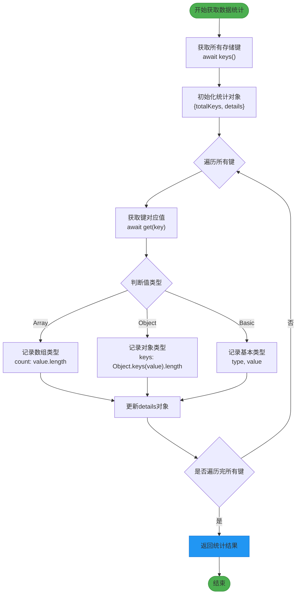
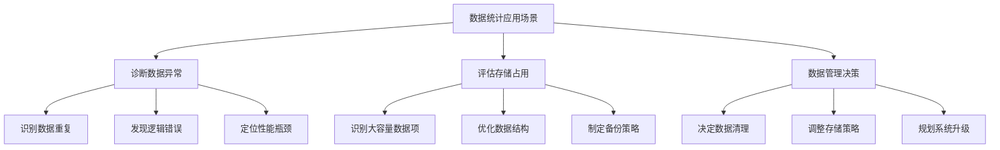
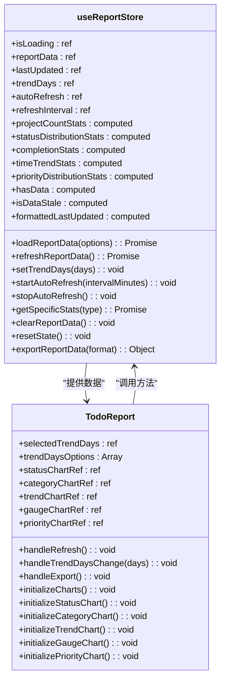
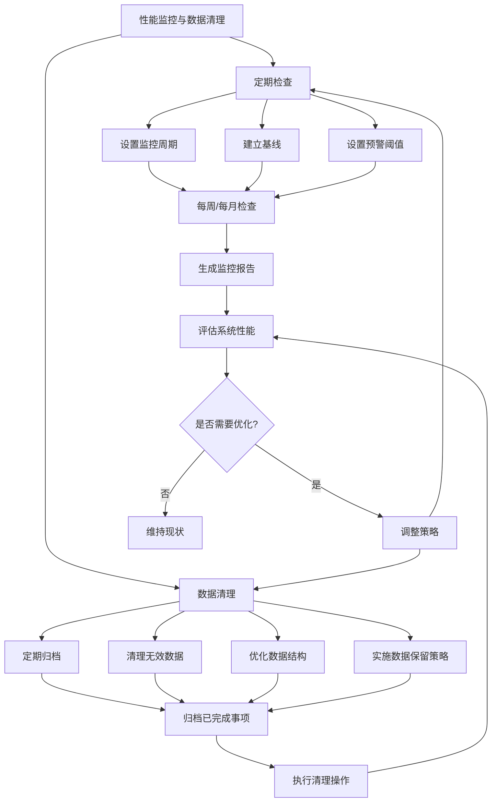

# 数据统计与存储分析

<cite>
**Referenced Files in This Document**   
- [src/services/dataService.js](file://src/services/dataService.js)
- [src/stores/useReportStore.js](file://src/stores/useReportStore.js)
- [src/model/ConfigDialog.vue](file://src/model/ConfigDialog.vue)
- [src/views/tidyDo/components/TodoReport.vue](file://src/views/tidyDo/components/TodoReport.vue)
</cite>

## 目录
1. [getDataStats方法详解](#getdatastats方法详解)
2. [数据统计应用场景](#数据统计应用场景)
3. [useReportStore中的统计信息应用](#usereportstore中的统计信息应用)
4. [性能监控与数据清理建议](#性能监控与数据清理建议)

## getDataStats方法详解

`getDataStats`方法是`DataService`类中的一个静态异步方法，负责扫描IndexedDB中的所有条目并生成详细的存储统计信息。该方法通过`idb-keyval`库提供的`keys()`和`get()`函数，遍历所有存储的键值对，分析每个数据项的类型和大小。

方法首先获取所有存储键，然后对每个键对应的值进行类型判断：
- 对于数组类型的数据，统计其元素数量
- 对于对象类型的数据，统计其属性数量
- 对于基本类型的数据，记录其类型和值

**Diagram sources**
- [src/services/dataService.js](file://src/services/dataService.js#L239-L272)

**Section sources**
- [src/services/dataService.js](file://src/services/dataService.js#L239-L272)

## 数据统计应用场景

`getDataStats`方法在用户诊断数据异常或评估存储占用时具有重要应用价值。通过提供详细的存储统计信息，用户可以：

1. **诊断数据异常**：当应用程序出现性能问题或数据不一致时，用户可以通过查看数据统计来识别异常的数据项。例如，某个分类的待办事项数量异常增多，可能表明存在数据重复或逻辑错误。

2. **评估存储占用**：用户可以了解不同类型数据的存储情况，识别占用空间较大的数据项。这对于管理存储空间、优化数据结构和制定备份策略至关重要。

3. **数据管理决策**：在配置对话框中，数据统计信息以可视化的方式展示，帮助用户做出数据管理决策。用户可以清楚地看到"待办分类"、"待办事项"和"应用配置"等关键数据项的数量和类型。

**Diagram sources**
- [src/model/ConfigDialog.vue](file://src/model/ConfigDialog.vue#L170-L198)

**Section sources**
- [src/model/ConfigDialog.vue](file://src/model/ConfigDialog.vue#L170-L198)

## useReportStore中的统计信息应用

`useReportStore`是基于Pinia的状态管理模块，它利用`getDataStats`提供的统计信息来支持高级分析功能。该store不仅管理报表数据的响应式状态，还提供了丰富的计算属性和方法来处理和展示统计信息。

`useReportStore`通过以下方式整合和应用统计信息：

1. **响应式状态管理**：store使用`ref`和`computed`创建响应式状态，确保统计信息的实时更新和自动计算。

2. **高级分析功能**：store提供了多种计算属性，如`projectCountStats`、`statusDistributionStats`、`completionStats`等，将原始数据转化为有意义的分析指标。

3. **数据可视化支持**：store为前端组件提供结构化的数据，支持各种图表的渲染，包括饼图、柱状图、折线图和仪表盘。

**Diagram sources**
- [src/stores/useReportStore.js](file://src/stores/useReportStore.js#L9-L247)
- [src/views/tidyDo/components/TodoReport.vue](file://src/views/tidyDo/components/TodoReport.vue#L285-L333)

**Section sources**
- [src/stores/useReportStore.js](file://src/stores/useReportStore.js#L9-L247)
- [src/views/tidyDo/components/TodoReport.vue](file://src/views/tidyDo/components/TodoReport.vue#L285-L333)

## 性能监控与数据清理建议

为了确保应用程序的长期稳定运行，建议实施以下性能监控和数据清理策略：

### 定期检查数据膨胀情况

1. **设置监控周期**：建议每周或每月定期检查数据统计，关注关键数据项的增长趋势。

2. **建立基线**：记录初始数据量作为基线，便于后续比较和识别异常增长。

3. **设置预警阈值**：当某个数据项的数量超过预设阈值时，系统应发出警告。

### 数据清理最佳实践

1. **定期归档**：将已完成的待办事项归档，减少活跃数据集的大小。

2. **清理无效数据**：定期检查并删除不再需要的分类、配置或临时数据。

3. **优化数据结构**：根据使用模式优化数据结构，例如将频繁访问的小数据项合并存储。

4. **实施数据保留策略**：为不同类型的数据设置合理的保留期限，自动清理过期数据。

**Diagram sources**
- [src/services/dataService.js](file://src/services/dataService.js#L239-L272)
- [src/model/ConfigDialog.vue](file://src/model/ConfigDialog.vue#L170-L198)

**Section sources**
- [src/services/dataService.js](file://src/services/dataService.js#L239-L272)
- [src/model/ConfigDialog.vue](file://src/model/ConfigDialog.vue#L170-L198)