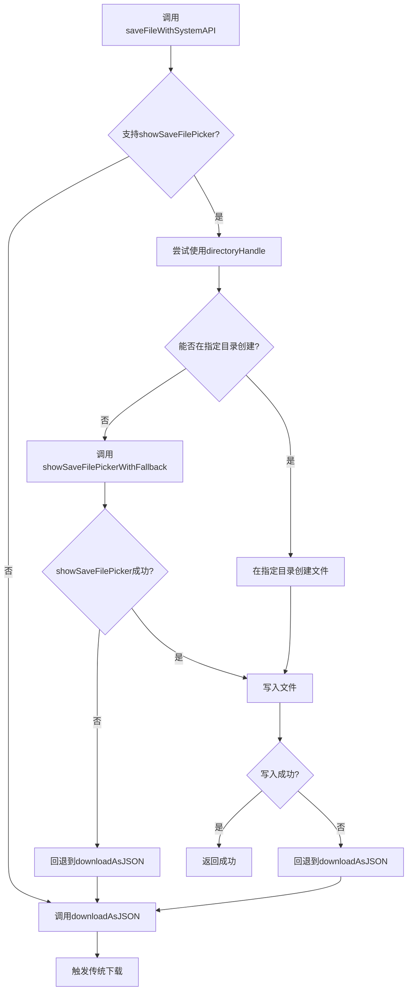

# 文件系统API与下载机制

<cite>
**本文档引用的文件**  
- [dataService.js](file://src/services/dataService.js)
- [ConfigDialog.vue](file://src/model/ConfigDialog.vue)
</cite>

## 目录
1. [技术差异对比](#技术差异对比)
2. [现代文件系统API优势](#现代文件系统api优势)
3. [优雅降级流程](#优雅降级流程)
4. [调用流程图解](#调用流程图解)
5. [浏览器兼容性](#浏览器兼容性)
6. [最佳实践建议](#最佳实践建议)

## 技术差异对比

`saveFileWithSystemAPI`与`downloadAsJSON`是两种不同的文件保存机制，分别代表了现代和传统浏览器文件操作方式。

`saveFileWithSystemAPI`方法利用现代File System Access API，允许用户选择文件保存位置，并支持在指定目录中创建和写入文件。该方法首先检查浏览器是否支持`showSaveFilePicker`，如果支持则使用文件选择器让用户选择保存位置，或通过目录句柄在指定位置创建文件。文件写入过程通过`createWritable`创建可写流，然后写入Blob数据。

`downloadAsJSON`方法采用传统的Blob下载方式，通过创建临时URL和隐藏的a标签触发浏览器下载。这种方法不提供文件位置选择功能，文件会自动保存到浏览器默认下载目录。

两种方法在异常处理上也有显著差异：`saveFileWithSystemAPI`能够捕获`AbortError`（用户取消操作），而`downloadAsJSON`主要处理Blob创建和URL生成过程中的错误。

**Section sources**
- [dataService.js](file://src/services/dataService.js#L102-L121)
- [dataService.js](file://src/services/dataService.js#L130-L173)

## 现代文件系统API优势

现代File System Access API提供了多项传统下载方式无法实现的功能优势。

**指定目录保存**：通过`directoryHandle`参数，`saveFileWithSystemAPI`能够在用户授权的特定目录中直接创建文件，无需用户每次选择保存位置。这对于需要定期备份到固定位置的场景非常有用。

**持久化权限**：一旦用户授予对某个目录的访问权限，应用可以在后续会话中继续访问该目录，无需重复授权。这种持久化访问能力使得自动化备份和文件管理成为可能。

**更好的用户体验**：用户可以精确控制文件保存位置，避免文件散落在默认下载目录中难以查找。文件选择器还支持文件类型过滤（如仅显示JSON文件）和建议文件名。

**原子性操作**：文件写入通过可写流完成，支持分块写入和流式处理，对于大文件操作更加安全可靠。写入完成后才关闭流，确保文件完整性。

**更丰富的错误处理**：能够区分用户取消操作（AbortError）和其他错误，提供更精确的错误反馈和处理策略。

**Section sources**
- [dataService.js](file://src/services/dataService.js#L130-L173)
- [dataService.js](file://src/services/dataService.js#L180-L196)

## 优雅降级流程

当现代API不可用时，系统实现了完善的优雅降级机制，确保功能可用性。

降级流程从`saveFileWithSystemAPI`方法开始，首先检查`window.showSaveFilePicker`是否存在。如果不存在（即浏览器不支持File System Access API），立即回退到`downloadAsJSON`方法。



**Diagram sources**
- [dataService.js](file://src/services/dataService.js#L130-L173)

**Section sources**
- [dataService.js](file://src/services/dataService.js#L130-L173)
- [dataService.js](file://src/services/dataService.js#L180-L196)

## 调用流程图解

`showSaveFilePickerWithFallback`的调用流程体现了现代API与传统方式的无缝集成。

```mermaid
sequenceDiagram
participant 组件 as ConfigDialog.vue
participant 服务 as DataService
participant API as 浏览器API
组件->>服务 : 调用saveFileWithSystemAPI
服务->>服务 : 检查API支持性
服务->>API : 调用showSaveFilePickerWithFallback
API-->>服务 : 返回文件句柄或错误
alt 用户取消
服务-->>组件 : 返回false
else API调用失败
服务->>服务 : 记录警告
服务->>服务 : 调用downloadAsJSON
服务->>API : 创建Blob和临时URL
API-->>服务 : 返回下载结果
服务-->>组件 : 返回结果
end
else 成功获取句柄
服务->>API : createWritable并写入数据
API-->>服务 : 确认写入完成
服务-->>组件 : 返回true
end
```

**Diagram sources**
- [dataService.js](file://src/services/dataService.js#L180-L196)
- [ConfigDialog.vue](file://src/model/ConfigDialog.vue#L602-L653)

**Section sources**
- [dataService.js](file://src/services/dataService.js#L180-L196)

## 浏览器兼容性

File System Access API的浏览器兼容性存在明显限制，需要合理处理兼容性问题。

**支持的主流浏览器版本**：
- Google Chrome 86+（2020年10月发布）
- Microsoft Edge 86+（基于Chromium）
- Opera 72+
- Android WebView 86+

**不支持的浏览器**：
- Safari（所有版本）
- Firefox（所有版本）
- Internet Explorer（所有版本）
- 旧版Edge（非Chromium版本）

通过`isFileSystemAccessSupported`静态方法可以检测API可用性，该方法检查`showSaveFilePicker`和`showDirectoryPicker`是否存在于window对象中。

```javascript
static isFileSystemAccessSupported() {
    return 'showSaveFilePicker' in window && 'showDirectoryPicker' in window
}
```

在实际应用中，系统在`ConfigDialog.vue`中使用此方法决定采用哪种保存策略，确保在不支持的浏览器上自动降级到传统下载方式。

**Section sources**
- [dataService.js](file://src/services/dataService.js#L198-L204)
- [ConfigDialog.vue](file://src/model/ConfigDialog.vue#L602-L653)

## 最佳实践建议

针对企业环境或旧版浏览器用户，建议采用以下最佳实践。

**渐进式增强策略**：始终以传统`downloadAsJSON`为基础功能，将现代API作为增强功能。这样可以确保所有用户都能使用核心功能，同时为支持现代API的用户提供更好的体验。

**明确的用户提示**：在用户界面中明确告知当前使用的保存方式。例如，在支持现代API时提示"文件将保存到您选择的位置"，在降级时提示"文件将下载到默认下载文件夹"。

**错误处理一致性**：保持两种方式的错误处理模式一致，向调用方返回相似的结果格式，避免因实现方式不同而导致上层逻辑复杂化。

**性能考虑**：对于大文件操作，现代API的流式写入可能比传统方式的内存中Blob更高效，但需要考虑不同浏览器的实现差异。

**安全考量**：现代API需要用户明确授权才能访问文件系统，这既是优势也是限制。在企业环境中，可能需要考虑用户权限策略和IT策略限制。

**Section sources**
- [dataService.js](file://src/services/dataService.js#L102-L121)
- [dataService.js](file://src/services/dataService.js#L130-L173)
- [ConfigDialog.vue](file://src/model/ConfigDialog.vue#L602-L653)