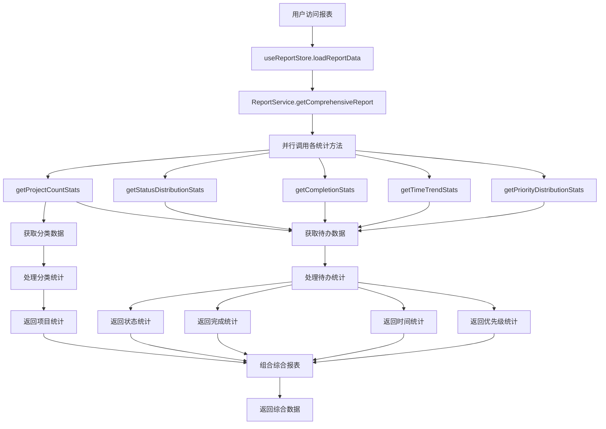
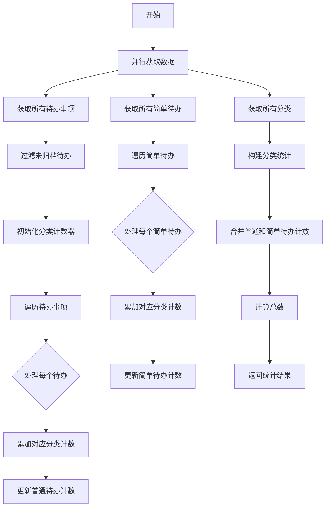
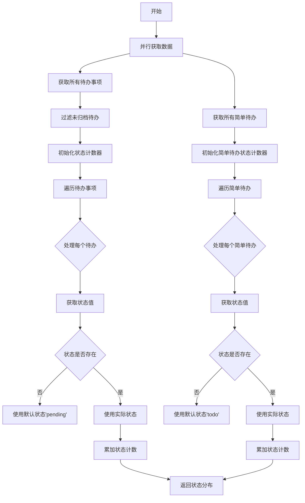
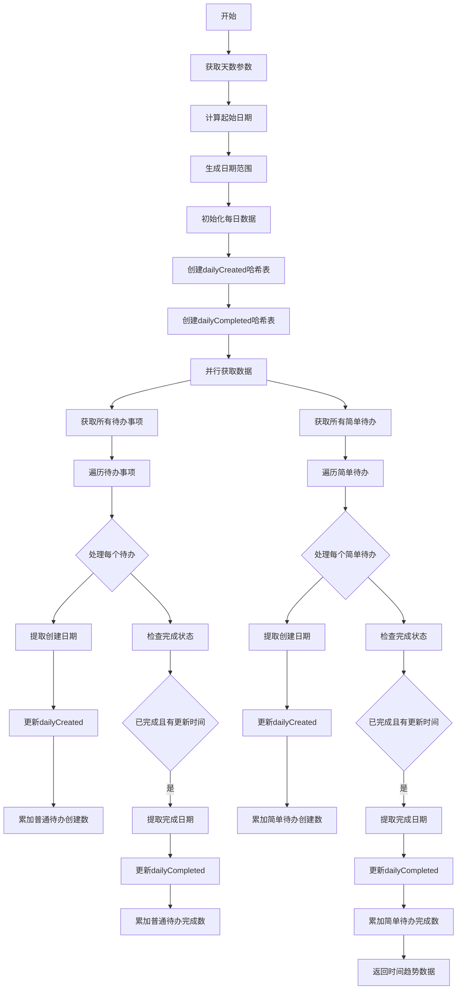
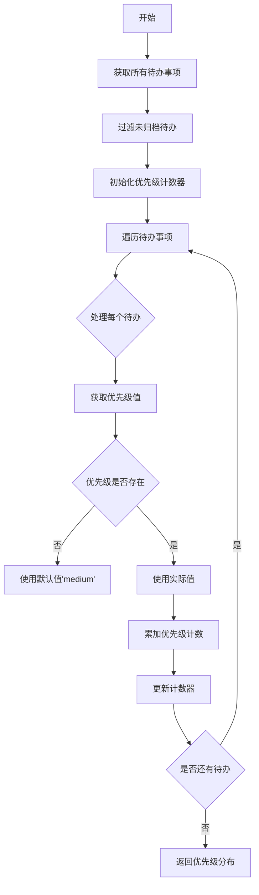
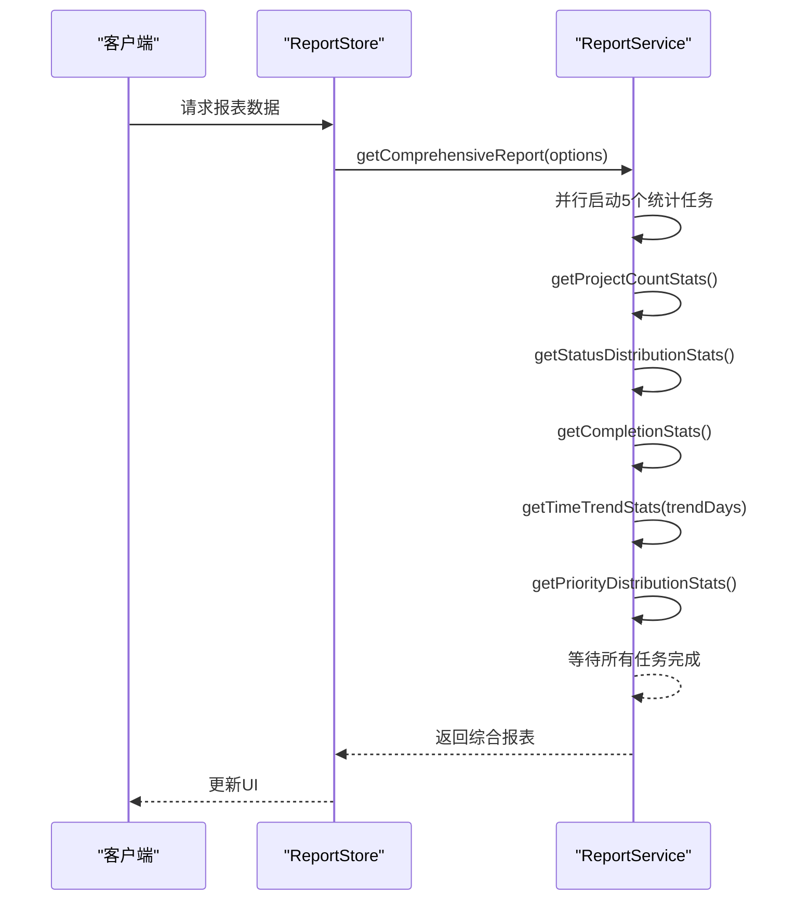
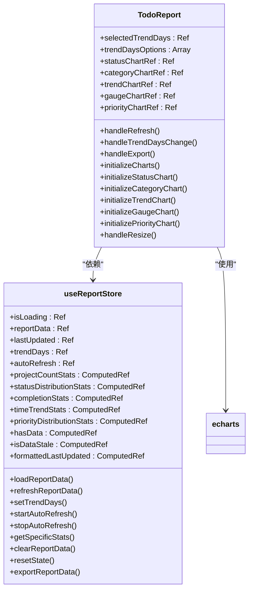

# ReportService 报表统计服务

<cite>
**Referenced Files in This Document**   
- [reportService.js](file://src/services/reportService.js)
- [todoService.js](file://src/services/todoService.js)
- [simpleTodoService.js](file://src/services/simpleTodoService.js)
- [errorHandler.js](file://src/utils/errorHandler.js)
- [TodoReport.vue](file://src/views/tidyDo/components/TodoReport.vue)
- [useReportStore.js](file://src/stores/useReportStore.js)
</cite>

## 目录
1. [简介](#简介)
2. [核心功能分析](#核心功能分析)
3. [项目数量统计](#项目数量统计)
4. [状态分布统计](#状态分布统计)
5. [完成情况统计](#完成情况统计)
6. [时间趋势统计](#时间趋势统计)
7. [优先级分布统计](#优先级分布统计)
8. [综合报表生成](#综合报表生成)
9. [ECharts集成示例](#echarts集成示例)
10. [性能优化策略](#性能优化策略)

## 简介

ReportService 是 TidyDo 应用的核心数据分析引擎，负责提供全面的报表统计功能。该服务通过整合多维度数据，为用户提供项目分布、状态统计、时间趋势等关键指标的可视化分析能力。作为数据聚合中心，ReportService 协调多个数据源，包括普通待办事项、简单待办事项和分类信息，生成统一的报表数据结构。

服务采用静态方法模式实现，所有统计功能均通过静态方法暴露，便于在应用的任何位置调用。每个统计方法都集成了错误处理机制，确保在数据获取失败时能够优雅降级并提供有意义的错误信息。整个服务设计遵循单一职责原则，专注于数据统计和分析，不涉及UI渲染或用户交互逻辑。

**Section sources**
- [reportService.js](file://src/services/reportService.js#L1-L20)

## 核心功能分析

ReportService 提供了五个核心统计功能，分别对应不同的数据分析维度。这些功能通过并行数据获取策略实现高效的数据处理，最大限度减少I/O等待时间。服务通过 `withErrorHandling` 装饰器统一处理异步操作中的异常，确保每个统计方法都具有健壮的错误处理能力。

数据源主要来自三个服务：`TodoItemService` 用于获取普通待办事项，`SimpleTodoService` 用于获取简单待办事项，`CategoryService` 用于获取分类信息。所有数据操作都基于IndexedDB存储，通过idb-keyval库进行持久化管理。这种设计使得报表数据能够离线访问，同时保证了数据的一致性和可靠性。

服务的调用流程通常由 `useReportStore` 状态管理器触发，该store负责管理报表数据的生命周期，包括加载、缓存和刷新。当用户访问报表页面时，store会调用ReportService的综合报表方法，获取最新数据并更新UI。



**Diagram sources**
- [reportService.js](file://src/services/reportService.js#L1-L287)
- [useReportStore.js](file://src/stores/useReportStore.js#L1-L248)

**Section sources**
- [reportService.js](file://src/services/reportService.js#L1-L287)
- [useReportStore.js](file://src/stores/useReportStore.js#L1-L248)

## 项目数量统计

`getProjectCountStats` 方法是报表服务的核心功能之一，负责生成项目分布报表。该方法通过并行获取分类、普通待办和简单待办数据，实现了高效的多源数据整合。数据获取采用 `Promise.all` 并发模式，显著提升了数据加载性能。

方法首先过滤出未归档的活跃待办事项，然后分别按分类统计普通待办和简单待办的数量。统计过程采用哈希表计数模式，通过遍历待办事项列表，累加每个分类ID对应的计数器。这种算法的时间复杂度为O(n)，其中n为待办事项总数，具有良好的性能表现。

分类统计数据不仅包含数量信息，还保留了分类的元数据，如名称、图标和类型标识。这使得前端能够根据分类类型（普通分类、筛选分类、简单待办分类）进行差异化展示。最终返回的数据结构包含总体统计和详细的分类统计，满足了不同层次的分析需求。



**Diagram sources**
- [reportService.js](file://src/services/reportService.js#L17-L79)

**Section sources**
- [reportService.js](file://src/services/reportService.js#L17-L79)
- [todoService.js](file://src/services/todoService.js#L1-L313)
- [simpleTodoService.js](file://src/services/simpleTodoService.js#L1-L216)

## 状态分布统计

`getStatusDistributionStats` 方法专门用于分析待办事项的状态分布情况。该方法分别统计普通待办和简单待办的状态数据，考虑到两者使用不同的状态值体系：普通待办使用 'pending', 'completed' 等状态，而简单待办使用 'todo', 'done' 等状态。

统计逻辑采用对象键值对计数模式，将状态值作为对象的键，计数作为值。对于没有明确状态的待办事项，方法会提供默认状态值（'pending' 或 'todo'），确保数据完整性。这种设计避免了因数据缺失导致的统计偏差，提高了报表的可靠性。

返回的数据结构清晰地区分了两种待办类型的状态统计，同时提供了各自的总数信息。这种分离式设计使得前端可以根据需要选择展示全部数据或特定类型的数据。状态分布数据通常用于饼图或环形图展示，直观反映各类状态的占比情况。



**Diagram sources**
- [reportService.js](file://src/services/reportService.js#L85-L113)

**Section sources**
- [reportService.js](file://src/services/reportService.js#L85-L113)
- [simpleTodoService.js](file://src/services/simpleTodoService.js#L1-L216)

## 完成情况统计

`getCompletionStats` 方法负责计算待办事项的完成率指标，这是衡量任务执行效率的关键KPI。方法采用分层统计策略，分别计算普通待办、简单待办和总体的完成情况，提供多维度的完成率视图。

对于普通待办，完成状态通过 `status === 'completed'` 判断；对于简单待办，则通过 `status === 'done'` 判断。这种差异化处理确保了不同类型待办的完成标准得到正确应用。完成率计算采用标准的百分比公式：(完成数量 / 总数量) × 100，结果保留小数点后一位。

特别地，方法在计算总体完成率时，将普通待办和简单待办视为同一项目体系的不同表现形式，进行统一计算。这种设计反映了TidyDo应用的核心理念——所有待办事项都是项目管理的组成部分。返回的数据结构包含详细的统计信息和计算过程，便于前端进行灵活展示。

```mermaid
flowchart TD
A[开始] --> B[并行获取数据]
B --> C[获取所有待办事项]
B --> D[获取所有简单待办]
C --> E[过滤未归档待办]
E --> F[计算普通待办完成数]
F --> G[完成数=状态为'completed'的数量]
G --> H[计算普通待办完成率]
H --> I[完成率=(完成数/总数)*100]
D --> J[计算简单待办完成数]
J --> K[完成数=状态为'done'的数量]
K --> L[计算简单待办完成率]
L --> M[完成率=(完成数/总数)*100]
I --> N[计算总体完成数]
M --> N
N --> O[总体完成数=普通完成数+简单完成数]
O --> P[计算总体完成率]
P --> Q[总体完成率=(总体完成数/总体总数)*100]
Q --> R[返回完成统计]
```

**Diagram sources**
- [reportService.js](file://src/services/reportService.js#L119-L158)

**Section sources**
- [reportService.js](file://src/services/reportService.js#L119-L158)

## 时间趋势统计

`getTimeTrendStats` 方法实现了时间序列分析功能，用于展示待办事项的创建和完成趋势。方法接受一个可选参数 `days`，默认为30天，允许用户自定义分析的时间范围。

算法首先生成指定天数的日期范围数组，然后初始化两个哈希表：`dailyCreated` 和 `dailyCompleted`，用于存储每日的创建和完成数据。通过遍历所有待办事项，方法根据 `createdAt` 和 `updatedAt` 时间戳，将事项分配到相应的日期桶中。

为了提高查询效率，日期键采用ISO格式的日期字符串（YYYY-MM-DD），便于直接索引。统计过程区分普通待办和简单待办，分别记录其创建和完成趋势，同时维护一个总计字段。这种设计使得前端可以灵活选择展示全部数据或特定类型的数据。



**Diagram sources**
- [reportService.js](file://src/services/reportService.js#L165-L233)

**Section sources**
- [reportService.js](file://src/services/reportService.js#L165-L233)

## 优先级分布统计

`getPriorityDistributionStats` 方法专注于分析待办事项的优先级分布情况。该方法仅处理未归档的普通待办事项，因为简单待办事项不包含优先级字段。

统计过程采用默认值填充策略，对于没有明确优先级的待办事项，默认归类为'medium'（中优先级）。这种设计确保了数据的完整性，避免了因缺失值导致的统计偏差。优先级计数同样使用对象键值对模式，将优先级值作为键，计数作为值。

返回的数据结构简洁明了，包含一个 `priorityStats` 对象和总待办数量。前端通常使用饼图或条形图展示这些数据，直观反映不同优先级事项的分布情况。该统计对于识别任务优先级配置是否合理具有重要参考价值。



**Diagram sources**
- [reportService.js](file://src/services/reportService.js#L239-L253)

**Section sources**
- [reportService.js](file://src/services/reportService.js#L239-L253)

## 综合报表生成

`getComprehensiveReport` 方法是报表服务的入口点，负责聚合所有子报表生成综合分析结果。该方法采用并行聚合策略，通过 `Promise.all` 同时调用所有统计方法，最大化利用多核CPU的并行处理能力。

方法接受一个可选的 `options` 参数，目前主要支持 `trendDays` 配置，允许用户自定义时间趋势分析的范围。这种设计提供了灵活性，用户可以根据需要选择短期或长期的趋势分析。

性能优化方面，`Promise.all` 的使用将原本串行的5次数据获取操作减少为1次并行操作，理论上可将响应时间减少到原来的1/5。考虑到每个统计方法内部也采用了并行数据获取，整体性能提升更为显著。返回的数据结构采用扁平化设计，便于前端直接使用。



**Diagram sources**
- [reportService.js](file://src/services/reportService.js#L260-L285)

**Section sources**
- [reportService.js](file://src/services/reportService.js#L260-L285)
- [useReportStore.js](file://src/stores/useReportStore.js#L1-L248)

## ECharts集成示例

TidyDo应用使用ECharts库实现报表数据的可视化展示。`TodoReport.vue` 组件负责渲染各种图表类型，包括饼图、条形图、折线图和仪表盘。组件通过Pinia store订阅报表数据，实现响应式更新。

每个图表都有独立的初始化函数，如 `initializeStatusChart`、`initializeCategoryChart` 等。这些函数将ReportService返回的原始数据转换为ECharts所需的格式。例如，状态分布数据被转换为包含名称和值的数组，用于饼图展示。

图表配置遵循统一的设计规范，包括工具提示、图例和坐标轴设置。颜色方案与应用的整体UI风格保持一致，确保视觉体验的连贯性。组件还实现了窗口大小自适应功能，通过监听resize事件调整图表尺寸。



**Diagram sources**
- [TodoReport.vue](file://src/views/tidyDo/components/TodoReport.vue#L1-L752)
- [useReportStore.js](file://src/stores/useReportStore.js#L1-L248)

**Section sources**
- [TodoReport.vue](file://src/views/tidyDo/components/TodoReport.vue#L1-L752)

## 性能优化策略

针对大数据量下的统计延迟问题，TidyDo采用了多层次的性能优化策略。首先，通过 `Promise.all` 实现并行数据获取，充分利用现代浏览器的多线程能力。其次，采用数据缓存机制，`useReportStore` 会缓存最近5分钟内的报表数据，避免频繁的重复计算。

对于时间趋势分析，算法采用日期桶聚合模式，将大量细粒度的时间戳数据聚合成日粒度的统计结果，显著减少了前端渲染的数据量。同时，前端实现了虚拟滚动和懒加载技术，只渲染可视区域内的图表，提高页面响应速度。

在数据存储层面，应用使用IndexedDB而非localStorage，前者支持更大的存储容量和更高效的查询性能。对于超大数据集，可以考虑实现分页统计或增量更新机制，只重新计算发生变化的数据部分，而不是全量重新统计。

```mermaid
flowchart TD
    A[性能挑战] --> B[大数据量统计延迟]
    B --> C[并行处理]
    C --> D[Promise.all聚合]
    C --> E[多线程数据获取]
    B --> F[数据缓存]
    F --> G[5分钟缓存策略]
    F --> H[避免重复计算]
    B --> I[数据聚合]
    I --> J[日期桶聚合]
    I --> K[减少渲染数据量]
    B --> L[前端优化]
    L --> M[虚拟滚动]
    L --> N[懒加载]
    B --> O[存储优化]
    O --> P[IndexedDB替代localStorage]
    O --> Q[高效查询]
    B --> R[增量更新]
    R --> S[只计算变化数据]
    R --> T[避免全量重算