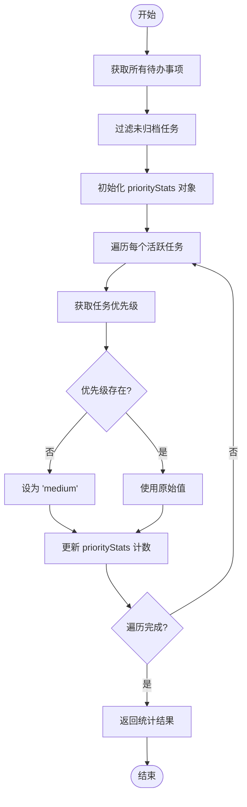
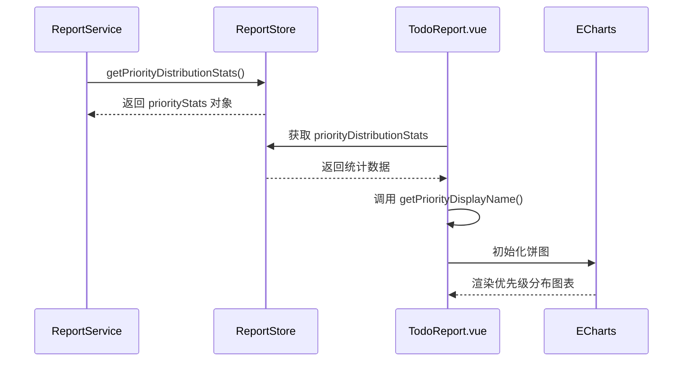

# 优先级分布统计

<cite>
**Referenced Files in This Document**   
- [reportService.js](file://src/services/reportService.js)
- [todoService.js](file://src/services/todoService.js)
- [TodoReport.vue](file://src/views/tidyDo/components/TodoReport.vue)
</cite>

## 目录
1. [方法概述](#方法概述)
2. [数据提取与归一化逻辑](#数据提取与归一化逻辑)
3. [优先级统计机制](#优先级统计机制)
4. [过滤规则](#过滤规则)
5. [图表数据适配示例](#图表数据适配示例)
6. [国际化处理方案](#国际化处理方案)

## 方法概述

`ReportService.getPriorityDistributionStats` 方法是 TidyDo 应用中用于生成优先级分布统计数据的核心功能。该方法通过聚合未归档的普通待办事项（Todo），分析其优先级字段的分布情况，为用户提供直观的优先级分布视图。

**Section sources**
- [reportService.js](file://src/services/reportService.js#L239-L253)

## 数据提取与归一化逻辑

该方法首先从 `TodoItemService` 中获取所有普通待办事项数据，然后对这些数据进行处理。在提取 `priority` 字段时，采用了归一化处理策略：如果待办事项的 `priority` 字段为空或未定义，则自动将其值设为默认的 `'medium'`（中优先级）。这一设计确保了统计结果的完整性，避免了因缺失优先级信息而导致的数据偏差。

该方法的默认值设定逻辑体现了系统对用户体验的考量，保证了即使用户未明确设置优先级，系统仍能提供有意义的统计信息。

**Section sources**
- [reportService.js](file://src/services/reportService.js#L242-L245)
- [todoService.js](file://src/services/todoService.js#L70)

## 优先级统计机制

方法内部通过 `priorityStats` 对象实现累加统计。该对象以优先级等级作为键（key），以对应任务数量作为值（value）。支持的优先级等级包括：`'low'`（低）、`'medium'`（中）、`'high'`（高）和 `'urgent'`（紧急）。当遍历每个活跃待办事项时，系统会根据其优先级值在 `priorityStats` 对象中对应的键上进行累加计数。

这种基于对象的累加机制简单高效，能够快速生成分布统计数据，为后续的可视化展示提供结构化数据支持。

**Diagram sources**
- [reportService.js](file://src/services/reportService.js#L239-L253)

**Section sources**
- [reportService.js](file://src/services/reportService.js#L244-L246)

## 过滤规则

该统计方法严格遵循业务规则，仅对未归档的任务进行分析。通过 `filter(todo => !todo.archived)` 过滤器，系统排除了所有已归档的待办事项。这一过滤规则确保了统计结果反映的是当前活跃工作负载的优先级分布，而非包含历史归档数据的全局视图，从而为用户提供更具实际指导意义的分析结果。

**Section sources**
- [reportService.js](file://src/services/reportService.js#L241)
- [todoService.js](file://src/services/todoService.js#L75)

## 图表数据适配示例

在 `TodoReport.vue` 组件中，`initializePriorityChart` 方法展示了如何将 `getPriorityDistributionStats` 返回的原始数据适配为 ECharts 图表所需的格式。通过 `Object.entries` 将 `priorityStats` 对象转换为数组，并使用 `getPriorityDisplayName` 辅助函数将英文优先级键转换为中文显示名称，最终生成包含 `{name, value}` 结构的图表数据点数组。

**Diagram sources**
- [reportService.js](file://src/services/reportService.js#L239-L253)
- [TodoReport.vue](file://src/views/tidyDo/components/TodoReport.vue#L582-L615)

**Section sources**
- [TodoReport.vue](file://src/views/tidyDo/components/TodoReport.vue#L582-L615)

## 国际化处理方案

TidyDo 通过在视图层实现国际化处理，将优先级的英文键值（如 'low', 'medium'）转换为用户界面显示的本地化标签（如 '低优先级', '中优先级'）。`getPriorityDisplayName` 函数维护了一个映射表，定义了不同语言环境下优先级标签的显示文本。这种方案将数据存储的国际化与用户界面的本地化分离，既保证了数据存储的简洁性，又实现了灵活的多语言支持。

未来可扩展此方案，通过引入 i18n 框架或配置文件，支持更多语言环境，实现更完善的国际化功能。

**Section sources**
- [TodoReport.vue](file://src/views/tidyDo/components/TodoReport.vue#L639-L645)