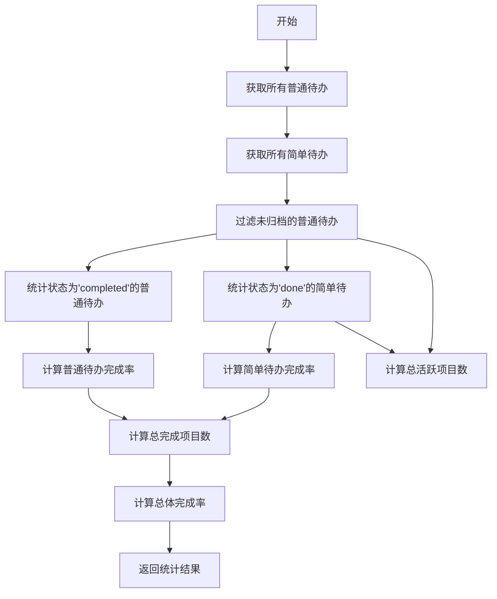

# 完成情况统计

<cite>
**Referenced Files in This Document**   
- [reportService.js](file://src/services/reportService.js)
- [todoService.js](file://src/services/todoService.js)
- [simpleTodoService.js](file://src/services/simpleTodoService.js)
- [TodoReport.vue](file://src/views/tidyDo/components/TodoReport.vue)
</cite>

## 目录
1. [方法概述](#方法概述)
2. [完成率计算逻辑](#完成率计算逻辑)
3. [总体完成率的加权计算](#总体完成率的加权计算)
4. [返回对象结构设计](#返回对象结构设计)
5. [使用案例：完成率趋势对比](#使用案例：完成率趋势对比)
6. [浮点精度与显示格式化](#浮点精度与显示格式化)
7. [跨时区问题与解决方案](#跨时区问题与解决方案)

## 方法概述

`ReportService.getCompletionStats` 方法是 TidyDo 应用中用于计算待办事项完成情况的核心统计功能。该方法通过聚合普通待办（Todo）和简单待办（Simple Todo）两类任务的完成数据，为用户提供全面的进度概览。方法通过并行调用 `TodoItemService.getAll()` 和 `SimpleTodoService.getAll()` 获取所有任务数据，并基于任务状态进行分类统计。

该方法在用户界面的 `TodoReport.vue` 组件中被消费，用于生成完成率仪表盘和相关报表数据，为用户提供直观的进度可视化。

**Section sources**
- [reportService.js](file://src/services/reportService.js#L119-L158)
- [TodoReport.vue](file://src/views/tidyDo/components/TodoReport.vue#L280-L283)

## 完成率计算逻辑

### 普通待办完成率

普通待办的完成率计算基于以下逻辑：
- **分母基数**：所有未归档的普通待办项（`!todo.archived`），通过 `TodoItemService.getAll()` 获取所有待办项后进行过滤。
- **分子（已完成）**：状态字段 `status` 严格等于 `'completed'` 的待办项数量。

计算公式为：  
`todoCompletionRate = (completedTodos / activeTodos.length) * 100`

当活跃待办项数量为零时，完成率返回 0 以避免除零错误。

### 简单待办完成率

简单待办的完成率计算逻辑与普通待办类似，但存在关键差异：
- **分母基数**：所有简单待办项，无论归档状态如何，均被计入总数。
- **分子（已完成）**：状态字段 `status` 严格等于 `'done'` 的简单待办项数量。

计算公式为：  
`simpleTodoCompletionRate = (completedSimpleTodos / simpleTodos.length) * 100`

**Section sources**
- [reportService.js](file://src/services/reportService.js#L128-L137)
- [simpleTodoService.js](file://src/services/simpleTodoService.js#L10-L15)

## 总体完成率的加权计算

总体完成率（`overallCompletionRate`）采用加权平均的方式，综合反映用户所有任务的完成进度。

### 计算方式
- **分母基数**：普通待办和简单待办的总数之和（`totalProjects = activeTodos.length + simpleTodos.length`）。
- **分子（已完成）**：两类任务中已完成项的总数之和（`totalCompleted = completedTodos + completedSimpleTodos`）。

计算公式为：  
`overallCompletionRate = (totalCompleted / totalProjects) * 100`

### 业务意义
这种加权计算方式确保了总体完成率能够真实反映用户整体任务的完成情况，避免了因某一类任务数量极少而对总体指标产生不合理的放大或缩小效应。它为用户提供了一个单一的、综合性的进度指标，便于快速评估整体工作进展。

**Diagram sources**
- [reportService.js](file://src/services/reportService.js#L119-L158)

**Section sources**
- [reportService.js](file://src/services/reportService.js#L140-L146)

## 返回对象结构设计

`getCompletionStats` 方法返回一个结构化的对象，其设计旨在清晰地组织和区分不同维度的统计数据。

### `todoStats` 结构
此嵌套结构专门用于存储普通待办的统计信息：
- `total`: 活跃普通待办的总数。
- `completed`: 已完成的普通待办数量。
- `completionRate`: 计算得出的完成率百分比。

设计目的：将普通待办的统计信息封装在一起，便于前端组件（如 `TodoReport.vue`）直接引用和展示。

### `simpleTodoStats` 结构
此结构与 `todoStats` 对应，但用于简单待办：
- `total`: 所有简单待办的总数。
- `completed`: 已完成的简单待办数量。
- `completionRate`: 简单待办的完成率百分比。

设计目的：实现数据的对称性和一致性，使两种任务类型的统计逻辑在数据结构上保持一致，简化了前端的处理逻辑。

### `overallStats` 结构
此结构提供一个全局视角：
- `total`: 所有任务（普通+简单）的总数。
- `completed`: 所有已完成任务的总数。
- `completionRate`: 加权计算的总体完成率。

设计目的：作为顶层聚合指标，满足用户对“整体进度”的快速查看需求，是仪表盘等UI组件的核心数据源。

**Section sources**
- [reportService.js](file://src/services/reportService.js#L148-L156)

## 使用案例：完成率趋势对比

一个典型的使用案例是通过 `TodoReport.vue` 组件中的完成率仪表盘（`gaugeChart`）来对比普通待办和简单待办的完成率。

1.  **数据获取**：`TodoReport.vue` 组件通过 `useReportStore` 调用 `getCompletionStats` 获取统计数据。
2.  **数据处理**：组件从返回的 `completionStats` 中提取 `overallStats.completionRate`。
3.  **可视化展示**：使用 ECharts 库的仪表盘图表，将总体完成率以直观的指针形式展示出来。
4.  **对比分析**：用户可以同时观察仪表盘上的总体完成率和下方的详细统计卡片，从而对比 `todoStats.completionRate` 和 `simpleTodoStats.completionRate`，分析不同类型任务的完成效率差异。

例如，如果总体完成率很高，但 `todoStats.completionRate` 较低，这可能表明用户倾向于完成简单的任务而忽略了复杂的项目，这为用户提供了改进工作策略的洞察。

**Section sources**
- [TodoReport.vue](file://src/views/tidyDo/components/TodoReport.vue#L280-L283)
- [TodoReport.vue](file://src/views/tidyDo/components/TodoReport.vue#L440-L468)

## 浮点精度与显示格式化

### 浮点精度处理
`getCompletionStats` 方法在计算完成率时，直接返回原始的浮点数值。例如，1/3 的完成率会返回约 `33.333333333333336`。该方法本身不进行精度截断，以保留计算的准确性。

### 显示格式化策略
精度处理和格式化工作被委托给前端展示层，这是一种良好的关注点分离实践。
- **在 `TodoReport.vue` 中**，当显示总体完成率时，使用 `Math.round(reportStore.completionStats?.overallStats?.completionRate || 0)` 对数值进行四舍五入取整。
- **在仪表盘图表中**，使用 `{value}%` 格式化器，ECharts 会自动处理数值的显示。

这种策略的优势在于：
1.  **灵活性**：后端提供精确数据，前端可以根据不同场景（如详细报表 vs. 概览卡片）选择不同的精度。
2.  **性能**：避免了在每次计算时都进行字符串格式化操作。
3.  **可维护性**：格式化规则的修改只需在前端完成，不影响核心业务逻辑。

**Section sources**
- [reportService.js](file://src/services/reportService.js#L130-L131)
- [TodoReport.vue](file://src/views/tidyDo/components/TodoReport.vue#L121-L122)

## 跨时区问题与解决方案

### 潜在问题
`getCompletionStats` 方法本身不直接处理时间，但其依赖的数据源（`TodoItem` 和 `SimpleTodoItem`）包含 `createdAt` 和 `updatedAt` 字段，这些字段以 ISO 8601 字符串（`new Date().toISOString()`）存储。这可能导致以下跨时区问题：
1.  **数据一致性**：当用户在不同时区的设备上创建或更新任务时，`updatedAt` 的时间戳会反映设备的本地时间，可能导致时间线混乱。
2.  **趋势分析偏差**：如果 `getTimeTrendStats` 等方法基于 `updatedAt` 进行统计，时区差异可能导致任务被错误地归入不同的日期。

### 解决方案
1.  **统一时间标准**：确保所有客户端在生成 `createdAt` 和 `updatedAt` 时，都使用 UTC 时间。`new Date().toISOString()` 实际上已经返回 UTC 时间，因此当前实现是正确的。
2.  **前端时区转换**：在前端展示时，使用 `dateUtils.js` 等工具将 UTC 时间戳转换为用户本地时区进行显示，确保用户看到的是符合其习惯的时间。
3.  **后端时间处理**：如果未来引入服务器端，应在服务器端统一处理时间，所有时间戳均以 UTC 存储，并在API响应中明确时区信息。

当前的实现（使用 `toISOString()`）已经是一个良好的实践，因为它避免了本地时间的歧义，主要的挑战在于前端如何正确地解析和展示这些 UTC 时间戳。

**Section sources**
- [todoService.js](file://src/services/todoService.js#L107-L108)
- [simpleTodoService.js](file://src/services/simpleTodoService.js#L24-L25)