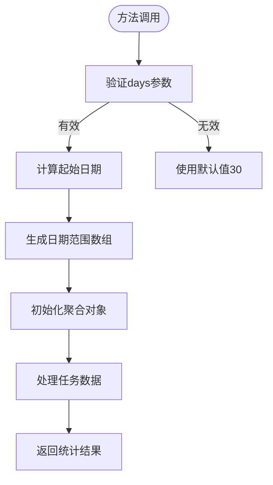
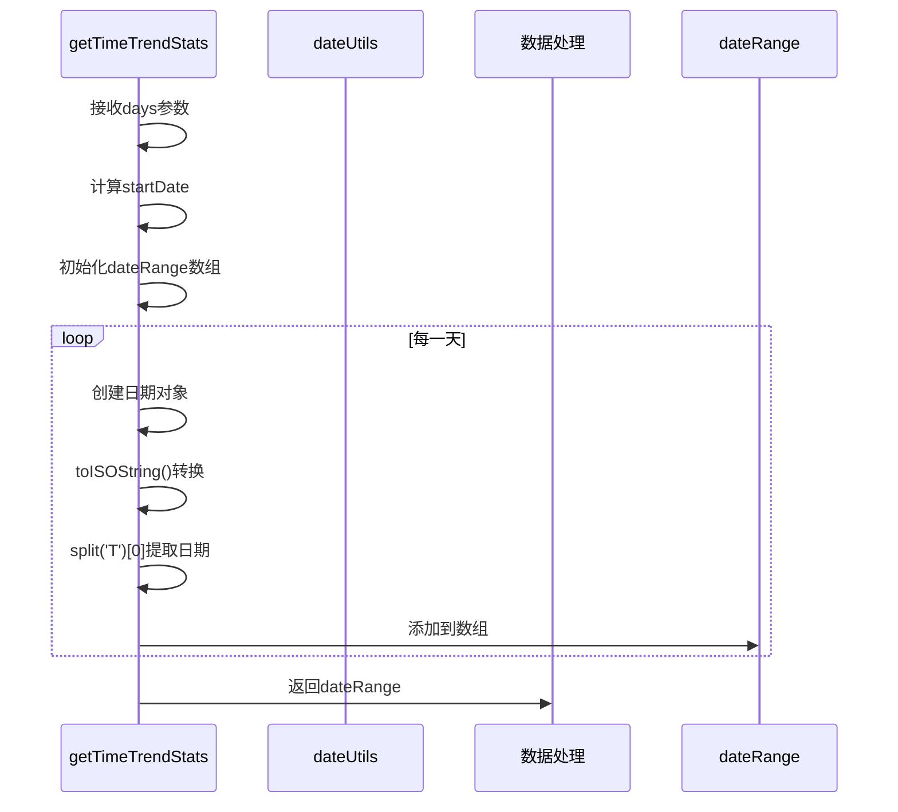
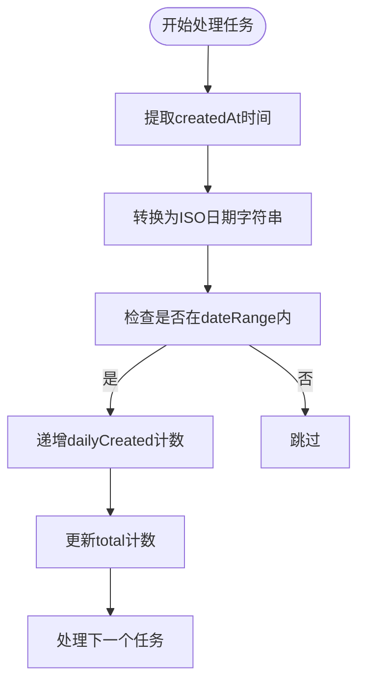
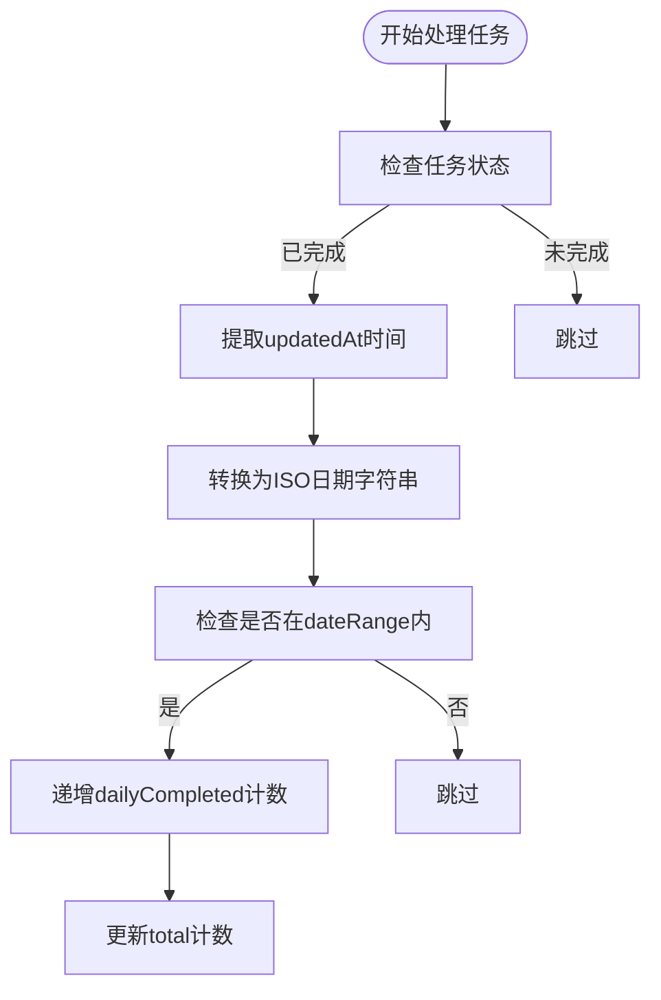
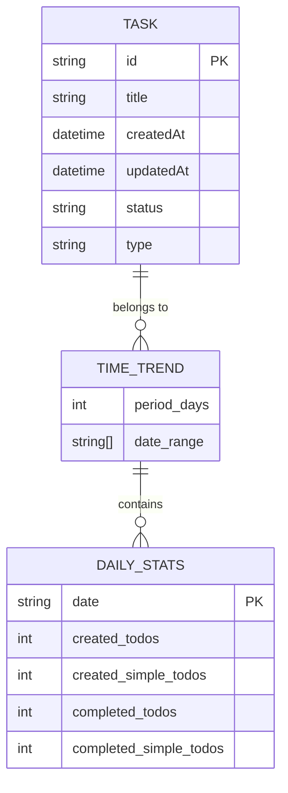
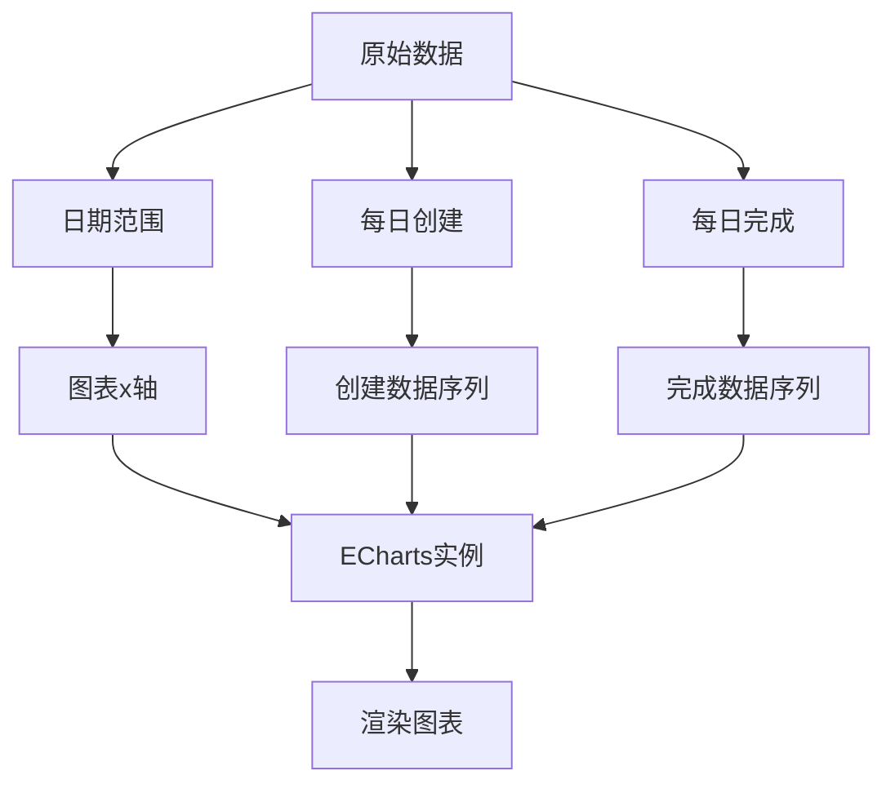

# 时间趋势统计

<cite>
**Referenced Files in This Document**   
- [reportService.js](file://src/services/reportService.js)
- [dateUtils.js](file://src/utils/dateUtils.js)
- [TodoReport.vue](file://src/views/tidyDo/components/TodoReport.vue)
- [useReportStore.js](file://src/stores/useReportStore.js)
</cite>

## 目录
1. [方法概述](#方法概述)
2. [参数机制与默认值](#参数机制与默认值)
3. [日期范围生成逻辑](#日期范围生成逻辑)
4. [数据聚合流程](#数据聚合流程)
5. [时区与边界处理](#时区与边界处理)
6. [图表数据映射](#图表数据映射)
7. [可视化优化策略](#可视化优化策略)

## 方法概述

`ReportService.getTimeTrendStats` 方法是 TidyDo 应用中用于生成时间序列统计的核心功能。该方法通过分析用户任务的创建和完成时间，提供可视化所需的时间趋势数据。其主要职责是聚合指定时间段内的任务创建与完成情况，为前端图表组件提供结构化数据支持。

该方法作为报表系统的一部分，与 `useReportStore` 状态管理器和 `TodoReport.vue` 视图组件协同工作，形成完整的数据流：从数据获取、状态管理到最终的可视化呈现。整个过程体现了典型的分层架构设计模式。

**Section sources**
- [reportService.js](file://src/services/reportService.js#L165-L233)
- [useReportStore.js](file://src/stores/useReportStore.js#L100-L115)
- [TodoReport.vue](file://src/views/tidyDo/components/TodoReport.vue#L280-L315)

## 参数机制与默认值

### days 参数作用机制

`days` 参数是 `getTimeTrendStats` 方法的核心输入参数，用于指定统计的时间跨度。该参数直接决定了分析窗口的大小，影响着返回数据的时间粒度和覆盖范围。

当方法被调用时，`days` 参数首先用于计算统计的起始日期。通过从当前时间减去 `days` 天数，确定分析窗口的起点。这个参数的值还决定了 `dateRange` 数组的长度，以及 `dailyCreated` 和 `dailyCompleted` 聚合对象中需要初始化的日期键数量。



**Diagram sources**
- [reportService.js](file://src/services/reportService.js#L165-L182)

### 默认值设定

该方法为 `days` 参数设置了明确的默认值：30天。这一设定通过 JavaScript 的默认参数语法实现，即 `async (days = 30)`。选择30天作为默认值是基于用户体验和数据分析的最佳实践考虑：

1. **月度分析视角**：30天接近一个自然月，便于用户进行月度绩效回顾和趋势分析
2. **性能平衡**：在提供足够分析深度的同时，避免因过长的时间跨度导致性能下降
3. **数据稀疏性管理**：较短的时间窗口有助于确保数据点的密度，提高图表的可读性

这一默认值可以在调用时被覆盖，允许用户根据具体需求选择不同的分析周期，如7天（周度分析）、90天（季度分析）或365天（年度分析）。

**Section sources**
- [reportService.js](file://src/services/reportService.js#L165)
- [TodoReport.vue](file://src/views/tidyDo/components/TodoReport.vue#L47-L53)

## 日期范围生成逻辑

### startDate 计算

`startDate` 的生成基于当前时间和 `days` 参数的精确计算。实现逻辑如下：

```javascript
const now = new Date()
const startDate = new Date(now.getTime() - days * 24 * 60 * 60 * 1000)
```

此计算过程将天数转换为毫秒数，然后从当前时间戳中减去，得到精确的起始时间点。这种基于时间戳的计算方式确保了跨日历边界（如月份、年份变化）时的准确性。

### dateRange 生成

`dateRange` 数组通过循环生成，覆盖从 `startDate` 开始的连续 `days` 天。每个日期元素都经过 ISO 8601 标准化处理：

```javascript
dateRange.push(date.toISOString().split('T')[0])
```

这一处理过程包含两个关键步骤：
1. `toISOString()` 将日期对象转换为标准的 ISO 8601 格式字符串（如 "2023-12-01T00:00:00.000Z"）
2. `split('T')[0]` 提取日期部分，去除时间信息，得到纯日期字符串（如 "2023-12-01"）

这种标准化处理确保了日期键的一致性，便于后续的数据聚合和比较操作。



**Diagram sources**
- [reportService.js](file://src/services/reportService.js#L179-L187)
- [dateUtils.js](file://src/utils/dateUtils.js#L280-L290)

## 数据聚合流程

### 聚合对象初始化

`dailyCreated` 和 `dailyCompleted` 两个聚合对象的初始化是通过遍历 `dateRange` 数组完成的。对于 `dateRange` 中的每一个日期字符串，都会在两个聚合对象中创建对应的键值对：

```javascript
dateRange.forEach(date => {
  dailyCreated[date] = { todos: 0, simpleTodos: 0, total: 0 }
  dailyCompleted[date] = { todos: 0, simpleTodos: 0, total: 0 }
})
```

这种预初始化策略确保了即使某天没有创建或完成任务，该日期在结果中也会有对应的条目（计数为0），从而保证了时间序列的连续性和完整性。

### 数据填充流程

数据填充过程分为两个主要阶段，分别处理普通任务和简单任务：

#### 创建时间统计

对于每个任务，系统提取其 `createdAt` 时间戳，转换为 ISO 日期字符串，并在 `dailyCreated` 对象中对应日期的计数器上递增：



#### 完成时间统计

完成时间的统计更为复杂，需要同时检查任务状态和 `updatedAt` 时间戳：



这种双重验证机制确保了只有真正完成的任务才会被计入完成统计，避免了数据污染。

**Section sources**
- [reportService.js](file://src/services/reportService.js#L189-L228)

## 时区与边界处理

### 跨天数据边界

该方法通过严格的日期字符串匹配来处理跨天数据边界问题。由于所有日期都被标准化为 "YYYY-MM-DD" 格式，不包含具体时间信息，因此任何在同一天内创建或完成的任务都会被正确归类到相应的日期桶中。

这种方法虽然简单有效，但也存在一定的局限性：它无法区分同一天内不同时段的活动模式。对于需要更精细时间分析的场景，可能需要扩展为小时级或更细粒度的统计。

### 时区偏移问题

当前实现存在潜在的时区偏移问题。由于 `new Date()` 和 `toISOString()` 方法都基于浏览器的本地时区，不同用户的统计结果可能会因时区差异而出现偏差。

例如，一个位于东八区的用户在午夜前创建的任务，可能会被记录为比UTC时间早8小时的日期。这在多用户协作环境中可能导致数据不一致。

解决方案建议：
1. 在数据存储时统一使用UTC时间
2. 在前端显示时根据用户时区进行转换
3. 或在统计计算时明确指定时区上下文



**Diagram sources**
- [reportService.js](file://src/services/reportService.js#L165-L233)
- [dateUtils.js](file://src/utils/dateUtils.js#L280-L290)

## 图表数据映射

### 数据结构转换

`TodoReport.vue` 组件中的 `initializeTrendChart` 方法负责将 `getTimeTrendStats` 返回的原始数据转换为 ECharts 所需的格式：

```javascript
const dates = trendData.dateRange
const createdData = dates.map(date => trendData.dailyCreated[date]?.total || 0)
const completedData = dates.map(date => trendData.dailyCompleted[date]?.total || 0)
```

这一转换过程保持了时间序列的顺序性，确保图表的 x 轴能够正确反映时间的先后顺序。

### 可视化配置

ECharts 配置中包含了多项优化设置：
- `smooth: true`：启用平滑曲线，使趋势变化更加直观
- 自定义颜色方案：使用绿色表示创建，橙色表示完成，符合用户心理预期
- x 轴标签格式化：将 ISO 日期转换为更易读的 "M/D" 格式



**Diagram sources**
- [TodoReport.vue](file://src/views/tidyDo/components/TodoReport.vue#L325-L355)
- [reportService.js](file://src/services/reportService.js#L229-L233)

## 可视化优化策略

### 数据稀疏性处理

当用户选择较长的时间跨度（如365天）而任务数量较少时，可能会出现数据稀疏问题。当前实现通过以下方式缓解：

1. **预初始化所有日期**：确保时间轴的连续性，避免图表出现断裂
2. **零值填充**：没有活动的日期显示为零值，保持时间序列的完整性

### 建议的优化策略

为进一步提升稀疏数据的可视化效果，建议实施以下优化：

1. **动态粒度调整**：
   - 当时间跨度超过一定阈值时，自动将日粒度聚合为周或月粒度
   - 实现多级时间缩放功能，允许用户在不同粒度间切换

2. **插值算法**：
   - 对于连续的零值区间，可以考虑使用线性插值或移动平均来平滑趋势线
   - 添加数据密度指示器，帮助用户识别数据稀疏区域

3. **交互式探索**：
   - 实现缩放和平移功能，允许用户聚焦于特定时间段
   - 添加数据点悬停提示，显示详细的统计信息

4. **补充统计指标**：
   - 在稀疏区域显示平均值或趋势线，提供额外的参考信息
   - 添加数据质量提示，告知用户统计结果的置信度

这些优化策略将显著提升长时间跨度下数据可视化的效果和用户体验。

**Section sources**
- [TodoReport.vue](file://src/views/tidyDo/components/TodoReport.vue#L325-L355)
- [useReportStore.js](file://src/stores/useReportStore.js#L60-L65)