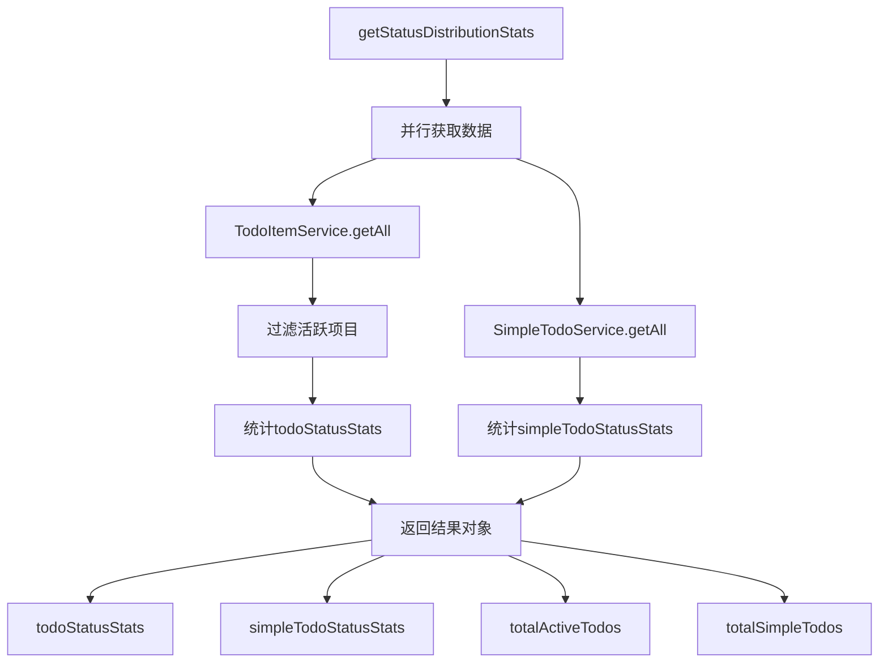
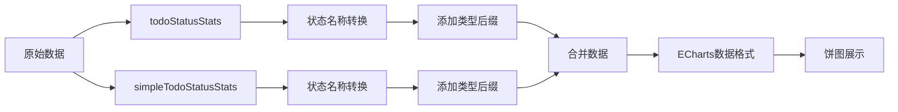

# 状态分布统计

<cite>
**Referenced Files in This Document**   
- [reportService.js](file://src/services/reportService.js#L85-L113)
- [todoService.js](file://src/services/todoService.js#L233-L236)
- [simpleTodoService.js](file://src/services/simpleTodoService.js#L38-L41)
- [createTodoItem](file://src/services/todoService.js#L52-L76)
- [createSimpleTodoItem](file://src/services/simpleTodoService.js#L15-L27)
- [TodoReport.vue](file://src/views/tidyDo/components/TodoReport.vue#L270-L330)
- [useReportStore.js](file://src/stores/useReportStore.js#L20-L25)
</cite>

## 目录
1. [方法概述](#方法概述)
2. [数据提取与分类逻辑](#数据提取与分类逻辑)
3. [统计对象结构分析](#统计对象结构分析)
4. [默认值处理机制](#默认值处理机制)
5. [图表数据适配示例](#图表数据适配示例)
6. [状态命名一致性分析](#状态命名一致性分析)
7. [总结与建议](#总结与建议)

## 方法概述

`ReportService.getStatusDistributionStats` 方法是 TidyDo 应用中用于获取待办事项状态分布统计数据的核心功能。该方法通过并行调用两个数据服务，分别获取普通待办事项和简单待办事项的完整数据集，然后对这些数据进行分类统计，最终返回一个包含详细状态分布信息的对象。

该方法的主要职责是为报表界面提供状态分布数据，支持用户了解不同类型待办事项的状态构成情况。其设计体现了清晰的职责分离原则，将数据获取与统计逻辑集中在一个服务方法中，便于维护和测试。

**Section sources**
- [reportService.js](file://src/services/reportService.js#L85-L113)

## 数据提取与分类逻辑

`getStatusDistributionStats` 方法首先通过 `Promise.all` 并行调用 `TodoItemService.getAll()` 和 `SimpleTodoService.getAll()` 方法，同时获取普通待办和服务待办的全部数据。这种并行调用方式有效减少了数据获取的总耗时，提高了方法的执行效率。

对于普通待办事项，方法会过滤掉已归档的项目，仅统计活跃项目的状态分布。这一过滤逻辑确保了统计结果只反映当前需要关注的待办事项状态。普通待办事项的状态字段使用 `pending/completed` 命名体系，分别代表"待办"和"已完成"状态。

对于简单待办事项，方法直接统计所有项目的状态分布，不进行归档过滤。简单待办事项的状态字段采用 `todo/done` 命名体系，分别对应"待办"和"已完成"状态。这种不同的命名体系反映了两种待办类型在业务语义上的差异。

**Section sources**
- [reportService.js](file://src/services/reportService.js#L85-L113)
- [todoService.js](file://src/services/todoService.js#L233-L236)
- [simpleTodoService.js](file://src/services/simpleTodoService.js#L38-L41)

## 统计对象结构分析

该方法返回两个核心统计对象：`todoStatusStats` 和 `simpleTodoStatusStats`，它们采用相同的键值结构来表示状态分布。

`todoStatusStats` 对象的键对应普通待办事项的状态值，包括 `pending`（待办）、`completed`（已完成）等。其值为对应状态的项目数量。例如，`{ "pending": 15, "completed": 8 }` 表示有15个待办项目和8个已完成项目。

`simpleTodoStatusStats` 对象的键对应简单待办事项的状态值，包括 `todo`（待办）、`doing`（进行中）、`done`（已完成）和 `paused`（暂停）等。其值同样为对应状态的项目数量。例如，`{ "todo": 12, "done": 5, "doing": 3 }` 表示有12个待办、5个已完成和3个进行中的简单待办项目。

这两个对象的结构设计体现了键值映射的简洁性，使得状态统计结果易于遍历和处理，同时也便于前端界面进行数据展示。

**Diagram sources**
- [reportService.js](file://src/services/reportService.js#L85-L113)

**Section sources**
- [reportService.js](file://src/services/reportService.js#L85-L113)
- [createTodoItem](file://src/services/todoService.js#L52-L76)
- [createSimpleTodoItem](file://src/services/simpleTodoService.js#L15-L27)

## 默认值处理机制

该方法实现了健壮的默认值处理机制，以应对数据完整性问题。当待办事项对象缺少状态字段时，方法会自动应用默认状态值，确保统计结果的完整性。

对于普通待办事项，如果 `status` 字段不存在或为 `null`/`undefined`，则默认使用 `'pending'` 作为其状态值。这一逻辑通过表达式 `const status = todo.status || 'pending'` 实现，利用 JavaScript 的逻辑或运算符特性。

对于简单待办事项，如果 `status` 字段缺失，则默认使用 `'todo'` 作为其状态值，通过 `const status = todo.status || 'todo'` 实现。这种默认值策略确保了即使部分数据存在缺陷，统计结果仍然准确可靠。

该机制的设计考虑到了数据迁移、用户操作异常等可能导致状态字段缺失的场景，体现了代码的健壮性和容错能力。

**Section sources**
- [reportService.js](file://src/services/reportService.js#L85-L113)

## 图表数据适配示例

在 `TodoReport.vue` 组件中，`getStatusDistributionStats` 方法的返回结果被适配为 ECharts 图表所需的数据格式。这一适配过程通过 `initializeStatusChart` 函数实现，展示了如何将原始统计结果转换为可视化数据。

适配过程首先创建一个空数组 `combinedData`，然后遍历 `todoStatusStats` 对象的每个键值对，将状态名称转换为中文显示名称，并添加"(Todo)"后缀以区分类型，最后将 `{ name: 显示名称, value: 数量 }` 对象添加到数组中。

接着，适配过程遍历 `simpleTodoStatusStats` 对象的每个键值对，同样进行中文名称转换，并添加"(简单)"后缀，然后将转换后的对象添加到 `combinedData` 数组中。

最终，这个合并的数据数组被用作 ECharts 饼图的 `series.data` 属性，实现了两种待办类型状态分布的统一展示。这种数据适配模式既保持了数据的语义清晰性，又满足了可视化组件的需求。

**Diagram sources**
- [TodoReport.vue](file://src/views/tidyDo/components/TodoReport.vue#L270-L330)

**Section sources**
- [TodoReport.vue](file://src/views/tidyDo/components/TodoReport.vue#L270-L330)

## 状态命名一致性分析

当前系统存在状态命名不一致的问题，这可能对代码维护和用户体验产生负面影响。普通待办事项使用 `pending/completed` 命名体系，而简单待办事项使用 `todo/done` 命名体系，尽管它们在业务语义上表示相同的状态。

这种命名差异可能导致开发人员在处理状态逻辑时产生混淆，增加出错的可能性。例如，开发人员可能错误地将 `pending` 与 `done` 进行比较，或者在状态转换逻辑中使用不一致的条件判断。

从用户体验角度看，不一致的命名可能使用户难以理解系统状态的统一逻辑。虽然前端界面通过 `getStatusDisplayName` 和 `getSimpleTodoStatusDisplayName` 辅助函数将不同命名映射到相同的中文显示名称，但这只是掩盖了底层的不一致性。

未来标准化建议包括：统一采用 `todo/done` 命名体系，因为它更简洁直观；或者建立一个状态映射层，将所有状态名称标准化为统一的枚举值；在代码中使用常量定义状态值，避免魔法字符串的使用。

**Section sources**
- [reportService.js](file://src/services/reportService.js#L85-L113)
- [TodoReport.vue](file://src/views/tidyDo/components/TodoReport.vue#L680-L705)
- [useReportStore.js](file://src/stores/useReportStore.js#L20-L25)

## 总结与建议

`ReportService.getStatusDistributionStats` 方法实现了高效的状态分布统计功能，通过并行数据获取、清晰的分类逻辑和健壮的默认值处理，为报表系统提供了可靠的数据支持。其返回的 `todoStatusStats` 和 `simpleTodoStatusStats` 对象结构简洁，易于使用和扩展。

建议未来版本中解决状态命名不一致的问题，通过统一状态命名体系或引入状态映射层来提高代码的一致性和可维护性。同时，可以考虑在方法中添加更多的统计维度，如按分类、优先级等进行状态分布统计，以提供更丰富的报表信息。

此外，建议在方法文档中明确说明状态命名的差异及其处理方式，帮助开发人员正确理解和使用该方法。通过这些改进，可以进一步提升系统的整体质量和用户体验。