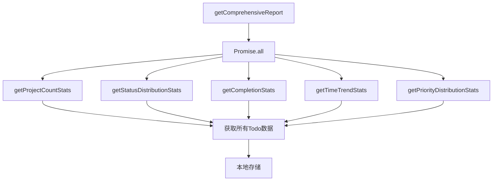
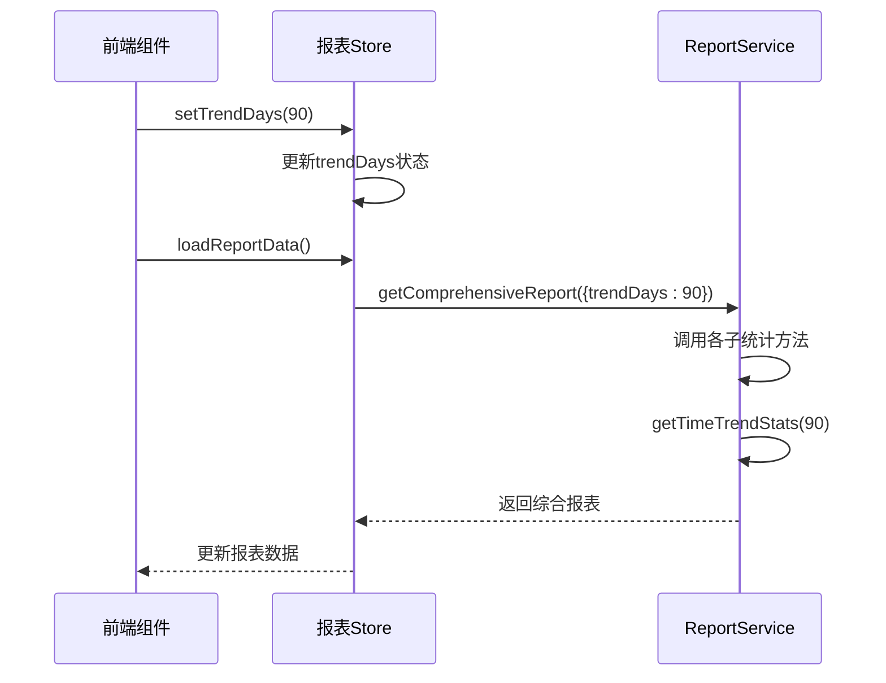
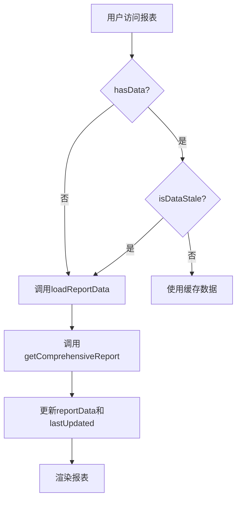

# 综合报表生成

<cite>
**Referenced Files in This Document**   
- [reportService.js](file://src/services/reportService.js)
- [TodoReport.vue](file://src/views/tidyDo/components/TodoReport.vue)
- [useReportStore.js](file://src/stores/useReportStore.js)
- [todoService.js](file://src/services/todoService.js)
- [simpleTodoService.js](file://src/services/simpleTodoService.js)
</cite>

## 目录
1. [方法概述](#方法概述)
2. [并行调用机制](#并行调用机制)
3. [参数传递与时间趋势统计](#参数传递与时间趋势统计)
4. [综合报表结构解析](#综合报表结构解析)
5. [时间戳与缓存策略](#时间戳与缓存策略)
6. [前端调用模式](#前端调用模式)
7. [性能瓶颈与优化建议](#性能瓶颈与优化建议)

## 方法概述

`ReportService.getComprehensiveReport` 方法是 TidyDo 应用的核心报表生成接口，负责整合多个维度的统计信息，为用户提供全面的数据洞察。该方法通过调用多个子统计方法，收集项目数量、状态分布、完成情况、时间趋势和优先级分布等关键指标，最终生成一个结构化的综合报表对象。

该方法采用异步编程模式，返回一个 Promise 对象，确保在数据获取完成后再进行后续处理。方法签名中定义了 `options` 参数，允许调用者传递配置选项，其中 `trendDays` 是一个关键参数，用于控制时间趋势分析的时间范围。

**Section sources**
- [reportService.js](file://src/services/reportService.js#L260-L285)

## 并行调用机制

`getComprehensiveReport` 方法的核心性能优势在于其使用 `Promise.all` 实现的并行调用机制。该方法同时发起五个独立的异步统计请求，而不是按顺序执行，从而显著减少了整体响应时间。

**Diagram sources**
- [reportService.js](file://src/services/reportService.js#L260-L285)

**Section sources**
- [reportService.js](file://src/services/reportService.js#L260-L285)

这五个子方法分别是：
- `getProjectCountStats`: 获取项目数量统计
- `getStatusDistributionStats`: 获取状态分布统计
- `getCompletionStats`: 获取完成情况统计
- `getTimeTrendStats`: 获取时间趋势统计
- `getPriorityDistributionStats`: 获取优先级分布统计

每个子方法都独立地从数据存储中获取所需数据。值得注意的是，这些方法中的大多数都需要调用 `TodoItemService.getAll()` 和 `SimpleTodoService.getAll()` 来获取基础数据。由于这些数据获取操作是并行执行的，因此 `getAll` 方法会被同时调用多次。这种设计虽然提高了响应速度，但也带来了潜在的性能问题，即对数据存储的重复读取。

## 参数传递与时间趋势统计

`getComprehensiveReport` 方法接受一个 `options` 对象作为参数，其中包含 `trendDays` 配置项，用于控制时间趋势分析的时间范围。该参数的传递机制如下：

**Diagram sources**
- [reportService.js](file://src/services/reportService.js#L260-L285)
- [useReportStore.js](file://src/stores/useReportStore.js#L100-L110)
- [TodoReport.vue](file://src/views/tidyDo/components/TodoReport.vue#L335-L350)

**Section sources**
- [reportService.js](file://src/services/reportService.js#L260-L285)
- [useReportStore.js](file://src/stores/useReportStore.js#L100-L110)
- [TodoReport.vue](file://src/views/tidyDo/components/TodoReport.vue#L335-L350)

`options` 参数中的 `trendDays` 默认值为 30 天，表示分析过去 30 天的数据趋势。当调用者传入自定义值时，该值会被传递给 `getTimeTrendStats` 方法。`getTimeTrendStats` 方法根据指定的天数生成日期范围，并统计每天创建和完成的项目数量。用户可以通过前端界面选择不同的时间范围（7天、30天、90天、180天、365天），系统会相应地调整 `trendDays` 的值，从而影响时间趋势图表的展示。

## 综合报表结构解析

`getComprehensiveReport` 方法返回的综合报表是一个结构化的 JavaScript 对象，包含多个嵌套的子对象，每个子对象代表一个维度的统计结果。报表的结构如下表所示：

| 属性名 | 类型 | 描述 | 子属性 |
|-------|------|------|-------|
| projectCount | Object | 项目数量统计 | totalProjects, totalCategories, categoryStats等 |
| statusDistribution | Object | 状态分布统计 | todoStatusStats, simpleTodoStatusStats等 |
| completion | Object | 完成情况统计 | todoStats, simpleTodoStats, overallStats等 |
| timeTrend | Object | 时间趋势统计 | dateRange, dailyCreated, dailyCompleted, period |
| priorityDistribution | Object | 优先级分布统计 | priorityStats, totalTodos |
| generatedAt | String | 报表生成时间戳 | ISO 8601格式 |

**Section sources**
- [reportService.js](file://src/services/reportService.js#L260-L285)

这些子对象之间存在清晰的逻辑关系。`projectCount` 提供了项目和分类的总体数量信息，`statusDistribution` 和 `priorityDistribution` 分别从状态和优先级两个维度对项目进行分类统计，`completion` 计算了各类项目的完成率，而 `timeTrend` 则提供了时间维度上的动态变化。这些数据共同构成了一个多维度的项目管理视图，帮助用户全面了解任务的执行情况。

## 时间戳与缓存策略

综合报表中的 `generatedAt` 字段是一个 ISO 8601 格式的时间戳，记录了报表生成的具体时间。这个时间戳在前端缓存策略中扮演着关键角色。

前端的 `useReportStore` 使用 `lastUpdated` 状态来记录最后一次成功加载报表的时间。通过比较当前时间和 `lastUpdated` 时间，系统可以判断数据是否过期。在 TidyDo 应用中，数据过期的阈值被设定为 5 分钟。

**Diagram sources**
- [useReportStore.js](file://src/stores/useReportStore.js#L45-L55)
- [reportService.js](file://src/services/reportService.js#L280-L285)

**Section sources**
- [useReportStore.js](file://src/stores/useReportStore.js#L45-L55)

当用户访问报表页面时，系统首先检查是否存在已加载的数据（`hasData`）。如果存在，则进一步检查数据是否过期（`isDataStale`）。只有当数据不存在或已过期时，才会发起新的 API 调用。这种缓存策略有效减少了对后端服务的重复请求，提升了用户体验和系统性能。

## 前端调用模式

`getComprehensiveReport` 方法在首页仪表盘的典型调用模式是通过 Pinia 状态管理库的 `useReportStore` 进行封装的。前端组件 `TodoReport.vue` 不直接调用服务方法，而是通过调用 Store 中的 `loadReportData` 或 `refreshReportData` 方法来间接获取数据。

这种模式实现了关注点分离，将数据获取逻辑与 UI 渲染逻辑解耦。Store 负责管理数据状态、处理缓存和错误，而组件则专注于数据的展示。用户可以通过界面上的“刷新”按钮触发 `refreshReportData`，或通过下拉菜单选择不同的趋势分析天数来动态调整报表内容。

**Section sources**
- [useReportStore.js](file://src/stores/useReportStore.js#L100-L110)
- [TodoReport.vue](file://src/views/tidyDo/components/TodoReport.vue#L335-L350)

## 性能瓶颈与优化建议

尽管 `Promise.all` 的并行调用机制提升了性能，但当前实现仍存在明显的性能瓶颈。主要问题在于五个子统计方法都独立调用了 `TodoItemService.getAll()` 和 `SimpleTodoService.getAll()`，导致对本地存储的重复读取。在高并发请求下，这可能会成为性能瓶颈。

### 性能瓶颈分析

1. **重复数据读取**：每个子方法都独立获取全部数据，造成资源浪费。
2. **高并发压力**：大量并发请求可能导致存储访问竞争。
3. **内存占用**：重复的数据副本增加了内存消耗。

### 缓存优化建议

1. **引入数据层缓存**：在 `todoService` 层面实现数据缓存，确保 `getAll()` 方法在短时间内多次调用时，只进行一次实际的存储读取。
2. **批量数据获取**：修改子方法，使其能够共享基础数据，避免重复获取。
3. **服务端缓存**：对于更复杂的场景，可以考虑在服务端实现报表缓存，定期生成并存储报表结果，减少实时计算的压力。

通过这些优化措施，可以在保持高性能的同时，进一步提升系统的稳定性和可扩展性。