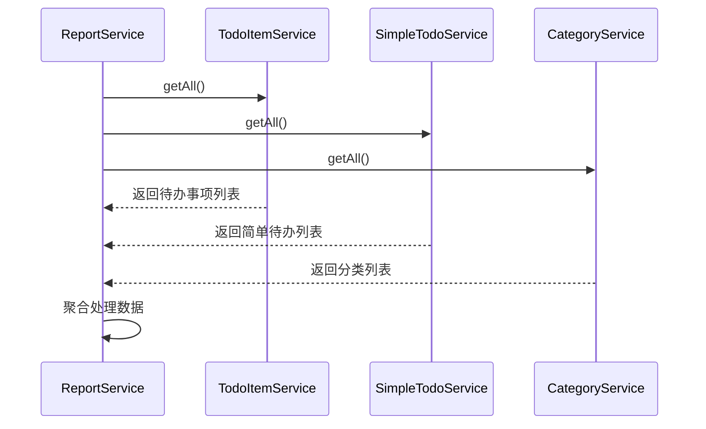
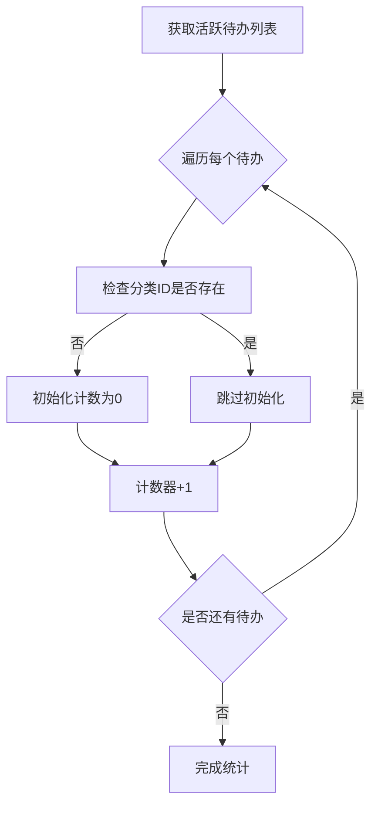
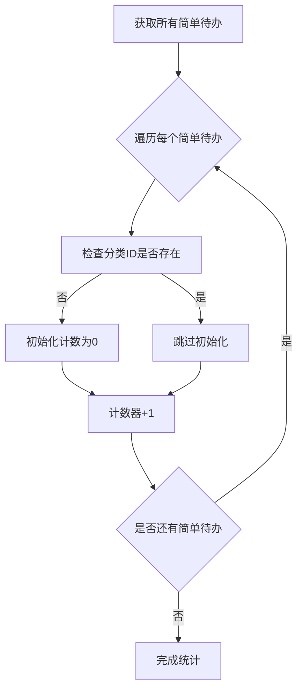
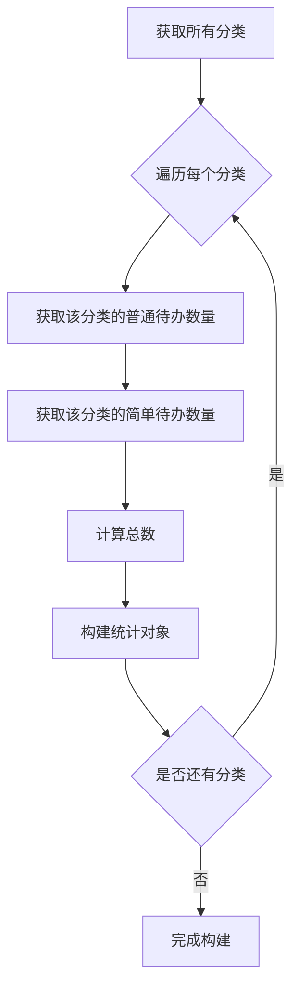
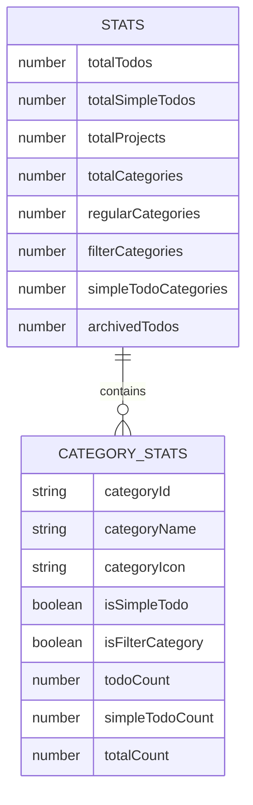
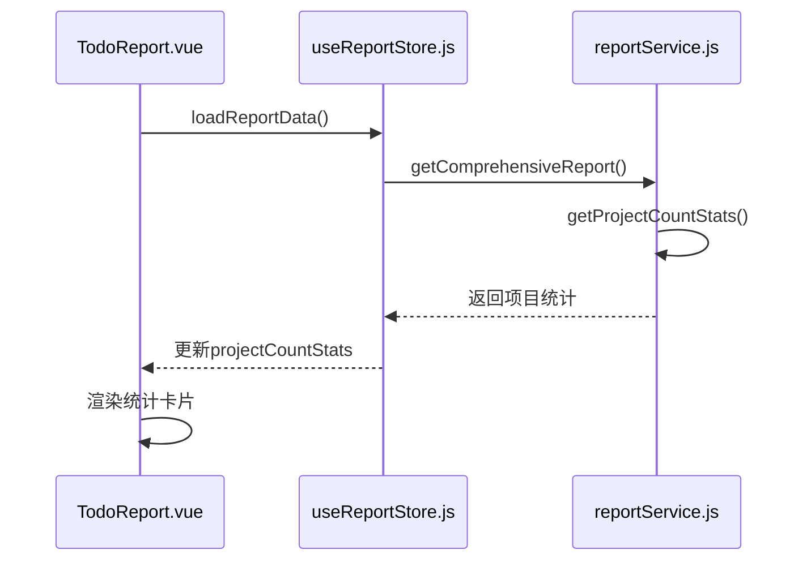

# 项目数量统计

<cite>
**Referenced Files in This Document**   
- [reportService.js](file://src/services/reportService.js)
- [todoService.js](file://src/services/todoService.js)
- [simpleTodoService.js](file://src/services/simpleTodoService.js)
- [TodoReport.vue](file://src/views/tidyDo/components/TodoReport.vue)
- [useReportStore.js](file://src/stores/useReportStore.js)
</cite>

## 目录
1. [方法概述](#方法概述)
2. [并行数据获取机制](#并行数据获取机制)
3. [归档状态过滤逻辑](#归档状态过滤逻辑)
4. [分类统计聚合过程](#分类统计聚合过程)
5. [返回对象结构解析](#返回对象结构解析)
6. [报表页面调用示例](#报表页面调用示例)
7. [性能表现与优化建议](#性能表现与优化建议)

## 方法概述

`ReportService.getProjectCountStats` 方法是 TidyDo 应用中用于获取项目数量统计的核心功能。该方法通过并行调用多个服务来收集待办事项、简单待办和分类数据，经过一系列数据处理后，返回一个包含丰富统计信息的对象。此方法为报表页面提供了基础数据支持，帮助用户了解其任务管理的整体情况。

该方法采用异步编程模式，利用 `Promise.all` 实现并行数据获取，显著提升了数据加载效率。同时，方法内部集成了错误处理机制，确保在数据获取失败时能够优雅地处理异常。

**Section sources**
- [reportService.js](file://src/services/reportService.js#L17-L79)

## 并行数据获取机制

`getProjectCountStats` 方法通过 `Promise.all` 并行调用三个独立的服务方法，实现了高效的数据获取：



**Diagram sources**
- [reportService.js](file://src/services/reportService.js#L19-L22)
- [todoService.js](file://src/services/todoService.js#L233-L236)
- [simpleTodoService.js](file://src/services/simpleTodoService.js#L38-L41)
- [todoService.js](file://src/services/todoService.js#L83-L92)

### 服务调用详情

1. **TodoItemService.getAll**: 获取所有普通待办事项数据，数据存储于 IndexedDB 的 `todo-items` 键下。
2. **SimpleTodoService.getAll**: 获取所有简单待办事项数据，数据存储于 IndexedDB 的 `simple-todo-items` 键下。
3. **CategoryService.getAll**: 获取所有分类数据，数据存储于 IndexedDB 的 `todo-categories` 键下，并按 `order` 字段或创建时间排序。

这种并行调用机制将原本串行的 3 次数据库查询优化为 1 次并行查询，理论上可将数据获取时间减少至原来的 1/3，特别是在数据量较大时性能提升更为明显。

**Section sources**
- [reportService.js](file://src/services/reportService.js#L19-L22)
- [todoService.js](file://src/services/todoService.js#L233-L236)
- [simpleTodoService.js](file://src/services/simpleTodoService.js#L38-L41)
- [todoService.js](file://src/services/todoService.js#L83-L92)

## 归档状态过滤逻辑

在获取到所有待办事项后，`getProjectCountStats` 方法会执行归档状态过滤，仅保留未归档的活跃项目：

```javascript
const activeTodos = todos.filter(todo => !todo.archived)
```

这一过滤逻辑基于待办事项对象的 `archived` 字段，该字段为布尔类型，`true` 表示已归档，`false` 表示未归档。通过此过滤，确保统计结果只反映用户当前正在处理的活跃项目，而不包含已完成并归档的历史任务。

归档状态过滤是项目统计的关键步骤，它保证了统计指标的准确性和实用性。例如，`totalTodos` 和 `totalProjects` 等指标只计算活跃项目，使用户能够清晰地了解当前的工作负载。

**Section sources**
- [reportService.js](file://src/services/reportService.js#L24-L25)

## 分类统计聚合过程

方法通过两个独立的聚合过程，分别按分类统计普通待办和简单待办的数量，并最终构建详细的分类统计数据。

### 普通待办分类统计



**Diagram sources**
- [reportService.js](file://src/services/reportService.js#L28-L34)

### 简单待办分类统计



**Diagram sources**
- [reportService.js](file://src/services/reportService.js#L37-L43)

### 分类统计数据构建

在完成两个分类的统计后，方法会遍历所有分类，构建 `categoryStats` 数组，为每个分类提供详细的统计信息：



**Diagram sources**
- [reportService.js](file://src/services/reportService.js#L52-L68)

`categoryStats` 数组中的每个对象包含以下字段：
- `categoryId`: 分类ID
- `categoryName`: 分类名称
- `categoryIcon`: 分类图标
- `isSimpleTodo`: 是否为简单待办分类
- `isFilterCategory`: 是否为筛选分类
- `todoCount`: 普通待办数量
- `simpleTodoCount`: 简单待办数量
- `totalCount`: 总数量

**Section sources**
- [reportService.js](file://src/services/reportService.js#L28-L68)

## 返回对象结构解析

`getProjectCountStats` 方法返回一个结构化的对象，包含多个维度的统计指标：



**Diagram sources**
- [reportService.js](file://src/services/reportService.js#L70-L78)

### 核心统计指标

| 字段名 | 计算方式 | 说明 |
|-------|--------|------|
| `totalTodos` | `activeTodos.length` | 活跃普通待办总数 |
| `totalSimpleTodos` | `simpleTodos.length` | 简单待办总数 |
| `totalProjects` | `activeTodos.length + simpleTodos.length` | 项目总数 |
| `totalCategories` | `categories.length` | 分类总数 |
| `regularCategories` | `categories.filter(cat => !cat.isFilterCategory && !cat.isSimpleTodo).length` | 普通分类数量 |
| `filterCategories` | `categories.filter(cat => cat.isFilterCategory).length` | 筛选分类数量 |
| `simpleTodoCategories` | `categories.filter(cat => cat.isSimpleTodo).length` | 简单待办分类数量 |
| `archivedTodos` | `todos.filter(todo => todo.archived).length` | 已归档待办数量 |

这些统计指标为用户提供了全面的任务管理概览，帮助用户了解其工作负载、分类结构和任务完成情况。

**Section sources**
- [reportService.js](file://src/services/reportService.js#L70-L78)

## 报表页面调用示例

`getProjectCountStats` 方法在报表页面中被 `useReportStore` 状态管理器调用，形成完整的数据流：



**Diagram sources**
- [TodoReport.vue](file://src/views/tidyDo/components/TodoReport.vue#L112-L128)
- [useReportStore.js](file://src/stores/useReportStore.js#L82-L98)
- [reportService.js](file://src/services/reportService.js#L17-L79)

在 `TodoReport.vue` 组件中，通过 Pinia store 的计算属性 `projectCountStats` 访问这些统计数据，并在概览卡片中展示关键指标：

```html
<h3 class="text-h4 mb-1">{{ reportStore.projectCountStats?.totalProjects || 0 }}</h3>
<p class="text-body-2 text-medium-emphasis">总项目数</p>
```

这种分层架构设计实现了数据获取、状态管理和视图渲染的分离，提高了代码的可维护性和可测试性。

**Section sources**
- [TodoReport.vue](file://src/views/tidyDo/components/TodoReport.vue#L112-L128)
- [useReportStore.js](file://src/stores/useReportStore.js#L82-L98)

## 性能表现与优化建议

### 当前性能表现

`getProjectCountStats` 方法在当前实现中表现出良好的性能特征：

1. **并行数据获取**: 通过 `Promise.all` 并行调用三个服务，最大化利用了 IndexedDB 的异步特性。
2. **内存效率**: 使用对象字面量作为计数器（`todosByCategory` 和 `simpleTodosByCategory`），避免了数组的频繁插入操作。
3. **单次遍历**: 对每个数据集只进行一次遍历，时间复杂度为 O(n)，其中 n 为待办事项总数。

### 潜在性能瓶颈

1. **大数据量下的内存占用**: 当待办事项数量达到数千条时，一次性加载所有数据可能导致内存占用过高。
2. **重复计算**: 在报表页面中，`getComprehensiveReport` 会调用多个统计方法，可能导致部分数据被重复获取和处理。
3. **缺乏缓存机制**: 每次调用都会重新查询数据库，即使数据未发生变化。

### 优化建议

1. **实现数据缓存**:
   ```javascript
   // 在ReportService中添加缓存机制
   const cache = {
     projectCountStats: null,
     lastUpdated: null,
     ttl: 5 * 60 * 1000 // 5分钟缓存
   }
   
   static getProjectCountStats = withErrorHandling(async () => {
     const now = Date.now()
     if (cache.projectCountStats && now - cache.lastUpdated < cache.ttl) {
       return cache.projectCountStats
     }
     
     // 执行原有逻辑...
     
     // 缓存结果
     cache.projectCountStats = result
     cache.lastUpdated = now
     return result
   })
   ```

2. **分页或懒加载**: 对于超大数据集，考虑实现分页查询或懒加载机制，避免一次性加载过多数据。

3. **批量处理优化**: 使用更高效的算法进行数据聚合，如利用 Map 数据结构替代普通对象。

4. **索引优化**: 确保 IndexedDB 中的查询字段（如 `categoryId`、`archived`）有适当的索引，加快查询速度。

5. **Web Worker**: 将复杂的数据处理逻辑移至 Web Worker，避免阻塞主线程，保持 UI 流畅。

通过这些优化措施，可以进一步提升 `getProjectCountStats` 方法在大数据量场景下的性能表现，为用户提供更流畅的报表体验。

**Section sources**
- [reportService.js](file://src/services/reportService.js#L17-L79)
- [useReportStore.js](file://src/stores/useReportStore.js#L82-L98)