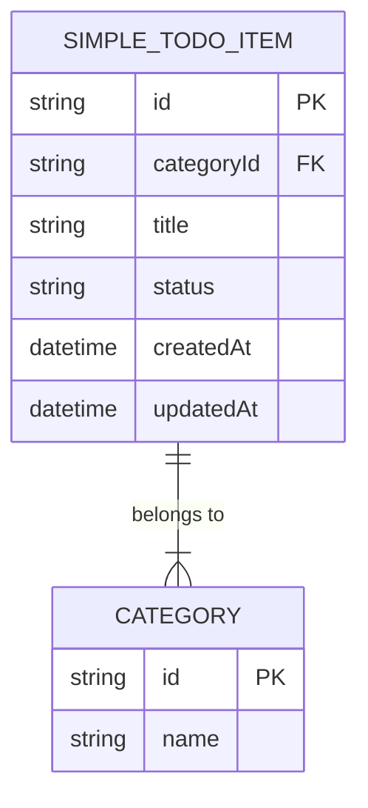
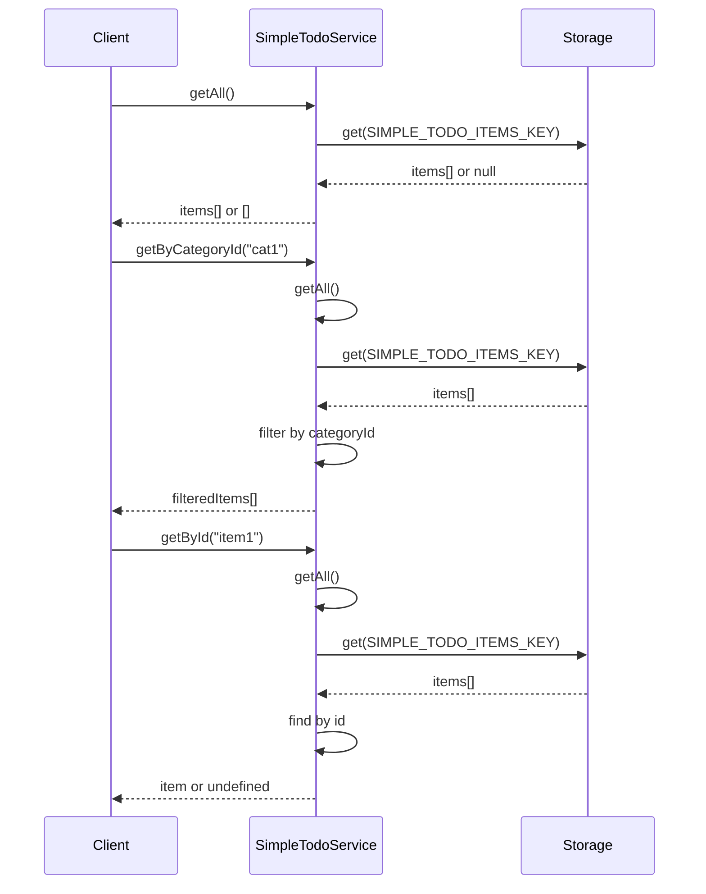
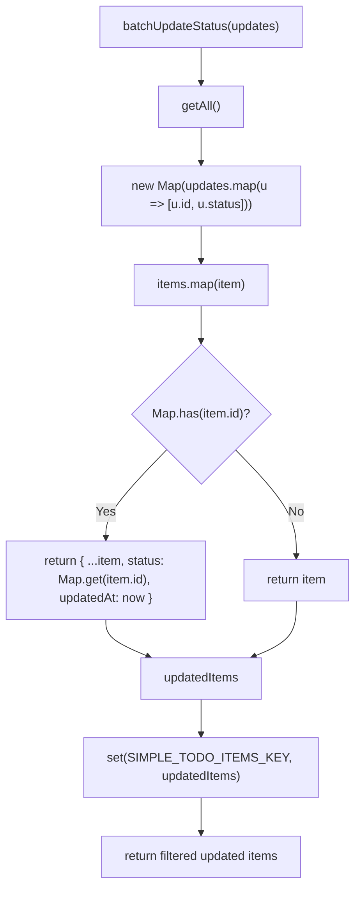

# SimpleTodoService 简单待办服务

<cite>
**Referenced Files in This Document**  
- [simpleTodoService.js](file://src/services/simpleTodoService.js)
- [todoService.js](file://src/services/todoService.js)
- [idGenerator.js](file://src/utils/idGenerator.js)
- [errorHandler.js](file://src/utils/errorHandler.js)
</cite>

## 目录
1. [简介](#简介)
2. [核心架构与设计模式](#核心架构与设计模式)
3. [数据结构与状态管理](#数据结构与状态管理)
4. [查询操作实现](#查询操作实现)
5. [数据持久化与净化策略](#数据持久化与净化策略)
6. [级联删除机制](#级联删除机制)
7. [状态更新与批量处理](#状态更新与批量处理)
8. [ID生成规范](#id生成规范)
9. [批量操作使用示例](#批量操作使用示例)
10. [异常调试与错误处理](#异常调试与错误处理)

## 简介

SimpleTodoService 是 TidyDo 应用中专为管理简单待办事项（SimpleTodo）而设计的轻量级服务模块。该服务专注于提供高效、简洁的待办事项管理功能，与功能更复杂的 TodoService 形成互补。SimpleTodoService 采用静态类模式实现，通过 IndexedDB 键值存储（idb-keyval）进行数据持久化，确保数据在浏览器环境中的可靠存储。服务提供了完整的 CRUD 操作接口，特别优化了批量状态更新和分类级联删除等核心场景，为用户提供流畅的任务管理体验。

**Section sources**
- [simpleTodoService.js](file://src/services/simpleTodoService.js#L1-L50)

## 核心架构与设计模式

SimpleTodoService 采用静态类（Static Class）设计模式，所有方法均为静态方法，无需实例化即可直接调用。这种设计模式非常适合管理单一数据源的服务，简化了调用接口。服务通过 `withErrorHandling` 高阶函数对所有异步操作进行统一的错误处理包装，确保异常能够被捕获并转换为应用级别的错误对象，便于上层组件进行一致的错误展示和日志记录。数据存储基于 `idb-keyval` 库，使用 `SIMPLE_TODO_ITEMS_KEY` 作为唯一的存储键，将所有简单待办项以数组形式序列化存储。

```mermaid
classDiagram
class SimpleTodoService {
+getAll() Promise~Array~
+getByCategoryId(categoryId) Promise~Array~
+getById(id) Promise~Object~
+save(item) Promise~Object~
+delete(id) Promise~void~
+deleteByCategoryId(categoryId) Promise~void~
+updateStatus(id, newStatus) Promise~Object~
+batchUpdateStatus(updates) Promise~Array~
+generateId() string
}
class idGenerator {
+generateId() string
}
class errorHandler {
+withErrorHandling(fn, operation, errorType) Function
}
SimpleTodoService --> idGenerator : "uses"
SimpleTodoService --> errorHandler : "uses"
SimpleTodoService ..> "SIMPLE_TODO_ITEMS_KEY" : "stores data in"
```

**Diagram sources**
- [simpleTodoService.js](file://src/services/simpleTodoService.js#L38-L165)
- [idGenerator.js](file://src/utils/idGenerator.js#L5-L15)
- [errorHandler.js](file://src/utils/errorHandler.js#L69-L86)

**Section sources**
- [simpleTodoService.js](file://src/services/simpleTodoService.js#L38-L165)

## 数据结构与状态管理

SimpleTodoService 的核心数据结构由 `createSimpleTodoItem` 工厂函数定义，包含 `id`、`categoryId`、`title`、`status`、`createdAt` 和 `updatedAt` 等关键字段。其数据结构相较于 `todoService.js` 中的 `createTodoItem` 更为精简，省略了 `description`、`priority`、`tags`、`endDate` 等复杂字段，体现了其“简单待办”的定位。

状态管理方面，服务定义了四种标准状态：`todo`（待办）、`doing`（进行中）、`done`（已完成）和 `paused`（暂停）。每种状态都关联了详细的配置信息（`SIMPLE_TODO_STATUS_CONFIG`），包括用户界面显示的标签、背景色、文字色和图标，实现了状态与UI表现的解耦，便于统一管理和主题定制。



**Diagram sources**
- [simpleTodoService.js](file://src/services/simpleTodoService.js#L15-L27)
- [simpleTodoService.js](file://src/services/simpleTodoService.js#L170-L190)

**Section sources**
- [simpleTodoService.js](file://src/services/simpleTodoService.js#L15-L27)
- [simpleTodoService.js](file://src/services/simpleTodoService.js#L170-L190)
- [todoService.js](file://src/services/todoService.js#L45-L55)

## 查询操作实现

SimpleTodoService 提供了三个核心查询方法：`getAll`、`getByCategoryId` 和 `getById`，均基于内存过滤实现，以换取极高的查询性能。

- `getAll` 方法直接从 `SIMPLE_TODO_ITEMS_KEY` 键中读取所有待办项数组。该方法使用 `withErrorHandling` 进行包装，确保读取失败时能返回空数组作为安全默认值，保证了调用的健壮性。
- `getByCategoryId` 方法首先调用 `getAll` 获取全量数据，然后使用 `Array.filter` 方法筛选出 `categoryId` 匹配的所有项。这是一种典型的“全量加载+内存过滤”模式，适用于数据量不大的场景。
- `getById` 方法同样基于 `getAll` 的结果，使用 `Array.find` 方法根据 `id` 字段进行精确查找，返回匹配的单个对象或 `undefined`。



**Diagram sources**
- [simpleTodoService.js](file://src/services/simpleTodoService.js#L38-L51)
- [simpleTodoService.js](file://src/services/simpleTodoService.js#L58-L61)

**Section sources**
- [simpleTodoService.js](file://src/services/simpleTodoService.js#L38-L61)

## 数据持久化与净化策略

`save` 方法是数据持久化的核心，它实现了数据的创建和更新。该方法首先调用 `getAll` 获取当前所有数据，然后通过 `findIndex` 查找是否存在同 `id` 的项以决定是更新还是新增。

在保存前，`save` 方法执行了关键的数据净化（Sanitization）策略：
1.  **字段填充**：对 `title` 和 `status` 字段设置了默认值（空字符串和 `'todo'`），防止 `null` 或 `undefined` 值被存储。
2.  **时间戳更新**：强制更新 `updatedAt` 字段为当前时间，并为新创建的项填充 `createdAt` 字段（如果不存在）。
3.  **数据精简**：只保留服务定义的核心字段，丢弃任何可能传入的额外属性，确保数据结构的纯净和一致性。

净化后的数据被写回 `SIMPLE_TODO_ITEMS_KEY`，完成持久化。

**Section sources**
- [simpleTodoService.js](file://src/services/simpleTodoService.js#L68-L90)

## 级联删除机制

`deleteByCategoryId` 方法实现了分类删除时的级联清理。当用户删除一个分类时，该方法会移除所有属于该分类的简单待办项。

其工作流程如下：
1.  调用 `getAll` 获取所有待办项。
2.  使用 `Array.filter` 创建一个新数组，其中不包含 `categoryId` 与传入参数相等的项。
3.  将过滤后的新数组重新写入存储。

这种实现方式简单高效，通过一次读取和一次写入操作完成批量删除，避免了循环调用单个删除方法带来的性能开销。

**Section sources**
- [simpleTodoService.js](file://src/services/simpleTodoService.js#L108-L112)

## 状态更新与批量处理

SimpleTodoService 提供了 `updateStatus` 和 `batchUpdateStatus` 两个方法来处理状态流转。

- `updateStatus` 方法用于更新单个待办项的状态。它首先通过 `getById` 确保目标项存在，然后创建一个包含新状态和更新时间戳的新对象，最后调用 `save` 方法持久化。
- `batchUpdateStatus` 方法是性能优化的关键。它接收一个包含 `id` 和 `status` 的更新列表。其核心优化在于使用 `Map` 数据结构：
    1.  将 `updates` 数组转换为 `id` 到 `newStatus` 的 `Map`，实现 O(1) 的状态查找。
    2.  遍历所有待办项，对于 `Map` 中存在的 `id`，应用新的状态。
    3.  一次性将所有更新后的数据写回存储。

这种“一次读取、一次遍历、一次写入”的模式，相比循环调用 `updateStatus`，极大地减少了与存储层的交互次数，显著提升了批量操作的性能。



**Diagram sources**
- [simpleTodoService.js](file://src/services/simpleTodoService.js#L120-L133)
- [simpleTodoService.js](file://src/services/simpleTodoService.js#L140-L157)

**Section sources**
- [simpleTodoService.js](file://src/services/simpleTodoService.js#L120-L157)

## ID生成规范

`generateId` 方法用于生成全局唯一的待办项ID。该方法并非直接实现，而是委托给 `idGenerator.js` 模块中的 `generateId` 函数。

`idGenerator.js` 的实现策略是将当前时间戳（`Date.now()`）转换为36进制字符串，并与一个随机数（`Math.random()`）的36进制字符串（去除前两位）进行拼接。这种组合方式结合了时间的有序性和随机数的不可预测性，能够在高并发下生成极大概率唯一的ID，且生成的ID具有一定可读性。

**Section sources**
- [simpleTodoService.js](file://src/services/simpleTodoService.js#L163-L165)
- [idGenerator.js](file://src/utils/idGenerator.js#L5-L15)

## 批量操作使用示例

以下是一个使用 `batchUpdateStatus` 进行批量状态更新的代码示例：

```javascript
// 假设我们有一组待办项ID，需要将它们全部标记为“已完成”
const todoIds = ['id1', 'id2', 'id3'];
const updates = todoIds.map(id => ({ id, status: 'done' }));

try {
  const updatedItems = await SimpleTodoService.batchUpdateStatus(updates);
  console.log(`成功批量更新了 ${updatedItems.length} 个待办项`);
} catch (error) {
  console.error('批量更新失败:', error.message);
}
```

此示例展示了如何构造 `updates` 数组，并通过 `await` 调用 `batchUpdateStatus`。成功后，`updatedItems` 数组将包含所有被成功更新的待办项。

## 异常调试与错误处理

当状态同步等操作出现异常时，可遵循以下调试方法：

1.  **检查控制台日志**：`withErrorHandling` 会在捕获错误时输出详细的日志，包括操作描述和原始错误堆栈，这是首要的排查入口。
2.  **验证ID有效性**：确保传入的 `id` 或 `categoryId` 是有效的字符串。可以使用 `isValidId` 函数进行验证。
3.  **检查数据完整性**：确认待办项数据存在于存储中。可通过 `getAll` 方法获取所有数据，检查目标项是否在列表中。
4.  **分析错误类型**：捕获的 `AppError` 对象包含 `type` 属性（如 `ErrorTypes.STORAGE`）。如果是存储错误，可能与浏览器存储空间不足或权限有关。
5.  **验证网络状态**：虽然主要依赖本地存储，但某些情况下（如扩展同步）可能涉及网络，需确认网络连接正常。

通过结合日志、数据验证和错误类型分析，可以快速定位并解决状态同步问题。

**Section sources**
- [errorHandler.js](file://src/utils/errorHandler.js#L69-L86)
- [errorHandler.js](file://src/utils/errorHandler.js#L15-L30)