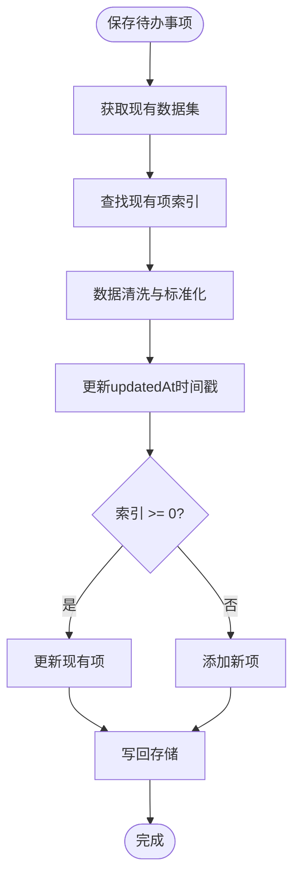

# TodoService 待办事项服务

<cite>
**Referenced Files in This Document**  
- [todoService.js](file://src/services/todoService.js)
- [idGenerator.js](file://src/utils/idGenerator.js)
- [errorHandler.js](file://src/utils/errorHandler.js)
</cite>

## 目录
1. [简介](#简介)
2. [核心数据结构](#核心数据结构)
3. [CRUD操作实现](#crud操作实现)
4. [ID生成与数据清洗](#id生成与数据清洗)
5. [存储层交互机制](#存储层交互机制)
6. [并发与事务处理](#并发与事务处理)
7. [性能优化建议](#性能优化建议)
8. [错误处理策略](#错误处理策略)

## 简介

TodoService 是 TidyDo 应用的核心数据服务模块，负责管理普通待办事项（TodoItem）的全生命周期。该服务基于 IndexedDB 提供持久化存储，通过 `TodoItemService` 类实现了完整的 CRUD（创建、读取、更新、删除）操作。服务设计注重数据一致性、可扩展性和用户体验，支持分类筛选、状态管理等高级功能，并通过统一的错误处理机制保障系统稳定性。

**Section sources**
- [todoService.js](file://src/services/todoService.js#L231-L313)

## 核心数据结构

### 待办事项数据模型

`createTodoItem` 函数定义了待办事项的标准数据结构，包含基础属性和可扩展字段：

- **基础属性**：ID、分类ID、标题、自定义编号、描述、优先级、状态
- **扩展字段**：标签数组、节点日期、截止日期、分配人、附件列表、归档状态
- **元数据**：创建时间（createdAt）、更新时间（updatedAt）

该设计支持未来功能扩展，同时通过默认值确保数据完整性。

### 分类数据模型

`createCategory` 函数定义了分类数据结构，包含：

- **基础信息**：ID、名称、图标、展开状态
- **类型标识**：是否为筛选类、是否为简单Todo大类
- **排序与过滤**：排序值（order）、筛选条件（filterConditions）
- **元数据**：创建时间、更新时间

分类与待办事项通过 `categoryId` 建立关联关系，形成树状数据结构。

**Diagram sources**
- [todoService.js](file://src/services/todoService.js#L20-L128)

**Section sources**
- [todoService.js](file://src/services/todoService.js#L20-L128)

## CRUD操作实现

### 数据读取机制

#### getAll 方法
`getAll` 方法从 IndexedDB 中读取所有待办事项数据。该方法使用 `idb-keyval` 库的 `get` 函数异步获取 `TODO_ITEMS_KEY` 键对应的数据，若无数据则返回空数组。方法通过 `withErrorHandling` 装饰器包裹，确保异常情况下的优雅降级。

#### getById 方法
`getById` 基于 `getAll` 实现，先获取全部数据再通过 ID 进行过滤查找。这种设计简化了实现逻辑，但在大数据集下可能存在性能瓶颈。

#### getByCategoryId 方法
`getByCategoryId` 支持按分类筛选待办事项，通过 `categoryId` 字段进行精确匹配，返回指定分类下的所有待办事项，为分类视图提供数据支持。

**Diagram sources**
- [todoService.js](file://src/services/todoService.js#L233-L246)

**Section sources**
- [todoService.js](file://src/services/todoService.js#L233-L246)

### 数据持久化逻辑

#### save 方法
`save` 方法实现数据的创建和更新操作。其核心逻辑包括：

1. **数据清洗**：确保 `tags` 和 `attachments` 为数组类型，`milestoneDate` 存在且为 null 安全
2. **时间戳更新**：自动更新 `updatedAt` 字段为当前时间
3. **存在性检查**：通过 `findIndex` 查找现有项，决定是更新还是新增
4. **批量写入**：将完整数据集写回存储，确保数据一致性

#### delete 方法
`delete` 方法通过过滤掉指定 ID 的项来实现删除，然后将剩余数据集写回存储。`deleteByCategoryId` 批量删除指定分类下的所有待办事项，支持分类删除时的级联清理。

**Diagram sources**
- [todoService.js](file://src/services/todoService.js#L248-L269)

**Section sources**
- [todoService.js](file://src/services/todoService.js#L248-L275)

### 状态变更流程

`updateStatus` 方法（虽未在代码中直接定义，但可通过 `save` 方法实现）在状态变更时应执行业务校验。虽然当前实现中未显式包含校验逻辑，但可通过扩展 `save` 方法或创建专用方法来实现状态转换规则，如禁止从"已完成"状态直接变更为"已取消"等。

## ID生成与数据清洗

### 唯一ID生成策略

`generateId` 方法通过组合时间戳和随机字符串生成唯一ID：

- **时间戳部分**：`Date.now().toString(36)` 提供时间顺序性和部分唯一性
- **随机部分**：`Math.random().toString(36).slice(2)` 增加随机性，避免时间戳碰撞

该策略在单机环境下能有效保证ID的全局唯一性，且生成的ID具有可读性。

### 数据清洗机制

在 `save` 操作中，服务执行了严格的数据清洗：

- **类型安全**：确保 `tags` 和 `attachments` 为数组类型，防止序列化错误
- **字段补全**：确保 `milestoneDate` 字段存在，即使值为 null
- **时间同步**：强制更新 `updatedAt` 字段，准确记录最后修改时间

这种清洗策略提高了数据的健壮性和存储可靠性。

**Diagram sources**
- [idGenerator.js](file://src/utils/idGenerator.js#L5-L31)
- [todoService.js](file://src/services/todoService.js#L231-L313)

**Section sources**
- [idGenerator.js](file://src/utils/idGenerator.js#L5-L31)
- [todoService.js](file://src/services/todoService.js#L248-L269)

## 存储层交互机制

### IndexedDB 交互模式

TodoService 通过 `idb-keyval` 库与 IndexedDB 交互，采用键值对存储模式：

- **数据键**：`TODO_ITEMS_KEY = 'todo-items'` 作为待办事项的存储键
- **读取操作**：使用 `get(key)` 异步读取数据
- **写入操作**：使用 `set(key, value)` 写入完整数据集
- **删除操作**：使用 `del(key)` 删除数据（在 `CategoryService` 中使用）

这种模式简化了 IndexedDB 的复杂API，但每次写入都是全量更新，可能影响性能。

### 事务一致性保障

虽然当前实现未显式使用 IndexedDB 事务，但通过以下方式保障数据一致性：

- **原子性操作**：每次 `set` 操作写入完整数据集，避免部分更新
- **错误处理**：通过 `withErrorHandling` 捕获异常，防止数据损坏
- **批量删除**：`deleteByCategoryId` 在获取全集后过滤并一次性写回，确保删除的完整性

## 并发与事务处理

### 数据并发修改处理

当前架构在并发修改场景下存在潜在风险：

- **写入覆盖**：多个客户端同时修改可能导致后写入者覆盖前写入者的更改
- **解决方案建议**：
  - 实现乐观锁机制，在数据中添加版本号字段
  - 读取时记录版本，更新时验证版本一致性
  - 使用 IndexedDB 的事务机制进行更精细的控制

### 批量操作一致性

批量删除操作（如 `deleteByCategoryId`）通过"读取-过滤-写回"模式实现，确保了操作的原子性。由于 IndexedDB 的 `set` 操作是原子的，整个删除过程要么完全成功，要么完全失败（在异常情况下），保障了数据的一致性。

## 性能优化建议

### 复杂查询场景优化

针对大数据集的复杂查询，建议以下优化策略：

1. **索引优化**：在 IndexedDB 中为常用查询字段（如 `categoryId`、`status`、`endDate`）创建索引
2. **分页查询**：实现 `getAll` 的分页版本，避免一次性加载大量数据
3. **缓存机制**：在内存中维护数据缓存，减少对 IndexedDB 的频繁访问
4. **增量更新**：避免全量写回，改为仅更新变更的记录

### 数据结构优化

- **分离热数据**：将频繁访问的元数据与不常访问的附件数据分离存储
- **预计算视图**：为常用视图（如按状态分组）维护预计算的数据结构
- **数据压缩**：对大文本字段进行压缩存储，减少存储空间占用

## 错误处理策略

### 统一错误处理

`withErrorHandling` 装饰器为所有异步操作提供了统一的错误处理框架：

- **错误捕获**：捕获所有异步操作中的异常
- **错误包装**：将原生错误包装为 `AppError`，包含操作描述和错误类型
- **用户友好**：通过 `getUserFriendlyMessage` 提供可读的错误信息
- **日志记录**：在控制台记录详细错误信息，便于调试

### 错误类型分类

系统定义了多种错误类型，便于针对性处理：

- **STORAGE**：存储操作失败，提示检查浏览器存储权限
- **NETWORK**：网络连接问题
- **VALIDATION**：数据验证失败
- **BUSINESS**：业务逻辑错误
- **UNKNOWN**：未知错误

这种分类有助于提供更精确的用户反馈和错误恢复策略。

**Section sources**
- [errorHandler.js](file://src/utils/errorHandler.js#L1-L109)
- [todoService.js](file://src/services/todoService.js#L233-L269)