# 服务层架构

<cite>
**本文档引用的文件**
- [appService.js](file://src/services/appService.js)
- [configService.js](file://src/services/configService.js)
- [todoService.js](file://src/services/todoService.js)
- [simpleTodoService.js](file://src/services/simpleTodoService.js)
- [dataService.js](file://src/services/dataService.js)
- [reportService.js](file://src/services/reportService.js)
- [errorHandler.js](file://src/utils/errorHandler.js)
- [idGenerator.js](file://src/utils/idGenerator.js)
- [useConfig.js](file://src/composables/useConfig.js)
- [DEVELOPMENT.md](file://DEVELOPMENT.md)
</cite>

## 目录

1. [简介](#简介)
2. [项目结构](#项目结构)
3. [核心组件](#核心组件)
4. [架构概览](#架构概览)
5. [详细组件分析](#详细组件分析)
6. [依赖分析](#依赖分析)
7. [性能考量](#性能考量)
8. [故障排除指南](#故障排除指南)
9. [结论](#结论)

## 简介

TidyDo 是一款功能丰富的待办事项管理应用，其服务层作为业务逻辑的核心，承担着数据操作、持久化处理和应用初始化等关键职责。本文档详细阐述了服务层的架构设计、各服务模块的功能划分与协作关系，以及与 Pinia Stores 和 Composables 的调用关系。重点说明了 AppService 如何通过并行加载配置、分类和待办事项数据来优化性能，并确保正确的初始化时序。

## 项目结构

TidyDo 采用清晰的分层架构设计，各层职责明确，易于维护和扩展。

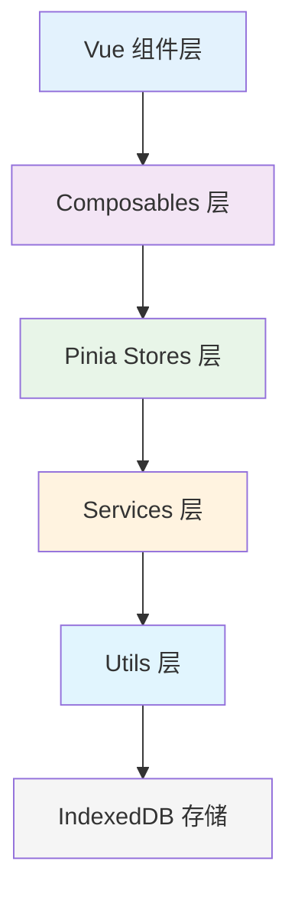

**图示来源**
- [DEVELOPMENT.md](file://DEVELOPMENT.md#L10-L80)

**本节来源**
- [DEVELOPMENT.md](file://DEVELOPMENT.md#L10-L80)

## 核心组件

服务层是 TidyDo 的业务逻辑核心，包含多个服务模块，每个模块负责特定的业务功能。

**本节来源**
- [appService.js](file://src/services/appService.js#L1-L10)
- [configService.js](file://src/services/configService.js#L1-L10)
- [todoService.js](file://src/services/todoService.js#L1-L10)

## 架构概览

TidyDo 的服务层采用模块化设计，各服务模块之间通过明确的接口进行通信，确保了系统的可维护性和可扩展性。

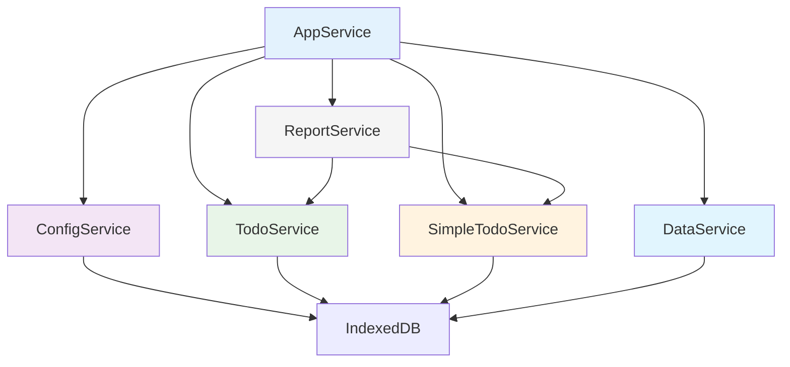

**图示来源**
- [appService.js](file://src/services/appService.js#L1-L10)
- [configService.js](file://src/services/configService.js#L1-L10)
- [todoService.js](file://src/services/todoService.js#L1-L10)
- [simpleTodoService.js](file://src/services/simpleTodoService.js#L1-L10)
- [dataService.js](file://src/services/dataService.js#L1-L10)
- [reportService.js](file://src/services/reportService.js#L1-L10)

## 详细组件分析

### AppService 分析

AppService 是应用初始化服务，负责统一管理整个应用的启动流程，确保初始化的正确时序。

#### 初始化流程

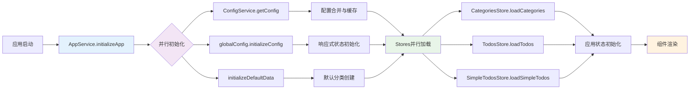

**图示来源**
- [DEVELOPMENT.md](file://DEVELOPMENT.md#L85-L110)

#### 类图

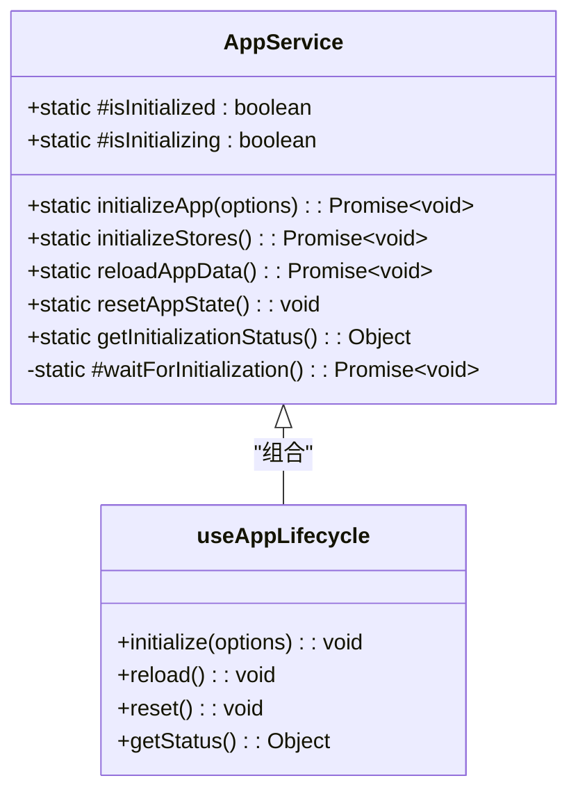

**图示来源**
- [appService.js](file://src/services/appService.js#L1-L170)

**本节来源**
- [appService.js](file://src/services/appService.js#L1-L170)

### ConfigService 分析

ConfigService 负责应用配置的持久化存储和管理，确保配置的完整性和一致性。

#### 配置合并流程

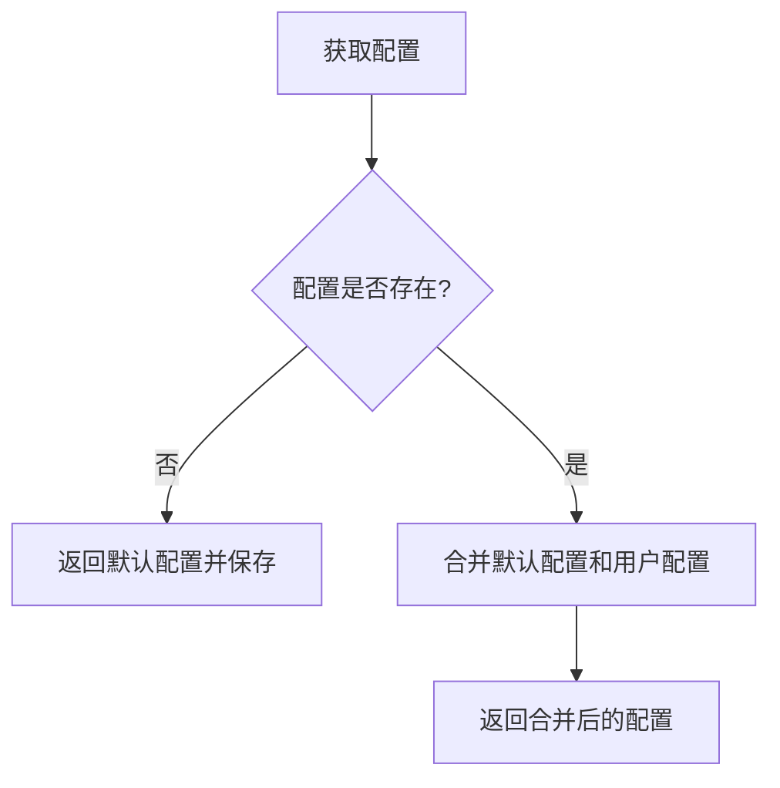

**图示来源**
- [configService.js](file://src/services/configService.js#L1-L206)

#### 类图

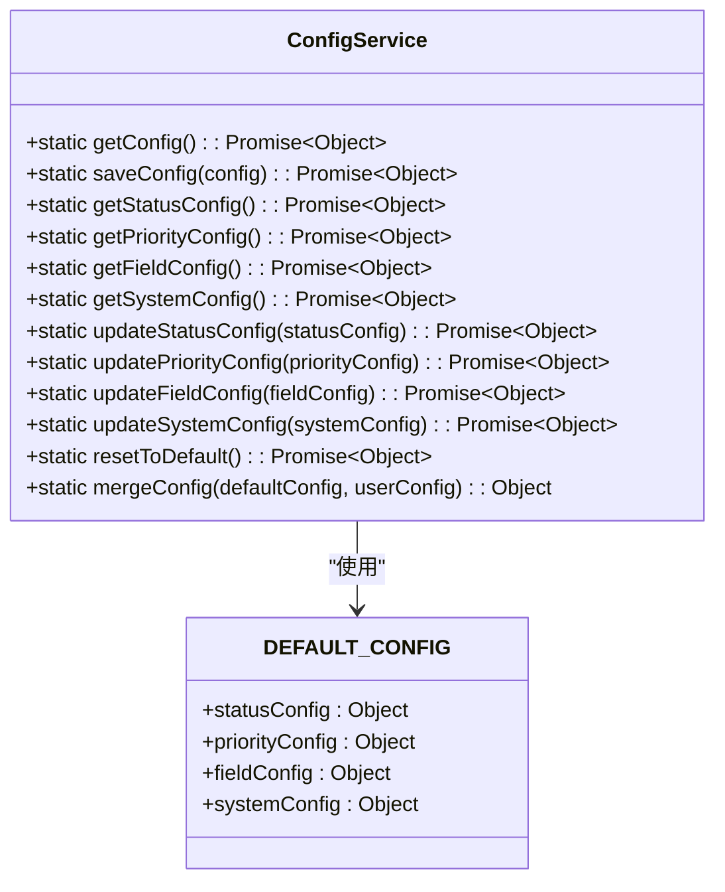

**图示来源**
- [configService.js](file://src/services/configService.js#L1-L206)

**本节来源**
- [configService.js](file://src/services/configService.js#L1-L206)

### TodoService 分析

TodoService 是待办事项和分类的数据操作核心，提供完整的 CRUD 操作和数据结构定义。

#### 数据结构

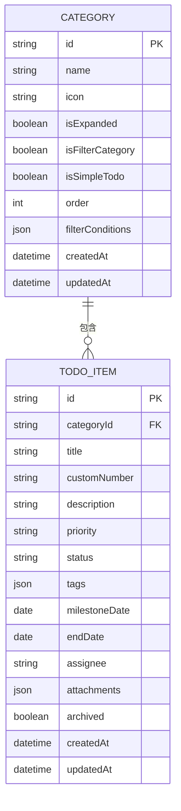

**图示来源**
- [todoService.js](file://src/services/todoService.js#L1-L314)

#### 类图

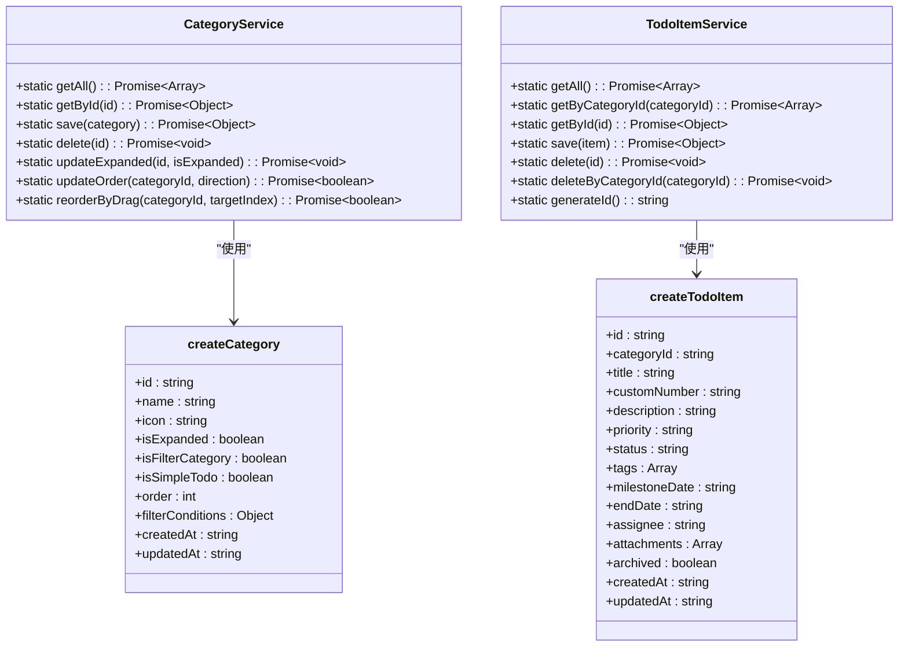

**图示来源**
- [todoService.js](file://src/services/todoService.js#L1-L314)

**本节来源**
- [todoService.js](file://src/services/todoService.js#L1-L314)

### SimpleTodoService 分析

SimpleTodoService 负责简单 Todo 项的数据操作和状态管理，提供独立的数据存储和状态配置。

#### 状态配置

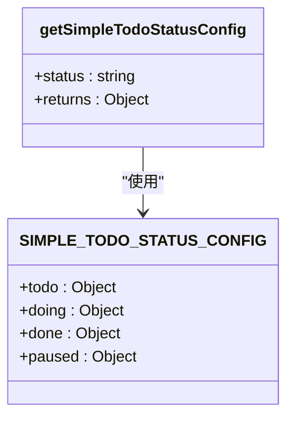

**图示来源**
- [simpleTodoService.js](file://src/services/simpleTodoService.js#L1-L217)

#### 类图

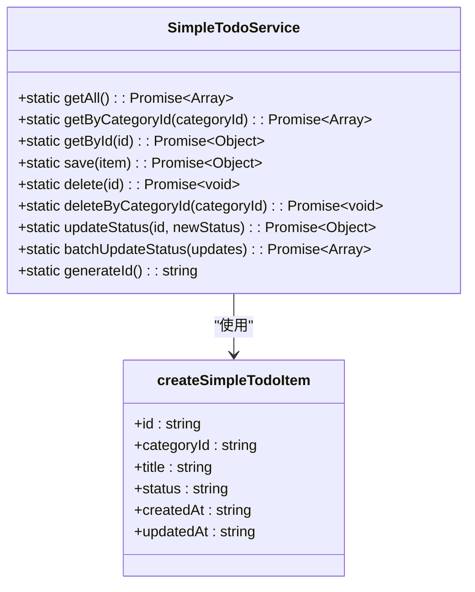

**图示来源**
- [simpleTodoService.js](file://src/services/simpleTodoService.js#L1-L217)

**本节来源**
- [simpleTodoService.js](file://src/services/simpleTodoService.js#L1-L217)

### DataService 分析

DataService 提供数据备份和恢复功能，支持数据的导入导出和迁移。

#### 导入导出流程

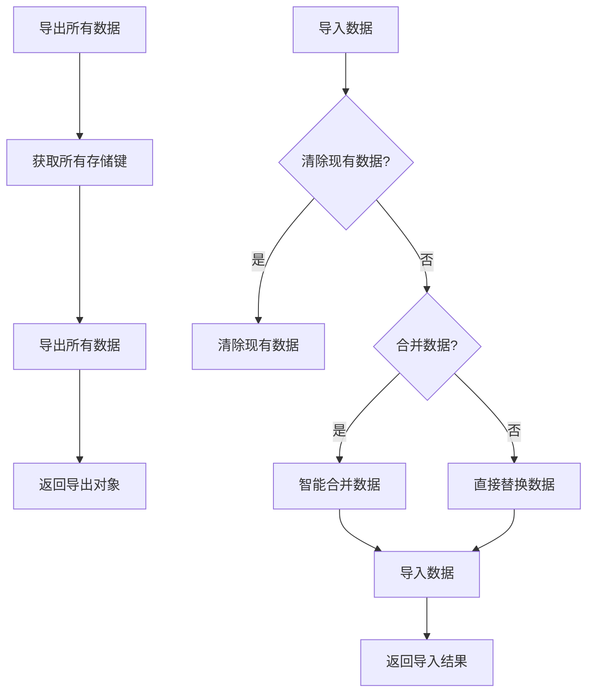

**图示来源**
- [dataService.js](file://src/services/dataService.js#L1-L274)

#### 类图

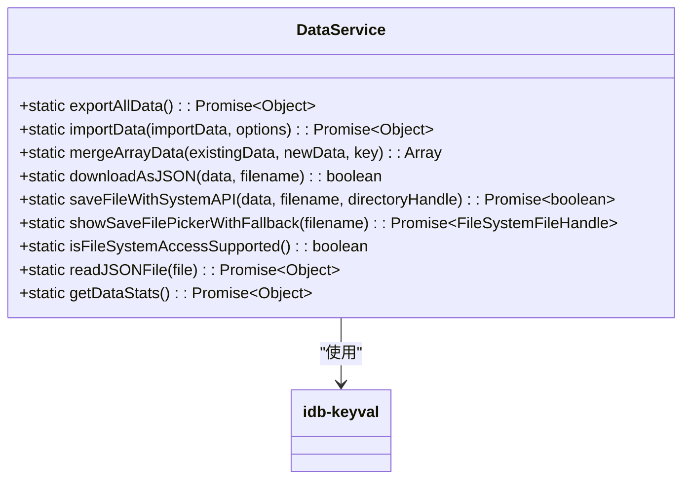

**图示来源**
- [dataService.js](file://src/services/dataService.js#L1-L274)

**本节来源**
- [dataService.js](file://src/services/dataService.js#L1-L274)

### ReportService 分析

ReportService 提供数据统计分析功能，生成多维度的报表数据。

#### 统计分析流程

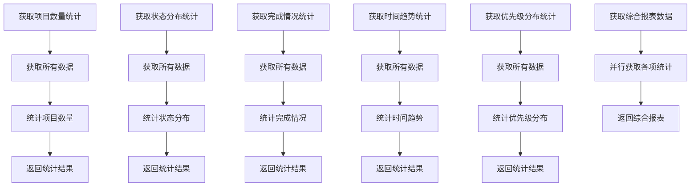

**图示来源**
- [reportService.js](file://src/services/reportService.js#L1-L288)

#### 类图

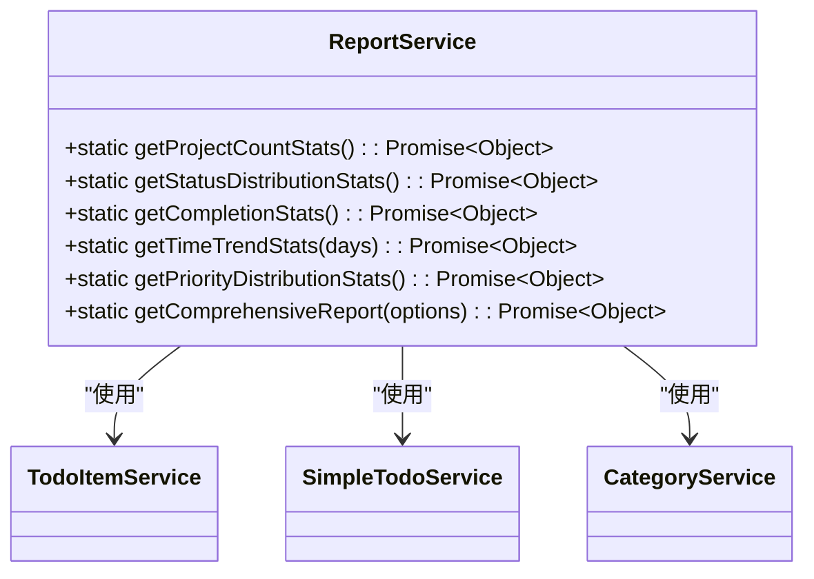

**图示来源**
- [reportService.js](file://src/services/reportService.js#L1-L288)

**本节来源**
- [reportService.js](file://src/services/reportService.js#L1-L288)

## 依赖分析

TidyDo 的服务层与其他层之间存在明确的依赖关系，确保了系统的模块化和可维护性。

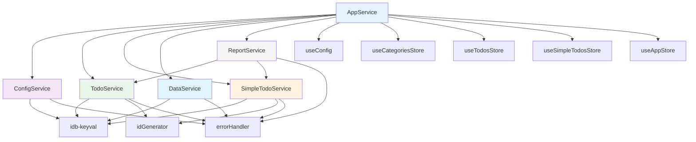

**图示来源**
- [appService.js](file://src/services/appService.js#L1-L170)
- [configService.js](file://src/services/configService.js#L1-L206)
- [todoService.js](file://src/services/todoService.js#L1-L314)
- [simpleTodoService.js](file://src/services/simpleTodoService.js#L1-L217)
- [dataService.js](file://src/services/dataService.js#L1-L274)
- [reportService.js](file://src/services/reportService.js#L1-L288)
- [errorHandler.js](file://src/utils/errorHandler.js#L1-L110)
- [idGenerator.js](file://src/utils/idGenerator.js#L1-L32)
- [useConfig.js](file://src/composables/useConfig.js#L1-L205)

**本节来源**
- [appService.js](file://src/services/appService.js#L1-L170)
- [configService.js](file://src/services/configService.js#L1-L206)
- [todoService.js](file://src/services/todoService.js#L1-L314)
- [simpleTodoService.js](file://src/services/simpleTodoService.js#L1-L217)
- [dataService.js](file://src/services/dataService.js#L1-L274)
- [reportService.js](file://src/services/reportService.js#L1-L288)
- [errorHandler.js](file://src/utils/errorHandler.js#L1-L110)
- [idGenerator.js](file://src/utils/idGenerator.js#L1-L32)
- [useConfig.js](file://src/composables/useConfig.js#L1-L205)

## 性能考量

TidyDo 的服务层在设计时充分考虑了性能优化，通过并行加载、缓存机制和高效的错误处理来提升用户体验。

### 并行加载

AppService 通过 `Promise.all` 并行加载配置、分类和待办事项数据，显著减少了初始化时间。

### 缓存机制

useConfig 使用全局响应式状态和缓存机制，避免了重复的配置加载和解析。

### 错误处理

withErrorHandling 函数包装所有异步操作，提供统一的错误处理和用户友好的错误信息，确保应用的稳定性。

## 故障排除指南

### 常见问题

1. **应用初始化失败**
   - 检查浏览器存储权限
   - 清除浏览器缓存后重试
   - 检查网络连接

2. **数据导入失败**
   - 确保导入文件格式正确
   - 检查文件是否损坏
   - 尝试重新导出数据

3. **配置更新不生效**
   - 清除配置缓存
   - 重启应用
   - 检查配置文件是否正确

### 调试技巧

1. **使用 Vue DevTools**
   - 调试组件状态和 Pinia stores

2. **检查 IndexedDB**
   - 在开发者工具中查看存储数据

3. **查看控制台日志**
   - 检查错误日志和调试信息

**本节来源**
- [errorHandler.js](file://src/utils/errorHandler.js#L1-L110)
- [DEVELOPMENT.md](file://DEVELOPMENT.md#L600-L700)

## 结论

TidyDo 的服务层设计优雅，职责清晰，通过模块化设计和明确的接口定义，确保了系统的可维护性和可扩展性。AppService 的并行初始化和 withErrorHandling 的统一错误处理机制，显著提升了应用的性能和稳定性。各服务模块之间的协作关系明确，与 Pinia Stores 和 Composables 的调用关系清晰，为开发者提供了良好的开发体验。