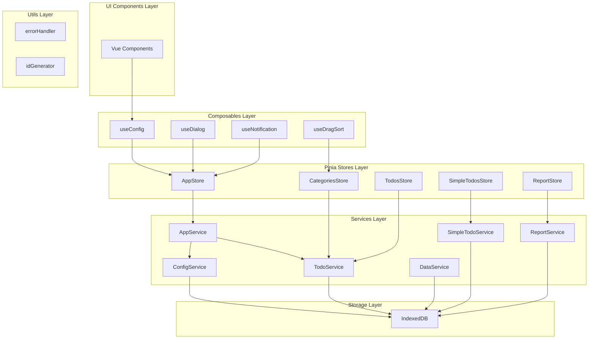
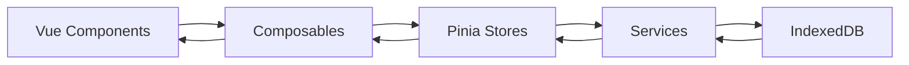
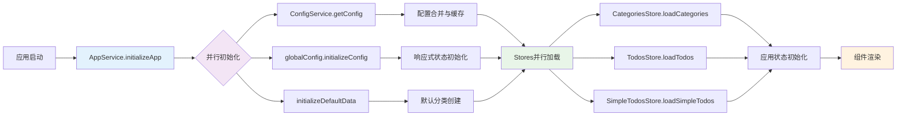
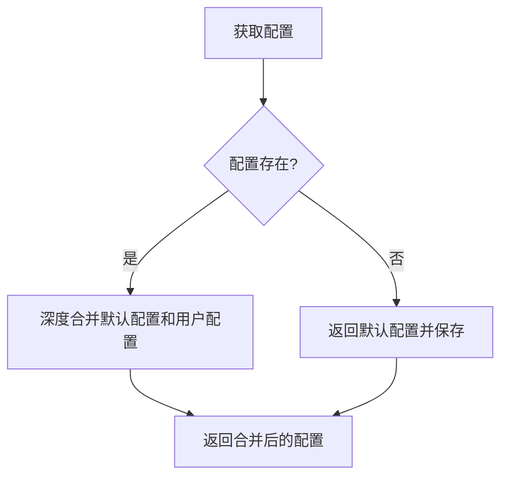
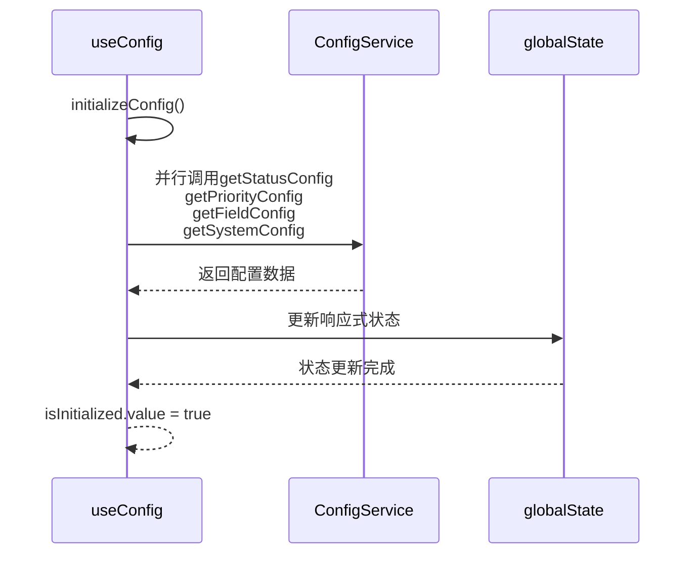
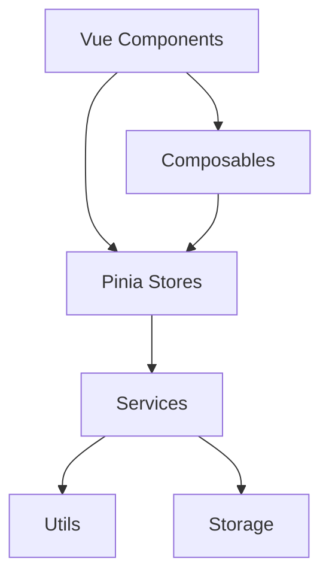
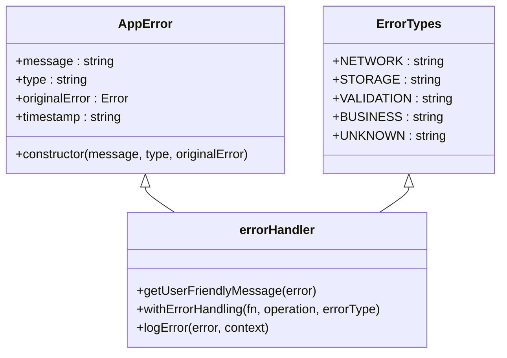

# 架构设计

<cite>
**本文档中引用的文件**  
- [App.vue](file://src/App.vue)
- [main.js](file://src/main.js)
- [appService.js](file://src/services/appService.js)
- [configService.js](file://src/services/configService.js)
- [todoService.js](file://src/services/todoService.js)
- [useAppStore.js](file://src/stores/useAppStore.js)
- [useCategoriesStore.js](file://src/stores/useCategoriesStore.js)
- [useTodosStore.js](file://src/stores/useTodosStore.js)
- [useConfig.js](file://src/composables/useConfig.js)
- [errorHandler.js](file://src/utils/errorHandler.js)
- [DEVELOPMENT.md](file://DEVELOPMENT.md)
</cite>

## 目录
1. [引言](#引言)
2. [项目结构](#项目结构)
3. [核心组件](#核心组件)
4. [架构概述](#架构概述)
5. [详细组件分析](#详细组件分析)
6. [依赖分析](#依赖分析)
7. [性能考虑](#性能考虑)
8. [故障排除指南](#故障排除指南)
9. [结论](#结论)

## 引言
TidyDo 是一款基于 Vue 3 和 Pinia 的待办事项管理应用，采用 MVVM 架构模式，具备清晰的分层结构和高性能的初始化流程。本架构文档旨在全面阐述其系统设计，重点说明从 Vue 组件层到 IndexedDB 存储层的职责分离，以及应用初始化流程中的性能优化策略。

## 项目结构
TidyDo 采用模块化分层架构，各层职责明确，便于维护和扩展。项目结构遵循功能划分原则，主要包含组件、组合式函数、状态管理、服务、工具和视图等目录。

**图源**
- [DEVELOPMENT.md](file://DEVELOPMENT.md)

## 核心组件
TidyDo 的核心组件包括 Vue 组件、组合式函数、Pinia Store、服务类和工具函数。这些组件共同构成了应用的基础架构，实现了数据驱动的用户界面和高效的业务逻辑处理。

**节源**
- [App.vue](file://src/App.vue)
- [main.js](file://src/main.js)

## 架构概述
TidyDo 采用 MVVM（Model-View-ViewModel）架构模式，实现了视图与数据的双向绑定。该架构通过清晰的分层设计，将用户界面、业务逻辑和数据存储分离，提高了代码的可维护性和可测试性。

**图源**
- [DEVELOPMENT.md](file://DEVELOPMENT.md)

## 详细组件分析
### AppService 分析
AppService 是 TidyDo 的应用初始化服务，负责管理整个应用的启动流程，确保初始化的正确时序。

#### 应用初始化流程

**图源**
- [DEVELOPMENT.md](file://DEVELOPMENT.md)

**节源**
- [appService.js](file://src/services/appService.js#L1-L170)

### ConfigService 分析
ConfigService 负责应用配置的持久化存储和管理，确保配置数据的完整性和一致性。

#### 配置合并逻辑

**图源**
- [configService.js](file://src/services/configService.js#L1-L206)

**节源**
- [configService.js](file://src/services/configService.js#L1-L206)

### useConfig 分析
useConfig 是一个组合式函数，提供响应式的配置状态管理和便捷的配置访问方法。

#### 配置初始化流程

**图源**
- [useConfig.js](file://src/composables/useConfig.js#L1-L205)

**节源**
- [useConfig.js](file://src/composables/useConfig.js#L1-L205)

## 依赖分析
TidyDo 的依赖关系清晰，各层之间通过明确定义的接口进行通信，降低了耦合度，提高了系统的可维护性。

**图源**
- [DEVELOPMENT.md](file://DEVELOPMENT.md)

**节源**
- [DEVELOPMENT.md](file://DEVELOPMENT.md)

## 性能考虑
TidyDo 在设计时充分考虑了性能优化，特别是在应用初始化阶段采用了并行加载策略，显著提升了启动速度。

- **并行初始化**: AppService 在初始化时并行加载配置、分类和待办事项数据，减少了总的加载时间。
- **缓存机制**: useConfig 使用响应式状态缓存配置数据，避免了重复的数据库查询。
- **懒加载**: 部分功能模块采用懒加载策略，按需加载资源，减少初始加载负担。

## 故障排除指南
### 统一错误处理
TidyDo 采用统一的错误处理机制，提供一致的错误处理和用户友好的错误信息。

**图源**
- [errorHandler.js](file://src/utils/errorHandler.js#L1-L110)

**节源**
- [errorHandler.js](file://src/utils/errorHandler.js#L1-L110)

## 结论
TidyDo 通过采用 MVVM 架构模式和清晰的分层设计，实现了高度模块化和可维护的代码结构。其高性能的初始化流程和统一的错误处理机制，为用户提供流畅的使用体验。未来可进一步优化深色/浅色主题切换、多语言国际化支持和云端数据同步等功能，提升应用的竞争力。