# 分类状态管理 (useCategoriesStore)

<cite>
**Referenced Files in This Document**   
- [useCategoriesStore.js](file://src/stores/useCategoriesStore.js)
- [todoService.js](file://src/services/todoService.js)
- [errorHandler.js](file://src/utils/errorHandler.js)
- [idGenerator.js](file://src/utils/idGenerator.js)
- [CategoryEditDialog.vue](file://src/model/CategoryEditDialog.vue)
- [TodoSidebar.vue](file://src/components/TodoSidebar.vue)
</cite>

## 目录
1. [简介](#简介)
2. [数据模型与状态管理](#数据模型与状态管理)
3. [计算属性实现](#计算属性实现)
4. [操作接口与事务处理](#操作接口与事务处理)
5. [拖拽排序逻辑](#拖拽排序逻辑)
6. [异步加载机制](#异步加载机制)
7. [状态同步与缓存一致性](#状态同步与缓存一致性)
8. [调用链示例](#调用链示例)
9. [结论](#结论)

## 简介

`useCategoriesStore` 是 TidyDo 应用中的核心状态管理模块，负责分类数据的集中管理。该模块基于 Pinia 构建，提供了完整的分类数据模型、计算属性和操作接口，实现了分类的创建、更新、删除、排序等核心功能。通过与 `CategoryService` 的深度集成，确保了数据持久化的一致性和可靠性。

**Section sources**
- [useCategoriesStore.js](file://src/stores/useCategoriesStore.js#L4-L185)

## 数据模型与状态管理

### 核心数据结构

`useCategoriesStore` 维护着分类数据的核心状态，其数据模型设计遵循清晰的结构化原则：

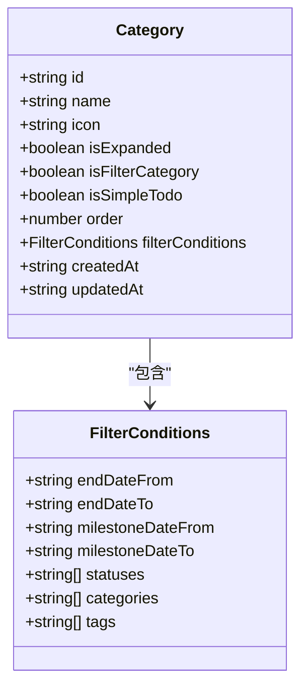

**Diagram sources**
- [todoService.js](file://src/services/todoService.js#L20-L39)

### 状态管理机制

`useCategoriesStore` 通过 Vue 的响应式系统管理分类状态，主要状态变量包括：

- `categories`: 响应式数组，存储所有分类数据
- `isLoading`: 布尔值，标识数据加载状态

状态管理遵循单向数据流原则，所有状态变更都通过定义的 actions 进行，确保了状态变更的可预测性和可追踪性。

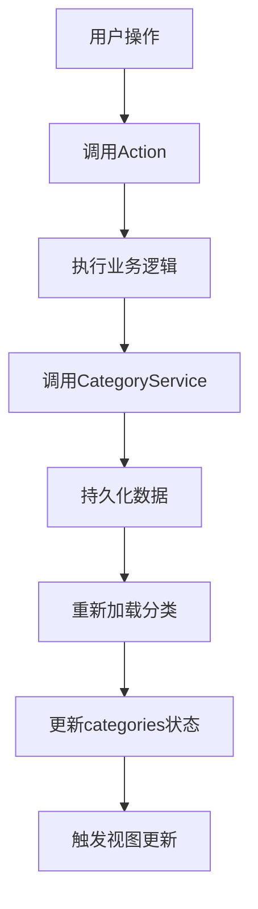

**Diagram sources**
- [useCategoriesStore.js](file://src/stores/useCategoriesStore.js#L6-L7)
- [useCategoriesStore.js](file://src/stores/useCategoriesStore.js#L115-L185)

**Section sources**
- [useCategoriesStore.js](file://src/stores/useCategoriesStore.js#L6-L185)

## 计算属性实现

### 分类过滤机制

`useCategoriesStore` 提供了多个计算属性来实现分类数据的动态过滤，这些属性基于 `categories` 状态数组进行计算，自动响应状态变化。

#### regularCategories

`regularCategories` 计算属性用于获取普通分类，排除筛选类和简单Todo类：

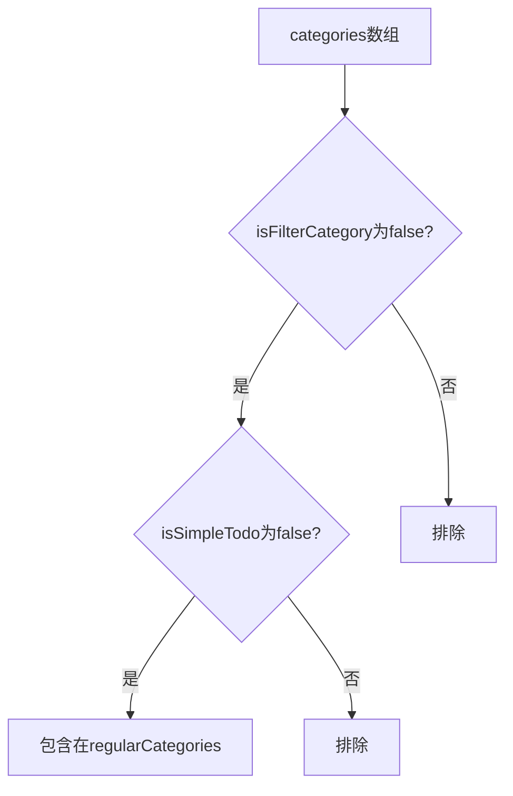

**Diagram sources**
- [useCategoriesStore.js](file://src/stores/useCategoriesStore.js#L12-L14)

#### filterCategories

`filterCategories` 计算属性专门用于获取筛选类分类，这些分类用于显示符合特定条件的待办事项：

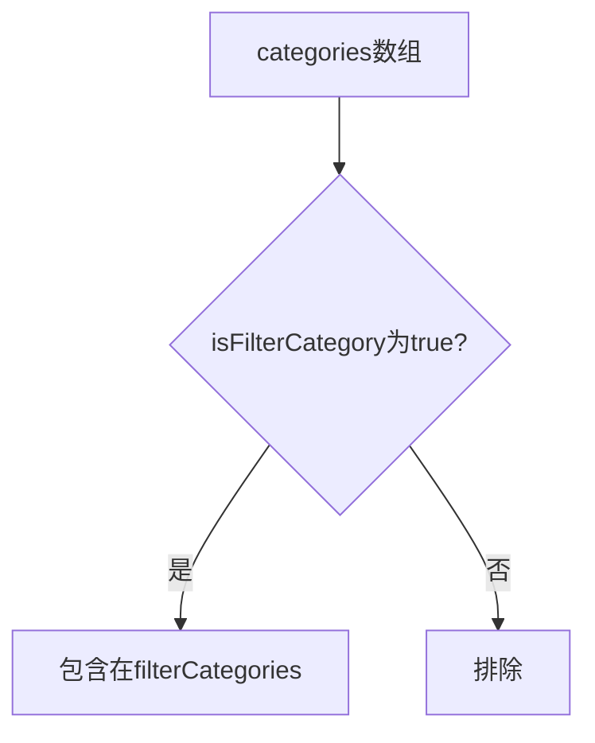

**Diagram sources**
- [useCategoriesStore.js](file://src/stores/useCategoriesStore.js#L16-L18)

#### simpleTodoCategories

`simpleTodoCategories` 计算属性用于获取简单Todo类分类，这些分类用于轻量级的四象限待办管理：

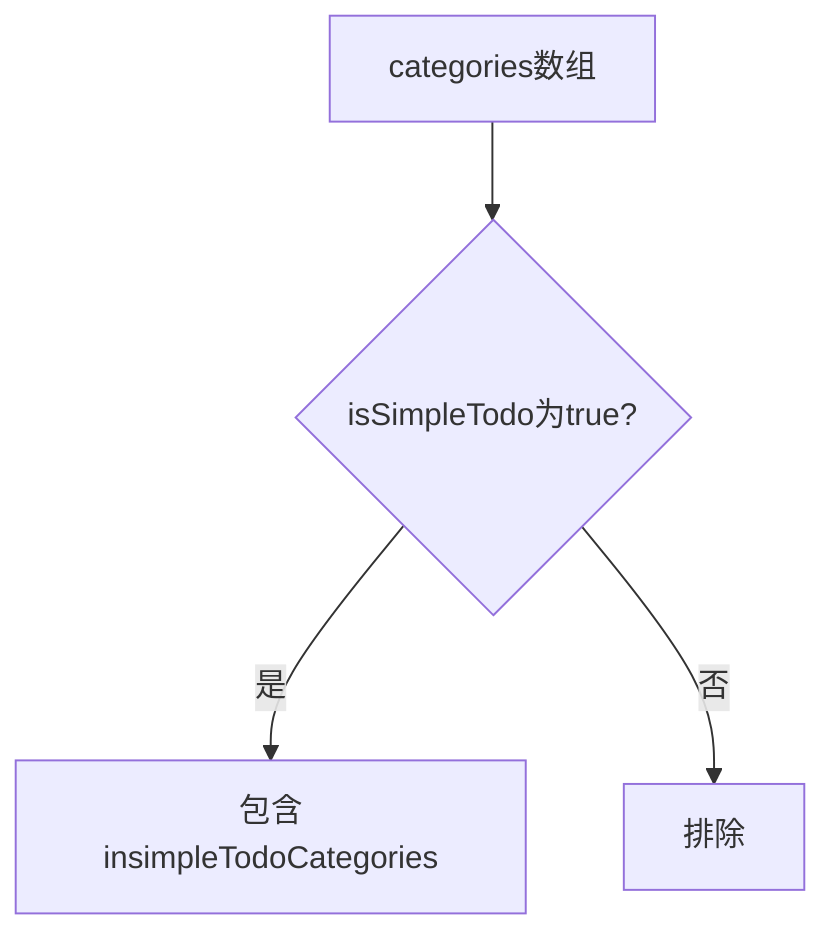

**Diagram sources**
- [useCategoriesStore.js](file://src/stores/useCategoriesStore.js#L20-L22)

**Section sources**
- [useCategoriesStore.js](file://src/stores/useCategoriesStore.js#L12-L24)

## 操作接口与事务处理

### Action 事务处理流程

`useCategoriesStore` 的 actions 实现了完整的事务处理流程，确保数据操作的原子性和一致性。

#### createNewCategory

`createNewCategory` 方法用于创建新的分类，其事务处理流程如下：

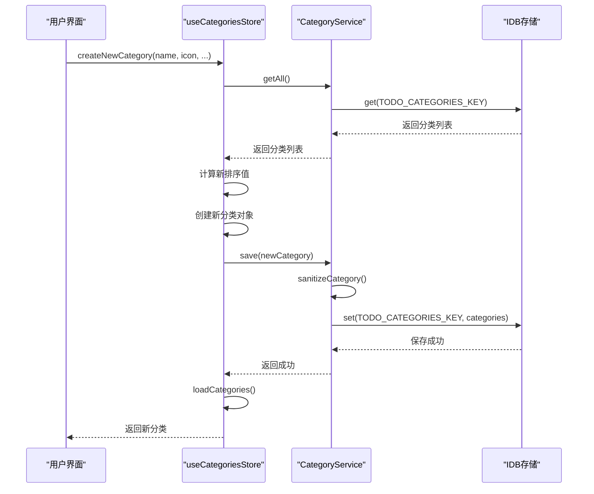

**Diagram sources**
- [useCategoriesStore.js](file://src/stores/useCategoriesStore.js#L53-L78)
- [todoService.js](file://src/services/todoService.js#L99-L137)

#### updateCategory

`updateCategory` 方法用于更新现有分类，其事务处理流程如下：

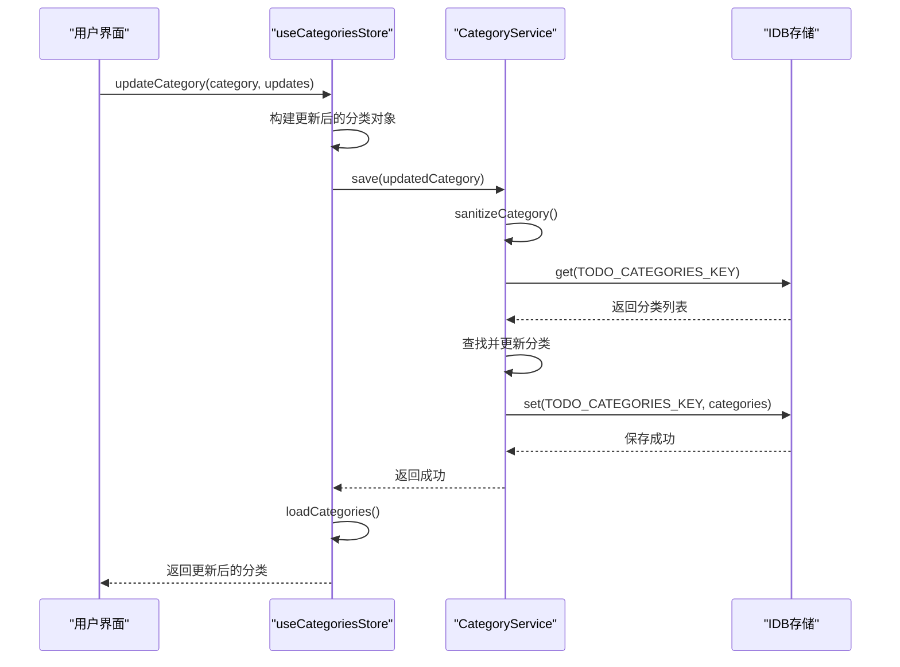

**Diagram sources**
- [useCategoriesStore.js](file://src/stores/useCategoriesStore.js#L79-L114)
- [todoService.js](file://src/services/todoService.js#L99-L137)

#### deleteCategory

`deleteCategory` 方法用于删除分类，其事务处理流程如下：

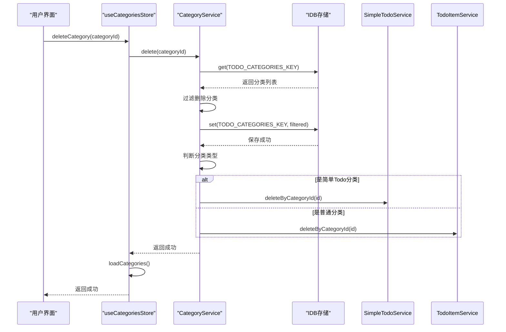

**Diagram sources**
- [useCategoriesStore.js](file://src/stores/useCategoriesStore.js#L115-L126)
- [todoService.js](file://src/services/todoService.js#L139-L154)

### 错误处理策略

`useCategoriesStore` 的 actions 采用了统一的错误处理策略，通过 try-catch 机制捕获异常，并将错误信息记录到控制台后重新抛出，确保调用方能够正确处理错误。

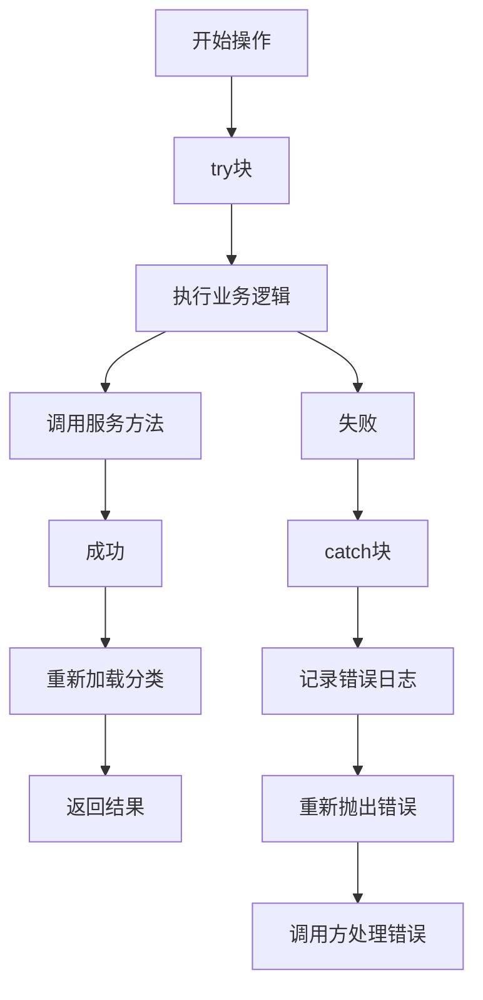

**Diagram sources**
- [useCategoriesStore.js](file://src/stores/useCategoriesStore.js#L54-L57)
- [useCategoriesStore.js](file://src/stores/useCategoriesStore.js#L80-L83)

**Section sources**
- [useCategoriesStore.js](file://src/stores/useCategoriesStore.js#L53-L126)
- [todoService.js](file://src/services/todoService.js#L83-L154)

## 拖拽排序逻辑

### reorderCategoriesByDrag 应用逻辑

`reorderCategoriesByDrag` 方法实现了拖拽排序的核心逻辑，通过与 `CategoryService.reorderByDrag` 的交互完成分类的重新排序。

#### 拖拽排序流程

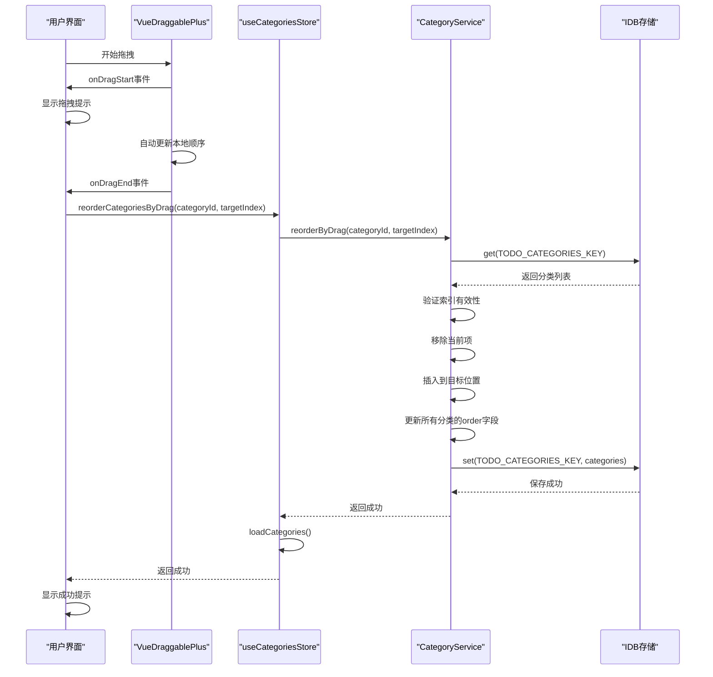

**Diagram sources**
- [useCategoriesStore.js](file://src/stores/useCategoriesStore.js#L158-L170)
- [todoService.js](file://src/services/todoService.js#L196-L225)
- [TodoSidebar.vue](file://src/components/TodoSidebar.vue#L200-L230)

#### 边界条件处理

`reorderCategoriesByDrag` 方法在实现时充分考虑了各种边界条件：

- **无效索引检查**: 确保 `currentIndex` 和 `targetIndex` 在有效范围内
- **相同位置处理**: 如果 `currentIndex` 等于 `targetIndex`，直接返回成功
- **索引调整**: 在移除元素后，如果 `targetIndex` 大于 `currentIndex`，需要调整目标索引

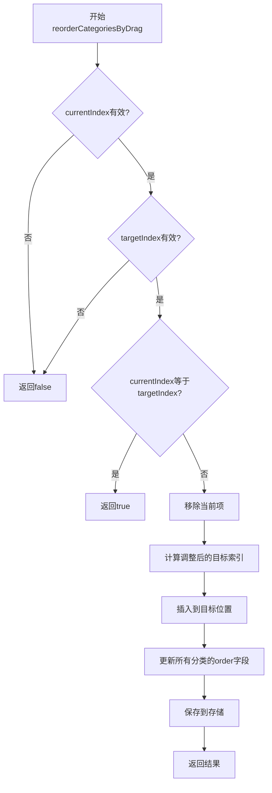

**Diagram sources**
- [todoService.js](file://src/services/todoService.js#L196-L225)

**Section sources**
- [useCategoriesStore.js](file://src/stores/useCategoriesStore.js#L158-L170)
- [todoService.js](file://src/services/todoService.js#L196-L225)

## 异步加载机制

### loadCategories 异步加载

`loadCategories` 方法实现了分类数据的异步加载机制，确保了数据的最新状态。

#### 加载流程

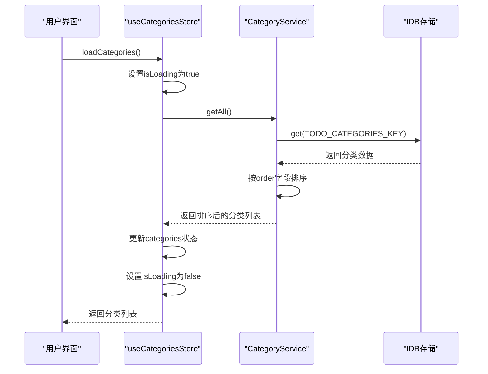

**Diagram sources**
- [useCategoriesStore.js](file://src/stores/useCategoriesStore.js#L38-L51)
- [todoService.js](file://src/services/todoService.js#L83-L92)

#### 加载状态管理

`loadCategories` 方法通过 `isLoading` 状态变量管理加载过程，为用户提供清晰的加载反馈：

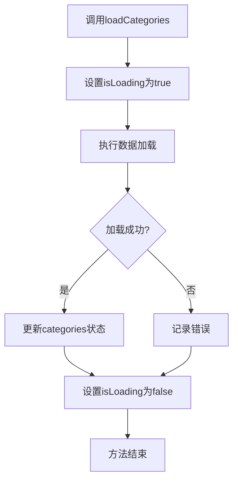

**Diagram sources**
- [useCategoriesStore.js](file://src/stores/useCategoriesStore.js#L38-L51)

**Section sources**
- [useCategoriesStore.js](file://src/stores/useCategoriesStore.js#L38-L51)
- [todoService.js](file://src/services/todoService.js#L83-L92)

## 状态同步与缓存一致性

### 最佳实践

`useCategoriesStore` 在状态同步和缓存一致性方面采用了以下最佳实践：

#### 数据一致性策略

1. **单一数据源**: 所有分类数据以 `CategoryService` 中的存储为单一数据源
2. **读写分离**: 读取操作通过 `getAll()` 获取最新数据，写入操作通过 `save()` 更新数据
3. **操作后刷新**: 每次写入操作后调用 `loadCategories()` 确保状态与存储一致

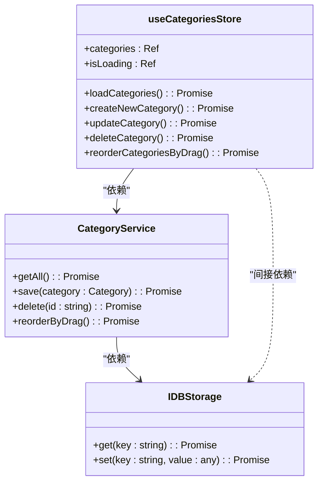

**Diagram sources**
- [useCategoriesStore.js](file://src/stores/useCategoriesStore.js#L4-L185)
- [todoService.js](file://src/services/todoService.js#L83-L225)

#### 错误处理与恢复

当操作失败时，`useCategoriesStore` 采用以下策略确保状态一致性：

1. **错误传播**: 将底层错误原样抛出，由调用方决定如何处理
2. **状态隔离**: 操作失败不会影响现有状态，避免状态污染
3. **用户反馈**: 通过控制台日志提供详细的错误信息，便于调试

**Section sources**
- [useCategoriesStore.js](file://src/stores/useCategoriesStore.js#L38-L185)
- [todoService.js](file://src/services/todoService.js#L83-L225)

## 调用链示例

### 分类创建完整调用链

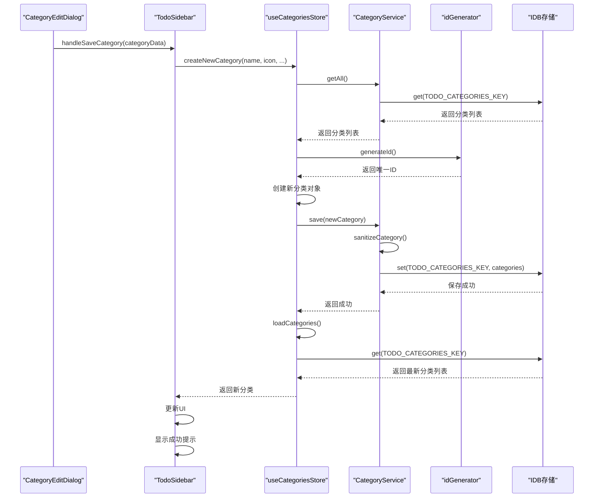

**Diagram sources**
- [CategoryEditDialog.vue](file://src/model/CategoryEditDialog.vue#L410-L470)
- [TodoSidebar.vue](file://src/components/TodoSidebar.vue#L500-L530)
- [useCategoriesStore.js](file://src/stores/useCategoriesStore.js#L53-L78)
- [todoService.js](file://src/services/todoService.js#L99-L137)
- [idGenerator.js](file://src/utils/idGenerator.js#L10-L12)

### 分类更新完整调用链

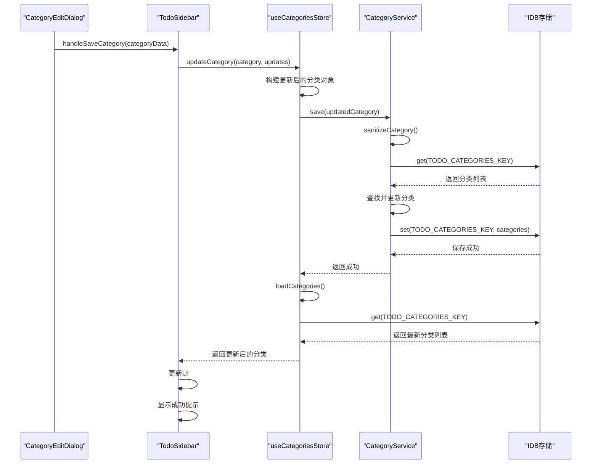

**Diagram sources**
- [CategoryEditDialog.vue](file://src/model/CategoryEditDialog.vue#L410-L470)
- [TodoSidebar.vue](file://src/components/TodoSidebar.vue#L500-L530)
- [useCategoriesStore.js](file://src/stores/useCategoriesStore.js#L79-L114)
- [todoService.js](file://src/services/todoService.js#L99-L137)

### 分类排序完整调用链

```mermaid
sequenceDiagram
    participant Draggable as "VueDraggablePlus"
    participant Sidebar as "TodoSidebar"
    participant Store as "useCategoriesStore"
    participant Service as "CategoryService"
    participant Storage as "IDB存储"
    
    Draggable->>Sidebar: onDragEnd(event)
    Sidebar->>Store: reorderCategoriesByDrag(categoryId, targetIndex)
    Store->>Service: reorderByDrag(categoryId, targetIndex)
    Service->>Storage: get(TODO_CATEGORIES_KEY)
    Storage-->>Service: 返回分类列表
    Service->>Service: 验证索引有效性
    Service->>Service: 移除当前项
    Service->>Service: 插入到目标位置
    Service->>Service: 更新所有分类的order字段
    Service->>Storage: set(TODO_CATEGORIES_KEY, categories)
    Storage-->>Service: 保存成功
    Service-->>Store: 返回成功
    Store->>Store: loadCategories()
    Store->>Storage: get(TODO_CATEGORIES_KEY)
    Storage-->>Store: 返回最新分类列表
    Store-->>Sidebar: 返回成功
    Sidebar->>Sidebar: 更新UI
    Sidebar