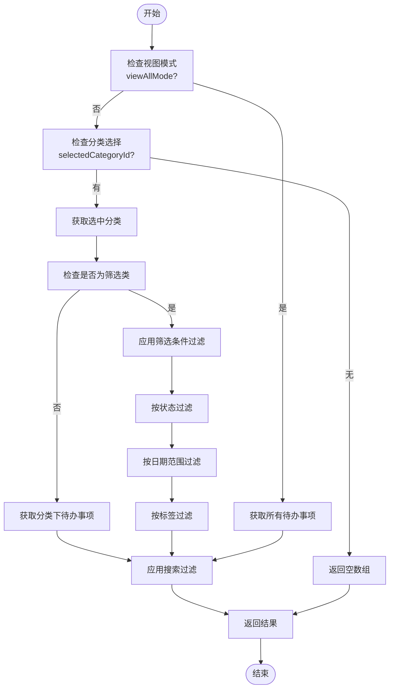
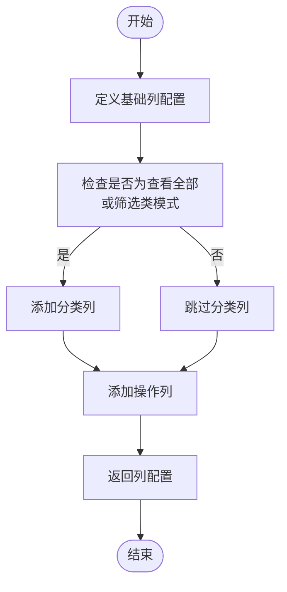
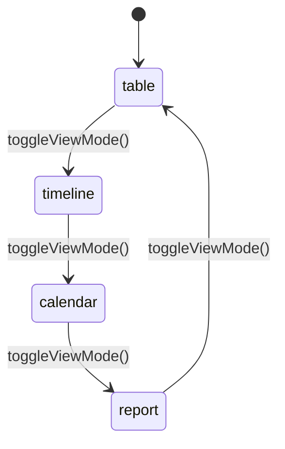
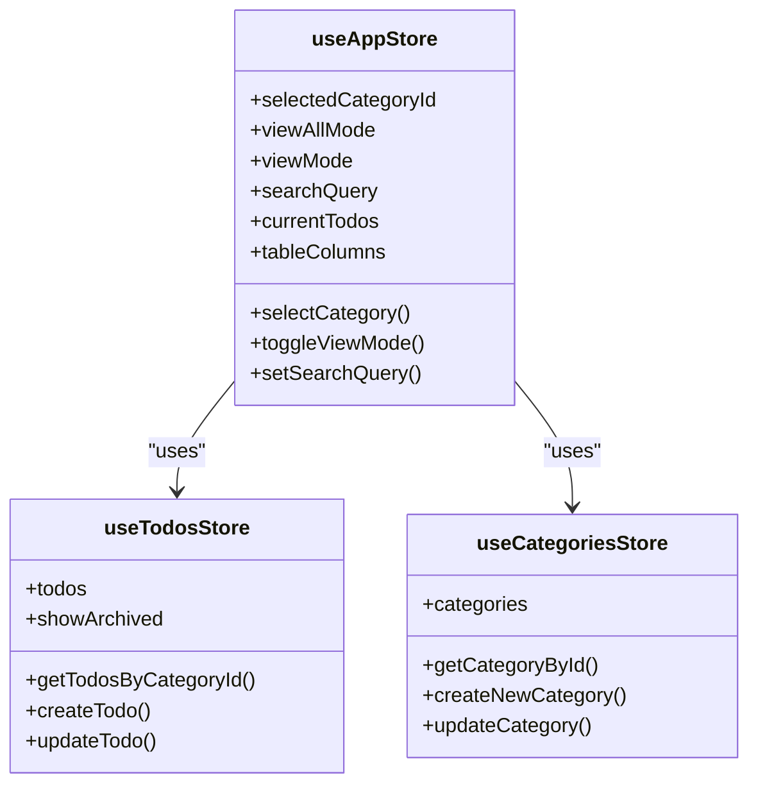

# 应用状态管理 (useAppStore)

<cite>
**Referenced Files in This Document**   
- [useAppStore.js](file://src/stores/useAppStore.js)
- [useCategoriesStore.js](file://src/stores/useCategoriesStore.js)
- [useTodosStore.js](file://src/stores/useTodosStore.js)
- [index.vue](file://src/views/tidyDo/index.vue)
- [TodoHeader.vue](file://src/views/tidyDo/components/TodoHeader.vue)
- [TodoContent.vue](file://src/views/tidyDo/components/TodoContent.vue)
- [TableRow.vue](file://src/views/tidyDo/components/TableRow.vue)
</cite>

## 目录
1. [全局状态管理机制](#全局状态管理机制)
2. [计算属性与动态数据流](#计算属性与动态数据流)
3. [核心Action与组件交互](#核心action与组件交互)
4. [Store初始化与状态重置](#store初始化与状态重置)
5. [跨Store调用实现](#跨store调用实现)
6. [状态一致性最佳实践](#状态一致性最佳实践)
7. [性能优化策略](#性能优化策略)

## 全局状态管理机制

`useAppStore` 是 TidyDo 应用的核心状态管理模块，采用 Pinia 实现全局状态的集中管理。该 store 负责维护应用级别的 UI 状态和用户交互状态，确保不同组件间的状态同步与一致性。

### 核心状态定义

`useAppStore` 定义了多个响应式状态变量，用于跟踪当前应用的视图状态和用户交互：

- **selectedCategoryId**: 当前选中的分类ID，`null` 表示未选择任何分类
- **viewAllMode**: 查看全部模式开关，`true` 时显示所有待办事项
- **viewMode**: 当前视图模式，支持 `'table' | 'timeline' | 'calendar' | 'report'` 四种模式
- **searchQuery**: 搜索查询字符串，用于全文搜索过滤

这些状态通过 `ref` 函数创建，确保其响应性，任何对这些状态的修改都会自动触发依赖它们的计算属性和组件的重新渲染。

### 状态管理原则

该 store 遵循单一数据源原则，所有与应用视图相关的状态都集中在此 store 中管理。这种设计避免了状态在多个组件间传递导致的不一致问题，同时简化了状态的调试和追踪。

**Section sources**
- [useAppStore.js](file://src/stores/useAppStore.js#L4-L15)

## 计算属性与动态数据流

`useAppStore` 通过计算属性（computed properties）实现复杂的数据处理逻辑，将原始数据转换为视图层所需的格式。

### currentTodos 计算属性

`currentTodos` 是核心计算属性，负责根据当前分类、视图模式和搜索条件动态生成待办事项列表。其数据流遵循以下逻辑：

1. **模式判断**: 首先判断是否处于 `viewAllMode`
2. **分类过滤**: 根据 `selectedCategoryId` 获取对应分类的待办事项
3. **筛选类处理**: 如果是筛选类分类，应用其预设的过滤条件
4. **搜索过滤**: 应用 `searchQuery` 进行全文搜索
5. **结果返回**: 返回最终过滤后的待办事项数组

该计算属性通过依赖 `useTodosStore` 和 `useCategoriesStore` 的状态，实现了跨 store 的数据整合。

**Diagram sources**
- [useAppStore.js](file://src/stores/useAppStore.js#L48-L144)

**Section sources**
- [useAppStore.js](file://src/stores/useAppStore.js#L48-L144)

### tableColumns 计算属性

`tableColumns` 动态生成表格的列配置，根据当前视图模式和分类类型调整列的显示：

- **基础列**: 编号、标题、节点日期、截止日期、状态
- **条件列**: 在 `viewAllMode` 或筛选类模式下，添加"分类"列
- **操作列**: 始终显示操作列

这种动态配置确保了在不同场景下表格的合理布局，提升了用户体验。

**Diagram sources**
- [useAppStore.js](file://src/stores/useAppStore.js#L146-L168)

**Section sources**
- [useAppStore.js](file://src/stores/useAppStore.js#L146-L168)

## 核心Action与组件交互

`useAppStore` 提供了一系列 Action 方法，用于响应用户交互并更新应用状态。

### selectCategory 方法

`selectCategory` 方法处理分类选择逻辑：

- 更新 `selectedCategoryId` 状态
- 如果在 `viewAllMode` 下选择分类，则自动退出该模式
- 清空搜索查询，确保新的分类视图不受之前搜索的影响

该方法在 `TodoSidebar` 组件中通过事件监听器调用，实现了侧边栏与主内容区的联动。

**Section sources**
- [useAppStore.js](file://src/stores/useAppStore.js#L170-L178)
- [index.vue](file://src/views/tidyDo/index.vue#L10-L13)

### toggleViewMode 方法

`toggleViewMode` 实现了四种视图模式的循环切换：

- 当前模式 → 下一模式 → ... → 当前模式
- 支持表格、时间线、日历和报表四种视图的无缝切换

该方法在 `TodoHeader` 组件中被调用，用户通过视图切换按钮触发此操作。

**Diagram sources**
- [useAppStore.js](file://src/stores/useAppStore.js#L226-L235)
- [TodoHeader.vue](file://src/views/tidyDo/components/TodoHeader.vue#L50-L94)

**Section sources**
- [useAppStore.js](file://src/stores/useAppStore.js#L226-L235)

### setSearchQuery 方法

`setSearchQuery` 方法处理搜索功能：

- 更新 `searchQuery` 状态
- 触发 `currentTodos` 计算属性的重新计算
- 实现即时搜索效果

该方法在 `TodoHeader` 组件中通过 `v-model` 双向绑定自动调用，确保搜索输入与状态同步。

**Section sources**
- [useAppStore.js](file://src/stores/useAppStore.js#L256-L260)
- [TodoHeader.vue](file://src/views/tidyDo/components/TodoHeader.vue#L108-L115)

## Store初始化与状态重置

`useAppStore` 提供了完整的生命周期管理功能，确保应用状态的正确初始化和清理。

### 初始化逻辑

`initializeSelection` 方法在应用启动时调用，确保：

- 如果存在分类但未选择任何分类，则自动选择第一个分类
- 避免出现"未选择分类"的空白状态

该初始化逻辑在应用加载分类数据后执行，确保用户始终能看到有效内容。

**Section sources**
- [useAppStore.js](file://src/stores/useAppStore.js#L214-L224)

### 状态重置

`resetState` 方法提供了一键重置功能：

- 将所有状态恢复到默认值
- 用于应用重启、用户登出或错误恢复场景

该方法确保了状态的可预测性和可恢复性，是应用健壮性的重要保障。

**Section sources**
- [useAppStore.js](file://src/stores/useAppStore.js#L245-L254)

## 跨Store调用实现

`useAppStore` 通过导入和调用其他 store 实现了跨 store 的数据访问和操作。

### 依赖关系

`useAppStore` 明确依赖两个核心 store：

- **useTodosStore**: 访问待办事项数据和操作方法
- **useCategoriesStore**: 访问分类数据和操作方法

这种依赖关系通过 ES6 模块导入实现，确保了类型安全和代码可维护性。

**Diagram sources**
- [useAppStore.js](file://src/stores/useAppStore.js#L3-L4)
- [useAppStore.js](file://src/stores/useAppStore.js#L50-L51)
- [useAppStore.js](file://src/stores/useAppStore.js#L57-L58)

**Section sources**
- [useAppStore.js](file://src/stores/useAppStore.js#L3-L4)

### 运行时调用

在计算属性和方法执行时，`useAppStore` 通过调用 `useTodosStore()` 和 `useCategoriesStore()` 获取 store 实例，然后访问其状态和方法。这种运行时调用模式确保了 store 实例的正确性和响应性。

## 状态一致性最佳实践

为避免状态不一致问题，`useAppStore` 采用了多种最佳实践。

### 状态更新原子性

所有状态更新操作都被封装在单个方法中，确保相关状态的同步更新。例如，`selectCategory` 方法同时处理分类选择、模式切换和搜索清空，避免了状态不一致的风险。

### 事件驱动更新

通过组件事件驱动状态更新，而不是直接修改 store 状态。例如，`TodoSidebar` 组件通过 `@category-select` 事件通知 `useAppStore` 进行分类选择，实现了关注点分离。

**Section sources**
- [index.vue](file://src/views/tidyDo/index.vue#L10-L13)

### 依赖状态同步

当依赖的 store 状态发生变化时，`useAppStore` 提供了 `handleCategoryUpdated` 方法来同步更新自身状态：

- 当分类列表更新时，检查当前选中的分类是否仍然存在
- 如果不存在，则自动选择新的有效分类
- 确保状态的持续有效性

**Section sources**
- [useAppStore.js](file://src/stores/useAppStore.js#L180-L198)
- [index.vue](file://src/views/tidyDo/index.vue#L12)

## 性能优化策略

`useAppStore` 采用了多种策略来优化应用性能。

### 计算属性缓存

利用 Vue 的计算属性缓存机制，`currentTodos` 和 `tableColumns` 只有在依赖状态发生变化时才会重新计算，避免了不必要的重复计算。

### 搜索性能优化

搜索功能实现了多项优化：

- **最小匹配长度**: 编号搜索要求至少两个字符，减少不必要的计算
- **多字段搜索**: 支持标题、描述、标签和编号的全面搜索
- **大小写不敏感**: 统一转换为小写进行比较，提升搜索体验

### 视图模式优化

不同视图模式下只渲染必要的组件：

- 简单Todo模式下隐藏视图切换按钮
- 报表视图仅在 `viewAllMode` 下显示
- 根据实际需要动态加载不同视图组件

这种按需渲染策略显著提升了应用性能和响应速度。

**Section sources**
- [TodoHeader.vue](file://src/views/tidyDo/components/TodoHeader.vue#L48-L94)
- [TodoContent.vue](file://src/views/tidyDo/components/TodoContent.vue#L1-L384)