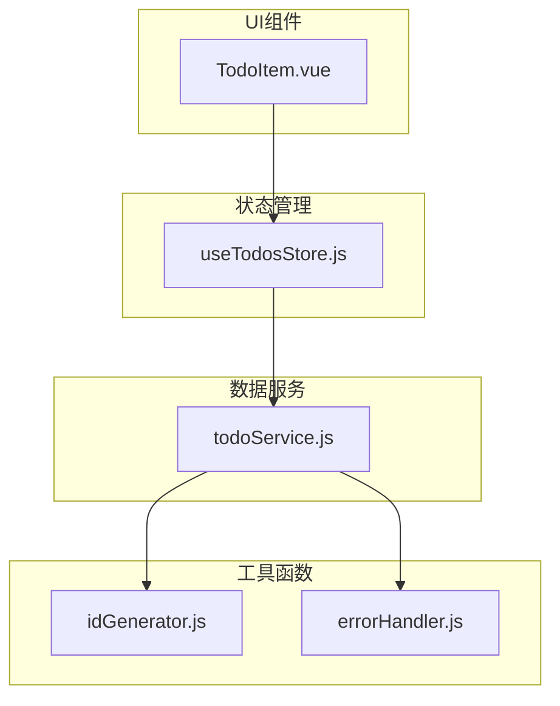
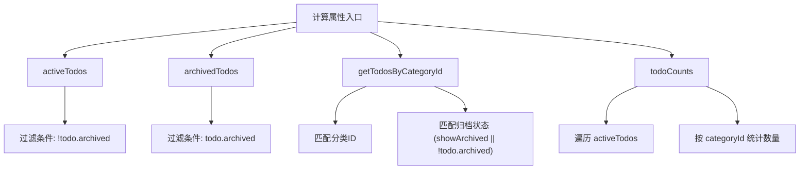
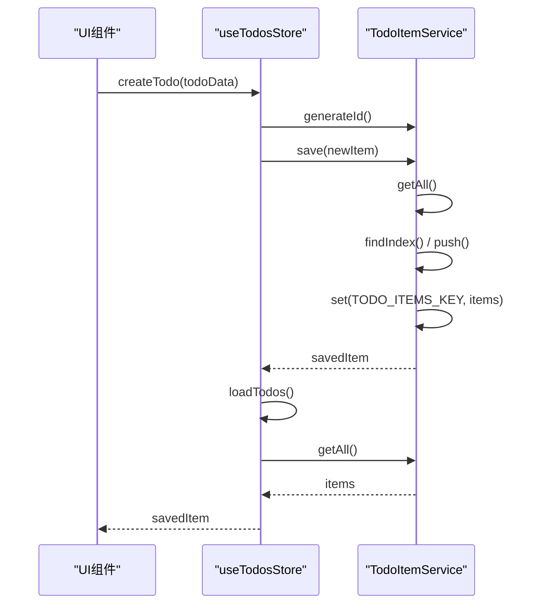
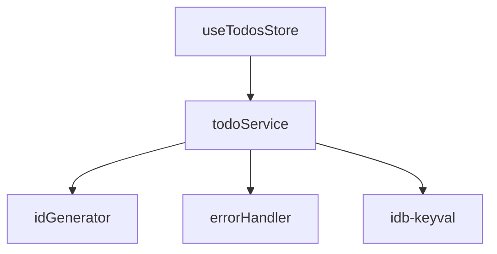

# 待办事项状态管理 (useTodosStore)

<cite>
**本文档引用的文件**
- [useTodosStore.js](file://src/stores/useTodosStore.js)
- [todoService.js](file://src/services/todoService.js)
- [idGenerator.js](file://src/utils/idGenerator.js)
- [errorHandler.js](file://src/utils/errorHandler.js)
- [TodoItem.vue](file://src/views/tidyDo/components/TodoItem.vue)
</cite>

## 目录
1. [简介](#简介)
2. [项目结构](#项目结构)
3. [核心组件](#核心组件)
4. [架构概述](#架构概述)
5. [详细组件分析](#详细组件分析)
6. [依赖分析](#依赖分析)
7. [性能考虑](#性能考虑)
8. [故障排除指南](#故障排除指南)
9. [结论](#结论)

## 简介
`useTodosStore` 是 TidyDo 应用的核心状态管理模块，基于 Vue 的 Pinia 框架实现。该模块负责管理所有待办事项（Todo）的状态，提供响应式的数据访问接口，并通过与 `TodoItemService` 协同工作确保数据的持久化一致性。本文档全面解析其架构设计、实现细节及性能优化策略。

## 项目结构
`useTodosStore` 位于 `src/stores/` 目录下，是应用状态管理的核心。它依赖于 `src/services/todoService.js` 进行数据持久化，并利用 `src/utils/` 目录下的工具函数处理 ID 生成和错误管理。



**Diagram sources**
- [useTodosStore.js](file://src/stores/useTodosStore.js)
- [todoService.js](file://src/services/todoService.js)
- [idGenerator.js](file://src/utils/idGenerator.js)
- [errorHandler.js](file://src/utils/errorHandler.js)
- [TodoItem.vue](file://src/views/tidyDo/components/TodoItem.vue)

**Section sources**
- [useTodosStore.js](file://src/stores/useTodosStore.js)
- [todoService.js](file://src/services/todoService.js)

## 核心组件
`useTodosStore` 的核心是 `todos` 数组，它通过 Pinia 的 `ref` 进行响应式管理。所有对 `todos` 的读取和修改都通过定义的 `getters` 和 `actions` 进行，确保了状态变更的可预测性和可追踪性。

**Section sources**
- [useTodosStore.js](file://src/stores/useTodosStore.js#L4-L169)

## 架构概述
该模块采用典型的 MVVM（Model-View-ViewModel）架构。`todos` 数组作为模型（Model），`useTodosStore` 作为视图模型（ViewModel），负责业务逻辑和状态管理，而 `TodoItem.vue` 等组件作为视图（View）消费状态。

```mermaid
classDiagram
class useTodosStore {
-todos : ref<Todo[]>
-isLoading : ref<boolean>
-showArchived : ref<boolean>
+activeTodos : computed<Todo[]>
+archivedTodos : computed<Todo[]>
+getTodosByCategoryId : computed<(categoryId : string) => Todo[]>
+todoCounts : computed<{[categoryId : string] : number}>
+loadTodos() : Promise<void>
+createTodo(todoData : Object) : Promise<Todo>
+updateTodo(todoData : Object) : Promise<Todo>
+deleteTodo(todoId : string) : Promise<boolean>
+toggleTodoArchived(todo : Todo) : Promise<Todo>
+toggleShowArchived() : void
}
class TodoItemService {
+getAll() : Promise<Todo[]>
+save(item : Todo) : Promise<Todo>
+delete(id : string) : Promise<void>
+generateId() : string
}
class TodoItem {
+id : string
+categoryId : string
+title : string
+description : string
+priority : string
+status : string
+tags : string[]
+milestoneDate : string | null
+endDate : string | null
+assignee : string | null
+attachments : string[]
+archived : boolean
+createdAt : string
+updatedAt : string
}
useTodosStore --> TodoItemService : "依赖"
useTodosStore --> TodoItem : "管理"
```

**Diagram sources**
- [useTodosStore.js](file://src/stores/useTodosStore.js#L4-L169)
- [todoService.js](file://src/services/todoService.js#L232-L290)

## 详细组件分析

### 状态与计算属性分析
`useTodosStore` 定义了多个计算属性（Getters）来提供对 `todos` 数组的过滤和统计视图。

#### 计算属性逻辑


**Diagram sources**
- [useTodosStore.js](file://src/stores/useTodosStore.js#L10-L45)

#### activeTodos 与 archivedTodos
这两个计算属性分别返回未归档和已归档的待办事项列表。它们的实现非常直接，利用 `Array.filter()` 方法对 `todos` 数组进行筛选。

**Section sources**
- [useTodosStore.js](file://src/stores/useTodosStore.js#L12-L15)

#### getTodosByCategoryId
这是一个高阶计算属性，它返回一个函数，该函数接受 `categoryId` 作为参数。其过滤逻辑包含两个条件：一是待办事项必须属于指定的分类，二是必须满足当前的 `showArchived` 状态（即显示所有或仅显示未归档）。

**Section sources**
- [useTodosStore.js](file://src/stores/useTodosStore.js#L21-L30)

#### todoCounts
该计算属性统计每个分类下未归档的待办事项数量。它遍历 `activeTodos`，并使用一个对象 `counts` 来累加每个 `categoryId` 对应的数量。

**Section sources**
- [useTodosStore.js](file://src/stores/useTodosStore.js#L32-L40)

### Actions 与数据持久化分析
`useTodosStore` 的 actions 负责与 `TodoItemService` 交互，实现数据的持久化。

#### Action 与 Service 协同流程


**Diagram sources**
- [useTodosStore.js](file://src/stores/useTodosStore.js#L48-L169)
- [todoService.js](file://src/services/todoService.js#L232-L290)

#### createTodo, updateTodo, deleteTodo
这三个 action 是数据操作的核心。它们的共同特点是：先调用 `TodoItemService` 的相应方法进行数据持久化，然后调用 `loadTodos()` 重新从存储中加载所有数据，以确保状态与持久化层完全一致。这种“写后读”（Write-then-Read）的策略简化了状态同步的复杂性。

**Section sources**
- [useTodosStore.js](file://src/stores/useTodosStore.js#L48-L107)

#### toggleTodoArchived 与 toggleShowArchived
这两个方法实现了双向状态同步。
- `toggleTodoArchived`：用于切换单个待办事项的 `archived` 状态。它会创建一个新对象，翻转 `archived` 字段，然后通过 `save` 方法持久化，并触发 `loadTodos` 来更新整个状态。
- `toggleShowArchived`：用于切换视图层的 `showArchived` 标志。它直接修改 `showArchived` 的值，由于 `getTodosByCategoryId` 等计算属性依赖于它，因此视图会自动更新。

**Section sources**
- [useTodosStore.js](file://src/stores/useTodosStore.js#L117-L136)

## 依赖分析
`useTodosStore` 的依赖关系清晰，体现了良好的分层设计。



**Diagram sources**
- [useTodosStore.js](file://src/stores/useTodosStore.js#L1)
- [todoService.js](file://src/services/todoService.js#L1-L2)

**Section sources**
- [useTodosStore.js](file://src/stores/useTodosStore.js)
- [todoService.js](file://src/services/todoService.js)

## 性能考虑
在处理大规模待办事项时，当前的实现存在潜在的性能瓶颈，主要体现在 `loadTodos` 操作上，它每次都会加载所有数据。

### 性能优化建议
1.  **懒加载 (Lazy Loading)**：在应用启动或进入特定分类时，只加载必要的数据，而不是一次性加载所有待办事项。
2.  **分页策略 (Pagination)**：对于待办事项列表，实现分页加载。`useTodosStore` 可以提供 `loadTodosPage(page, size)` 方法，`TodoItemService` 需要支持分页查询。
3.  **增量更新 (Incremental Update)**：避免使用 `loadTodos()` 进行全量刷新。可以优化 `createTodo`、`updateTodo`、`deleteTodo` 等 action，直接在内存中的 `todos` 数组上进行增删改操作，仅在操作成功后更新数组，从而减少一次不必要的 `getAll()` 调用。
4.  **响应式更新最佳实践**：当前使用 `ref([])` 管理数组是合适的。对于计算属性，Vue 的依赖追踪机制能确保只有在 `todos` 或 `showArchived` 变化时才会重新计算，这是高效的。

**Section sources**
- [useTodosStore.js](file://src/stores/useTodosStore.js#L6-L169)

## 故障排除指南
当待办事项数据出现不一致时，应按以下步骤排查：

1.  **检查持久化服务**：确认 `TodoItemService` 的 `getAll` 和 `save` 方法是否正常工作。查看控制台是否有来自 `withErrorHandling` 的错误日志。
2.  **验证状态同步**：检查 `createTodo` 等 action 是否在 `save` 后正确调用了 `loadTodos`。
3.  **检查计算属性依赖**：确保 `getTodosByCategoryId` 等计算属性正确地依赖了 `showArchived` 状态。
4.  **审查数据结构**：确认 `createTodoItem` 函数创建的对象结构与 `TodoItemService` 期望的结构一致。

**Section sources**
- [useTodosStore.js](file://src/stores/useTodosStore.js#L54-L107)
- [todoService.js](file://src/services/todoService.js#L233-L269)
- [errorHandler.js](file://src/utils/errorHandler.js#L50-L109)

## 结论
`useTodosStore` 是一个设计良好、职责清晰的状态管理模块。它通过 Pinia 提供了响应式的状态管理，并通过与 `TodoItemService` 的协同工作保证了数据的一致性。其计算属性的设计使得数据查询和统计变得简单高效。尽管在大规模数据下存在性能优化空间，但其基础架构为未来的优化（如分页、增量更新）提供了良好的支持。