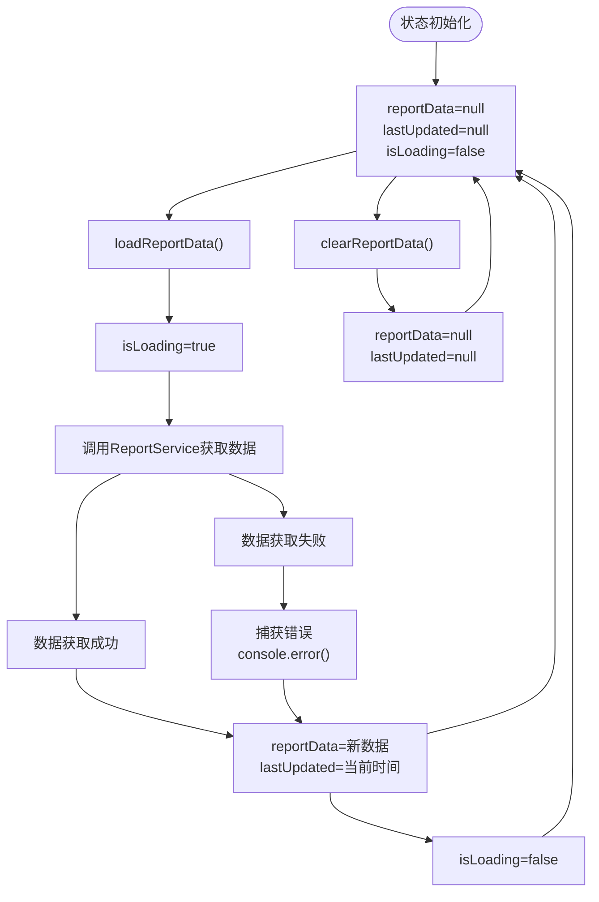
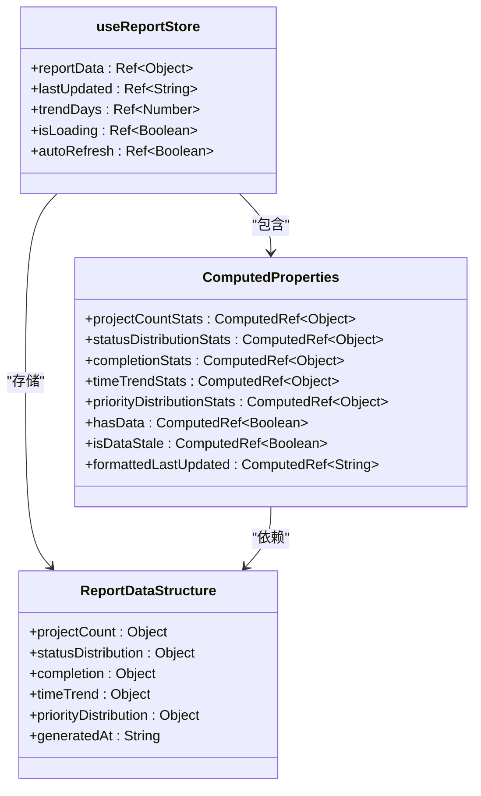
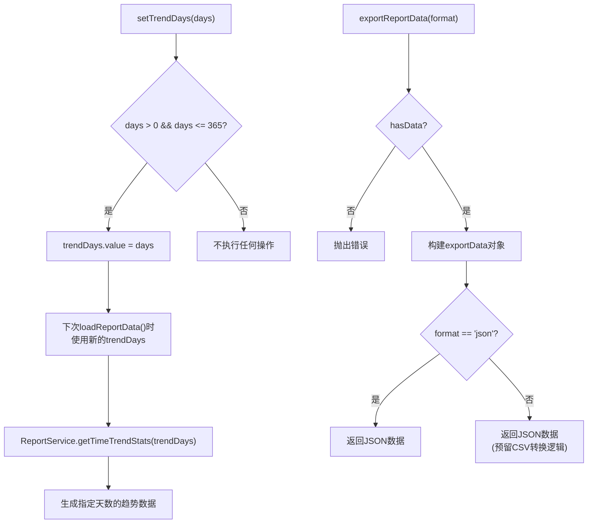
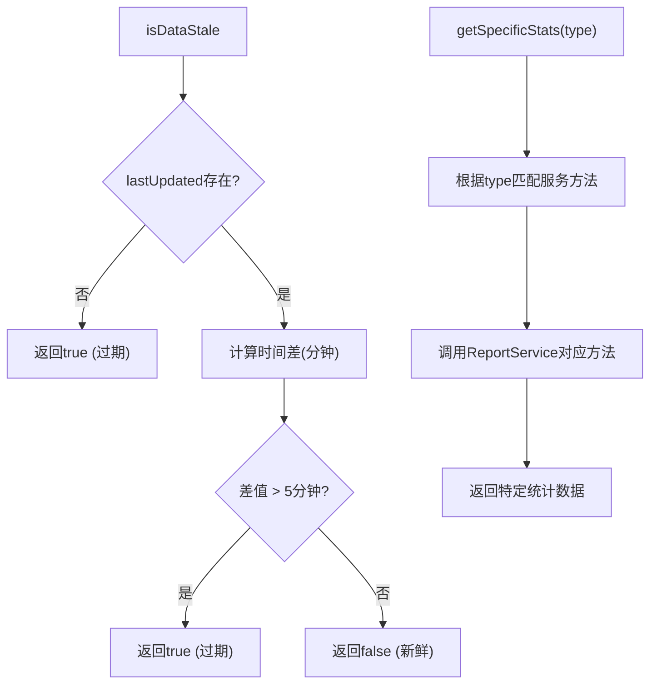

# 报表状态管理 (useReportStore)

<cite>
**Referenced Files in This Document**  
- [useReportStore.js](file://src/stores/useReportStore.js)
- [reportService.js](file://src/services/reportService.js)
- [TodoReport.vue](file://src/views/tidyDo/components/TodoReport.vue)
</cite>

## 目录
1. [状态生命周期管理](#状态生命周期管理)
2. [计算属性数据派生逻辑](#计算属性数据派生逻辑)
3. [异步加载与定时刷新机制](#异步加载与定时刷新机制)
4. [时间趋势分析与数据导出](#时间趋势分析与数据导出)
5. [数据过期检测与按需加载](#数据过期检测与按需加载)
6. [性能优化与内存管理](#性能优化与内存管理)

## 状态生命周期管理

`useReportStore` 采用响应式状态管理机制，核心状态包括 `reportData`、`lastUpdated`、`isLoading` 等，通过 Pinia store 实现全局状态的统一管理和响应式更新。

状态的生命周期始于初始化，store 创建时所有状态被设置为初始值（如 `reportData` 为 null，`lastUpdated` 为 null）。当调用 `loadReportData` 或 `refreshReportData` 方法时，进入加载状态，`isLoading` 被置为 true。数据加载成功后，`reportData` 被赋予从 `ReportService` 获取的最新报表数据，同时 `lastUpdated` 记录当前时间戳，标志着数据新鲜度的起点。此后，其他组件通过计算属性消费这些状态，实现视图的自动更新。

状态的生命周期可通过 `clearReportData` 或 `resetState` 方法主动终止，将 `reportData` 和 `lastUpdated` 置为 null，清除现有数据。当组件卸载时（如 `TodoReport.vue` 的 `onUnmounted` 钩子），会自动调用 `stopAutoRefresh` 停止定时刷新，避免内存泄漏。



**Diagram sources**
- [useReportStore.js](file://src/stores/useReportStore.js#L11-L13)
- [useReportStore.js](file://src/stores/useReportStore.js#L99-L140)

**Section sources**
- [useReportStore.js](file://src/stores/useReportStore.js#L9-L247)

## 计算属性数据派生逻辑

`useReportStore` 定义了多个计算属性，用于从核心的 `reportData` 对象中派生出特定维度的统计信息，实现数据的逻辑分离和高效复用。

- **`projectCountStats`**: 派生自 `reportData.value?.projectCount`，提供项目数量相关的统计，如总项目数、分类统计等。
- **`statusDistributionStats`**: 派生自 `reportData.value?.statusDistribution`，提供普通和简单待办事项的状态分布数据。
- **`completionStats`**: 派生自 `reportData.value?.completion`，提供完成率相关的统计数据，包括总体、普通和简单待办事项的完成情况。
- **`timeTrendStats`**: 派生自 `reportData.value?.timeTrend`，提供时间维度的趋势分析数据，用于绘制折线图。
- **`priorityDistributionStats`**: 派生自 `reportData.value?.priorityDistribution`，提供优先级分布数据。
- **`hasData`**: 一个简单的布尔计算属性，判断 `reportData` 是否不为 null，用于 UI 上的条件渲染。
- **`isDataStale`**: 一个关键的计算属性，根据 `lastUpdated` 时间戳判断数据是否过期（超过5分钟）。
- **`formattedLastUpdated`**: 将 `lastUpdated` 的 ISO 字符串格式化为本地可读的时间字符串。

这些计算属性是惰性求值的，只有在被访问时才会执行计算，并且会自动追踪其依赖（`reportData` 和 `lastUpdated`），当依赖变化时，它们会自动重新计算并触发视图更新。



**Diagram sources**
- [useReportStore.js](file://src/stores/useReportStore.js#L15-L79)
- [reportService.js](file://src/services/reportService.js#L260-L285)

**Section sources**
- [useReportStore.js](file://src/stores/useReportStore.js#L15-L79)

## 异步加载与定时刷新机制

`useReportStore` 提供了 `loadReportData` 和 `refreshReportData` 两个核心方法来管理数据的异步加载流程，并通过 `startAutoRefresh` 实现定时刷新。

`loadReportData` 方法是数据加载的核心。它首先将 `isLoading` 置为 true 以显示加载状态，然后调用 `ReportService.getComprehensiveReport` 方法。该方法接受一个包含 `trendDays` 选项的参数对象，用于定制报表的统计范围。数据获取成功后，将结果赋值给 `reportData`，并更新 `lastUpdated` 时间戳。无论成功或失败，最终都会将 `isLoading` 置为 false。`refreshReportData` 方法本质上是 `loadReportData` 的快捷方式，用于刷新当前配置下的数据。

定时刷新机制由 `startAutoRefresh` 和 `stopAutoRefresh` 方法控制。`startAutoRefresh` 接收一个以分钟为单位的刷新间隔（默认5分钟）。它首先调用 `stopAutoRefresh` 确保没有重复的定时器运行，然后创建一个新的 `setInterval` 定时器，并将其引用存储在 `refreshInterval` 中。定时器会周期性地调用 `refreshReportData` 方法来更新数据。`autoRefresh` 标志位用于在 UI 上显示自动刷新的状态。`stopAutoRefresh` 方法负责清除定时器并重置相关状态。

```mermaid
sequenceDiagram
participant UI as "UI组件"
participant Store as "useReportStore"
participant Service as "ReportService"
UI->>Store : refreshReportData()
Store->>Store : isLoading = true
Store->>Service : getComprehensiveReport(options)
Service->>Service : Promise.all(多个统计方法)
Service-->>Store : 返回综合报表数据
Store->>Store : reportData = 数据
Store->>Store : lastUpdated = 当前时间
Store->>Store : isLoading = false
Store-->>UI : 刷新完成
Note over Store,Service : 定时刷新流程
loop 每intervalMinutes分钟
Store->>Store : 触发定时器
Store->>Store : refreshReportData()
... (同上异步流程) ...
end
```

**Diagram sources**
- [useReportStore.js](file://src/stores/useReportStore.js#L99-L140)
- [useReportStore.js](file://src/stores/useReportStore.js#L142-L170)
- [reportService.js](file://src/services/reportService.js#L260-L285)

**Section sources**
- [useReportStore.js](file://src/stores/useReportStore.js#L99-L170)

## 时间趋势分析与数据导出

`setTrendDays` 方法允许用户动态调整时间趋势分析的统计周期。该方法接收一个天数参数，验证其有效性（大于0且不超过365天）后，将其设置为 `trendDays` 状态。这个状态值会被 `loadReportData` 方法读取，并作为 `trendDays` 选项传递给 `ReportService.getComprehensiveReport`，从而影响 `timeTrendStats` 的数据范围。例如，设置为90天时，`timeTrendStats` 将包含过去90天的创建和完成趋势数据。

`exportReportData` 方法实现了数据导出功能。它首先检查 `hasData` 以确保有数据可导出。然后，它创建一个包含原始 `reportData` 和额外元信息（如导出时间、格式）的 `exportData` 对象。目前支持 'json' 和 'csv' 两种格式。对于 JSON 格式，直接返回 `exportData` 对象。对于 CSV 格式，代码中预留了转换逻辑的位置，但当前实现仍返回 JSON 格式的数据。在 `TodoReport.vue` 组件中，该方法被用于生成可下载的 JSON 文件。



**Diagram sources**
- [useReportStore.js](file://src/stores/useReportStore.js#L138-L140)
- [useReportStore.js](file://src/stores/useReportStore.js#L209-L237)
- [TodoReport.vue](file://src/views/tidyDo/components/TodoReport.vue#L200-L222)

**Section sources**
- [useReportStore.js](file://src/stores/useReportStore.js#L138-L140)
- [useReportStore.js](file://src/stores/useReportStore.js#L209-L237)

## 数据过期检测与按需加载

`isDataStale` 计算属性是数据新鲜度的核心检测机制。它通过比较当前时间与 `lastUpdated` 时间戳的差值来判断数据是否过期。具体逻辑是：如果 `lastUpdated` 为 null，则认为数据过期；否则，计算两个时间点之间的分钟数，如果超过5分钟，则返回 true，表示数据已过期。这个属性在 `TodoReport.vue` 组件的 `onMounted` 钩子中被使用，用于决定是否在组件挂载时自动加载数据。

`getSpecificStats` 方法提供了按需加载特定统计数据的能力。当不需要加载完整的综合报表时，可以调用此方法并传入统计类型（如 'projectCount', 'timeTrend'），它会直接调用 `ReportService` 中对应的单一统计方法，避免了获取和处理大量无关数据的开销，提高了效率。例如，如果只需要更新时间趋势图，可以调用 `getSpecificStats('timeTrend')` 而不是 `refreshReportData()`。



**Diagram sources**
- [useReportStore.js](file://src/stores/useReportStore.js#L66-L73)
- [useReportStore.js](file://src/stores/useReportStore.js#L172-L199)
- [TodoReport.vue](file://src/views/tidyDo/components/TodoReport.vue#L357-L361)

**Section sources**
- [useReportStore.js](file://src/stores/useReportStore.js#L66-L73)
- [useReportStore.js](file://src/stores/useReportStore.js#L172-L199)

## 性能优化与内存管理

针对大数据量报表场景，`useReportStore` 及其相关组件实施了多项性能优化和内存管理策略。

**按需加载与数据分片**：通过 `getSpecificStats` 方法，系统支持按需加载特定维度的统计数据，避免了在用户仅关注某一部分信息时加载整个庞大的综合报表，显著减少了网络传输和前端处理的开销。

**计算属性优化**：所有派生数据均使用 Vue 的 `computed` 实现。这确保了数据只在依赖项（`reportData`）发生变化时才重新计算，避免了不必要的重复计算，提升了渲染性能。

**图表资源管理**：在 `TodoReport.vue` 组件中，通过 `onMounted` 和 `onUnmounted` 生命周期钩子对 ECharts 实例进行精细化管理。组件挂载时初始化图表，组件卸载时调用 `dispose()` 方法销毁所有图表实例，释放其占用的内存和事件监听器，有效防止了内存泄漏。

**定时刷新控制**：`startAutoRefresh` 方法在启动新定时器前会先调用 `stopAutoRefresh`，确保不会创建多个重复的定时器。`onUnmounted` 钩子中也明确调用了 `stopAutoRefresh`，保证了组件销毁时定时器被正确清除。

**错误处理**：`ReportService` 中的每个统计方法都包裹在 `withErrorHandling` 高阶函数中，实现了统一的错误捕获和处理，避免因单个统计方法的失败而导致整个报表加载中断，增强了系统的健壮性。

**建议**：
1.  **分页或虚拟滚动**：对于包含大量分类的 `categoryStats`，在 UI 展示时可考虑实现分页或虚拟滚动。
2.  **数据缓存**：对于历史趋势数据，可以考虑在 `ReportService` 层面实现缓存，避免频繁查询数据库。
3.  **Web Worker**：对于极其复杂的统计计算，可考虑将其移至 Web Worker 中执行，避免阻塞主线程。

**Section sources**
- [useReportStore.js](file://src/stores/useReportStore.js#L172-L199)
- [TodoReport.vue](file://src/views/tidyDo/components/TodoReport.vue#L357-L361)
- [TodoReport.vue](file://src/views/tidyDo/components/TodoReport.vue#L474-L489)