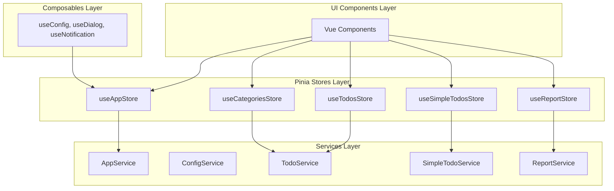
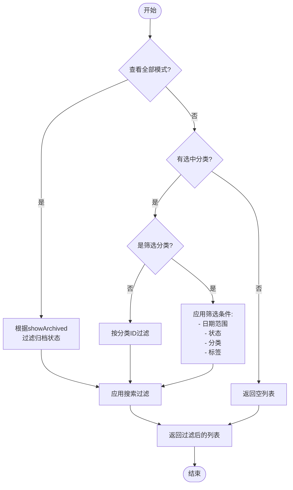
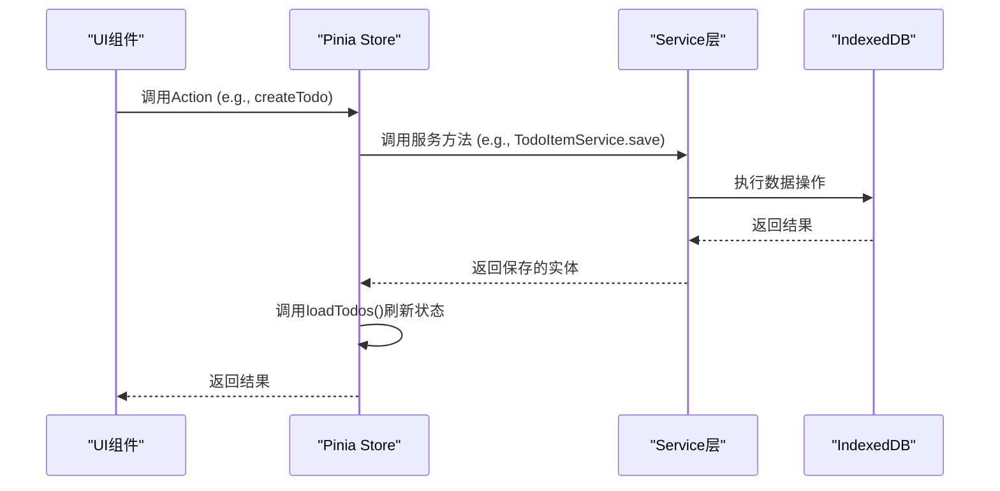
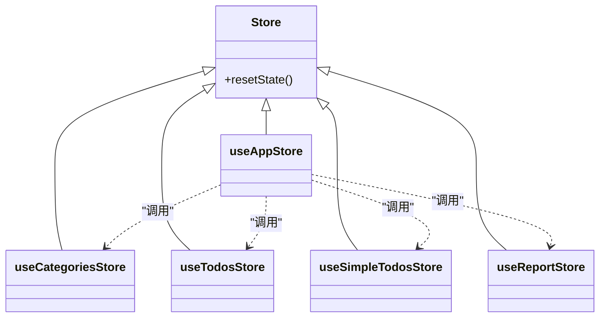

# 状态管理架构

<cite>
**本文档引用的文件**  
- [useAppStore.js](file://src/stores/useAppStore.js)
- [useCategoriesStore.js](file://src/stores/useCategoriesStore.js)
- [useTodosStore.js](file://src/stores/useTodosStore.js)
- [useSimpleTodosStore.js](file://src/stores/useSimpleTodosStore.js)
- [useReportStore.js](file://src/stores/useReportStore.js)
- [DEVELOPMENT.md](file://DEVELOPMENT.md)
</cite>

## 目录
1. [引言](#引言)
2. [状态管理层总体架构](#状态管理层总体架构)
3. [核心Store职责划分](#核心store职责划分)
4. [全局状态管理机制](#全局状态管理机制)
5. [复杂计算属性实现](#复杂计算属性实现)
6. [业务逻辑与服务层交互](#业务逻辑与服务层交互)
7. [状态流传递路径](#状态流传递路径)
8. [响应式设计与初始化机制](#响应式设计与初始化机制)
9. [状态重置与同步策略](#状态重置与同步策略)
10. [最佳实践指南](#最佳实践指南)

## 引言

TidyDo采用Pinia作为其状态管理解决方案，构建了一个清晰、可维护且高性能的状态管理层。该层位于应用架构的核心位置，连接UI组件与后端服务，负责管理所有业务状态、处理用户交互逻辑，并确保数据的一致性与响应性。本文档深入解析五个核心Store的职责划分、相互依赖关系及其实现细节，为开发者提供全面的状态管理架构参考。

## 状态管理层总体架构

TidyDo的状态管理层遵循分层架构设计原则，与服务层、组合式函数层和组件层形成清晰的职责边界。各Store通过定义明确的状态、计算属性和Actions，实现了业务逻辑的集中管理。

**Diagram sources**
- [DEVELOPMENT.md](file://DEVELOPMENT.md#L20-L100)

**Section sources**
- [DEVELOPMENT.md](file://DEVELOPMENT.md#L20-L100)

## 核心Store职责划分

### useAppStore：全局状态中心

`useAppStore`是整个应用的全局状态管理中心，负责协调用户界面的全局行为和跨Store的状态共享。

**Section sources**
- [useAppStore.js](file://src/stores/useAppStore.js#L1-L277)

### useCategoriesStore：分类数据管理

`useCategoriesStore`专注于管理所有分类数据，包括普通分类、筛选分类和简单Todo分类的CRUD操作。

**Section sources**
- [useCategoriesStore.js](file://src/stores/useCategoriesStore.js#L1-L186)

### useTodosStore：待办事项管理

`useTodosStore`负责管理标准待办事项（Todo）的完整生命周期，包括创建、更新、删除、状态切换和归档操作。

**Section sources**
- [useTodosStore.js](file://src/stores/useTodosStore.js#L1-L170)

### useSimpleTodosStore：简单Todo管理

`useSimpleTodosStore`专用于管理“简单Todo”类型的任务，支持四象限视图和拖拽排序，提供独立的状态管理。

**Section sources**
- [useSimpleTodosStore.js](file://src/stores/useSimpleTodosStore.js#L1-L188)

### useReportStore：报表数据管理

`useReportStore`负责管理数据报表的生成、刷新和展示状态，提供自动刷新和数据导出功能。

**Section sources**
- [useReportStore.js](file://src/stores/useReportStore.js#L1-L248)

## 全局状态管理机制

`useAppStore`通过一系列响应式状态变量，实现了对应用全局行为的精细控制。

### 核心全局状态

- `selectedCategoryId`：当前选中的分类ID，驱动内容区域的数据显示。
- `viewAllMode`：查看全部模式开关，决定是否显示所有分类的待办事项。
- `viewMode`：当前视图模式（表格、时间线、日志、报表），控制主内容区域的渲染方式。
- `sortBy` / `sortOrder`：统一的排序字段和顺序，确保所有视图下的排序一致性。
- `searchQuery`：全局搜索查询字符串，应用于所有待办事项的过滤。

### 状态依赖与联动

这些状态之间存在复杂的联动关系。例如，当`viewAllMode`被激活时，`selectedCategoryId`会被自动清空；当用户切换分类时，搜索框会被清空以避免混淆。这种联动逻辑通过`selectCategory`、`enterViewAllMode`等Actions进行封装，确保了状态变更的原子性和一致性。

**Section sources**
- [useAppStore.js](file://src/stores/useAppStore.js#L4-L15)

## 复杂计算属性实现

### currentTodos计算属性

`currentTodos`是`useAppStore`中最复杂的计算属性，它根据当前的全局状态动态生成最终展示给用户的待办事项列表。

**Diagram sources**
- [useAppStore.js](file://src/stores/useAppStore.js#L25-L145)

**Section sources**
- [useAppStore.js](file://src/stores/useAppStore.js#L25-L145)

### tableColumns计算属性

`tableColumns`根据当前视图模式和分类类型动态生成表格列配置。在“查看全部”或“筛选分类”模式下，会自动添加“分类”列，以提供上下文信息。

**Section sources**
- [useAppStore.js](file://src/stores/useAppStore.js#L147-L179)

## 业务逻辑与服务层交互

Store通过Actions封装业务逻辑，并与服务层进行交互，确保数据操作的原子性和错误处理的统一性。

### Actions封装模式

所有数据修改操作都通过Actions暴露。这些Actions内部调用对应的服务层方法，并在操作完成后重新加载数据以保持状态同步。

**Diagram sources**
- [useTodosStore.js](file://src/stores/useTodosStore.js#L100-L115)
- [useCategoriesStore.js](file://src/stores/useCategoriesStore.js#L70-L85)

**Section sources**
- [useTodosStore.js](file://src/stores/useTodosStore.js#L100-L115)
- [useCategoriesStore.js](file://src/stores/useCategoriesStore.js#L70-L85)

### 错误处理与数据一致性

通过`withErrorHandling`高阶函数包装服务层调用，实现了统一的错误处理和用户友好提示。无论在哪个Store中调用，错误都会被规范化处理，确保了数据操作的可靠性和用户体验的一致性。

## 状态流传递路径

结合`DEVELOPMENT.md`中的分层架构图，状态流从Store到组件的传递路径清晰明确。

```mermaid
graph LR
A[AppService.initializeApp] --> B[Stores.loadData]
B --> C[useAppStore.selectedCategoryId]
C --> D[useAppStore.currentTodos]
D --> E[TodoContent.vue]
E --> F[TodoItem.vue]
F --> G[用户交互]
G --> H[Store Actions]
H --> I[Service Layer]
I --> J[IndexedDB]
J --> K[数据变更]
K --> L[响应式更新]
L --> M[组件自动刷新]
```

**Diagram sources**
- [DEVELOPMENT.md](file://DEVELOPMENT.md#L105-L120)
- [useAppStore.js](file://src/stores/useAppStore.js#L25-L145)

**Section sources**
- [DEVELOPMENT.md](file://DEVELOPMENT.md#L105-L120)
- [useAppStore.js](file://src/stores/useAppStore.js#L25-L145)

## 响应式设计与初始化机制

### 响应式状态设计原则

所有状态均使用`ref`定义，计算属性使用`computed`，确保了状态的响应性。Store之间通过`useStore()`函数相互引用，实现了安全的依赖注入。

### 初始化同步机制

应用启动时，`AppService.initializeApp`会并行加载所有Store的数据。每个Store的`loadData`方法负责从服务层获取初始数据并填充到状态中，确保了应用状态的快速、同步初始化。

**Section sources**
- [DEVELOPMENT.md](file://DEVELOPMENT.md#L105-L120)
- [useAppStore.js](file://src/stores/useAppStore.js#L200-L210)

## 状态重置与同步策略

### resetState策略

每个Store都实现了`resetState`方法，用于将自身状态重置为初始值。这在应用重置或用户登出时非常有用。

**Diagram sources**
- [useAppStore.js](file://src/stores/useAppStore.js#L260-L270)
- [useCategoriesStore.js](file://src/stores/useCategoriesStore.js#L170-L175)
- [useTodosStore.js](file://src/stores/useTodosStore.js#L155-L160)
- [useSimpleTodosStore.js](file://src/stores/useSimpleTodosStore.js#L175-L180)
- [useReportStore.js](file://src/stores/useReportStore.js#L235-L240)

**Section sources**
- [useAppStore.js](file://src/stores/useAppStore.js#L260-L270)

## 最佳实践指南

### 避免状态管理陷阱

- **避免Store间循环依赖**：`useAppStore`可以依赖其他Store，但其他Store不应反向依赖`useAppStore`。
- **保持Actions的原子性**：每个Action应完成一个完整的业务操作，避免在组件中分散调用多个Actions。
- **合理使用计算属性**：复杂的过滤和计算逻辑应放在计算属性中，而非组件内。
- **及时清理副作用**：如`useReportStore`中的自动刷新定时器，必须在`resetState`或组件销毁时清除。

### 推荐实践

- **统一错误处理**：始终使用`withErrorHandling`包装异步操作。
- **ID生成规范**：使用`idGenerator.js`生成唯一ID，确保数据一致性。
- **状态变更通知**：在关键状态变更后，通过`useNotification`向用户反馈操作结果。

**Section sources**
- [DEVELOPMENT.md](file://DEVELOPMENT.md#L500-L700)
- [useAppStore.js](file://src/stores/useAppStore.js#L260-L270)
- [useReportStore.js](file://src/stores/useReportStore.js#L180-L200)