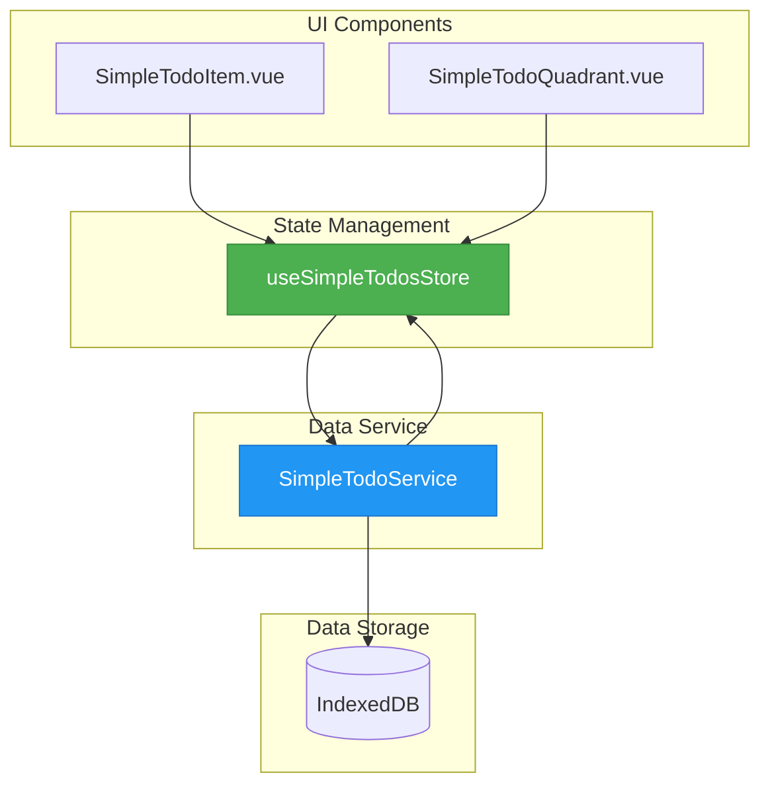
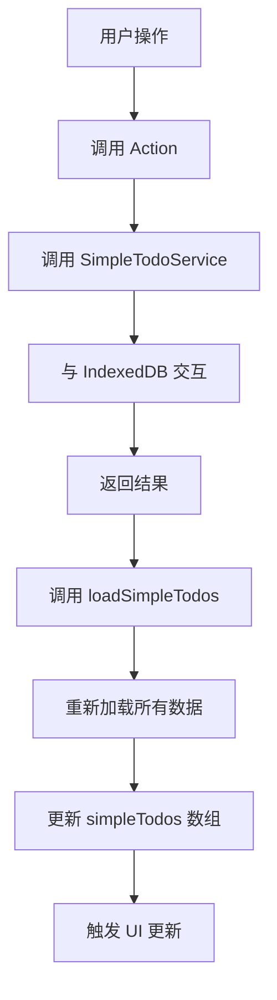
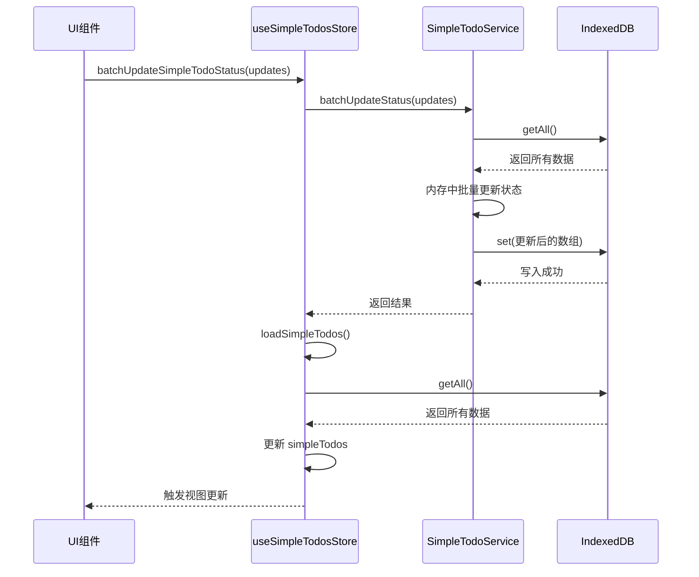
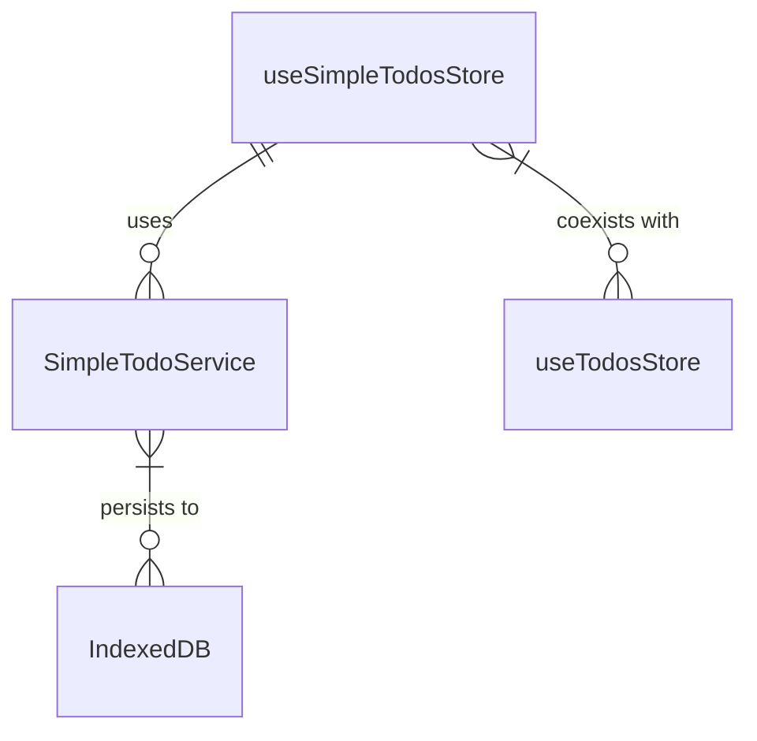

# 简易待办状态管理 (useSimpleTodosStore)

<cite>
**Referenced Files in This Document**   
- [useSimpleTodosStore.js](file://src/stores/useSimpleTodosStore.js)
- [useTodosStore.js](file://src/stores/useTodosStore.js)
- [simpleTodoService.js](file://src/services/simpleTodoService.js)
</cite>

## 目录
1. [简介](#简介)
2. [项目结构](#项目结构)
3. [核心组件](#核心组件)
4. [架构概览](#架构概览)
5. [详细组件分析](#详细组件分析)
6. [依赖分析](#依赖分析)
7. [性能考量](#性能考量)
8. [故障排除指南](#故障排除指南)
9. [结论](#结论)

## 简介

`useSimpleTodosStore` 是一个基于 Pinia 的 Vue.js 状态管理模块，专为管理简易待办事项（Simple Todo）而设计。该模块与 `useTodosStore` 并存，服务于不同的业务场景：`useSimpleTodosStore` 专注于轻量级、高频次的状态变更操作，而 `useTodosStore` 则处理包含更多元数据的复杂待办事项。

本技术文档旨在深入解析 `useSimpleTodosStore` 的设计原理，重点阐述其与 `useTodosStore` 的差异与协作关系，详细说明 `simpleTodos` 数组的管理机制，以及 `getSimpleTodosByCategoryAndStatus`、`getSimpleTodoCountsByCategoryId` 等专用计算属性的设计目的。同时，文档将解析 `batchUpdateSimpleTodoStatus` 在批量状态更新中的性能优势，阐明其与 `SimpleTodoService` 的交互协议，并解析 `createSimpleTodo`、`updateSimpleTodoStatus` 等 action 的事务处理流程，最后为高频率状态变更场景提供优化建议。

## 项目结构

`useSimpleTodosStore` 位于 `src/stores/` 目录下，是整个应用状态管理的核心部分。它与 `useTodosStore` 并列，共同构成了应用的待办事项管理能力。该 store 通过 `simpleTodoService` 与 IndexedDB 进行数据持久化交互，确保数据的可靠存储。

**Section sources**
- [useSimpleTodosStore.js](file://src/stores/useSimpleTodosStore.js#L1-L10)
- [useTodosStore.js](file://src/stores/useTodosStore.js#L1-L10)
- [simpleTodoService.js](file://src/services/simpleTodoService.js#L1-L10)

## 核心组件

`useSimpleTodosStore` 的核心组件包括：
- **`simpleTodos` 数组**：存储所有简易待办事项的响应式数组。
- **计算属性**：如 `getSimpleTodosByCategoryAndStatus` 和 `getSimpleTodoCountsByCategoryId`，用于高效地从 `simpleTodos` 中派生出视图所需的数据。
- **Actions**：如 `createSimpleTodo`、`updateSimpleTodoStatus` 和 `batchUpdateSimpleTodoStatus`，封装了与 `SimpleTodoService` 交互的业务逻辑。

**Section sources**
- [useSimpleTodosStore.js](file://src/stores/useSimpleTodosStore.js#L12-L187)

## 架构概览

**Diagram sources**
- [useSimpleTodosStore.js](file://src/stores/useSimpleTodosStore.js#L1-L187)
- [simpleTodoService.js](file://src/services/simpleTodoService.js#L33-L166)

## 详细组件分析

### useSimpleTodosStore 与 useTodosStore 的差异与协作

`useSimpleTodosStore` 和 `useTodosStore` 虽然都管理待办事项，但它们在数据模型和使用场景上存在显著差异。

`useSimpleTodosStore` 的数据模型极其精简，仅包含 `id`、`categoryId`、`title`、`status` 等核心字段，这使得其状态变更操作非常轻量。相比之下，`useTodosStore` 的数据模型更为复杂，包含了 `tags`、`priority`、`endDate`、`attachments` 等丰富的元数据，适用于需要详细规划和跟踪的复杂任务。

在协作关系上，两者是独立的，没有直接的数据依赖。它们通过不同的 UI 组件（如 `SimpleTodoItem.vue` 和 `TodoItem.vue`）被调用，服务于应用的不同功能区域。这种分离设计遵循了关注点分离原则，确保了简易待办功能的高性能和复杂待办功能的高灵活性。

**Section sources**
- [useSimpleTodosStore.js](file://src/stores/useSimpleTodosStore.js#L12-L187)
- [useTodosStore.js](file://src/stores/useTodosStore.js#L6-L169)

### simpleTodos 数组管理机制

`simpleTodos` 是一个由 Vue 的 `ref` 创建的响应式数组，它是 `useSimpleTodosStore` 的单一数据源（Single Source of Truth）。所有对简易待办事项的增删改查操作，最终都会反映到这个数组上。

该数组的管理遵循严格的“服务驱动”原则。任何状态变更（如创建、更新、删除）都不会直接修改 `simpleTodos` 数组，而是通过调用 `SimpleTodoService` 的相应方法来完成。在服务层完成数据持久化后，会通过 `loadSimpleTodos` action 一次性重新加载整个数据集，从而更新 `simpleTodos` 数组。这种方式虽然看似低效，但由于简易待办事项数据量通常较小，且 IndexedDB 的读写性能较高，因此在实践中表现良好，并保证了状态的最终一致性。

**Diagram sources**
- [useSimpleTodosStore.js](file://src/stores/useSimpleTodosStore.js#L50-L187)
- [simpleTodoService.js](file://src/services/simpleTodoService.js#L33-L166)

### 专用计算属性设计

`useSimpleTodosStore` 定义了多个高效的计算属性，以满足不同视图的查询需求。

`getSimpleTodosByCategoryAndStatus` 计算属性返回一个函数，该函数接收 `categoryId` 和 `status` 作为参数，并返回匹配的待办事项列表。其设计目的是为了在四象限视图等场景中，能够快速筛选出特定分类和状态的待办项。

`getSimpleTodoCountsByCategoryId` 计算属性同样返回一个函数，它接收 `categoryId` 作为参数，并返回一个包含该分类下各状态（待办、进行中、已完成、暂停）数量的对象。这个属性的设计目的是为了在分类侧边栏中实时显示每个分类的待办事项统计信息，为用户提供全局概览。

这些计算属性利用了 Vue 的响应式系统，当 `simpleTodos` 数组发生变化时，它们会自动重新计算，确保了视图数据的实时性和准确性。

**Section sources**
- [useSimpleTodosStore.js](file://src/stores/useSimpleTodosStore.js#L20-L45)

### 批量状态更新与性能优势

`batchUpdateSimpleTodoStatus` action 是 `useSimpleTodosStore` 的一个关键性能优化点。它允许一次性更新多个待办事项的状态，特别适用于拖拽排序等需要批量操作的场景。

其性能优势体现在与 `SimpleTodoService` 的交互协议上。`SimpleTodoService.batchUpdateStatus` 方法接收一个包含 `{id, status}` 对象的数组。服务层会一次性读取所有待办事项，然后通过一个 `Map` 对象快速查找需要更新的项，并在单次遍历中完成所有状态的修改，最后将整个更新后的数组一次性写回 IndexedDB。

这种“批量读取、内存中处理、批量写入”的模式，将多次独立的数据库 I/O 操作（读、写）合并为一次，极大地减少了与持久化层的交互次数，从而在高频率状态变更场景下展现出显著的性能优势。

**Diagram sources**
- [useSimpleTodosStore.js](file://src/stores/useSimpleTodosStore.js#L120-L135)
- [simpleTodoService.js](file://src/services/simpleTodoService.js#L138-L166)

### Action 事务处理流程

`createSimpleTodo` 和 `updateSimpleTodoStatus` 等 action 的事务处理流程遵循一个统一的模式：

1.  **调用服务**：Action 内部调用 `SimpleTodoService` 的对应方法（如 `save` 或 `updateStatus`）。
2.  **错误处理**：这些服务方法都包裹在 `withErrorHandling` 高阶函数中，能够捕获并处理存储层的错误（如 `ErrorTypes.STORAGE`），并提供有意义的错误信息。
3.  **状态同步**：无论服务调用成功与否，action 都会尝试调用 `loadSimpleTodos` 来刷新本地状态。这确保了应用状态与持久化数据的一致性。
4.  **返回结果**：如果操作成功，action 会返回保存或更新后的对象；如果失败，则抛出错误，由调用者处理。

这种流程设计虽然简单，但非常有效。它将复杂的错误处理和数据验证逻辑下沉到服务层，使 store 的 action 保持简洁，同时通过强制刷新来规避了复杂的局部状态更新逻辑，降低了出错的可能性。

**Section sources**
- [useSimpleTodosStore.js](file://src/stores/useSimpleTodosStore.js#L80-L120)
- [simpleTodoService.js](file://src/services/simpleTodoService.js#L70-L136)

## 依赖分析

`useSimpleTodosStore` 的依赖关系清晰且单一。

**Diagram sources**
- [useSimpleTodosStore.js](file://src/stores/useSimpleTodosStore.js#L1-L187)
- [simpleTodoService.js](file://src/services/simpleTodoService.js#L33-L166)

`useSimpleTodosStore` 直接依赖于 `SimpleTodoService`，通过其提供的 API 进行数据的持久化操作。`SimpleTodoService` 本身则依赖于 `idb-keyval` 库来操作 IndexedDB。`useSimpleTodosStore` 与 `useTodosStore` 之间不存在直接的代码依赖，它们是并列的、独立的状态管理模块，共同服务于应用的不同功能需求。

## 性能考量

在高频率状态变更场景下，`useSimpleTodosStore` 的性能表现主要取决于 `batchUpdateSimpleTodoStatus` 的使用。

**优化建议**：
1.  **优先使用批量操作**：在需要同时更新多个待办事项状态时（如拖拽排序），务必使用 `batchUpdateSimpleTodoStatus`，避免逐个调用 `updateSimpleTodoStatus`。
2.  **状态合并**：如果应用逻辑允许，可以将短时间内发生的多次状态变更请求合并为一次批量更新，以进一步减少与服务层的交互次数。
3.  **响应式更新**：由于 store 采用了“全量重载”的更新策略，应避免在 `simpleTodos` 数组非常大的情况下频繁触发 `loadSimpleTodos`。对于大型数据集，应考虑实现更精细的局部更新逻辑。

## 故障排除指南

当 `useSimpleTodosStore` 出现问题时，可按以下步骤排查：

1.  **检查服务层错误**：查看控制台日志，确认 `SimpleTodoService` 是否抛出了 `ErrorTypes.STORAGE` 错误。这通常意味着 IndexedDB 操作失败。
2.  **验证数据结构**：确保传递给 `createSimpleTodo` 等 action 的数据对象符合 `createSimpleTodoItem` 函数的预期结构。
3.  **检查状态同步**：如果 UI 未及时更新，检查 `loadSimpleTodos` 是否在每次操作后被正确调用。`simpleTodos` 数组的更新完全依赖于此方法。

**Section sources**
- [useSimpleTodosStore.js](file://src/stores/useSimpleTodosStore.js#L50-L187)
- [simpleTodoService.js](file://src/services/simpleTodoService.js#L33-L166)

## 结论

`useSimpleTodosStore` 是一个设计精良、职责明确的状态管理模块。它通过与 `useTodosStore` 的分离，实现了对简易待办事项的高效管理。其核心优势在于利用 `batchUpdateSimpleTodoStatus` 和 `SimpleTodoService` 的批量处理能力，在高频率操作场景下保证了出色的性能。通过清晰的计算属性和统一的 action 处理流程，该模块为上层 UI 提供了稳定、可靠的数据支持。在未来的开发中，应继续遵循其设计原则，充分利用其批量操作特性，以维持应用的高性能和响应速度。