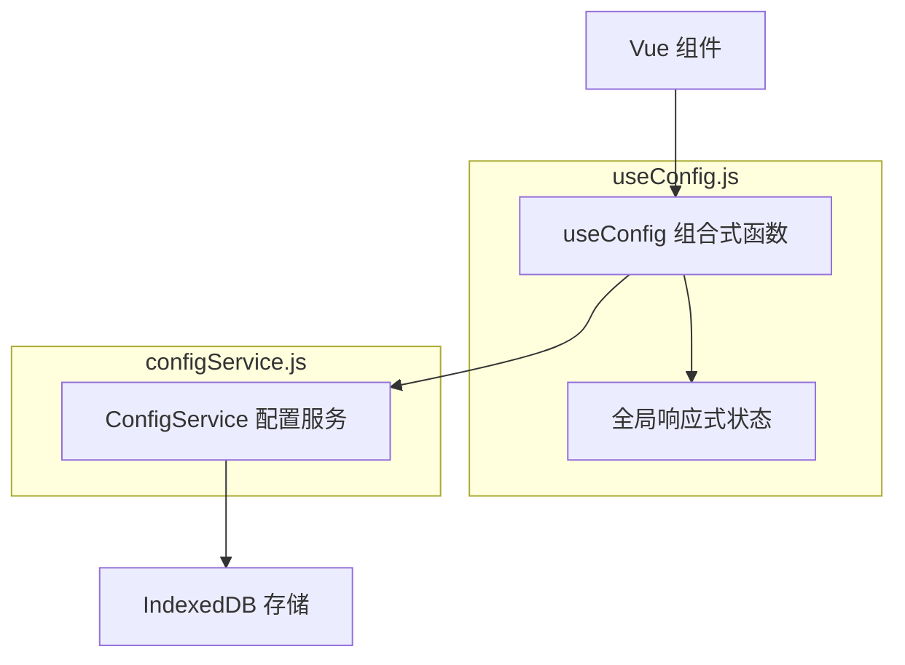
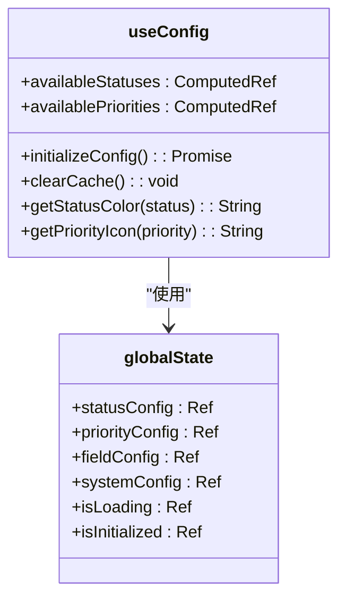
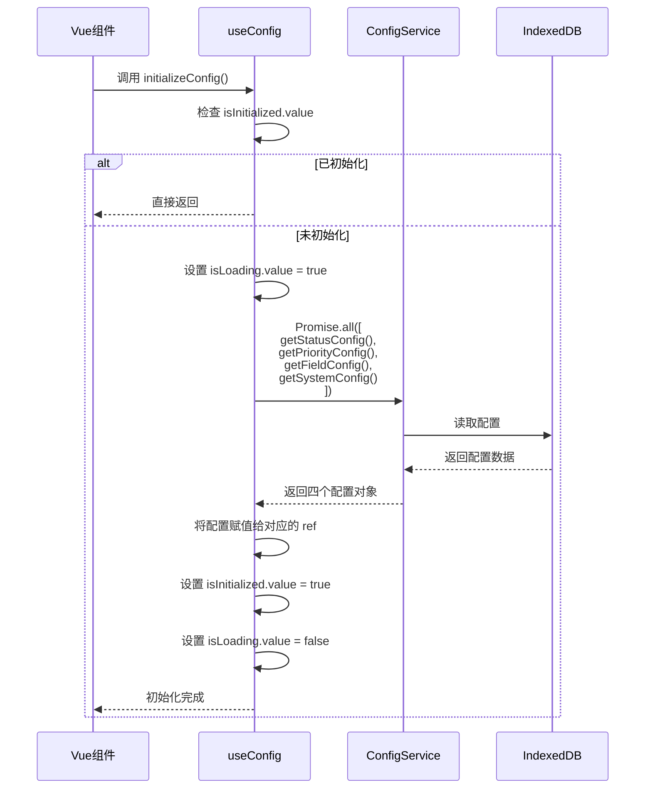

# useConfig 配置管理

<cite>
**Referenced Files in This Document**   
- [useConfig.js](file://src/composables/useConfig.js)
- [configService.js](file://src/services/configService.js)
- [TodoItem.vue](file://src/views/tidyDo/components/TodoItem.vue)
- [TodoTimeline.vue](file://src/views/tidyDo/components/TodoTimeline.vue)
</cite>

## 目录
1. [简介](#简介)
2. [核心设计与架构](#核心设计与架构)
3. [响应式状态管理](#响应式状态管理)
4. [异步初始化流程](#异步初始化流程)
5. [便捷工具方法](#便捷工具方法)
6. [计算属性](#计算属性)
7. [配置缓存与清除](#配置缓存与清除)
8. [在Vue组件中的使用](#在vue组件中的使用)
9. [错误处理与性能优化](#错误处理与性能优化)
10. [与其他Pinia Store的协作](#与其他pinia-store的协作)

## 简介

`useConfig` 是 TidyDo 应用中的核心组合式函数，作为全局配置的访问中心，为整个应用提供统一、响应式的配置管理服务。该函数采用单例模式设计，确保所有组件共享同一份配置状态，避免了状态不一致的问题。`useConfig` 不仅管理着状态、优先级、字段和系统配置等核心数据，还提供了一系列便捷的工具方法，极大地简化了配置的访问和使用。其设计充分体现了响应式编程的优势，通过 Vue 的 `ref` 和 `computed` 实现了配置数据的自动更新和依赖追踪，确保了用户界面与配置状态的高度同步。

## 核心设计与架构

`useConfig` 的设计遵循了分层架构原则，将配置的访问逻辑与持久化逻辑进行了清晰的分离。其核心架构由三个关键部分组成：全局响应式状态、组合式函数接口和后端服务。



**Diagram sources**  
- [useConfig.js](file://src/composables/useConfig.js#L1-L205)
- [configService.js](file://src/services/configService.js#L1-L206)

**Section sources**  
- [useConfig.js](file://src/composables/useConfig.js#L1-L205)
- [configService.js](file://src/services/configService.js#L1-L206)

`useConfig` 作为中间层，向上为 Vue 组件提供简洁的 API，向下通过 `ConfigService` 与持久化存储（IndexedDB）进行交互。这种设计使得组件无需关心配置是如何加载或保存的，只需调用 `useConfig` 提供的方法即可。同时，`ConfigService` 负责处理所有与存储相关的复杂逻辑，如错误处理、默认配置合并等，保证了数据的完整性和可靠性。

## 响应式状态管理

`useConfig` 的核心是其全局响应式状态管理机制。它使用一个名为 `globalState` 的单例对象来存储所有配置数据，确保了应用内状态的唯一性。



**Diagram sources**  
- [useConfig.js](file://src/composables/useConfig.js#L1-L205)

**Section sources**  
- [useConfig.js](file://src/composables/useConfig.js#L1-L205)

该状态对象包含六个 `ref` 类型的属性，分别对应状态配置、优先级配置、字段配置、系统配置、加载状态和初始化状态。这些 `ref` 对象是响应式的，当它们的值发生变化时，所有依赖这些状态的 Vue 组件都会自动更新。`useConfig` 函数通过解构 `globalState` 来暴露这些响应式状态，使得组件可以轻松地读取和监听配置的变化。

## 异步初始化流程

`useConfig` 的 `initializeConfig` 方法是整个配置系统启动的关键。它采用了一种高效的并行加载策略，确保配置能够快速、可靠地初始化。



**Diagram sources**  
- [useConfig.js](file://src/composables/useConfig.js#L45-L75)
- [configService.js](file://src/services/configService.js#L90-L110)

**Section sources**  
- [useConfig.js](file://src/composables/useConfig.js#L45-L75)

该方法首先检查 `isInitialized.value`，如果配置已经初始化，则直接返回，避免了重复加载。如果未初始化，则将 `isLoading.value` 设置为 `true`，以通知 UI 进入加载状态。随后，它使用 `Promise.all` 并行调用 `ConfigService` 的四个方法来获取所有配置。这种并行策略显著减少了总的加载时间，因为所有网络或存储请求可以同时进行。一旦所有请求完成，配置数据会被赋值给相应的 `ref`，`isInitialized` 被标记为 `true`，最后 `isLoading` 被设置为 `false`，整个初始化流程结束。

## 便捷工具方法

`useConfig` 提供了一系列精心设计的工具方法，极大地简化了开发者对配置的访问。

### 状态与优先级访问

`getStatusColor` 和 `getPriorityIcon` 等方法是典型的便捷工具。它们的内部实现逻辑非常清晰：首先调用底层的 `getStatusConfig` 或 `getPriorityConfig` 方法获取完整的配置对象，然后从该对象中提取出所需的 `color` 或 `icon` 属性。

```mermaid
flowchart TD
Start([getStatusColor(status)]) --> GetConfig["调用 getStatusConfig(status)"]
GetConfig --> HasConfig{"配置存在?"}
HasConfig --> |是| ReturnColor["返回 config.color"]
HasConfig --> |否| ReturnDefault["返回默认值 'grey'"]
ReturnColor --> End([返回颜色])
ReturnDefault --> End
```

**Diagram sources**  
- [useConfig.js](file://src/composables/useConfig.js#L100-L110)

**Section sources**  
- [useConfig.js](file://src/composables/useConfig.js#L100-L110)

这些方法都内置了默认值处理机制。例如，`getStatusColor` 在找不到对应状态的颜色时，会返回 `'grey'`。`getPriorityConfig` 在找不到优先级配置时，会返回一个包含默认文本、颜色和图标的对象。这种设计保证了即使在配置缺失或初始化失败的情况下，应用也能正常运行，不会因为配置问题而崩溃。

### 默认值处理机制

默认值处理是 `useConfig` 可靠性的关键。当 `getStatusConfig` 发现某个状态没有配置时，它会返回一个包含 `{ text: '未知', color: 'grey' }` 的默认对象。同样，`getPriorityConfig` 会返回 `{ text: '普通', color: 'grey', icon: 'mdi-minus' }`。这种机制确保了应用的健壮性，开发者无需在每次调用这些方法时都进行空值检查。

## 计算属性

`useConfig` 利用 Vue 的 `computed` 属性，将原始的配置数据转换为更易于在 UI 中使用的格式。

### availableStatuses 与 availablePriorities

`availableStatuses` 和 `availablePriorities` 是两个核心的计算属性。它们的作用是将存储在 `statusConfig` 和 `priorityConfig` 中的键值对对象，转换为一个可供下拉菜单或选择器使用的数组。

```mermaid
flowchart TD
A[statusConfig.value] --> B[Object.keys()]
B --> C[遍历每个 key]
C --> D[创建新对象: { key, value, ...config }]
D --> E[推入数组]
E --> F[返回数组]
```

**Diagram sources**  
- [useConfig.js](file://src/composables/useConfig.js#L170-L185)

**Section sources**  
- [useConfig.js](file://src/composables/useConfig.js#L170-L185)

例如，`availableStatuses` 会遍历 `statusConfig.value` 的所有键（如 `pending`, `inProgress`），为每个键创建一个包含 `key`、`value`（与 `key` 相同）以及该状态所有配置（`text`, `color`）的新对象。最终生成的数组可以直接绑定到 Vuetify 的 `v-select` 组件上，为用户提供一个直观的状态选择列表。

## 配置缓存与清除

`useConfig` 实现了一套完整的配置缓存机制，以优化性能并支持配置的动态更新。

### 缓存机制

`useConfig` 的缓存机制基于其全局响应式状态。一旦 `initializeConfig` 成功执行，所有配置数据都会被存储在 `globalState` 的 `ref` 对象中。后续的访问（如调用 `getStatusColor`）都直接从内存中读取，避免了重复的存储访问，极大地提升了性能。

### clearCache 清除策略

`clearCache` 方法是缓存机制的重要组成部分。它的作用是将所有配置 `ref` 重置为空对象，并将 `isInitialized` 设置为 `false`。

```mermaid
flowchart TD
Start([clearCache()]) --> ResetStatus["重置 statusConfig.value = {}"]
ResetStatus --> ResetPriority["重置 priorityConfig.value = {}"]
ResetPriority --> ResetField["重置 fieldConfig.value = {}"]
ResetField --> ResetSystem["重置 systemConfig.value = {}"]
ResetSystem --> ResetInit["设置 isInitialized.value = false"]
ResetInit --> End([缓存清除完成])
```

**Diagram sources**  
- [useConfig.js](file://src/composables/useConfig.js#L187-L195)

**Section sources**  
- [useConfig.js](file://src/composables/useConfig.js#L187-L195)

这个方法通常在用户修改了配置并保存后被调用。通过清除缓存，`useConfig` 确保了下一次访问配置时会重新从 `ConfigService` 加载最新的数据，从而保证了 UI 与持久化配置的一致性。

## 在Vue组件中的使用

`useConfig` 在 Vue 组件中的使用非常简单和直观，是组合式 API 的最佳实践。

### 最佳实践示例

以下是在 `TodoItem.vue` 组件中使用 `useConfig` 的典型示例：

```javascript
import { useConfig } from '@/composables/useConfig'

// 在 setup 函数中
const { 
  getStatusColor, 
  getStatusText, 
  getPriorityIcon,
  statusConfig
} = useConfig()
```

**Section sources**  
- [TodoItem.vue](file://src/views/tidyDo/components/TodoItem.vue#L213-L214)

通过解构赋值，组件可以直接获得所需的方法和状态。例如，`getStatusColor(itemData.status)` 可以直接用于设置状态标签的颜色，`getPriorityIcon(itemData.priority)` 可以用于显示优先级图标。`statusConfig` 本身也可以作为一个响应式对象被监听，当配置发生变化时，组件会自动更新。

## 错误处理与性能优化

`useConfig` 的设计充分考虑了错误处理和性能优化。

### 错误处理

`useConfig` 的错误处理主要体现在两个层面。首先，在 `initializeConfig` 方法中，它使用了 `try-catch` 块来捕获 `Promise.all` 中可能发生的任何错误，并将其记录到控制台，然后重新抛出，以便上层逻辑可以处理。其次，在 `getStatusConfig` 和 `getPriorityConfig` 等方法中，当检测到配置未初始化时，会尝试异步调用 `initializeConfig`，并使用 `.catch(console.error)` 来处理可能的初始化失败，防止错误向上冒泡影响用户体验。

### 性能优化建议

1.  **避免重复初始化**：由于 `useConfig` 使用了单例模式和 `isInitialized` 标志，开发者无需担心重复调用 `initializeConfig` 会导致性能问题。
2.  **利用计算属性**：应优先使用 `availableStatuses` 和 `availablePriorities` 等计算属性，而不是在模板中手动遍历 `statusConfig`。
3.  **按需解构**：在导入 `useConfig` 时，只解构需要的方法和状态，避免引入不必要的响应式依赖。

## 与其他Pinia Store的协作

`useConfig` 与应用中的 Pinia Store 协作良好，共同构成了应用的状态管理生态。

`useConfig` 主要负责管理应用的“元数据”或“配置数据”，如状态的颜色、优先级的图标等。而 Pinia Store（如 `useAppStore`）则负责管理应用的“业务数据”和“UI 状态”，如当前选中的分类、视图模式、排序方式等。

```mermaid
graph TD
    A[useConfig] -->|提供| B[状态颜色]
    A -->|提供| C[优先级图标]
    D[useAppStore] -->|管理| E[选中分类]
    D -->|管理| F[视图模式]
    B --> G[UI 组件]
   