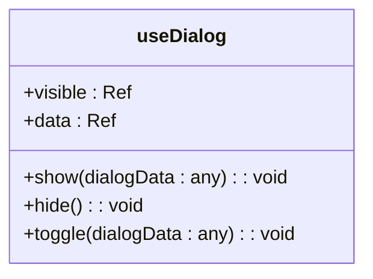
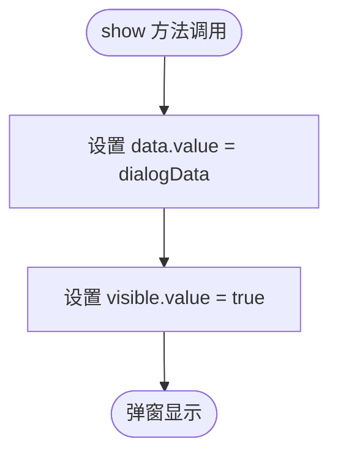
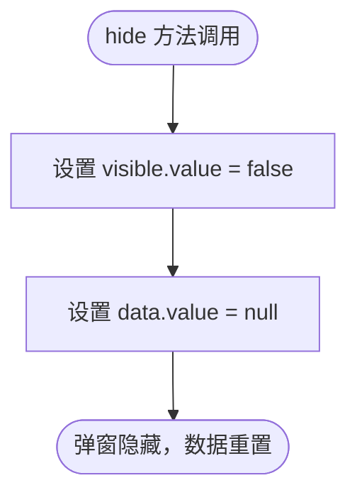
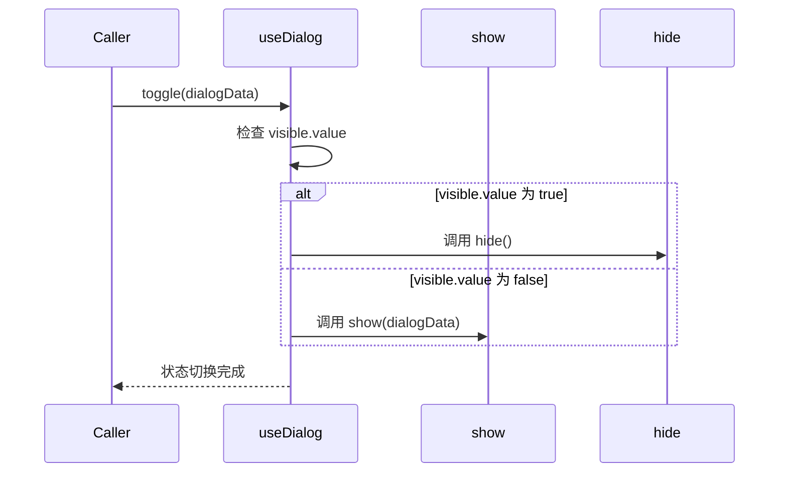
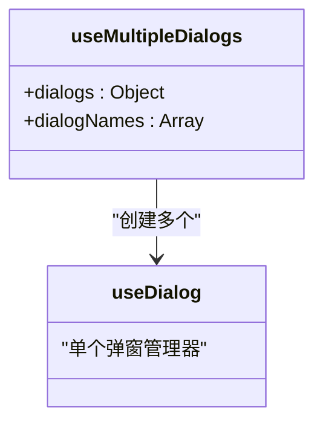
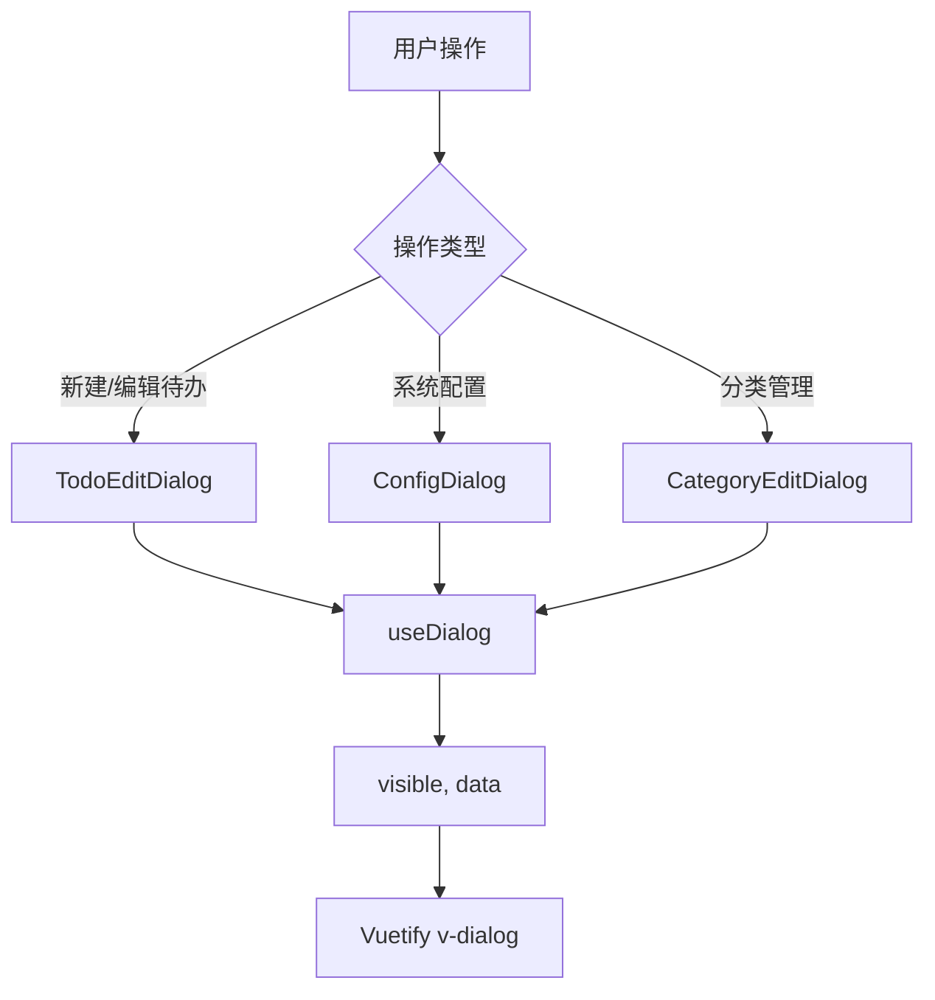

# useDialog 弹窗状态管理

<cite>
**Referenced Files in This Document**   
- [useDialog.js](file://src/composables/useDialog.js)
- [TodoEditDialog.vue](file://src/model/TodoEditDialog.vue)
- [ConfigDialog.vue](file://src/model/ConfigDialog.vue)
- [CategoryEditDialog.vue](file://src/model/CategoryEditDialog.vue)
- [TodoContent.vue](file://src/views/tidyDo/components/TodoContent.vue)
- [TodoHeader.vue](file://src/views/tidyDo/components/TodoHeader.vue)
</cite>

## 目录
1. [核心功能概述](#核心功能概述)
2. [响应式状态管理](#响应式状态管理)
3. [核心方法详解](#核心方法详解)
4. [多实例管理](#多实例管理)
5. [实际应用示例](#实际应用示例)
6. [与Vuetify组件集成](#与vuetify组件集成)
7. [边界情况处理](#边界情况处理)

## 核心功能概述

`useDialog` 是 TidyDo 应用中用于管理弹窗状态的核心组合式函数，提供了一种轻量级、可复用的对话框状态控制机制。该函数通过 Vue 的响应式系统，封装了弹窗的显示、隐藏和数据传递逻辑，使开发者能够以声明式的方式管理复杂的 UI 交互状态。

作为 UI 状态管理层的重要组成部分，`useDialog` 遵循组合式 API 的设计原则，将弹窗相关的状态和行为逻辑进行封装，实现了关注点分离。这种设计模式使得弹窗逻辑可以在多个组件间轻松复用，同时保持了代码的清晰性和可维护性。

**Section sources**
- [useDialog.js](file://src/composables/useDialog.js#L2-L38)

## 响应式状态管理

`useDialog` 函数通过 Vue 的 `ref` API 创建了两个核心的响应式状态变量，用于精确控制弹窗的行为和数据流。

### 状态变量



**Diagram sources**
- [useDialog.js](file://src/composables/useDialog.js#L4-L7)

#### visible 状态
`visible` 是一个布尔类型的响应式引用，用于表示弹窗的显示状态。当 `visible.value` 为 `true` 时，关联的弹窗组件将被显示；当为 `false` 时，弹窗将被隐藏。此状态的初始值可以通过函数参数 `initialVisible` 进行设置，默认值为 `false`，确保弹窗在初始化时处于关闭状态。

#### data 状态
`data` 是一个通用类型的响应式引用，用于在弹窗显示时传递相关数据。该状态允许父组件向弹窗传递上下文信息，如待编辑的待办事项数据、配置项等。当弹窗关闭时，`data` 会被自动重置为 `null`，确保数据的隔离性和安全性。

**Section sources**
- [useDialog.js](file://src/composables/useDialog.js#L4-L7)

## 核心方法详解

`useDialog` 提供了三个核心方法来控制弹窗的状态转换，每个方法都经过精心设计以满足不同的交互需求。

### show 方法

`show` 方法用于显示弹窗并可选地传递数据。该方法接受一个可选参数 `dialogData`，用于设置弹窗的数据上下文。



**Diagram sources**
- [useDialog.js](file://src/composables/useDialog.js#L10-L13)

当调用 `show` 方法时，首先将传入的数据赋值给 `data` 状态，然后将 `visible` 状态设置为 `true`，触发弹窗的显示。如果未传递参数，`data` 将保持为 `null` 或之前的值。

### hide 方法

`hide` 方法用于隐藏弹窗，并同时重置相关状态。



**Diagram sources**
- [useDialog.js](file://src/composables/useDialog.js#L16-L19)

该方法不仅将 `visible` 状态设置为 `false` 以隐藏弹窗，还会将 `data` 状态重置为 `null`。这种设计确保了每次弹窗关闭后，其数据上下文都会被清理，避免了数据污染和意外的数据残留。

### toggle 方法

`toggle` 方法提供了一种便捷的状态切换机制，根据当前的显示状态决定是显示还是隐藏弹窗。



**Diagram sources**
- [useDialog.js](file://src/composables/useDialog.js#L22-L29)

`toggle` 方法的逻辑是：如果弹窗当前可见，则调用 `hide` 方法将其隐藏；如果不可见，则调用 `show` 方法将其显示，并可选地传递新的数据。这种设计使得开发者可以通过单一方法实现弹窗的开关控制，简化了交互逻辑。

**Section sources**
- [useDialog.js](file://src/composables/useDialog.js#L10-L29)

## 多实例管理

为了支持应用中多个独立弹窗的管理需求，`useDialog` 还提供了 `useMultipleDialogs` 辅助函数。



**Diagram sources**
- [useDialog.js](file://src/composables/useDialog.js#L41-L49)

`useMultipleDialogs` 函数接受一个弹窗名称数组作为参数，为每个名称创建一个独立的 `useDialog` 实例，并将它们组织在一个对象中返回。这种设计模式使得开发者可以轻松地管理多个具有不同用途的弹窗，如编辑弹窗、确认弹窗、配置弹窗等，而无需在组件中重复声明多个 `useDialog` 调用。

**Section sources**
- [useDialog.js](file://src/composables/useDialog.js#L41-L49)

## 实际应用示例

`useDialog` 在 TidyDo 应用中被广泛应用于各种对话框组件的管理，展示了其强大的复用性和灵活性。

### 待办事项编辑弹窗

在 `TodoContent` 和 `TodoHeader` 组件中，`useDialog` 被用于管理待办事项的编辑弹窗：

```javascript
const todoEditDialog = useDialog()
```

当用户点击“新建待办”或“编辑”按钮时，调用 `todoEditDialog.show()` 方法显示弹窗，并可传递待编辑的待办事项数据。弹窗关闭时，`hide` 方法会被调用，自动清理数据状态。

### 配置管理弹窗

`ConfigDialog` 组件使用 `useDialog` 来管理系统配置的显示状态。该弹窗包含了多个标签页，用于配置状态、优先级和数据管理等功能。通过 `useDialog`，配置弹窗的打开和关闭逻辑被简化为简单的状态切换。

### 分类管理弹窗

`CategoryEditDialog` 组件利用 `useDialog` 实现了分类的创建和编辑功能。根据 `categoryType` 的不同，弹窗会显示不同的表单字段，展示了 `useDialog` 与复杂条件渲染逻辑的完美结合。



**Diagram sources**
- [TodoEditDialog.vue](file://src/model/TodoEditDialog.vue)
- [ConfigDialog.vue](file://src/model/ConfigDialog.vue)
- [CategoryEditDialog.vue](file://src/model/CategoryEditDialog.vue)

**Section sources**
- [TodoContent.vue](file://src/views/tidyDo/components/TodoContent.vue#L212)
- [TodoHeader.vue](file://src/views/tidyDo/components/TodoHeader.vue#L169)

## 与Vuetify组件集成

`useDialog` 与 Vuetify 的 `v-dialog` 组件实现了无缝集成，通过 `.sync` 修饰符或计算属性的 `get/set` 方法，将组合式函数的状态与 UI 组件的状态进行双向绑定。

在各个弹窗组件中，通常会定义一个计算属性 `isVisible`，其 `get` 方法返回 `props.modelValue`（即 `useDialog` 的 `visible` 状态），`set` 方法则通过 `emit` 触发 `update:modelValue` 事件，形成完整的状态同步链路。这种集成模式确保了 UI 状态与业务逻辑状态的一致性，同时保持了组件的可复用性。

**Section sources**
- [TodoEditDialog.vue](file://src/model/TodoEditDialog.vue#L54-L58)
- [ConfigDialog.vue](file://src/model/ConfigDialog.vue#L102-L106)
- [CategoryEditDialog.vue](file://src/model/CategoryEditDialog.vue#L72-L76)

## 边界情况处理

`useDialog` 的设计充分考虑了各种边界情况，确保了弹窗状态管理的健壮性。

### 初始状态设置
通过 `initialVisible` 参数，开发者可以灵活地设置弹窗的初始显示状态。这对于需要在页面加载时立即显示的引导弹窗或确认弹窗非常有用。

### 数据重置机制
`hide` 方法中对 `data` 状态的重置是关键的安全措施，防止了敏感数据在弹窗关闭后仍保留在内存中，也避免了下一次显示时出现意外的数据残留。

### 并发操作处理
由于 `useDialog` 基于 Vue 的响应式系统，其状态更新是同步且原子的，避免了多线程环境下的竞态条件问题。即使在短时间内频繁调用 `show` 和 `hide` 方法，状态也能保持一致和可预测。

**Section sources**
- [useDialog.js](file://src/composables/useDialog.js#L2-L38)