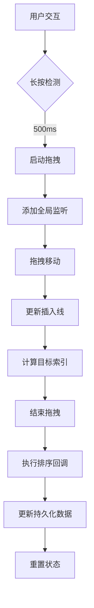
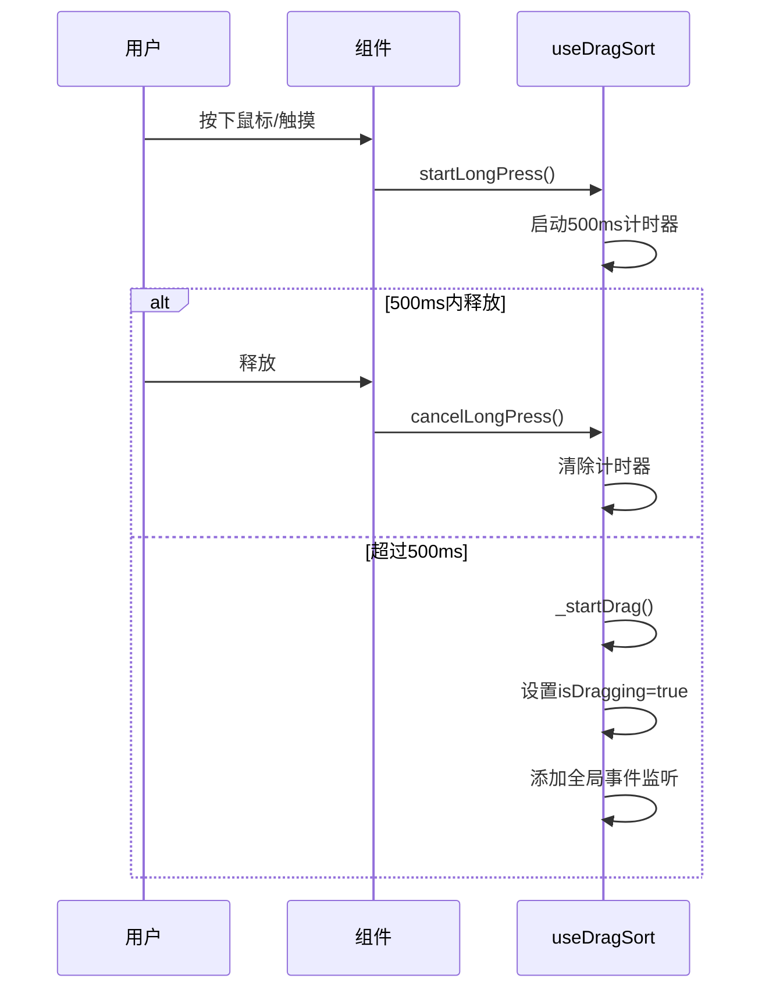
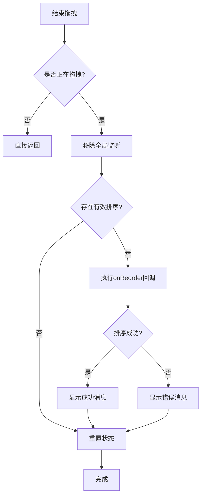
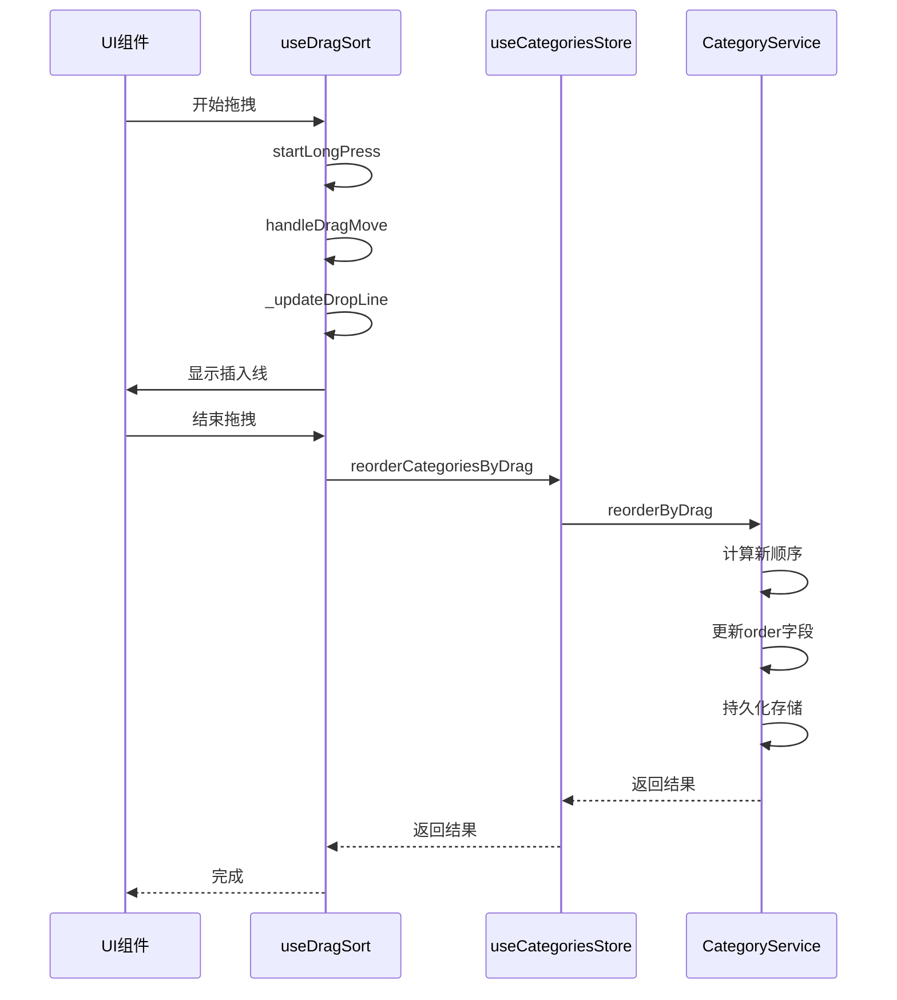

# useDragSort 拖拽排序引擎

<cite>
**Referenced Files in This Document**   
- [useDragSort.js](file://src/composables/useDragSort.js)
- [TodoSidebar.vue](file://src/components/TodoSidebar.vue)
- [useCategoriesStore.js](file://src/stores/useCategoriesStore.js)
- [todoService.js](file://src/services/todoService.js)
</cite>

## 目录
1. [简介](#简介)
2. [核心架构](#核心架构)
3. [状态管理](#状态管理)
4. [拖拽流程](#拖拽流程)
5. [私有方法解析](#私有方法解析)
6. [配置与错误处理](#配置与错误处理)
7. [资源清理](#资源清理)
8. [实际应用示例](#实际应用示例)
9. [结论](#结论)

## 简介

`useDragSort` 是 TidyDo 应用中用于实现分类拖拽排序功能的组合式函数。该函数提供了一套完整的拖拽排序解决方案，支持鼠标和触摸设备，具备防误触机制，并通过优雅的状态管理和事件处理确保用户体验流畅。本技术文档将深入解析其内部工作原理、关键状态流转、核心方法实现以及在实际项目中的应用方式。

**Section sources**
- [useDragSort.js](file://src/composables/useDragSort.js#L1-L20)

## 核心架构

`useDragSort` 采用组合式 API 设计模式，封装了拖拽排序所需的所有状态和方法。其架构设计遵循单一职责原则，将功能划分为状态管理、核心方法、私有方法和清理函数四个主要部分。

该组合式函数通过 `ref` 创建响应式状态对象 `dragState`，并暴露一系列方法供组件调用。整个拖拽流程由三个核心事件驱动：`startLongPress`（长按开始）、`handleDragMove`（拖拽移动）和 `endDrag`（结束拖拽）。这种设计使得拖拽逻辑与 UI 组件解耦，提高了代码的可复用性和可维护性。

**Diagram sources**
- [useDragSort.js](file://src/composables/useDragSort.js#L27-L236)

**Section sources**
- [useDragSort.js](file://src/composables/useDragSort.js#L27-L236)

## 状态管理

`dragState` 是 `useDragSort` 的核心状态对象，使用 Vue 的 `ref` 创建，包含多个关键属性来跟踪拖拽过程中的各种状态。

| 状态属性 | 类型 | 含义 | 流转过程 |
|--------|------|------|---------|
| isDragging | boolean | 是否处于拖拽状态 | `startLongPress` → `true`，`endDrag` → `false` |
| draggedCategoryId | string/null | 被拖拽的分类ID | `_startDrag` 时设置为当前分类ID，`_resetDragState` 时重置为null |
| dropLinePosition | object/null | 拖拽插入线位置 | `_updateDropLine` 计算并更新，包含top坐标和visible状态 |
| targetIndex | number/null | 目标插入索引 | `_updateDropLine` 计算得出，`endDrag` 时用于排序 |
| longPressTimer | number/null | 长按计时器ID | `startLongPress` 时创建，`cancelLongPress` 或超时后清除 |
| startPosition | object | 拖拽起始坐标 | `startLongPress` 时记录鼠标/触摸起始位置 |

这些状态共同构成了拖拽排序的完整状态机，确保了拖拽过程的准确性和可靠性。

**Section sources**
- [useDragSort.js](file://src/composables/useDragSort.js#L35-L45)

## 拖拽流程

### 长按触发机制

`startLongPress` 方法实现了防误触的长按触发机制。当用户在分类项上按下鼠标或触摸屏幕时，该方法被调用并启动一个 500 毫秒的计时器。如果用户在 500 毫秒内释放，则视为普通点击操作；如果持续按住超过 500 毫秒，则触发拖拽模式。

这种设计有效防止了用户的误操作，确保只有明确的拖拽意图才会启动排序功能。同时，该方法会记录拖拽的起始坐标，为后续的拖拽距离判断提供依据。

**Diagram sources**
- [useDragSort.js](file://src/composables/useDragSort.js#L52-L63)

**Section sources**
- [useDragSort.js](file://src/composables/useDragSort.js#L52-L63)

### 跨平台坐标处理

`handleDragMove` 方法负责处理拖拽过程中的移动事件，支持鼠标和触摸两种输入方式。该方法通过统一的事件接口获取 Y 坐标，无论是 `event.clientY`（鼠标）还是 `event.touches[0].clientY`（触摸），都能正确处理。

当检测到拖拽状态激活时，该方法会阻止默认行为（防止页面滚动），并调用 `_updateDropLine` 方法更新插入线位置。这种设计确保了在不同设备上的行为一致性，提供了无缝的用户体验。

**Section sources**
- [useDragSort.js](file://src/composables/useDragSort.js#L79-L86)

### 排序提交流程

`endDrag` 方法是拖拽流程的终点，负责提交排序结果。该方法使用 `withErrorHandling` 包装，确保错误能够被正确捕获和处理。

执行流程如下：
1. 移除全局事件监听器，防止内存泄漏
2. 检查是否存在有效的拖拽操作（`draggedCategoryId` 和 `targetIndex`）
3. 调用 `onReorder` 回调函数执行实际的排序逻辑
4. 根据结果显示成功或失败消息
5. 重置所有拖拽状态

**Diagram sources**
- [useDragSort.js](file://src/composables/useDragSort.js#L91-L112)

**Section sources**
- [useDragSort.js](file://src/composables/useDragSort.js#L91-L112)

## 私有方法解析

### 插入索引计算逻辑

`_updateDropLine` 方法是拖拽排序的核心算法，负责计算目标插入位置和索引。该方法通过以下步骤实现：

1. 获取所有分类元素的 DOM 集合
2. 遍历每个元素，计算其中心 Y 坐标
3. 比较鼠标/触摸 Y 坐标与各元素中心坐标
4. 确定插入位置（当前元素之前或之后）

当鼠标 Y 坐标小于等于元素中心 Y 坐标时，插入到该元素之前；当遍历到最后一个元素且鼠标 Y 坐标大于其中心坐标时，插入到最后一个元素之后。这种方法确保了插入位置的直观性和准确性。

**Section sources**
- [useDragSort.js](file://src/composables/useDragSort.js#L140-L169)

### 事件绑定策略

`_addGlobalListeners` 方法采用防御性编程策略，为文档对象添加全局事件监听器。该方法的关键特点包括：

- 同时监听鼠标和触摸事件，确保跨平台兼容性
- 为 `mousemove` 和 `touchmove` 事件设置 `{ passive: false }`，允许调用 `preventDefault()`
- 将事件处理委托给 `handleDragMove` 和 `endDrag` 方法
- 在 `endDrag` 中自动调用 `_removeGlobalListeners` 进行清理

这种设计确保了拖拽过程中事件的连续性和完整性，即使鼠标/触摸移出目标元素也能继续跟踪。

**Section sources**
- [useDragSort.js](file://src/composables/useDragSort.js#L175-L180)

## 配置与错误处理

### DRAG_CONFIG 配置项

`DRAG_CONFIG` 常量对象定义了拖拽行为的关键参数：

| 配置项 | 值 | 说明 |
|--------|-----|------|
| LONG_PRESS_DURATION | 500 | 长按触发时间（毫秒），平衡防误触与响应速度 |
| DRAG_THRESHOLD | 10 | 拖拽阈值（像素），目前未实际使用，预留扩展 |
| DROP_LINE_HEIGHT | 2 | 插入线高度（像素），视觉提示的粗细 |

这些配置项集中管理，便于后续调整和优化用户体验。

**Section sources**
- [useDragSort.js](file://src/composables/useDragSort.js#L15-L18)

### 错误处理集成

`useDragSort` 通过 `withErrorHandling` 高阶函数集成了完善的错误处理机制。`endDrag` 方法被包装后，能够在发生错误时：

1. 捕获异步操作中的异常
2. 显示用户友好的错误消息
3. 将错误重新抛出以便上层处理
4. 确保状态正确重置

这种设计遵循了"失败安全"原则，即使排序操作失败，也不会导致应用状态混乱。

**Section sources**
- [useDragSort.js](file://src/composables/useDragSort.js#L91-L112)

## 资源清理

`cleanup` 方法是组件生命周期管理的重要组成部分，确保在组件卸载时正确释放资源：

1. 取消可能存在的长按计时器
2. 如果处于拖拽状态，移除全局事件监听器
3. 重置所有拖拽状态

该方法应当在组件的 `onUnmounted` 钩子中调用，防止内存泄漏和事件监听器堆积。这种主动清理策略是编写高质量 Vue 组件的最佳实践。

**Section sources**
- [useDragSort.js](file://src/composables/useDragSort.js#L220-L230)

## 实际应用示例

在 `TodoSidebar.vue` 组件中，`useDragSort` 被用于实现分类的拖拽排序功能。虽然当前实现主要依赖 `VueDraggablePlus` 组件，但 `useDragSort` 提供了底层的拖拽逻辑支持。

当用户拖拽分类时，`reorderCategoriesByDrag` 方法被调用，该方法通过 `useCategoriesStore` 与 `CategoryService` 协作完成持久化存储：

1. `useDragSort` 计算目标索引
2. `useCategoriesStore.reorderCategoriesByDrag` 调用服务层
3. `CategoryService.reorderByDrag` 更新数据存储
4. 所有分类的 `order` 字段被重新计算并持久化

**Diagram sources**
- [useDragSort.js](file://src/composables/useDragSort.js#L27-L236)
- [TodoSidebar.vue](file://src/components/TodoSidebar.vue#L1-L577)
- [useCategoriesStore.js](file://src/stores/useCategoriesStore.js#L4-L185)
- [todoService.js](file://src/services/todoService.js#L196-L225)

**Section sources**
- [TodoSidebar.vue](file://src/components/TodoSidebar.vue#L1-L577)
- [useCategoriesStore.js](file://src/stores/useCategoriesStore.js#L4-L185)
- [todoService.js](file://src/services/todoService.js#L196-L225)

## 结论

`useDragSort` 组合式函数为 TidyDo 应用提供了强大而灵活的拖拽排序能力。其设计充分考虑了跨平台兼容性、用户体验和代码可维护性，通过清晰的状态管理、严谨的事件处理和完善的错误处理机制，确保了功能的稳定可靠。

该函数的模块化设计使其易于集成到其他需要拖拽排序功能的组件中，同时其暴露的配置项和回调接口提供了足够的扩展性。通过与 Pinia Store 和服务层的紧密协作，`useDragSort` 实现了从用户交互到数据持久化的完整闭环，是现代 Vue 应用中组合式函数设计的优秀范例。