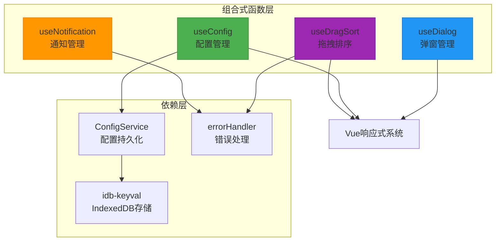
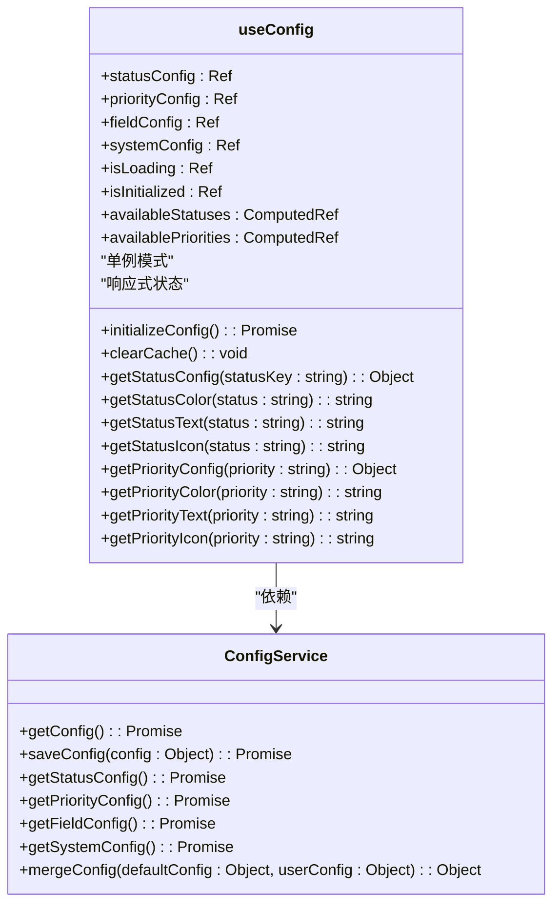
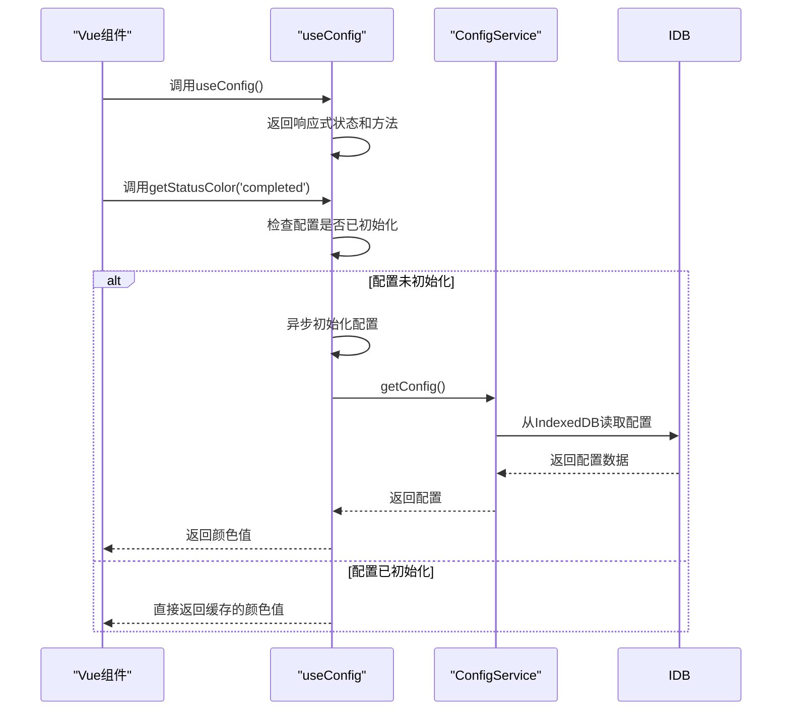
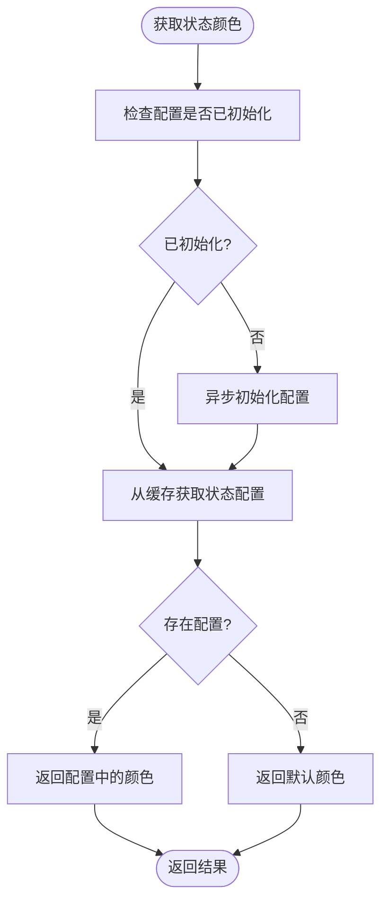
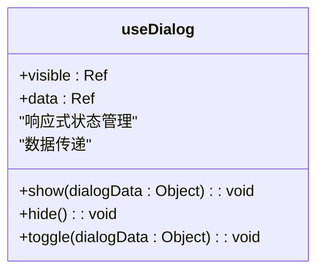
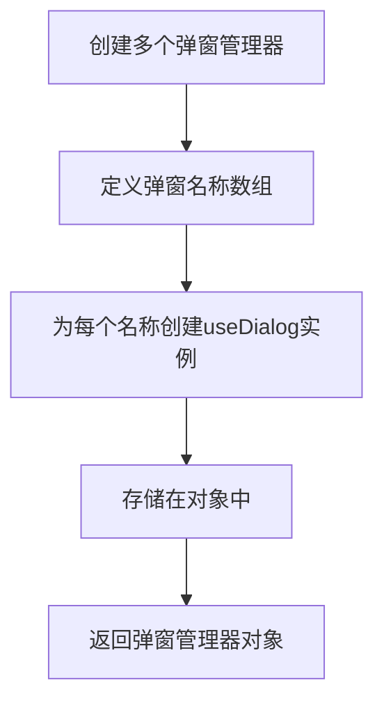
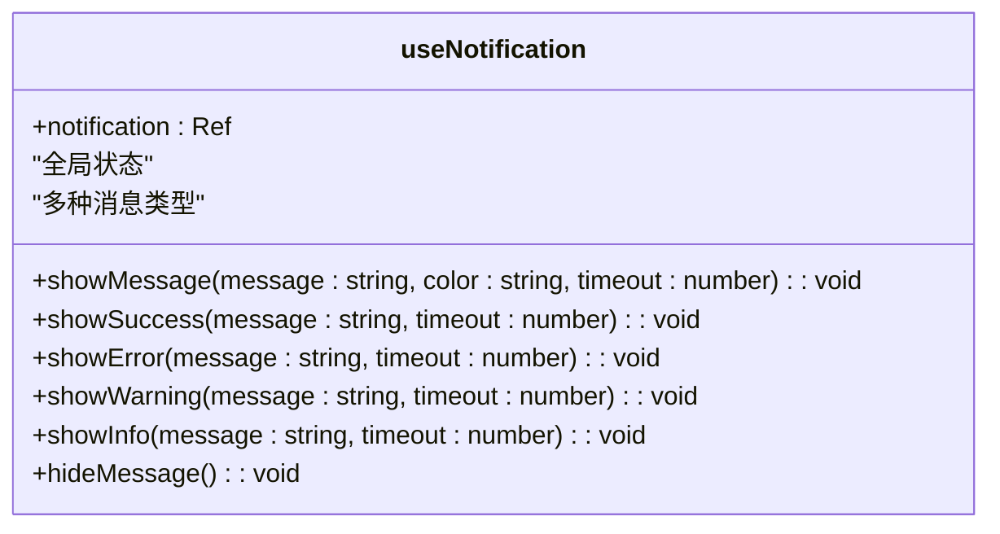
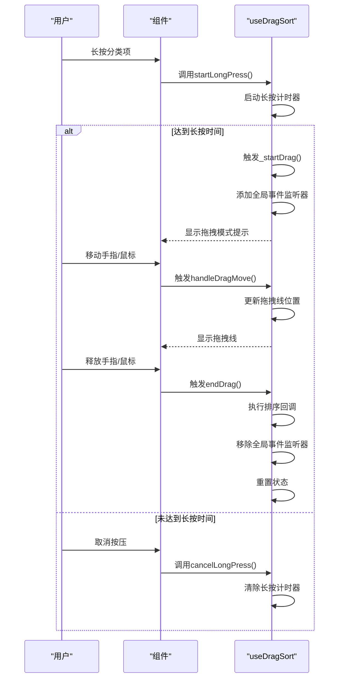
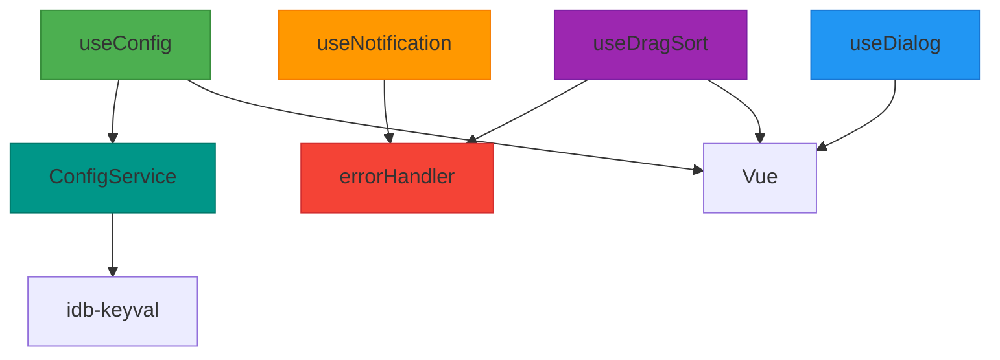

# 组合式函数架构

<cite>
**Referenced Files in This Document**   
- [useConfig.js](file://src/composables/useConfig.js)
- [useDialog.js](file://src/composables/useDialog.js)
- [useNotification.js](file://src/composables/useNotification.js)
- [useDragSort.js](file://src/composables/useDragSort.js)
- [configService.js](file://src/services/configService.js)
- [errorHandler.js](file://src/utils/errorHandler.js)
</cite>

## 目录
1. [简介](#简介)
2. [核心组合式函数分析](#核心组合式函数分析)
3. [架构概览](#架构概览)
4. [详细组件分析](#详细组件分析)
5. [依赖分析](#依赖分析)
6. [性能考虑](#性能考虑)
7. [故障排除指南](#故障排除指南)
8. [结论](#结论)

## 简介
TidyDo 应用通过组合式函数（composables）实现了可复用的逻辑封装和状态管理。这些组合式函数为应用提供了配置管理、弹窗控制、通知系统和拖拽排序等核心功能。本文档深入分析了 `useConfig`、`useDialog`、`useNotification` 和 `useDragSort` 四个核心组合式函数的设计理念、实现细节和使用场景，为开发者提供全面的技术参考。

## 核心组合式函数分析
TidyDo 的组合式函数层设计遵循了单一职责原则和可复用性原则，每个函数都专注于解决特定领域的状态管理和交互逻辑问题。通过将 UI 状态与业务逻辑分离，这些组合式函数实现了高度的模块化和可维护性。

**Section sources**
- [useConfig.js](file://src/composables/useConfig.js)
- [useDialog.js](file://src/composables/useDialog.js)
- [useNotification.js](file://src/composables/useNotification.js)
- [useDragSort.js](file://src/composables/useDragSort.js)

## 架构概览
TidyDo 的组合式函数架构采用分层设计，将不同类型的 UI 状态管理功能分离到独立的模块中。这种设计模式使得每个组合式函数都能专注于其特定的职责，同时通过统一的错误处理和状态管理机制保持整体架构的一致性。

**Diagram sources**
- [useConfig.js](file://src/composables/useConfig.js)
- [useDialog.js](file://src/composables/useDialog.js)
- [useNotification.js](file://src/composables/useNotification.js)
- [useDragSort.js](file://src/composables/useDragSort.js)
- [configService.js](file://src/services/configService.js)
- [errorHandler.js](file://src/utils/errorHandler.js)

## 详细组件分析
本节深入分析每个核心组合式函数的实现细节、设计理念和使用场景，为开发者提供全面的技术指导。

### useConfig 分析
`useConfig` 组合式函数实现了配置数据的响应式访问和缓存机制，为应用提供了统一的配置管理解决方案。

#### 设计理念与实现
`useConfig` 采用单例模式确保全局状态共享，通过响应式系统实现配置数据的实时更新。函数内部维护了一个全局状态对象，包含状态配置、优先级配置、字段配置和系统配置等多个维度的配置信息。

**Diagram sources**
- [useConfig.js](file://src/composables/useConfig.js#L20-L192)
- [configService.js](file://src/services/configService.js#L82-L202)

**Section sources**
- [useConfig.js](file://src/composables/useConfig.js)
- [configService.js](file://src/services/configService.js)

#### 配置数据的响应式访问
`useConfig` 通过 Vue 的响应式系统实现了配置数据的实时访问。所有配置数据都包装在 `ref` 中，确保当配置发生变化时，依赖这些数据的组件能够自动更新。

**Diagram sources**
- [useConfig.js](file://src/composables/useConfig.js#L20-L192)
- [configService.js](file://src/services/configService.js#L82-L202)

#### 便捷方法的内部实现
`useConfig` 提供了一系列便捷方法，如 `getStatusColor`、`getPriorityIcon` 等，这些方法简化了配置数据的访问过程。

**Diagram sources**
- [useConfig.js](file://src/composables/useConfig.js#L20-L192)

### useDialog 分析
`useDialog` 组合式函数提供了弹窗状态的统一管理策略，支持单个和多个弹窗的管理。

#### 单弹窗管理
`useDialog` 函数创建一个独立的弹窗管理器，管理弹窗的显示状态和传递数据。

**Diagram sources**
- [useDialog.js](file://src/composables/useDialog.js#L2-L38)

**Section sources**
- [useDialog.js](file://src/composables/useDialog.js)

#### 多弹窗管理
`useMultipleDialogs` 函数可以创建多个独立的弹窗管理器，用于管理应用中的多个弹窗。

### useNotification 分析
`useNotification` 组合式函数实现了消息队列与自动消失机制，为用户提供及时的反馈。

#### 消息队列与自动消失
`useNotification` 通过全局的响应式状态管理通知的显示，支持不同类型的提示消息。

**Diagram sources**
- [useNotification.js](file://src/composables/useNotification.js#L10-L58)

**Section sources**
- [useNotification.js](file://src/composables/useNotification.js)

### useDragSort 分析
`useDragSort` 组合式函数实现了在鼠标和触摸设备上的长按检测与拖拽排序功能。

#### 长按检测与拖拽实现
`useDragSort` 通过长按计时器和触摸事件处理，实现了跨设备的拖拽排序功能。

**Diagram sources**
- [useDragSort.js](file://src/composables/useDragSort.js#L27-L236)

**Section sources**
- [useDragSort.js](file://src/composables/useDragSort.js)

## 依赖分析
TidyDo 的组合式函数层与其他模块有着紧密的依赖关系，这些依赖关系确保了功能的完整性和一致性。

**Diagram sources**
- [useConfig.js](file://src/composables/useConfig.js)
- [useDialog.js](file://src/composables/useDialog.js)
- [useNotification.js](file://src/composables/useNotification.js)
- [useDragSort.js](file://src/composables/useDragSort.js)
- [configService.js](file://src/services/configService.js)
- [errorHandler.js](file://src/utils/errorHandler.js)

**Section sources**
- [configService.js](file://src/services/configService.js)
- [errorHandler.js](file://src/utils/errorHandler.js)

## 性能考虑
TidyDo 的组合式函数在设计时充分考虑了性能优化，通过多种机制确保应用的高效运行。

1. **配置缓存机制**：`useConfig` 通过响应式状态缓存配置数据，避免重复的存储访问。
2. **并行加载**：配置初始化时使用 `Promise.all` 并行加载多个配置，减少总加载时间。
3. **事件监听器管理**：`useDragSort` 在拖拽开始时添加全局事件监听器，在结束时及时移除，避免内存泄漏。
4. **错误处理优化**：使用 `withErrorHandling` 高阶函数统一处理异步操作的错误，减少重复代码。

## 故障排除指南
当使用组合式函数遇到问题时，可以参考以下常见问题的解决方案。

**Section sources**
- [errorHandler.js](file://src/utils/errorHandler.js)
- [useConfig.js](file://src/composables/useConfig.js)

### 配置初始化失败
如果 `useConfig` 初始化失败，检查：
1. 浏览器是否支持 IndexedDB 存储
2. 存储空间是否已满
3. 网络连接是否正常（如果配置需要从远程加载）

### 拖拽功能不工作
如果 `useDragSort` 拖拽功能不工作，检查：
1. 元素是否正确绑定了 `startLongPress` 和 `cancelLongPress` 事件
2. CSS 类名是否正确（需要 `.category-wrapper` 类）
3. 是否在组件卸载时调用了 `cleanup` 函数

### 弹窗状态不同步
如果 `useDialog` 状态不同步，检查：
1. 是否正确使用了响应式数据
2. 是否在正确的组件生命周期中调用相关方法
3. 是否存在多个实例导致状态冲突

## 结论
TidyDo 的组合式函数层通过精心设计的架构和实现，为应用提供了强大而灵活的 UI 状态管理能力。`useConfig`、`useDialog`、`useNotification` 和 `useDragSort` 四个核心组合式函数各司其职，共同构建了一个高效、可维护的应用架构。通过单例模式、响应式系统、统一错误处理等技术手段，这些组合式函数不仅提高了代码的复用性，还增强了应用的稳定性和用户体验。开发者可以基于这些模式创建新的组合式函数，进一步扩展应用的功能。