# 分类排序

<cite>
**Referenced Files in This Document**   
- [useDragSort.js](file://src/composables/useDragSort.js)
- [TodoSidebar.vue](file://src/components/TodoSidebar.vue)
- [useCategoriesStore.js](file://src/stores/useCategoriesStore.js)
- [todoService.js](file://src/services/todoService.js)
</cite>

## 目录
1. [引言](#引言)
2. [核心组件分析](#核心组件分析)
3. [拖拽排序工作原理](#拖拽排序工作原理)
4. [状态管理与事件机制](#状态管理与事件机制)
5. [数据持久化流程](#数据持久化流程)
6. [用户体验优化](#用户体验优化)
7. [移动端适配与性能调优](#移动端适配与性能调优)
8. [结论](#结论)

## 引言

本文档深入讲解基于长按拖拽的分类排序功能实现。详细分析`useDragSort`组合函数的工作原理，包括长按检测、拖拽状态管理、全局事件监听机制以及`_updateDropLine`的动态计算逻辑。说明`TodoSidebar`组件如何集成`useDragSort`，通过`startLongPress`和`endDrag`实现触摸与鼠标双模式支持。解释`reorderCategoriesByDrag`方法在store中的作用及与服务层的协作流程。提供拖拽冲突（如滚动条冲突、多指操作）的解决方案，阐述防抖策略和用户体验优化措施（如拖拽反馈动画、排序完成提示）。包含移动端适配注意事项和性能调优建议。

## 核心组件分析

### useDragSort 组合函数

`useDragSort`是实现分类拖拽排序的核心组合式函数，提供了完整的拖拽逻辑和状态管理。该函数通过Vue的响应式系统管理拖拽状态，并封装了从长按检测到排序完成的完整生命周期。

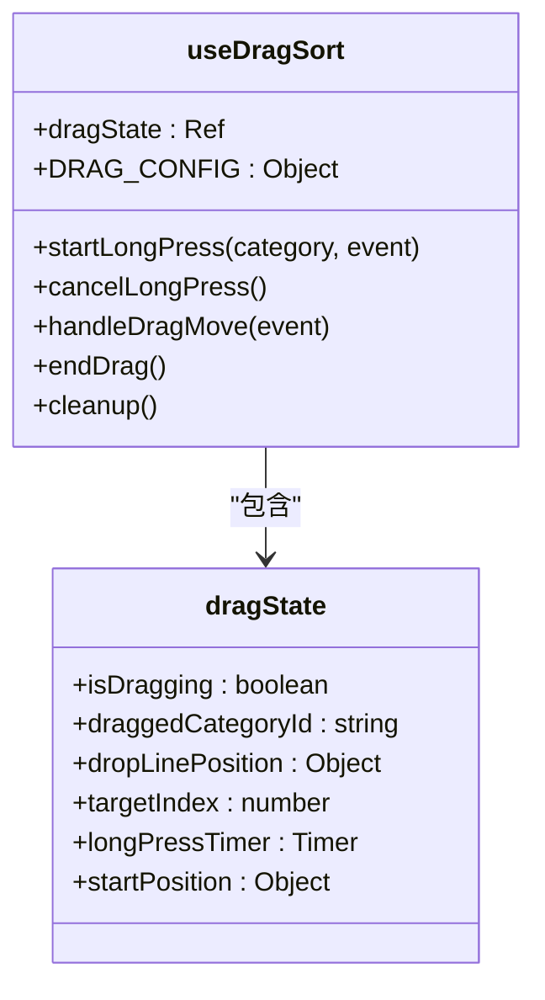

**Diagram sources**
- [useDragSort.js](file://src/composables/useDragSort.js#L27-L236)

**Section sources**
- [useDragSort.js](file://src/composables/useDragSort.js#L1-L237)

### TodoSidebar 组件

`TodoSidebar`组件是分类列表的UI容器，负责渲染分类项并集成拖拽功能。该组件通过`VueDraggable`组件实现可视化拖拽效果，并与`useDragSort`组合函数协同工作。

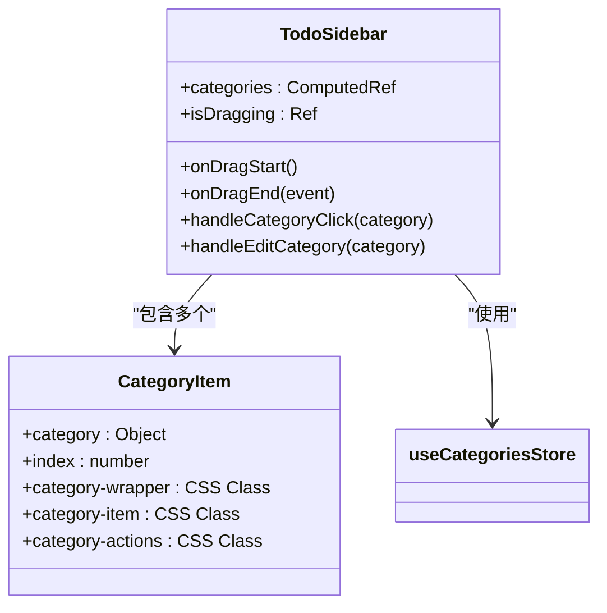

**Diagram sources**
- [TodoSidebar.vue](file://src/components/TodoSidebar.vue#L1-L577)

**Section sources**
- [TodoSidebar.vue](file://src/components/TodoSidebar.vue#L1-L577)

## 拖拽排序工作原理

### 长按检测机制

长按检测是触发拖拽模式的关键机制。系统通过`startLongPress`方法实现长按检测，当用户在分类项上持续按压达到预设时间（500毫秒）后，才激活拖拽模式。

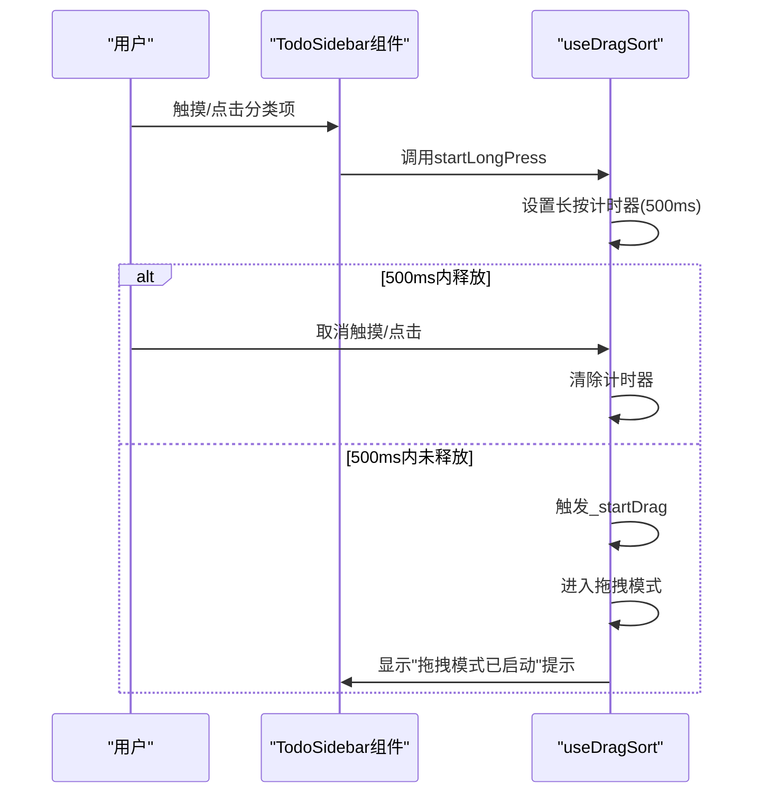

**Diagram sources**
- [useDragSort.js](file://src/composables/useDragSort.js#L91-L108)

**Section sources**
- [useDragSort.js](file://src/composables/useDragSort.js#L91-L108)

### 拖拽状态管理

拖拽状态由`dragState`响应式对象统一管理，包含拖拽状态、被拖拽的分类ID、拖拽线位置、目标索引等关键信息。

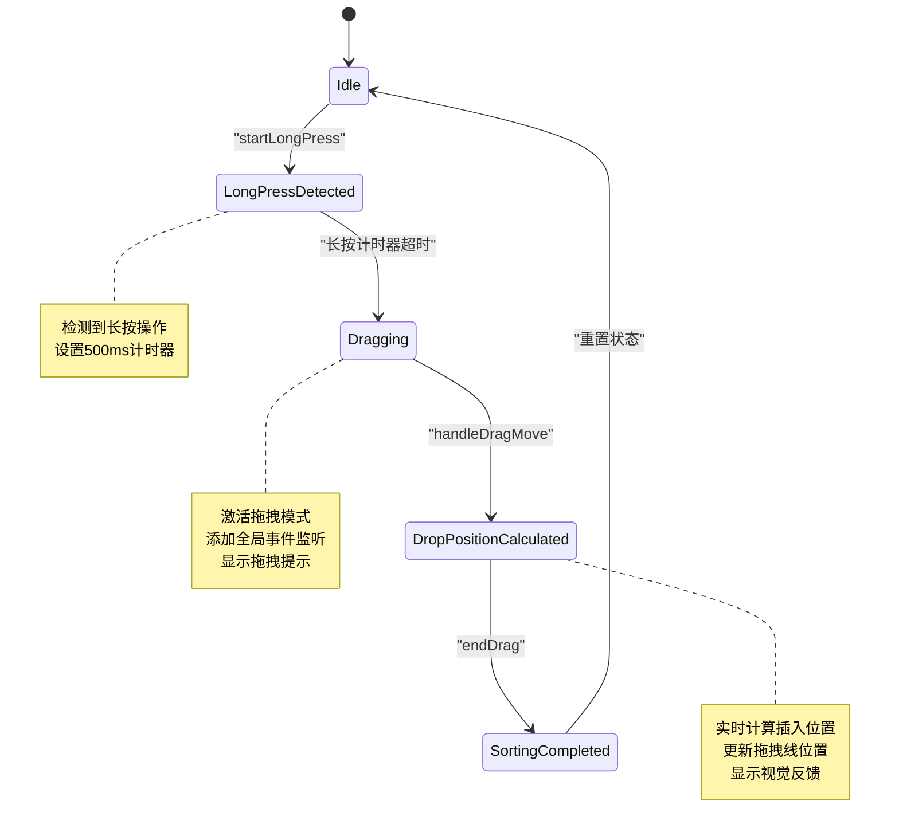

**Diagram sources**
- [useDragSort.js](file://src/composables/useDragSort.js#L45-L55)

**Section sources**
- [useDragSort.js](file://src/composables/useDragSort.js#L45-L55)

## 状态管理与事件机制

### 全局事件监听机制

为确保拖拽操作的流畅性，系统在进入拖拽模式时添加全局事件监听器，即使鼠标/手指移出分类项范围也能持续跟踪位置。

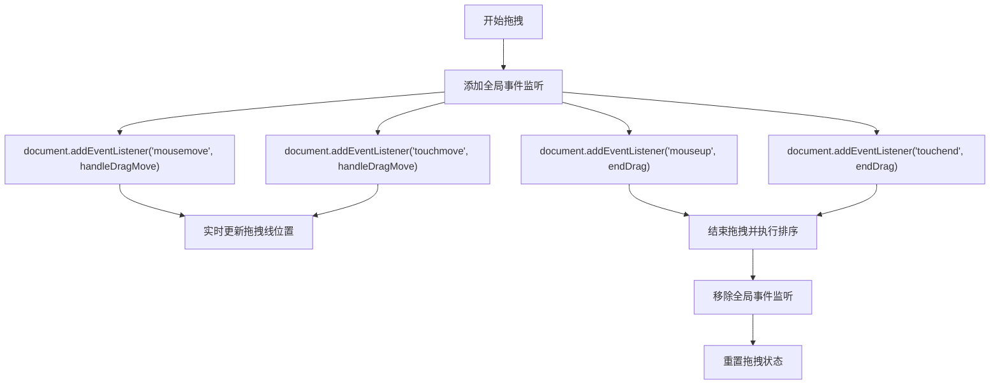

**Diagram sources**
- [useDragSort.js](file://src/composables/useDragSort.js#L184-L195)

**Section sources**
- [useDragSort.js](file://src/composables/useDragSort.js#L184-L195)

### _updateDropLine 动态计算逻辑

`_updateDropLine`方法负责实时计算拖拽线的显示位置，通过遍历所有分类元素并比较鼠标/触摸点的Y坐标来确定插入位置。

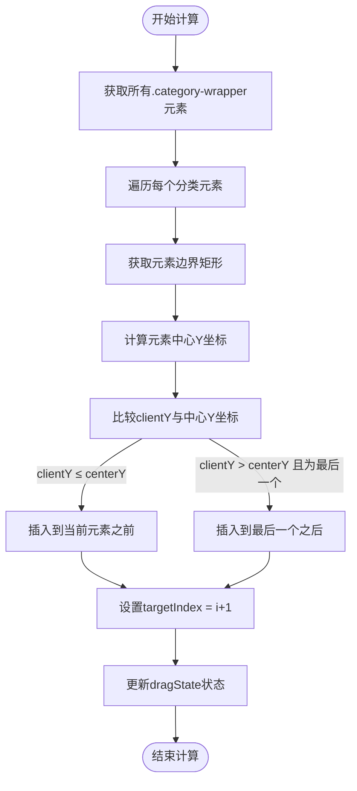

**Diagram sources**
- [useDragSort.js](file://src/composables/useDragSort.js#L164-L182)

**Section sources**
- [useDragSort.js](file://src/composables/useDragSort.js#L164-L182)

## 数据持久化流程

### reorderCategoriesByDrag 方法作用

`reorderCategoriesByDrag`方法位于`useCategoriesStore`中，作为store层的公共接口，协调拖拽排序的业务逻辑。

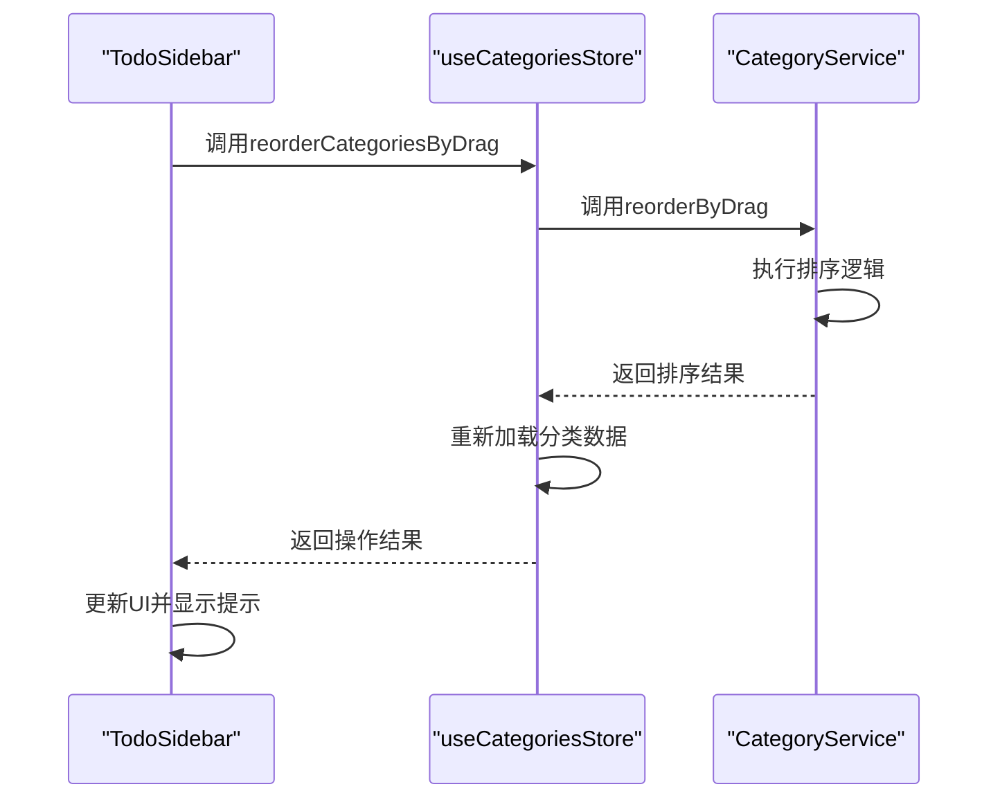

**Diagram sources**
- [useCategoriesStore.js](file://src/stores/useCategoriesStore.js#L146-L155)

**Section sources**
- [useCategoriesStore.js](file://src/stores/useCategoriesStore.js#L146-L155)

### 服务层协作流程

服务层的`reorderByDrag`方法负责实际的数据操作和持久化存储，确保排序结果被正确保存到IndexedDB中。

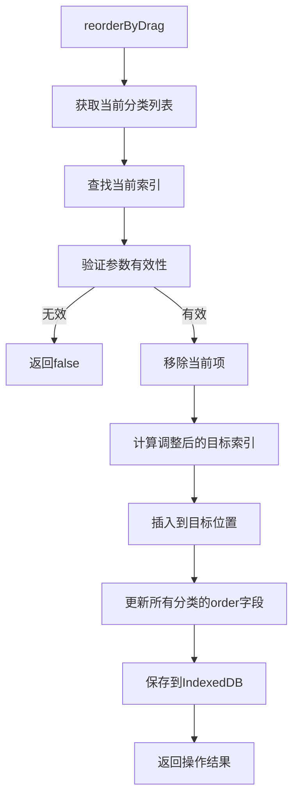

**Diagram sources**
- [todoService.js](file://src/services/todoService.js#L196-L225)

**Section sources**
- [todoService.js](file://src/services/todoService.js#L196-L225)

## 用户体验优化

### 拖拽冲突解决方案

系统通过多种策略解决常见的拖拽冲突问题：

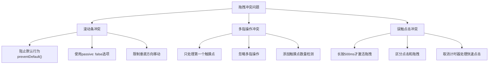

**Section sources**
- [useDragSort.js](file://src/composables/useDragSort.js#L91-L118)

### 防抖策略与反馈机制

系统实现了多层次的用户体验优化措施：

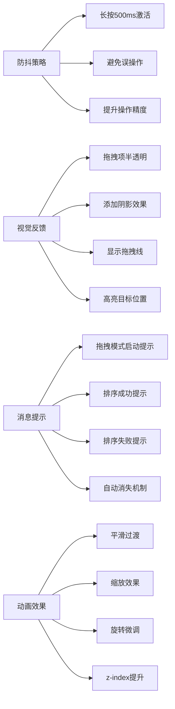

**Section sources**
- [useDragSort.js](file://src/composables/useDragSort.js#L110-L115)
- [TodoSidebar.vue](file://src/components/TodoSidebar.vue#L120-L135)

## 移动端适配与性能调优

### 移动端适配注意事项

针对移动端设备的特殊性，系统进行了专门的适配优化：

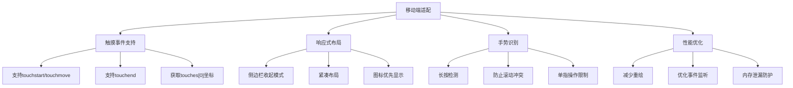

**Section sources**
- [useDragSort.js](file://src/composables/useDragSort.js#L100-L102)
- [TodoSidebar.vue](file://src/components/TodoSidebar.vue#L1-L577)

### 性能调优建议

为确保拖拽排序功能的高性能运行，建议采取以下优化措施：

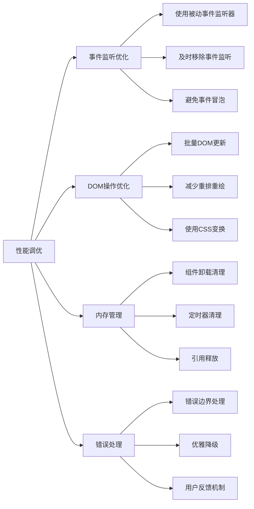

**Section sources**
- [useDragSort.js](file://src/composables/useDragSort.js#L196-L210)
- [useDragSort.js](file://src/composables/useDragSort.js#L225-L236)

## 结论

本文档全面分析了基于长按拖拽的分类排序功能实现。`useDragSort`组合函数通过精确的长按检测、完善的拖拽状态管理和智能的拖拽线位置计算，实现了流畅的拖拽体验。`TodoSidebar`组件与`useDragSort`紧密集成，支持触摸和鼠标双模式操作。数据层通过`useCategoriesStore`和`CategoryService`的协作，确保排序结果的持久化存储。系统通过长按激活、全局事件监听、视觉反馈和消息提示等机制，有效解决了拖拽冲突问题并提升了用户体验。移动端适配和性能调优措施保证了功能在各种设备上的稳定运行。整体设计体现了分层架构、关注点分离和用户体验优先的原则，为类似功能的开发提供了有价值的参考。