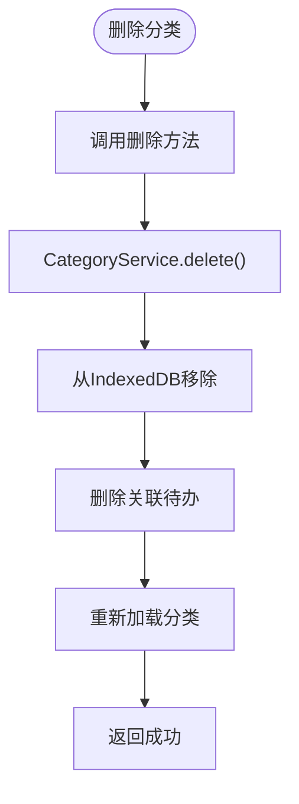

# 分类操作

<cite>
**本文档引用的文件**
- [useCategoriesStore.js](file://src/stores/useCategoriesStore.js)
- [todoService.js](file://src/services/todoService.js)
- [CategoryEditDialog.vue](file://src/model/CategoryEditDialog.vue)
- [configService.js](file://src/services/configService.js)
- [TodoSidebar.vue](file://src/components/TodoSidebar.vue)
</cite>

## 目录
1. [项目结构](#项目结构)
2. [核心组件](#核心组件)
3. [架构概述](#架构概述)
4. [详细组件分析](#详细组件分析)
5. [依赖分析](#依赖分析)
6. [性能考虑](#性能考虑)
7. [故障排除指南](#故障排除指南)

## 项目结构

根据项目架构，分类操作功能主要分布在以下层级：


**图示来源**
- [DEVELOPMENT.md](file://DEVELOPMENT.md#L19-L107)
- [project_structure](file://project_structure)

**本节来源**
- [DEVELOPMENT.md](file://DEVELOPMENT.md#L19-L107)
- [project_structure](file://project_structure)

## 核心组件

分类操作的核心功能由 `useCategoriesStore` 提供，该 Pinia Store 管理分类的增删改查操作。Store 通过 `CategoryService` 与 IndexedDB 进行数据持久化交互，确保数据的可靠存储。

Store 中定义了三个关键方法：`createNewCategory` 用于创建新分类，`updateCategory` 用于更新现有分类，`deleteCategory` 用于删除分类。这些方法都通过异步操作与服务层交互，并在操作完成后重新加载分类数据以保持状态同步。

**本节来源**
- [useCategoriesStore.js](file://src/stores/useCategoriesStore.js#L41-L174)

## 架构概述

分类操作的架构遵循清晰的分层设计，从 UI 组件到数据存储层形成了完整的调用链：


**图示来源**
- [useCategoriesStore.js](file://src/stores/useCategoriesStore.js#L41-L174)
- [todoService.js](file://src/services/todoService.js#L78-L137)

## 详细组件分析

### 分类存储分析

`useCategoriesStore` 实现了完整的分类管理功能，通过 Pinia 提供响应式状态管理。

#### 创建分类


**图示来源**
- [useCategoriesStore.js](file://src/stores/useCategoriesStore.js#L41-L68)
- [todoService.js](file://src/services/todoService.js#L99-L137)

#### 更新分类


**图示来源**
- [useCategoriesStore.js](file://src/stores/useCategoriesStore.js#L70-L101)
- [todoService.js](file://src/services/todoService.js#L99-L137)

#### 删除分类


**图示来源**
- [useCategoriesStore.js](file://src/stores/useCategoriesStore.js#L101-L110)
- [todoService.js](file://src/services/todoService.js#L139-L154)

**本节来源**
- [useCategoriesStore.js](file://src/stores/useCategoriesStore.js#L41-L174)

### 分类编辑对话框分析

`CategoryEditDialog` 组件提供了创建和编辑分类的用户界面，支持多种分类类型和筛选条件配置。

#### 表单验证机制


**图示来源**
- [CategoryEditDialog.vue](file://src/model/CategoryEditDialog.vue#L0-L45)
- [CategoryEditDialog.vue](file://src/model/CategoryEditDialog.vue#L249-L300)

#### 状态更新机制


**图示来源**
- [CategoryEditDialog.vue](file://src/model/CategoryEditDialog.vue#L249-L300)
- [TodoSidebar.vue](file://src/components/TodoSidebar.vue#L159-L214)

**本节来源**
- [CategoryEditDialog.vue](file://src/model/CategoryEditDialog.vue#L0-L473)

## 依赖分析

分类操作功能涉及多个组件和服务的协同工作，形成了复杂的依赖关系。

```mermaid
erDiagram
useCategoriesStore ||--o{ CategoryService : "使用"
CategoryService ||--o{ IndexedDB : "持久化"
CategoryEditDialog ||--o{ useCategoriesStore : "调用操作"
CategoryEditDialog ||--o{ ConfigService : "获取状态配置"
CategoryEditDialog ||--o{ TodoItemService : "获取标签"
TodoSidebar ||--o{ useCategoriesStore : "显示和操作"
TodoSidebar ||--o{ CategoryEditDialog : "打开对话框"
class useCategoriesStore {
createNewCategory()
updateCategory()
deleteCategory()
loadCategories()
}
class CategoryService {
getAll()
save()
delete()
}
class CategoryEditDialog {
handleSave()
loadStatusConfig()
loadTags()
}
```

**图示来源**
- [useCategoriesStore.js](file://src/stores/useCategoriesStore.js#L4-L185)
- [todoService.js](file://src/services/todoService.js#L78-L154)
- [CategoryEditDialog.vue](file://src/model/CategoryEditDialog.vue#L249-L300)
- [TodoSidebar.vue](file://src/components/TodoSidebar.vue#L159-L214)

**本节来源**
- [useCategoriesStore.js](file://src/stores/useCategoriesStore.js#L4-L185)
- [todoService.js](file://src/services/todoService.js#L78-L154)
- [CategoryEditDialog.vue](file://src/model/CategoryEditDialog.vue#L249-L300)
- [TodoSidebar.vue](file://src/components/TodoSidebar.vue#L159-L214)

## 性能考虑

分类操作在性能方面进行了多项优化，确保用户体验流畅。

### 批量操作优化
当进行批量分类操作时，系统通过以下策略优化状态更新：

1. **减少状态更新次数**：在批量操作完成后统一调用 `loadCategories()`，而不是每次操作后都重新加载
2. **高效的数据排序**：`CategoryService.getAll()` 方法在读取数据时自动按 `order` 字段排序，避免在前端进行额外排序
3. **索引优化**：使用 `id` 字段作为索引快速查找分类，提高更新和删除操作的效率

### 异步操作优化


这种模式确保了即使操作失败，加载状态也能被正确清除，避免界面卡在加载状态。

**本节来源**
- [useCategoriesStore.js](file://src/stores/useCategoriesStore.js#L41-L174)
- [todoService.js](file://src/services/todoService.js#L78-L101)

## 故障排除指南

### 常见问题及解决方案

#### 分类删除后关联待办事项处理
当删除分类时，系统会自动处理关联的待办事项：
- 如果是普通分类，删除该分类下的所有待办事项
- 如果是简单Todo分类，调用 `SimpleTodoService.deleteByCategoryId()` 删除相关项
- 通过 `await import()` 动态导入服务，避免循环依赖

**本节来源**
- [todoService.js](file://src/services/todoService.js#L139-L154)

#### 重复名称校验
系统目前未在存储层实现重复名称校验，建议在 UI 层添加验证逻辑：

```javascript
const validateCategoryName = (name, currentId = null) => {
  const categories = useCategoriesStore().categories
  const exists = categories.some(cat => 
    cat.name === name && cat.id !== currentId
  )
  return !exists
}
```

#### 空值校验
系统在多个层级实现了空值校验：
- UI 层：`CategoryEditDialog` 中的 `v-text-field` 使用规则验证名称非空
- 服务层：`CategoryService.save()` 方法对关键字段进行默认值处理
- 数据层：确保 `id`、`name` 等字段不为 null 或 undefined

**本节来源**
- [CategoryEditDialog.vue](file://src/model/CategoryEditDialog.vue#L0-L45)
- [todoService.js](file://src/services/todoService.js#L99-L137)