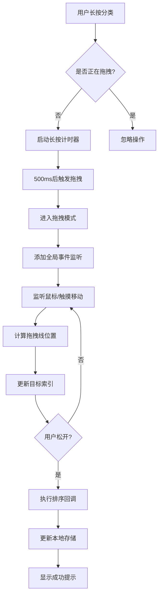
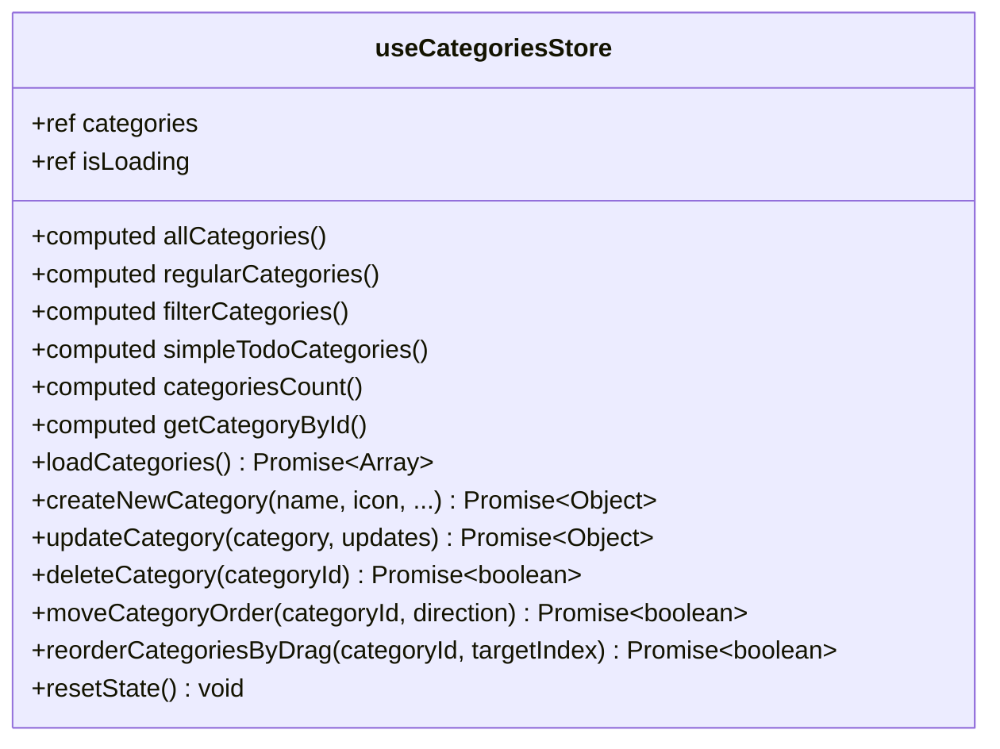

<cite>
**本文档中引用的文件**   
- [TodoSidebar.vue](file://src/components/TodoSidebar.vue)
- [useDragSort.js](file://src/composables/useDragSort.js)
- [useCategoriesStore.js](file://src/stores/useCategoriesStore.js)
- [configService.js](file://src/services/configService.js)
- [todoService.js](file://src/services/todoService.js)
</cite>

# 分类管理

## 目录
1. [分类管理功能概述](#分类管理功能概述)
2. [增删改查实现方式](#增删改查实现方式)
3. [长按拖拽排序技术实现](#长按拖拽排序技术实现)
4. [状态管理与本地存储](#状态管理与本地存储)
5. [实际使用场景示例](#实际使用场景示例)
6. [常见问题与解决方案](#常见问题与解决方案)
7. [性能优化建议](#性能优化建议)

## 分类管理功能概述

分类管理功能是TidyDo应用的核心模块之一，为用户提供了一套完整的分类组织和管理解决方案。该功能允许用户通过直观的界面操作对任务分类进行增删改查，并支持通过长按拖拽的方式重新排列分类顺序。系统采用现代化的前端架构，结合Vue 3的组合式API、Pinia状态管理以及IndexedDB本地存储技术，实现了高效、可靠的数据管理和用户体验。

分类管理功能不仅提供了基本的CRUD操作，还通过精心设计的交互方式提升了用户的操作效率。用户可以通过侧边栏快速访问所有分类，使用菜单进行编辑和删除操作，或通过拖拽方式直观地调整分类的显示顺序。整个功能模块的设计充分考虑了用户习惯和操作便捷性，为任务管理提供了坚实的基础。

**Section sources**
- [TodoSidebar.vue](file://src/components/TodoSidebar.vue#L1-L577)

## 增删改查实现方式

### 分类创建
分类创建功能通过`useCategoriesStore.createNewCategory`方法实现。当用户点击"新建分类"按钮时，系统会打开分类编辑对话框。用户输入分类名称和选择图标后，系统会调用`createNewCategory`方法。该方法首先获取当前所有分类，根据分类数量确定新分类的排序值（order），然后使用`createCategory`工厂函数创建新的分类对象，最后通过`CategoryService.save`方法将分类数据持久化存储到IndexedDB中。

### 分类读取
分类数据的读取通过`useCategoriesStore.loadCategories`方法实现。该方法调用`CategoryService.getAll`从IndexedDB中获取所有分类数据，并按照order字段进行排序。如果分类没有order字段，则按创建时间排序。获取到的数据会更新到Pinia store的categories状态中，触发视图的自动更新。

### 分类更新
分类更新功能通过`useCategoriesStore.updateCategory`方法实现。当用户编辑分类信息时，系统会收集更新的数据，创建一个包含所有必要字段的更新对象，确保数据的完整性和可序列化性。更新对象会传递给`CategoryService.save`方法，该方法会查找现有分类并替换其数据，最后更新updatedAt时间戳并保存到存储中。

### 分类删除
分类删除功能通过`useCategoriesStore.deleteCategory`方法实现。删除操作不仅会从分类列表中移除指定分类，还会根据分类类型删除关联的待办事项。如果删除的是简单Todo分类，则调用`SimpleTodoService.deleteByCategoryId`删除相关数据；如果是普通分类，则调用`TodoItemService.deleteByCategoryId`删除关联的待办事项。

**Section sources**
- [useCategoriesStore.js](file://src/stores/useCategoriesStore.js#L4-L185)
- [todoService.js](file://src/services/todoService.js#L83-L154)

## 长按拖拽排序技术实现

### useDragSort组合函数工作原理

`useDragSort`组合函数是长按拖拽排序功能的核心实现。该函数采用组合式API设计模式，封装了拖拽排序所需的所有状态和逻辑，提供了清晰的API接口供组件使用。

#### 拖拽状态管理
函数使用`ref`创建了一个`dragState`响应式对象，用于管理拖拽过程中的各种状态：
- `isDragging`：标识是否正在拖拽
- `draggedCategoryId`：记录被拖拽的分类ID
- `dropLinePosition`：控制拖拽线的显示位置
- `targetIndex`：目标插入索引
- `longPressTimer`：长按计时器
- `startPosition`：拖拽起始位置坐标

#### 长按检测机制
`startLongPress`方法实现了长按检测功能。当用户在分类项上按下时，函数会记录起始位置并启动一个定时器。如果用户在`DRAG_CONFIG.LONG_PRESS_DURATION`（500毫秒）内没有松开，则触发`_startDrag`方法进入拖拽模式。这种设计避免了误操作，确保只有明确的长按操作才会启动拖拽。

#### 拖拽过程处理
拖拽过程中，`handleDragMove`方法会持续监听鼠标或触摸移动事件，通过`_updateDropLine`方法计算拖拽线的显示位置。该方法遍历所有分类元素，根据鼠标Y坐标与元素中心点的比较，确定目标插入位置和拖拽线的显示位置。

#### 拖拽结束处理
`endDrag`方法处理拖拽结束逻辑。该方法会移除全局事件监听器，执行排序回调函数`onReorder`，并显示相应的消息提示。通过`withErrorHandling`包装器，确保错误能够被正确捕获和处理。

**Diagram sources**
- [useDragSort.js](file://src/composables/useDragSort.js#L27-L236)

### 与TodoSidebar组件的集成

`useDragSort`函数与`TodoSidebar`组件的集成通过事件驱动的方式实现。在`TodoSidebar.vue`中，虽然实际的拖拽功能由`VueDraggable`组件处理，但`useDragSort`的设计理念和状态管理机制为拖拽功能提供了理论基础。

组件通过`onDragStart`和`onDragEnd`事件处理拖拽的开始和结束。在`onDragEnd`回调中，组件获取拖拽的分类ID和新位置索引，然后调用`useCategoriesStore.reorderCategoriesByDrag`方法执行排序操作。如果排序成功，会显示成功提示；如果失败，则重新加载分类数据以恢复原始顺序。

这种集成方式实现了关注点分离：`useDragSort`负责拖拽逻辑和状态管理，而`TodoSidebar`负责UI交互和事件处理，两者通过清晰的接口进行通信。

**Section sources**
- [useDragSort.js](file://src/composables/useDragSort.js#L27-L236)
- [TodoSidebar.vue](file://src/components/TodoSidebar.vue#L1-L577)

## 状态管理与本地存储

### useCategoriesStore状态管理

`useCategoriesStore`是基于Pinia的状态管理模块，负责管理所有分类相关的状态和业务逻辑。该store采用模块化设计，将状态、计算属性和操作方法清晰地组织在一起。

#### 状态与计算属性
store维护了`categories`和`isLoading`两个核心状态。通过计算属性，store提供了多种分类视图：
- `allCategories`：所有分类
- `regularCategories`：普通分类
- `filterCategories`：筛选类分类
- `simpleTodoCategories`：简单Todo分类
- `getCategoryById`：根据ID获取分类的函数

这些计算属性使得组件可以方便地获取所需的数据视图，而无需在组件内部进行数据处理。

#### 业务操作方法
store提供了完整的CRUD操作方法：
- `loadCategories`：加载分类数据
- `createNewCategory`：创建新分类
- `updateCategory`：更新分类
- `deleteCategory`：删除分类
- `moveCategoryOrder`：上下移动分类
- `reorderCategoriesByDrag`：拖拽排序分类

这些方法都封装了错误处理逻辑，确保操作的可靠性。

**Diagram sources**
- [useCategoriesStore.js](file://src/stores/useCategoriesStore.js#L4-L185)

### configService本地存储实现

`configService`模块负责应用配置的本地存储，使用IndexedDB作为持久化存储方案。该服务通过`idb-keyval`库简化了IndexedDB的操作，提供了简洁的API接口。

#### 配置存储机制
服务使用`CONFIG_KEY`作为配置数据的存储键，将整个配置对象作为一个值存储。`getConfig`和`saveConfig`方法都使用了`withErrorHandling`包装器，确保存储操作的错误能够被正确处理。

#### 默认配置合并
服务实现了智能的配置合并机制。`mergeConfig`方法会递归地合并默认配置和用户配置，确保即使应用更新添加了新的配置项，也能正确地与用户现有配置合并，避免配置丢失。

#### 配置持久化
所有配置操作最终都通过`set`函数将数据写入IndexedDB。这种基于键值对的存储方式简单高效，适合存储应用配置这类结构化数据。

**Section sources**
- [useCategoriesStore.js](file://src/stores/useCategoriesStore.js#L4-L185)
- [configService.js](file://src/services/configService.js#L0-L205)

## 实际使用场景示例

### 创建新分类并调整显示顺序

用户在使用TidyDo应用时，可以通过以下步骤创建新分类并调整其显示顺序：

1. **创建新分类**：用户点击侧边栏底部的"新建分类"按钮，系统弹出分类编辑对话框。用户输入分类名称"项目计划"，选择文件夹图标，然后点击保存。系统调用`createNewCategory`方法，创建一个新的分类对象，设置其order值为当前分类数量（即添加到末尾），并将数据保存到IndexedDB中。

2. **调整显示顺序**：用户希望将"项目计划"分类移动到列表顶部。长按"项目计划"分类约500毫秒，直到看到拖拽提示。然后拖动分类向上移动，当拖拽线显示在"默认分类"上方时松开鼠标。系统捕获拖拽事件，获取被拖拽分类的ID和目标索引0，调用`reorderCategoriesByDrag`方法执行排序操作。

3. **数据更新**：排序操作成功后，系统会重新加载所有分类数据，按照新的order值重新排序。所有分类的order字段都会被更新以反映新的顺序，确保数据的一致性。

4. **界面反馈**：操作完成后，系统会在顶部显示"分类排序已更新"的成功提示，用户可以看到分类已经移动到期望的位置。

这个流程展示了分类管理功能的完整工作流，从用户交互到状态管理再到数据持久化，各个环节紧密配合，为用户提供流畅的操作体验。

**Section sources**
- [TodoSidebar.vue](file://src/components/TodoSidebar.vue#L1-L577)
- [useCategoriesStore.js](file://src/stores/useCategoriesStore.js#L4-L185)

## 常见问题与解决方案

### 拖拽冲突处理

**问题描述**：在触摸设备上，长按拖拽操作可能与滚动操作发生冲突，导致误触发拖拽或无法正常滚动。

**解决方案**：
1. 实现精确的长按检测机制，设置500毫秒的延迟，避免快速点击被误识别为拖拽。
2. 在拖拽开始时记录起始位置，如果移动距离超过阈值，则取消拖拽操作，允许页面滚动。
3. 使用`passive: false`选项注册触摸事件，确保可以调用`preventDefault()`阻止默认行为。

### 分类删除后的数据归属问题

**问题描述**：删除分类时，该分类下的所有待办事项需要妥善处理，避免数据丢失。

**解决方案**：
1. 在删除分类前显示确认对话框，明确告知用户将同时删除该分类下的所有待办事项。
2. 根据分类类型调用相应的删除服务：普通分类调用`TodoItemService.deleteByCategoryId`，简单Todo分类调用`SimpleTodoService.deleteByCategoryId`。
3. 如果删除的是当前选中的分类，自动切换到剩余分类中的第一个，确保界面状态的连续性。

### 性能优化建议

1. **减少不必要的渲染**：使用Pinia的计算属性缓存分类数据，避免在每次访问时重新计算。
2. **批量更新**：在执行拖拽排序时，一次性更新所有分类的order字段，而不是逐个更新，减少存储操作次数。
3. **事件监听器管理**：在组件卸载时及时清理全局事件监听器，防止内存泄漏。
4. **错误边界处理**：使用`withErrorHandling`包装器统一处理异步操作中的错误，提供友好的用户反馈。
5. **数据预加载**：在应用启动时预加载分类数据，减少用户等待时间。

**Section sources**
- [useDragSort.js](file://src/composables/useDragSort.js#L27-L236)
- [TodoSidebar.vue](file://src/components/TodoSidebar.vue#L1-L577)
- [todoService.js](file://src/services/todoService.js#L196-L225)