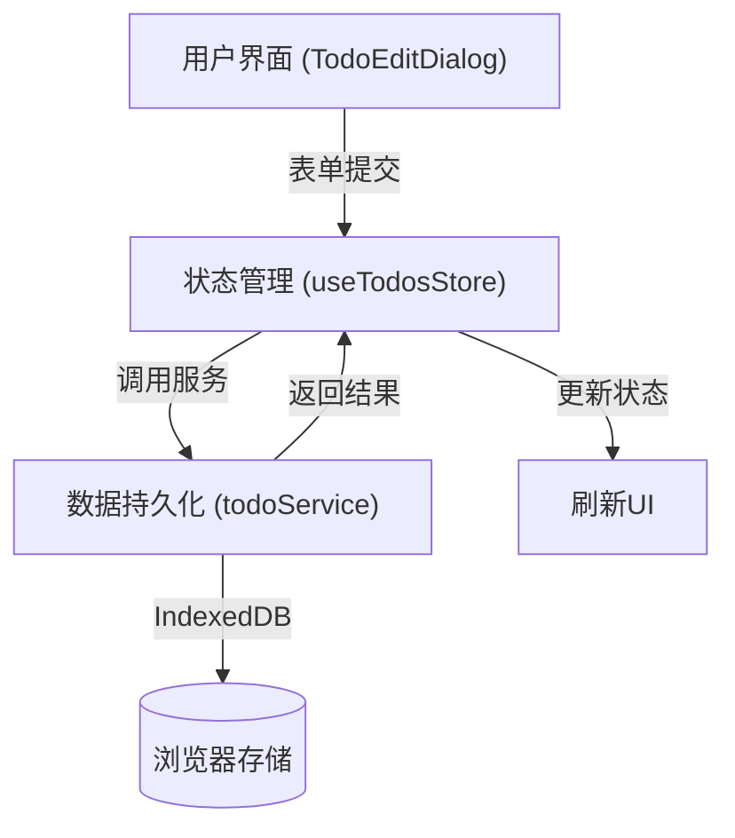
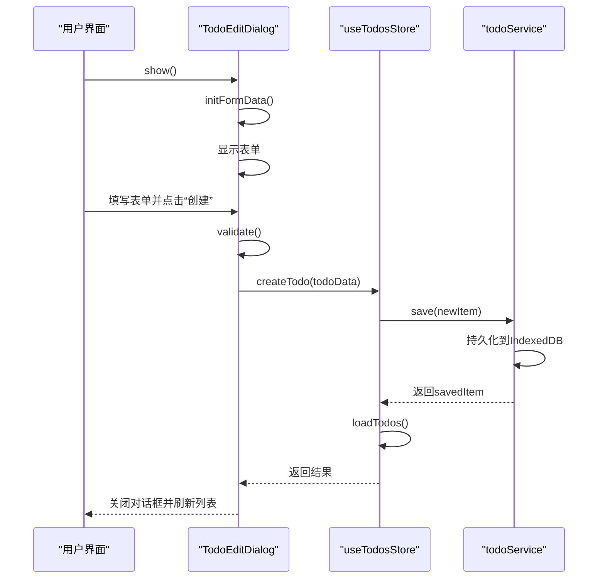
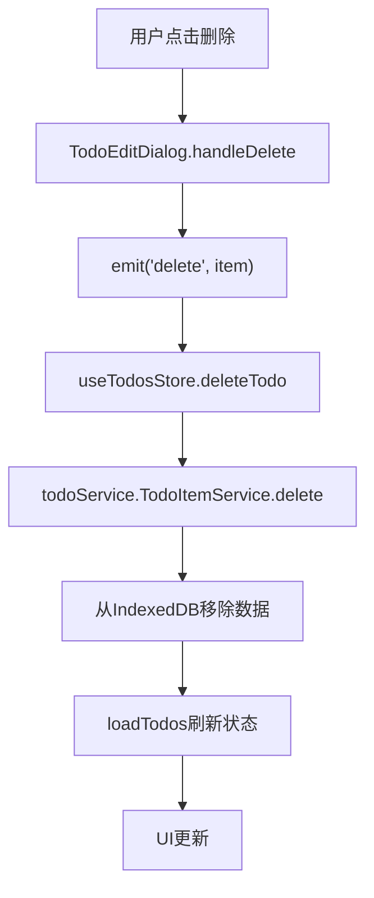

<cite>
**本文档中引用的文件**
- [TodoEditDialog.vue](file://src\model\TodoEditDialog.vue)
- [useTodosStore.js](file://src\stores\useTodosStore.js)
- [todoService.js](file://src\services\todoService.js)
- [useDialog.js](file://src\composables\useDialog.js)
- [configService.js](file://src\services\configService.js)
- [errorHandler.js](file://src\utils\errorHandler.js)
</cite>

# 待办事项CRUD操作

## 目录
1. [简介](#简介)
2. [核心组件与数据流](#核心组件与数据流)
3. [创建待办事项](#创建待办事项)
4. [读取待办事项](#读取待办事项)
5. [更新待办事项](#更新待办事项)
6. [删除待办事项](#删除待办事项)
7. [数据持久化机制](#数据持久化机制)
8. [错误处理机制](#错误处理机制)
9. [常见问题排查](#常见问题排查)
10. [性能优化建议](#性能优化建议)

## 简介

本文档详细介绍了待办事项应用中CRUD（创建、读取、更新、删除）操作的实现机制。系统采用Vue 3组合式API与Pinia状态管理，通过`TodoEditDialog`组件处理用户界面交互，`useTodosStore`管理应用状态，并利用`todoService`服务与IndexedDB进行数据持久化。文档将深入解析各组件间的协作流程，涵盖数据绑定、验证规则、状态变更及错误处理等关键环节。

## 核心组件与数据流

系统主要由三个核心组件构成，形成清晰的数据流：

1. **`TodoEditDialog.vue`**：负责用户界面交互，提供创建和编辑待办事项的表单。
2. **`useTodosStore.js`**：作为中央状态管理器，协调数据的获取、变更与同步。
3. **`todoService.js`**：封装与IndexedDB的交互逻辑，实现数据的持久化存储。

**Diagram sources**
- [TodoEditDialog.vue](file://src\model\TodoEditDialog.vue)
- [useTodosStore.js](file://src\stores\useTodosStore.js)
- [todoService.js](file://src\services\todoService.js)

**Section sources**
- [TodoEditDialog.vue](file://src\model\TodoEditDialog.vue)
- [useTodosStore.js](file://src\stores\useTodosStore.js)
- [todoService.js](file://src\services\todoService.js)

## 创建待办事项

创建待办事项的流程始于用户界面，最终完成于数据存储。

### 用户界面交互

当用户点击“新建待办”时，`TodoHeader`或`TodoContent`组件会调用`useDialog`实例的`show`方法来显示`TodoEditDialog`。

**Diagram sources**
- [TodoEditDialog.vue](file://src\model\TodoEditDialog.vue#L380-L410)
- [useTodosStore.js](file://src\stores\useTodosStore.js#L78-L98)
- [todoService.js](file://src\services\todoService.js#L244-L262)

**Section sources**
- [TodoEditDialog.vue](file://src\model\TodoEditDialog.vue#L380-L410)
- [useTodosStore.js](file://src\stores\useTodosStore.js#L78-L98)

### 数据绑定与验证

`TodoEditDialog`组件通过`v-model`将表单字段与`formData`对象进行双向绑定。关键的验证规则如下：

- **标题**：必填，且长度不能超过100个字符。
- **状态与优先级**：从`configService`动态加载的配置中获取选项。

表单初始化时，`initFormData`方法会根据`props.item`是否存在来判断是创建还是编辑模式，并相应地设置`formData`的初始值。

### 状态管理与服务调用

`useTodosStore`中的`createTodo` action负责处理创建逻辑。它首先调用`createTodoItem`工厂函数创建一个包含默认值的新待办项，然后合并表单中的其他字段（如标签、附件等），最后调用`TodoItemService.save`方法进行持久化。

## 读取待办事项

待办事项的读取是一个被动过程，通常在应用启动或数据变更后触发。

### 初始化加载

应用启动时，`useTodosStore`的`loadTodos` action会被调用。该方法通过`TodoItemService.getAll()`从IndexedDB中获取所有待办事项，并将其赋值给`todos`状态，从而驱动UI更新。

### 动态过滤

`useTodosStore`提供了多个计算属性（Getters）来实现数据的动态过滤：
- `activeTodos`：获取所有未归档的待办事项。
- `archivedTodos`：获取所有已归档的待办事项。
- `getTodosByCategoryId`：根据分类ID获取待办事项，并根据`showArchived`标志决定是否包含归档项。

**Section sources**
- [useTodosStore.js](file://src\stores\useTodosStore.js#L10-L45)

## 更新待办事项

更新待办事项的流程与创建类似，但起始于一个已存在的待办项。

### 编辑模式

当用户点击一个待办项进行编辑时，`TodoContent`组件会将该待办项的数据作为`item` prop传递给`TodoEditDialog`。`TodoEditDialog`的`initFormData`方法会将`item`的数据填充到`formData`中，使用户可以在现有数据的基础上进行修改。

### 状态更新

用户提交修改后，`TodoEditDialog`会通过`emit('save', { ...props.item, ...todoData })`将原始数据与修改后的数据合并，并触发`useTodosStore`的`updateTodo` action。该action直接调用`TodoItemService.save`方法，由于待办项ID已存在，服务会执行更新操作而非创建。

**Section sources**
- [TodoEditDialog.vue](file://src\model\TodoEditDialog.vue#L380-L405)
- [useTodosStore.js](file://src\stores\useTodosStore.js#L100-L108)

## 删除待办事项

删除操作涉及用户确认和数据清理。

### 用户确认

在`TodoEditDialog`的编辑模式下，会显示一个“删除”按钮。用户点击后，会触发`handleDelete`方法，该方法通过`emit('delete', props.item)`向父组件发出删除事件。

### 状态与数据清理

`useTodosStore`的`deleteTodo` action接收到删除请求后，会调用`TodoItemService.delete(todoId)`方法。该方法从IndexedDB的`todo-items`键值对中移除指定ID的待办项，然后调用`loadTodos`重新加载数据，从而从UI中移除该条目。

**Diagram sources**
- [TodoEditDialog.vue](file://src\model\TodoEditDialog.vue#L412-L418)
- [useTodosStore.js](file://src\stores\useTodosStore.js#L110-L118)
- [todoService.js](file://src\services\todoService.js#L288-L293)

**Section sources**
- [TodoEditDialog.vue](file://src\model\TodoEditDialog.vue#L412-L418)
- [useTodosStore.js](file://src\stores\useTodosStore.js#L110-L118)

## 数据持久化机制

系统使用`idb-keyval`库作为IndexedDB的轻量级封装，实现数据的持久化。

### 数据结构

数据被分为两个主要集合：
- `TODO_ITEMS_KEY` (`todo-items`)：存储所有待办事项。
- `TODO_CATEGORIES_KEY` (`todo-categories`)：存储分类信息。

每个待办事项（TodoItem）都是一个包含丰富元数据的JSON对象，如ID、标题、描述、优先级、状态、标签、日期和附件等。

### 服务层封装

`todoService.js`中的`TodoItemService`类提供了`getAll`、`getById`、`save`和`delete`等方法。`save`方法是CRUD操作的核心，它会先获取当前所有数据，然后根据ID判断是新增还是更新，最后将整个数据数组写回IndexedDB。

**Section sources**
- [todoService.js](file://src\services\todoService.js#L150-L293)

## 错误处理机制

系统采用分层的错误处理策略，确保用户体验的健壮性。

### 统一错误处理

`withErrorHandling`高阶函数被应用于所有可能失败的异步操作（如`TodoItemService.getAll`和`save`）。它捕获底层错误，将其包装为`AppError`，并提供用户友好的错误信息。

### 错误类型与反馈

`ErrorTypes`枚举定义了不同类型的错误（如`STORAGE`、`NETWORK`）。当`todoService`的操作失败时，`withErrorHandling`会记录详细的错误日志，并抛出一个包含操作描述和友好信息的`AppError`，该错误最终会冒泡到UI层进行提示。

**Section sources**
- [errorHandler.js](file://src\utils\errorHandler.js)
- [todoService.js](file://src\services\todoService.js#L244-L293)

## 常见问题排查

### 数据未保存

1. **检查浏览器存储权限**：确保浏览器允许该应用使用IndexedDB。
2. **检查存储空间**：如果存储空间已满，`QuotaExceededError`会被抛出。
3. **查看控制台日志**：检查是否有`❌ [保存待办事项] 操作失败:`的错误日志，这能帮助定位具体问题。

### 表单验证失败

1. **标题为空或过长**：确保标题已填写且不超过100个字符。
2. **必填字段缺失**：检查是否有其他必填字段未填写。

## 性能优化建议

### 批量操作

当前的`save`和`delete`操作会读取和写入整个数据数组。对于大量数据，这可能导致性能瓶颈。优化建议：
- **增量更新**：修改`todoService`，使其支持对单个条目的直接操作，避免读取整个数据集。
- **批量操作API**：为`todoService`添加`saveBatch`和`deleteBatch`方法，以减少与IndexedDB的交互次数。

### 状态更新

`createTodo`、`updateTodo`和`deleteTodo`在操作后都会调用`loadTodos`来刷新整个状态。对于大型列表，这会导致不必要的重渲染。优化建议：
- **局部更新**：在`createTodo`和`updateTodo`成功后，直接将返回的`savedItem`插入或更新到`todos`数组中，而不是重新加载全部数据。