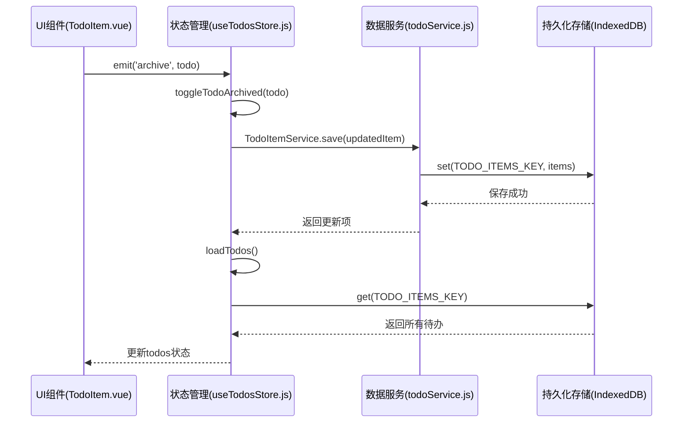
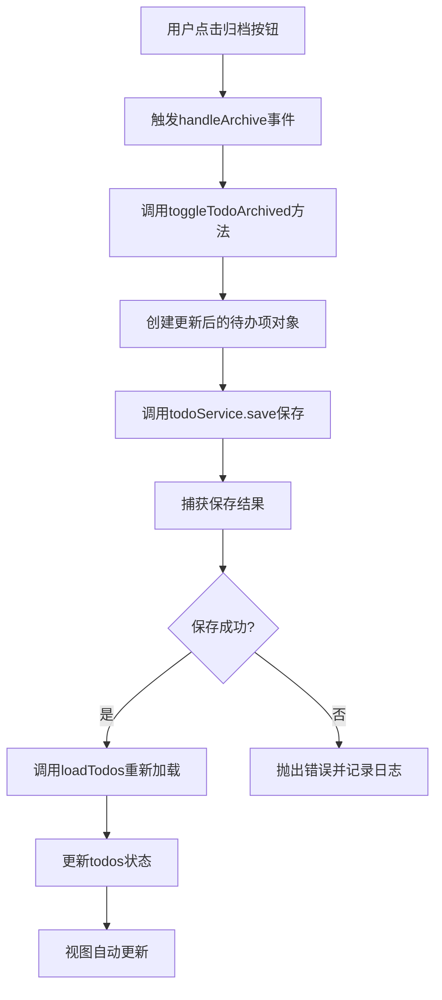

# 待办事项归档机制

<cite>
**本文档引用的文件**  
- [useTodosStore.js](file://src/stores/useTodosStore.js)
- [todoService.js](file://src/services/todoService.js)
- [TodoItem.vue](file://src/views/tidyDo/components/TodoItem.vue)
- [TodoContent.vue](file://src/views/tidyDo/components/TodoContent.vue)
- [useAppStore.js](file://src/stores/useAppStore.js)
</cite>

## 目录
1. [简介](#简介)
2. [归档状态切换逻辑](#归档状态切换逻辑)
3. [UI组件中的归档按钮行为](#ui组件中的归档按钮行为)
4. [useTodosStore中的异步处理流程](#usetodosstore中的异步处理流程)
5. [todoService.save的持久化实现](#todoservicesave的持久化实现)
6. [showArchived状态与全局显示控制](#showarchived状态与全局显示控制)
7. [数据过滤与视图展示](#数据过滤与视图展示)
8. [常见问题排查](#常见问题排查)
9. [性能优化建议](#性能优化建议)
10. [结论](#结论)

## 简介
待办事项归档功能是TidyDo应用中用于管理已完成或不再活跃任务的核心机制。该功能允许用户将特定待办事项标记为“已归档”，从而在默认视图中隐藏这些项目，同时保留其数据以供后续查阅。归档状态的切换涉及前端UI交互、状态管理、数据过滤和持久化存储等多个层面的协同工作。

本文档深入分析`toggleTodoArchived`状态切换逻辑的实现方式，涵盖从UI按钮响应到数据持久化的完整流程，并解释`showArchived`状态如何控制全局归档项的显示与隐藏。此外，文档还提供数据过滤机制、常见问题排查方法以及性能优化建议，帮助开发者全面理解并维护该功能。

## 归档状态切换逻辑
归档状态切换是用户与待办事项交互的重要操作之一。其核心逻辑围绕`archived`布尔字段展开，通过点击UI上的归档按钮触发状态翻转，并同步更新本地状态和持久化存储。

整个流程分为三个主要阶段：
1. **UI层触发**：用户点击待办项操作栏中的归档按钮。
2. **状态管理层处理**：`useTodosStore`接收事件并执行`toggleTodoArchived`方法，更新内存中的状态并调用服务层保存。
3. **数据持久化层同步**：`todoService.save`方法将变更后的待办项写入IndexedDB，确保数据在页面刷新后依然保持。

该机制确保了归档操作的原子性和一致性，即使在离线状态下也能正确记录用户的操作意图。

**图示来源**  
- [TodoItem.vue](file://src/views/tidyDo/components/TodoItem.vue#L278)
- [useTodosStore.js](file://src/stores/useTodosStore.js#L132-L145)
- [todoService.js](file://src/services/todoService.js#L250-L265)

## UI组件中的归档按钮行为
在`TodoItem.vue`组件中，归档按钮通过Vuetify的`v-btn`组件实现，其图标和颜色根据当前待办项的`archived`状态动态变化。

当用户点击归档按钮时，会触发`handleArchive`方法，该方法通过`emit`向父组件`TodoContent.vue`发送`archive`事件，并携带当前待办项的数据对象作为参数。这种事件驱动的设计模式实现了组件间的松耦合，使得`TodoItem`组件无需直接依赖状态管理逻辑。

按钮的视觉反馈设计清晰：
- **未归档状态**：显示`mdi-archive`图标，颜色为灰色，表示可归档。
- **已归档状态**：显示`mdi-archive-off`图标，颜色为黄色，表示可取消归档。

这种直观的设计降低了用户的认知负担，使其能够快速识别待办项的状态。

**本节来源**  
- [TodoItem.vue](file://src/views/tidyDo/components/TodoItem.vue#L278-L281)

## useTodosStore中的异步处理流程
`useTodosStore`是应用的核心状态管理模块，负责管理所有待办事项的状态。`toggleTodoArchived`方法是处理归档状态变更的关键动作。

该方法的执行流程如下：
1. 接收待办项对象作为参数。
2. 创建一个新对象，将原对象的所有属性复制，并将`archived`字段取反。
3. 调用`TodoItemService.save`方法保存更新后的对象。
4. 调用`loadTodos`方法重新从存储中加载所有待办事项，以确保状态的最终一致性。

值得注意的是，该方法采用了“乐观更新”策略的变体——它不直接修改本地状态，而是通过重新加载整个列表来更新状态。这种方式虽然简单可靠，但在大数据集下可能影响性能，是后续优化的一个方向。

**图示来源**  
- [useTodosStore.js](file://src/stores/useTodosStore.js#L132-L145)

## todoService.save的持久化实现
`todoService.js`中的`TodoItemService.save`方法负责将待办项数据持久化到浏览器的IndexedDB中。该方法使用`idb-keyval`库作为底层存储抽象，简化了对IndexedDB的直接操作。

在保存过程中，方法会对输入数据进行清洗（sanitization），确保`tags`、`attachments`等数组字段的存在性，并更新`updatedAt`时间戳。然后，它会查找现有列表中是否存在相同ID的待办项：如果存在则替换，否则追加到列表末尾。最后，使用`set`函数将整个列表写回存储。

这种“全量写入”而非“增量更新”的策略简化了逻辑，但也意味着每次保存都会写入所有待办项，可能在数据量大时成为性能瓶颈。

**本节来源**  
- [todoService.js](file://src/services/todoService.js#L250-L265)

## showArchived状态与全局显示控制
`showArchived`是一个布尔型的响应式状态，由`useTodosStore`管理，用于控制是否在视图中显示已归档的待办事项。

该状态通过`toggleShowArchived`方法进行切换。更重要的是，它被多个计算属性（computed properties）所消费，实现了声明式的视图过滤逻辑。例如，`getTodosByCategoryId`计算属性在过滤待办项时，会检查`showArchived.value || !todo.archived`条件，这意味着：
- 当`showArchived`为`true`时，所有待办项（无论归档状态）都会被包含。
- 当`showArchived`为`false`时，只有未归档的待办项会被包含。

这种设计将显示逻辑与数据获取逻辑分离，提高了代码的可维护性和可测试性。

**本节来源**  
- [useTodosStore.js](file://src/stores/useTodosStore.js#L7-L8)
- [useTodosStore.js](file://src/stores/useTodosStore.js#L25-L32)

## 数据过滤与视图展示
数据过滤逻辑分布在多个层级，形成了一个完整的过滤链。在`useAppStore.js`中，`currentTodos`计算属性是最终的数据源，它会根据当前的应用模式（如查看全部、特定分类）和`showArchived`状态来决定显示哪些待办项。

例如，在“查看全部”模式下，`currentTodos`会直接使用`useTodosStore`提供的`activeTodos`或`todos`（取决于`showArchived`状态）。而在特定分类模式下，它会调用`getTodosByCategoryId`并传入当前分类ID。

`TodoContent.vue`组件通过`v-for`指令遍历`currentTodos`，并为每个待办项渲染一个`TodoItem`组件。由于`currentTodos`是一个计算属性，任何导致其依赖项变化的操作（如切换`showArchived`、修改待办项状态）都会自动触发视图的重新渲染。

**本节来源**  
- [useAppStore.js](file://src/stores/useAppStore.js#L58-L104)
- [TodoContent.vue](file://src/views/tidyDo/components/TodoContent.vue#L108-L117)

## 常见问题排查
### 归档状态不同步
**现象**：用户操作后，待办项的归档状态没有立即更新，或在刷新页面后恢复原状。
**排查步骤**：
1. 检查`toggleTodoArchived`方法是否被正确调用。
2. 查看浏览器开发者工具的控制台是否有“Toggle todo archived error”错误日志。
3. 确认`todoService.save`是否成功执行，检查IndexedDB中的`todo-items`键值对是否已更新。
4. 验证`loadTodos`方法是否在保存后被调用，以确保状态同步。

### 已归档项目未正确显示
**现象**：切换`showArchived`为`true`后，已归档项目仍未显示。
**排查步骤**：
1. 确认`showArchived`状态是否正确切换，可通过Vue DevTools检查`useTodosStore`中的状态。
2. 检查`currentTodos`计算属性的逻辑，确保在`viewAllMode`或相关条件下正确包含了归档项。
3. 验证`getTodosByCategoryId`等过滤函数是否正确处理了`showArchived`条件。

## 性能优化建议
1. **避免全量重载**：`toggleTodoArchived`后调用`loadTodos`会重新加载所有待办项。建议改为直接更新本地状态中的特定项，仅在必要时（如应用启动）进行全量加载。
2. **优化计算属性**：对于大型待办列表，`currentTodos`等计算属性可能成为性能瓶颈。可考虑使用缓存或分页策略。
3. **减少不必要的重渲染**：确保`TodoItem`组件的`props`是稳定的，避免因对象引用变化导致的不必要重渲染。
4. **IndexedDB批量操作**：在需要批量更新归档状态时（如“全部归档”功能），应避免逐个调用`save`，而应实现批量操作接口，减少I/O次数。

## 结论
待办事项归档机制通过清晰的分层架构和响应式状态管理，实现了用户友好的任务管理功能。从UI交互到数据持久化，各组件职责分明，协同工作。理解`toggleTodoArchived`的执行流程、`showArchived`的过滤机制以及相关的性能考量，对于维护和扩展此功能至关重要。未来可通过优化状态更新策略和数据访问模式来进一步提升用户体验。