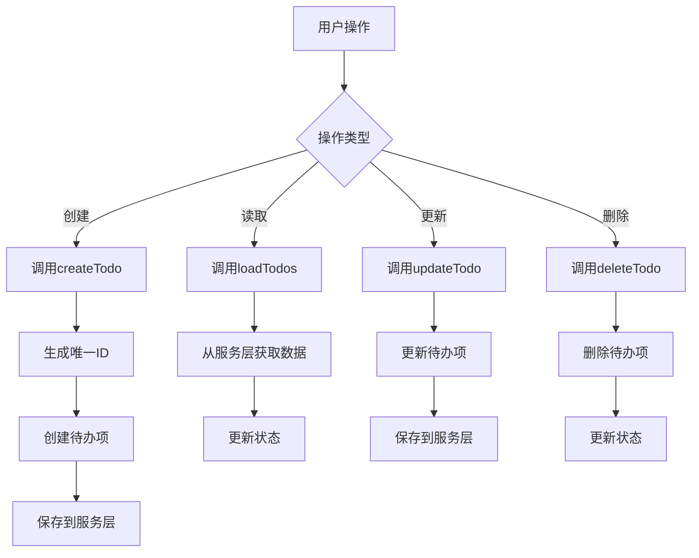
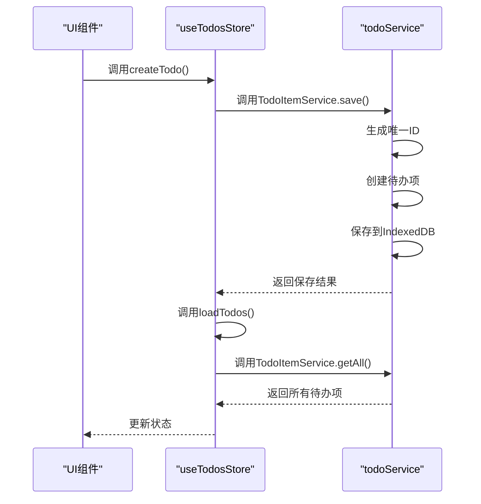
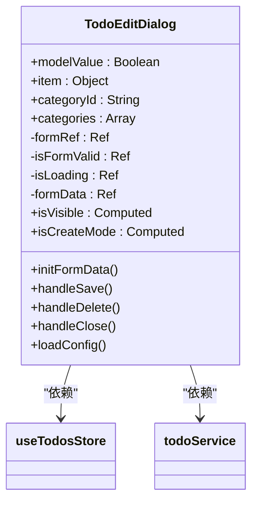
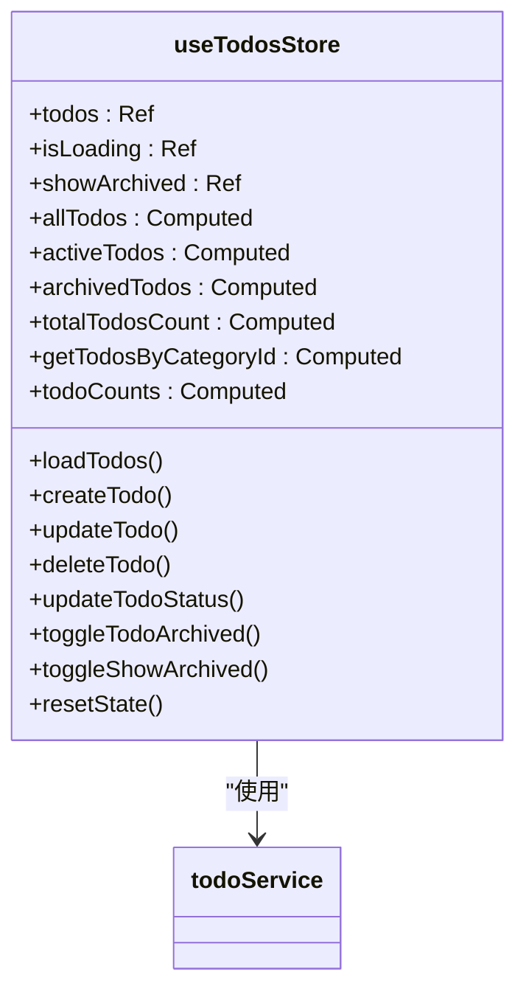
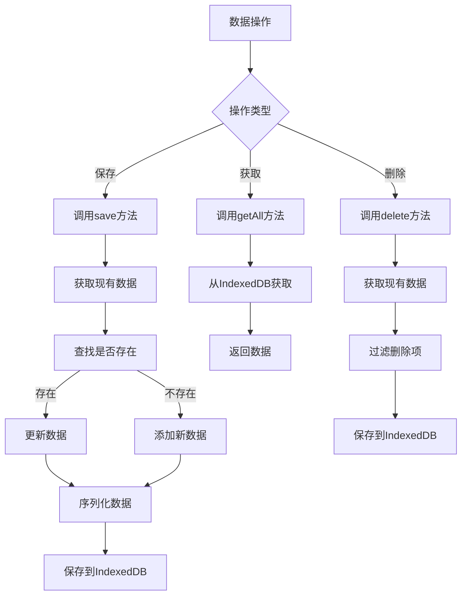
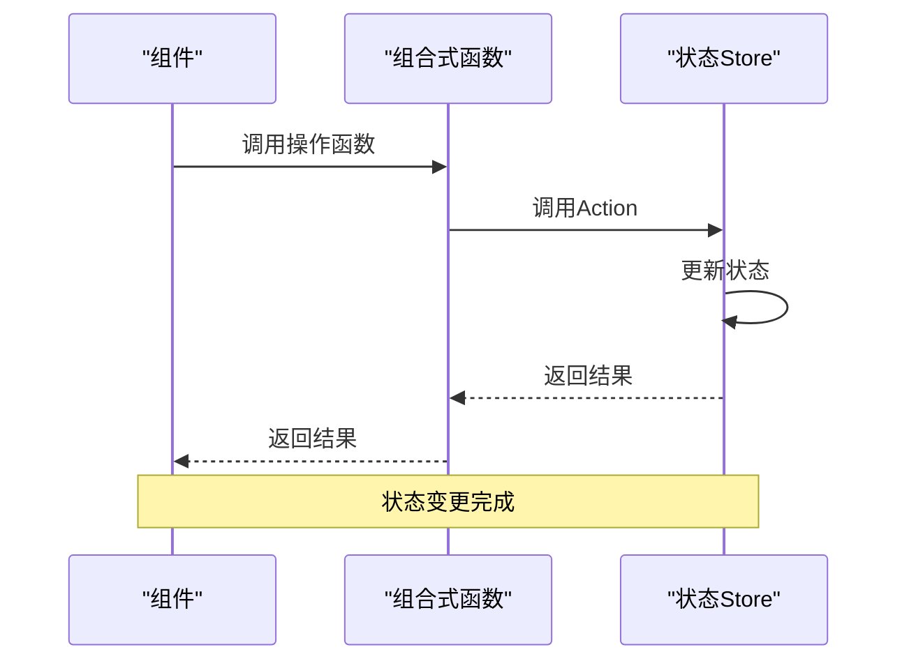
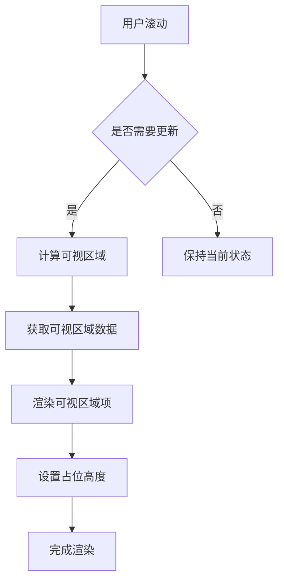

# 待办事项管理

<cite>
**本文档引用的文件**
- [TodoEditDialog.vue](file://src\model\TodoEditDialog.vue)
- [useTodosStore.js](file://src\stores\useTodosStore.js)
- [todoService.js](file://src\services\todoService.js)
</cite>

## 目录
1. [简介](#简介)
2. [核心组件](#核心组件)
3. [CRUD操作实现机制](#crud操作实现机制)
4. [用户交互流程与后端服务调用逻辑](#用户交互流程与后端服务调用逻辑)
5. [TodoEditDialog组件使用方式](#todoeditdialog组件使用方式)
6. [useTodosStore状态管理逻辑](#usetodosstore状态管理逻辑)
7. [todoService数据持久化过程](#todoservice数据持久化过程)
8. [组合式API触发状态变更](#组合式api触发状态变更)
9. [常见问题排查方法](#常见问题排查方法)
10. [性能优化建议](#性能优化建议)

## 简介
本项目实现了一个完整的待办事项管理功能，支持创建、编辑、删除和归档等CRUD操作。系统采用分层架构设计，包含UI组件层、状态管理层和服务层，通过Pinia进行状态管理，使用IndexedDB进行数据持久化存储。

## 核心组件
系统主要由以下核心组件构成：
- **TodoEditDialog**: 待办事项编辑弹窗组件
- **useTodosStore**: 待办事项状态管理Store
- **todoService**: 数据持久化服务

**Section sources**
- [TodoEditDialog.vue](file://src\model\TodoEditDialog.vue)
- [useTodosStore.js](file://src\stores\useTodosStore.js)
- [todoService.js](file://src\services\todoService.js)

## CRUD操作实现机制
系统实现了完整的CRUD操作机制，包括创建、读取、更新和删除待办事项。

**Diagram sources**
- [useTodosStore.js](file://src\stores\useTodosStore.js#L4-L169)
- [todoService.js](file://src\services\todoService.js#L139-L313)

## 用户交互流程与后端服务调用逻辑
用户交互流程与后端服务调用之间通过清晰的逻辑进行连接，确保数据的一致性和完整性。

**Diagram sources**
- [useTodosStore.js](file://src\stores\useTodosStore.js#L4-L169)
- [todoService.js](file://src\services\todoService.js#L139-L313)

## TodoEditDialog组件使用方式
TodoEditDialog是一个可复用的弹窗组件，用于创建和编辑待办事项。

**Diagram sources**
- [TodoEditDialog.vue](file://src\model\TodoEditDialog.vue#L1-L452)

## useTodosStore状态管理逻辑
useTodosStore是基于Pinia的状态管理模块，负责管理待办事项的所有状态。

**Diagram sources**
- [useTodosStore.js](file://src\stores\useTodosStore.js#L4-L169)

## todoService数据持久化过程
todoService负责与IndexedDB进行交互，实现数据的持久化存储。

**Diagram sources**
- [todoService.js](file://src\services\todoService.js#L139-L313)

## 组合式API触发状态变更
通过组合式API实现状态变更的触发和处理。

**Diagram sources**
- [useTodosStore.js](file://src\stores\useTodosStore.js#L4-L169)
- [TodoEditDialog.vue](file://src\model\TodoEditDialog.vue#L1-L452)

## 常见问题排查方法
针对常见的数据同步和状态更新问题，提供以下排查方法。

### 数据同步延迟
当出现数据同步延迟时，检查以下方面：
- 确认`loadTodos()`是否在每次数据变更后被正确调用
- 检查IndexedDB操作是否成功完成
- 验证网络连接状态（如果使用远程存储）

### 状态更新失败
当状态更新失败时，按照以下步骤排查：
1. 检查错误日志中的具体错误信息
2. 验证数据格式是否符合预期
3. 确认ID生成是否正常
4. 检查数据序列化过程

**Section sources**
- [useTodosStore.js](file://src\stores\useTodosStore.js#L4-L169)
- [todoService.js](file://src\services\todoService.js#L139-L313)

## 性能优化建议
为提升系统性能，建议采用以下优化策略。

### 列表渲染的虚拟滚动策略
对于大量待办事项的渲染，建议使用虚拟滚动策略：

**Diagram sources**
- [todoService.js](file://src\services\todoService.js#L139-L313)
- [useTodosStore.js](file://src\stores\useTodosStore.js#L4-L169)