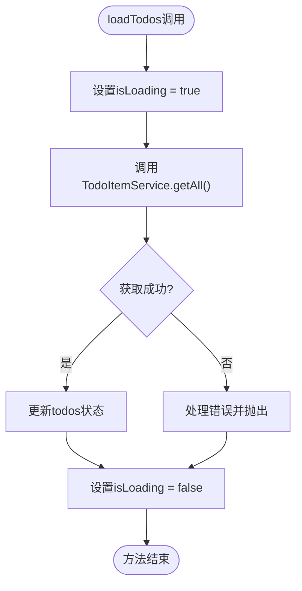
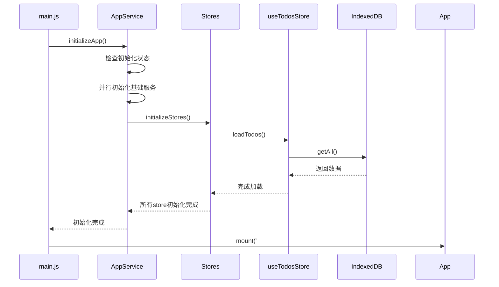
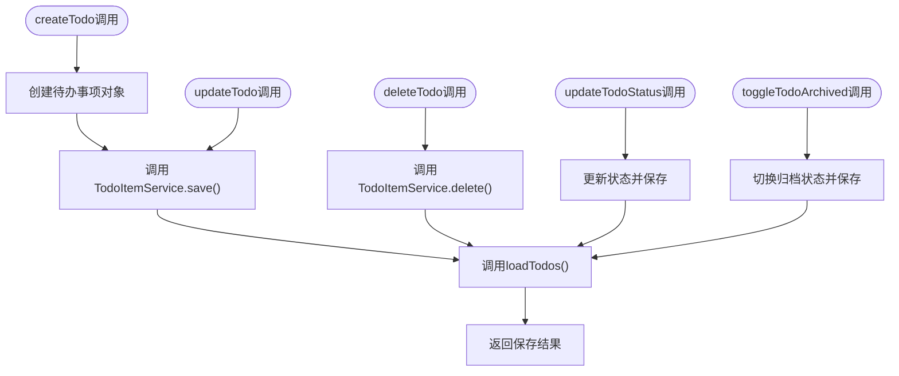
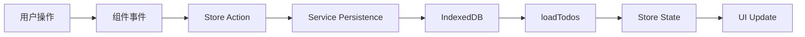
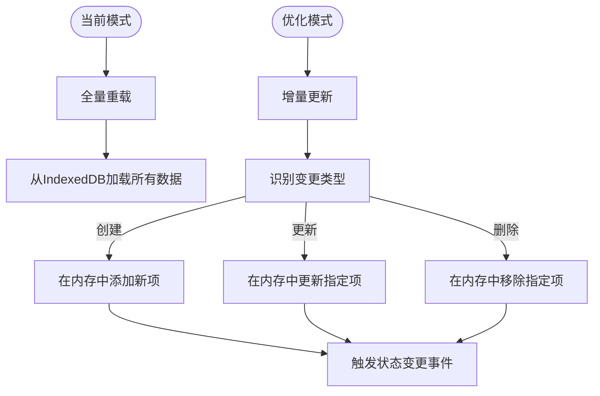

# 状态同步与数据一致性

<cite>
**Referenced Files in This Document**   
- [useTodosStore.js](file://src/stores/useTodosStore.js)
- [todoService.js](file://src/services/todoService.js)
- [appService.js](file://src/services/appService.js)
- [main.js](file://src/main.js)
- [TodoContent.vue](file://src/views/tidyDo/components/TodoContent.vue)
</cite>

## 目录
1. [状态同步机制概述](#状态同步机制概述)
2. [loadTodos方法的设计原理](#loadtodos方法的设计原理)
3. [应用启动时的数据加载流程](#应用启动时的数据加载流程)
4. [变更后的强制刷新模式](#变更后的强制刷新模式)
5. [UI与存储层一致性保障](#ui与存储层一致性保障)
6. [性能影响分析](#性能影响分析)
7. [常见问题排查](#常见问题排查)
8. [优化建议](#优化建议)

## 状态同步机制概述

本系统采用基于Pinia的状态管理机制，通过`useTodosStore`集中管理待办事项的状态。核心设计原则是确保UI层与IndexedDB存储层之间的数据一致性。当任何数据变更发生时，系统通过调用`loadTodos`方法强制重新加载所有数据，从而保证状态的准确性和一致性。

该机制解决了单页应用中常见的状态漂移问题，特别是在多组件共享状态的复杂场景下。通过全量重载策略，系统避免了局部状态更新可能带来的数据不一致风险。

**Section sources**
- [useTodosStore.js](file://src/stores/useTodosStore.js#L0-L170)

## loadTodos方法的设计原理

`loadTodos`方法是状态同步机制的核心，其设计遵循了"单一事实来源"原则。该方法直接从IndexedDB中读取最新数据，替代当前内存中的状态，确保每次数据访问都基于最新的持久化状态。

方法实现中包含了完整的错误处理和加载状态管理：
- 在加载开始时设置`isLoading`为`true`
- 调用`TodoItemService.getAll()`从IndexedDB获取数据
- 成功后更新`todos`状态并返回结果
- 在`finally`块中确保`isLoading`被重置

这种设计模式确保了用户界面能够准确反映数据加载状态，提供良好的用户体验。

**Diagram sources**
- [useTodosStore.js](file://src/stores/useTodosStore.js#L33-L45)

**Section sources**
- [useTodosStore.js](file://src/stores/useTodosStore.js#L33-L45)

## 应用启动时的数据加载流程

应用启动时，系统通过`appService.js`中的`initializeStores`方法并行加载所有数据。`loadTodos`作为初始化流程的关键环节，确保应用启动时就能获取到最新的待办事项数据。

初始化流程遵循严格的时序控制：
1. 首先初始化配置服务和默认数据
2. 然后并行加载分类、待办事项和简单待办事项
3. 最后基于加载的数据初始化应用状态

这种设计确保了应用启动时数据的完整性和一致性，避免了因数据加载顺序不当导致的状态错误。

**Diagram sources**
- [main.js](file://src/main.js#L0-L45)
- [appService.js](file://src/services/appService.js#L0-L169)
- [useTodosStore.js](file://src/stores/useTodosStore.js#L33-L45)

**Section sources**
- [main.js](file://src/main.js#L0-L45)
- [appService.js](file://src/services/appService.js#L0-L169)

## 变更后的强制刷新模式

系统在每次数据变更后都采用强制刷新模式，通过在`createTodo`、`updateTodo`、`deleteTodo`等方法中调用`loadTodos`来实现。这种模式的设计目的是防止本地状态与IndexedDB数据出现偏差。

以创建待办事项为例，流程如下：
1. 创建新的待办事项对象
2. 调用`TodoItemService.save()`保存到IndexedDB
3. 调用`loadTodos()`重新加载所有数据
4. 返回保存的结果

这种"保存后重载"的模式虽然牺牲了一定的性能，但极大地提高了数据一致性，避免了复杂的局部状态更新逻辑可能引入的bug。

**Diagram sources**
- [useTodosStore.js](file://src/stores/useTodosStore.js#L47-L125)

**Section sources**
- [useTodosStore.js](file://src/stores/useTodosStore.js#L47-L125)

## UI与存储层一致性保障

系统通过多层次机制确保UI与存储层的一致性：

### 状态同步链路

### 组件层集成
在`TodoContent.vue`组件中，系统通过Pinia store的响应式特性自动更新UI。当`loadTodos`更新store状态时，依赖该状态的组件会自动重新渲染。

关键集成点包括：
- 状态变更处理：`handleStatusChange`调用`updateTodoStatus`
- 删除操作：`handleDeleteTodo`调用`deleteTodo`
- 归档操作：`handleArchive`调用`toggleTodoArchived`

这些操作最终都会触发`loadTodos`，形成闭环的一致性保障机制。

**Section sources**
- [TodoContent.vue](file://src/views/tidyDo/components/TodoContent.vue#L0-L384)
- [useTodosStore.js](file://src/stores/useTodosStore.js#L0-L170)

## 性能影响分析

全量重载策略对性能有一定影响，主要体现在：

### 时间复杂度
- **数据加载**: O(n)，其中n为待办事项数量
- **UI渲染**: O(n×m)，其中m为每项的渲染复杂度

### 内存使用
- 保持两份数据副本：IndexedDB中的持久化数据和内存中的响应式状态
- 数据量大时可能导致内存占用较高

### 网络/存储I/O
- 每次变更都触发完整的数据读取操作
- 增加了IndexedDB的读取压力

尽管存在这些性能开销，但在当前应用场景下，待办事项数量通常有限，性能影响在可接受范围内。系统的优先级是数据一致性而非极致性能。

**Section sources**
- [useTodosStore.js](file://src/stores/useTodosStore.js#L33-L45)
- [todoService.js](file://src/services/todoService.js#L0-L313)

## 常见问题排查

### 数据延迟更新
**现象**: 数据变更后UI没有立即反映最新状态
**排查步骤**:
1. 检查`loadTodos`是否被正确调用
2. 验证`TodoItemService.save()`是否成功执行
3. 确认IndexedDB事务是否正常提交
4. 查看控制台是否有错误日志

### 重复加载
**现象**: `loadTodos`被多次调用导致性能下降
**排查步骤**:
1. 检查是否有多个组件同时触发相同操作
2. 验证事件绑定是否重复
3. 确认没有在生命周期钩子中重复调用

### 数据不一致
**现象**: UI显示的数据与预期不符
**排查步骤**:
1. 检查`loadTodos`返回的数据是否正确
2. 验证数据过滤逻辑（如归档状态过滤）
3. 确认计算属性的依赖关系

**Section sources**
- [useTodosStore.js](file://src/stores/useTodosStore.js#L33-L125)
- [TodoContent.vue](file://src/views/tidyDo/components/TodoContent.vue#L0-L384)

## 优化建议

### 引入增量更新策略
当前的全量重载策略可以优化为增量更新：

### 实现缓存机制
引入数据缓存层，减少对IndexedDB的直接访问频率。

### 优化数据结构
- 为常用查询字段建立索引
- 优化数据序列化格式
- 实现数据分页加载

### 异步加载优化
- 实现懒加载策略
- 添加加载进度指示
- 支持取消正在进行的加载操作

这些优化可以在保持数据一致性的同时，显著提升系统性能和用户体验。

**Section sources**
- [useTodosStore.js](file://src/stores/useTodosStore.js#L33-L125)
- [todoService.js](file://src/services/todoService.js#L0-L313)