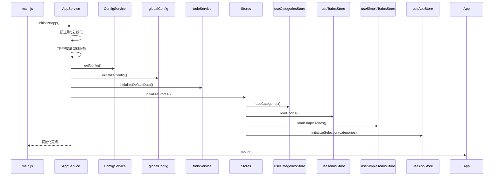
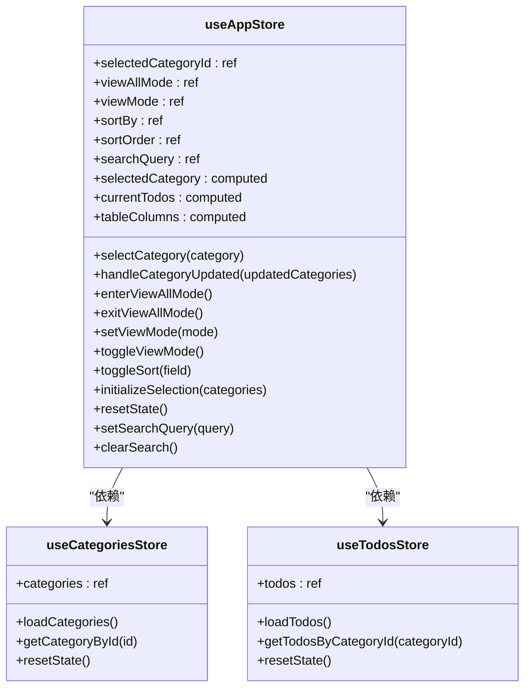
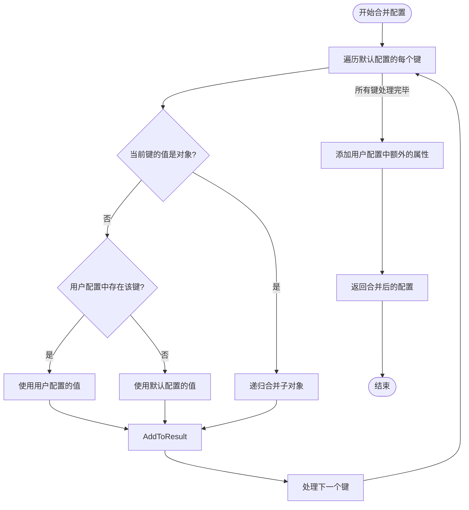
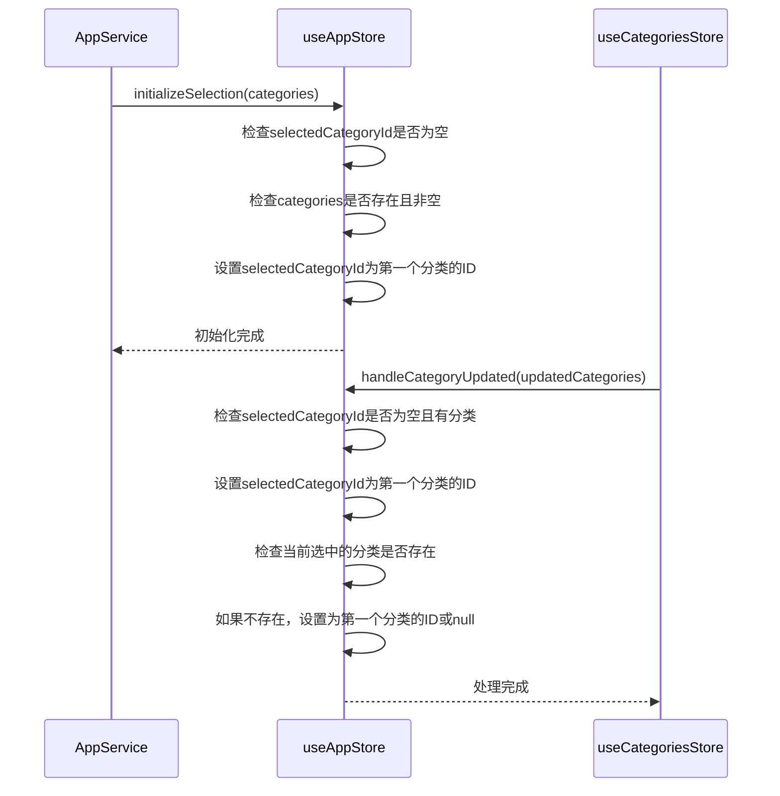
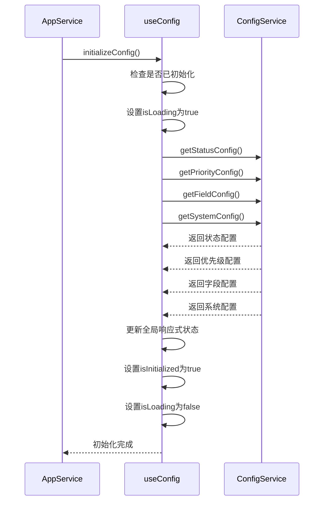
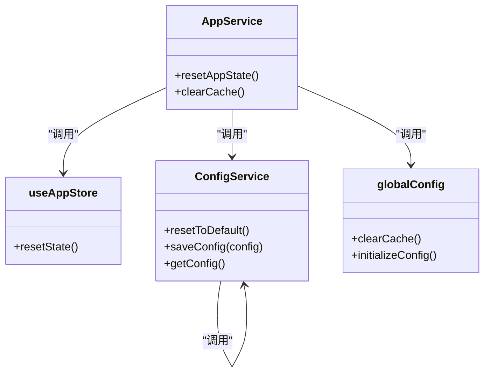

# 数据初始化

<cite>
**Referenced Files in This Document**   
- [useAppStore.js](file://src/stores/useAppStore.js)
- [configService.js](file://src/services/configService.js)
- [appService.js](file://src/services/appService.js)
- [useConfig.js](file://src/composables/useConfig.js)
- [main.js](file://src/main.js)
- [todoService.js](file://src/services/todoService.js)
</cite>

## 目录
1. [应用启动流程](#应用启动流程)
2. [核心状态初始化](#核心状态初始化)
3. [配置数据合并机制](#配置数据合并机制)
4. [分类选择逻辑](#分类选择逻辑)
5. [系统配置初始化](#系统配置初始化)
6. [状态重置机制](#状态重置机制)

## 应用启动流程

应用的启动流程由 `AppService` 统一管理，确保初始化过程的正确时序和依赖关系。在 `main.js` 中，应用通过调用 `AppService.initializeApp()` 方法启动，该方法负责协调所有基础服务的初始化。

**Diagram sources**
- [main.js](file://src/main.js#L40-L45)
- [appService.js](file://src/services/appService.js#L23-L54)

**Section sources**
- [main.js](file://src/main.js#L40-L45)
- [appService.js](file://src/services/appService.js#L23-L54)

## 核心状态初始化

`useAppStore` 是应用的核心状态管理模块，负责维护 `selectedCategoryId`、`viewMode`、`sortBy` 等关键状态的初始化和协调。这些状态在应用启动时被设置为默认值，为用户提供一致的初始体验。

**Diagram sources**
- [useAppStore.js](file://src/stores/useAppStore.js#L6-L277)
- [useCategoriesStore.js](file://src/stores/useCategoriesStore.js)
- [useTodosStore.js](file://src/stores/useTodosStore.js)

**Section sources**
- [useAppStore.js](file://src/stores/useAppStore.js#L6-L277)

## 配置数据合并机制

`configService` 通过 `mergeConfig` 方法实现了强大的配置数据默认值合并机制。这一机制确保了即使应用新增了配置项，也能被正确初始化，同时保留用户已有的自定义设置。

**Diagram sources**
- [configService.js](file://src/services/configService.js#L172-L205)

**Section sources**
- [configService.js](file://src/services/configService.js#L172-L205)

## 分类选择逻辑

`useAppStore` 提供了两种机制来处理分类选择：`initializeSelection` 方法在应用启动时自动选择合适的分类，而 `handleCategoryUpdated` 方法则在分类数据更新后维护选择状态。

**Diagram sources**
- [useAppStore.js](file://src/stores/useAppStore.js#L245-L277)
- [appService.js](file://src/services/appService.js#L98-L108)

**Section sources**
- [useAppStore.js](file://src/stores/useAppStore.js#L245-L277)

## 系统配置初始化

系统配置（如主题、语言、日期格式）的初始化由 `useConfig` 组合式函数管理。该函数通过 `globalConfig` 单例模式确保配置状态在整个应用中共享，并在应用启动时并行加载所有配置。

**Diagram sources**
- [useConfig.js](file://src/composables/useConfig.js#L30-L75)
- [configService.js](file://src/services/configService.js#L70-L120)

**Section sources**
- [useConfig.js](file://src/composables/useConfig.js#L30-L75)

## 状态重置机制

应用提供了两层状态重置机制：`useAppStore.resetState()` 负责重置应用界面状态，而 `ConfigService.resetToDefault()` 则负责将所有配置恢复为默认值。这两者共同构成了完整的状态管理策略。

**Diagram sources**
- [useAppStore.js](file://src/stores/useAppStore.js#L225-L235)
- [configService.js](file://src/services/configService.js#L166-L169)
- [appService.js](file://src/services/appService.js#L142-L158)

**Section sources**
- [useAppStore.js](file://src/stores/useAppStore.js#L225-L235)
- [configService.js](file://src/services/configService.js#L166-L169)